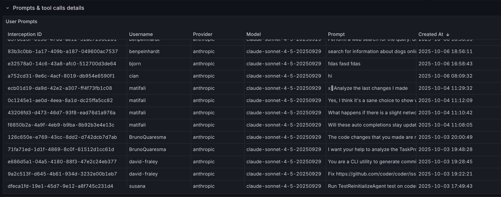
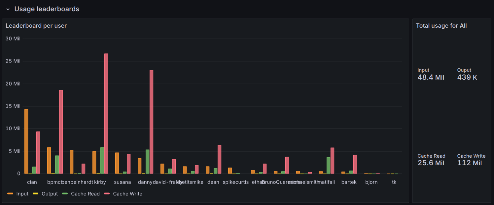
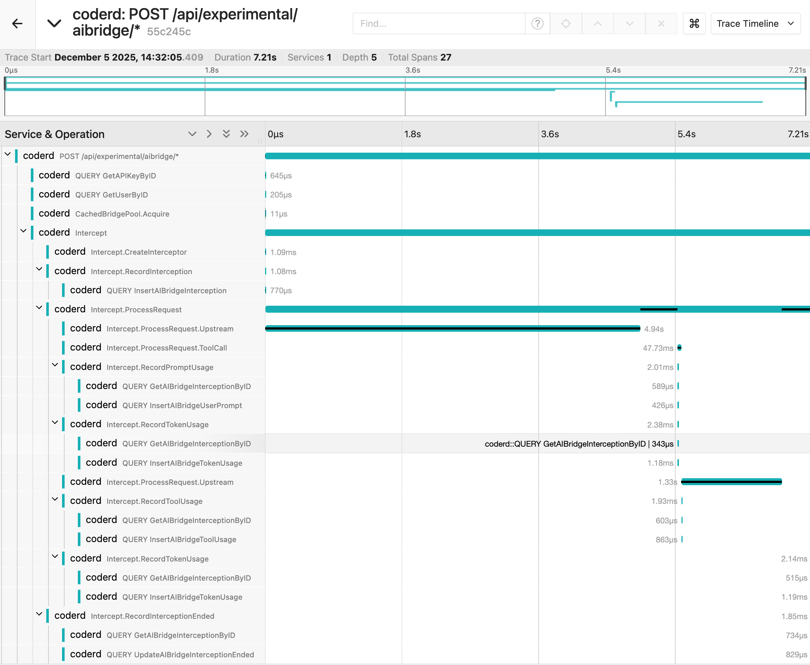

# Monitoring

> [!NOTE]
> AI Gateway is part of [AI Governance](../ai-governance.md), which is
> included with a Premium license.

AI Gateway records the last `user` prompt, token usage, model reasoning, and every tool invocation for each intercepted request. Each capture is tied to a single "interception" that maps back to the authenticated Coder identity, making it easy to attribute spend and behaviour.





Coder provides an example Grafana dashboard that you can import as a starting point for your metrics.
Refer to the [Grafana dashboard README](../../../examples/monitoring/dashboards/grafana/aibridge/README.md).

These logs and metrics can be used to determine usage patterns, track costs, and evaluate tooling adoption.

## Prometheus metrics

The embedded Gateway and [standalone Gateway](./standalone.md) export the same AI Gateway request metrics.
Each process exports metrics for the traffic that it handles:

- The Coder control plane (`coderd`) Prometheus listener exports metrics for the embedded Gateway.
- Each standalone Gateway replica exports metrics from its own Prometheus listener.

Refer to [provider configuration](./providers.md) for the provider reload lifecycle these metrics describe.

| Metric                                                             | Type      | Labels                                                                     | Purpose                                                                                                                                            |
|--------------------------------------------------------------------|-----------|----------------------------------------------------------------------------|----------------------------------------------------------------------------------------------------------------------------------------------------|
| `coder_ai_gateway_interceptions_total`                             | counter   | `client`, `initiator_id`, `method`, `model`, `provider`, `route`, `status` | Intercepted requests.                                                                                                                              |
| `coder_ai_gateway_interceptions_inflight`                          | gauge     | `model`, `provider`, `route`                                               | Intercepted requests currently being processed.                                                                                                    |
| `coder_ai_gateway_interceptions_duration_seconds`                  | histogram | `model`, `provider`                                                        | Total intercepted request duration, including upstream processing.                                                                                 |
| `coder_ai_gateway_passthrough_total`                               | counter   | `method`, `provider`, `route`                                              | Requests passed through to an upstream provider without interception.                                                                              |
| `coder_ai_gateway_prompts_total`                                   | counter   | `client`, `initiator_id`, `model`, `provider`                              | Prompts issued by users.                                                                                                                           |
| `coder_ai_gateway_tokens_total`                                    | counter   | `client`, `initiator_id`, `model`, `provider`, `type`                      | Tokens used by intercepted requests.                                                                                                               |
| `coder_ai_gateway_injected_tool_invocations_total`                 | counter   | `model`, `name`, `provider`, `server`                                      | Invocations of MCP tools injected by AI Gateway.                                                                                                   |
| `coder_ai_gateway_non_injected_tool_selections_total`              | counter   | `model`, `name`, `provider`                                                | Tools selected by a model for the client to invoke.                                                                                                |
| `coder_ai_gateway_circuit_breaker_state`                           | gauge     | `endpoint`, `model`, `provider`                                            | Current circuit-breaker state: `0` for closed, `0.5` for half-open, and `1` for open.                                                              |
| `coder_ai_gateway_circuit_breaker_trips_total`                     | counter   | `endpoint`, `model`, `provider`                                            | Times a circuit breaker transitioned to the open state.                                                                                            |
| `coder_ai_gateway_circuit_breaker_rejects_total`                   | counter   | `endpoint`, `model`, `provider`                                            | Requests rejected because a circuit breaker was open.                                                                                              |
| `coder_ai_gateway_key_pool_state`                                  | gauge     | `provider`, `state`                                                        | Provider keys in each state: `valid`, `temporary`, or `permanent`.                                                                                 |
| `coder_ai_gateway_key_pool_state_transitions_total`                | counter   | `provider`, `reason`                                                       | Provider key state transitions during failover.                                                                                                    |
| `coder_ai_gateway_key_pool_exhaustions_total`                      | counter   | `outcome`, `provider`                                                      | Times a provider key pool had no usable key.                                                                                                       |
| `coder_ai_gateway_key_pool_failover_attempts`                      | histogram | `provider`                                                                 | Keys attempted before a request succeeded or exhausted the provider key pool.                                                                      |
| `coder_ai_gateway_provider_info`                                   | gauge     | `provider_name`, `provider_type`, `status`                                 | Build status of each configured provider, including disabled and errored ones. Value is always `1`; `status` is `enabled`, `disabled`, or `error`. |
| `coder_ai_gateway_providers_last_reload_timestamp_seconds`         | gauge     |                                                                            | Unix timestamp of the last attempt to rebuild the Gateway provider pool.                                                                           |
| `coder_ai_gateway_providers_last_reload_success_timestamp_seconds` | gauge     |                                                                            | Unix timestamp of the last successful rebuild of the Gateway provider pool.                                                                        |

Histograms also emit the standard `_bucket`, `_sum`, and `_count` series.

### Cost control metrics

Budget enforcement runs in `coderd`.
Cost control metrics are exported only from the `coderd` Prometheus listener.
Standalone replicas do not export them.

| Metric                                                             | Type      | Labels                               | Purpose                                                                                                                                                                                                                            |
|--------------------------------------------------------------------|-----------|--------------------------------------|------------------------------------------------------------------------------------------------------------------------------------------------------------------------------------------------------------------------------------|
| `coder_ai_gateway_cost_control_blocked_requests_total`             | counter   | `group_id`                           | AI requests blocked because the initiator's budget was exceeded.                                                                                                                                                                   |
| `coder_ai_gateway_cost_control_blocked_users`                      | gauge     | `group_id`                           | Users currently over their AI budget.                                                                                                                                                                                              |
| `coder_ai_gateway_cost_control_enforcement_duration_seconds`       | histogram | `outcome`                            | Duration of AI budget enforcement checks. `outcome` is `allowed`, `blocked`, or `error`.                                                                                                                                           |
| `coder_ai_gateway_cost_control_unpriced_token_usage_records_total` | counter   | `model`, `provider`, `provider_type` | Recorded token-usage records for which no model price was found. `provider` is the provider instance name, and `provider_type` is the configured type the price is keyed on, or `unknown` when the provider could not be resolved. |

### AI Gateway Proxy metrics

AI Gateway Proxy exports metrics from the `coderd` Prometheus listener.

| Metric                                                                   | Type    | Labels                                     | Purpose                                                                                                         |
|--------------------------------------------------------------------------|---------|--------------------------------------------|-----------------------------------------------------------------------------------------------------------------|
| `coder_ai_gateway_proxy_connect_sessions_total`                          | counter | `type`                                     | CONNECT sessions established, classified as `mitm` or `tunneled`.                                               |
| `coder_ai_gateway_proxy_mitm_requests_total`                             | counter | `provider`                                 | MITM requests handled by AI Gateway Proxy.                                                                      |
| `coder_ai_gateway_proxy_inflight_mitm_requests`                          | gauge   | `provider`                                 | MITM requests currently being processed.                                                                        |
| `coder_ai_gateway_proxy_mitm_responses_total`                            | counter | `code`, `provider`                         | MITM responses by HTTP status code.                                                                             |
| `coder_ai_gateway_proxy_provider_info`                                   | gauge   | `provider_name`, `provider_type`, `status` | Routing status of each configured provider. Value is always `1`; `status` is `enabled`, `disabled`, or `error`. |
| `coder_ai_gateway_proxy_providers_last_reload_timestamp_seconds`         | gauge   |                                            | Unix timestamp of the last attempt to rebuild the proxy routing snapshot.                                       |
| `coder_ai_gateway_proxy_providers_last_reload_success_timestamp_seconds` | gauge   |                                            | Unix timestamp of the last successful rebuild of the proxy routing snapshot.                                    |

Refer to the [Prometheus reference](../../admin/integrations/prometheus.md) for these metrics alongside the other metrics that Coder components export.

### Metric name migration

> [!IMPORTANT]
> The embedded Gateway metric prefix changed from `coder_aibridged_*` to `coder_ai_gateway_*`, and the proxy prefix changed from `coder_aibridgeproxyd_*` to `coder_ai_gateway_proxy_*`.
> The embedded Gateway and AI Gateway Proxy emit the legacy names with identical values during the v2.35 and v2.36 deprecation window, and the legacy names are planned for removal in v2.37.
> The cost control metrics were added after the rename and have no legacy alias.
> The standalone Gateway emits only the current `coder_ai_gateway_*` names.
> Migrate dashboards and alerts to the new names.
> Do not relabel new names back to old names while both are emitted because this creates duplicate legacy series in the same scrape.
> After the legacy names are removed, use `metric_relabel_configs` only if you need a temporary compatibility bridge:
>
> ```yaml
> metric_relabel_configs:
>   # Proxy rule must come first; the gateway regex below also matches proxy metrics.
>   - source_labels: [__name__]
>     regex: 'coder_ai_gateway_proxy_(.*)'
>     target_label: __name__
>     replacement: 'coder_aibridgeproxyd_${1}'
>   - source_labels: [__name__]
>     regex: 'coder_ai_gateway_(.*)'
>     target_label: __name__
>     replacement: 'coder_aibridged_${1}'
> ```

### Suggested alerts

Alert on any provider entering a non-`enabled` status:

```promql
sum by (instance, provider_name, status) (
  coder_ai_gateway_provider_info{status!="enabled"}
) > 0
```

Alert when the provider reload loop is firing but failing to refresh the pool for longer than a few minutes:

```promql
(coder_ai_gateway_providers_last_reload_timestamp_seconds
  - coder_ai_gateway_providers_last_reload_success_timestamp_seconds) > 300
```

Use the `coder_ai_gateway_proxy_*` metrics when you alert on AI Gateway Proxy.

## Standalone Gateway monitoring

### Metrics listener

Enable the standalone metrics listener with `CODER_PROMETHEUS_ENABLE=true` or `--prometheus-enable`, and set its bind address with `CODER_PROMETHEUS_ADDRESS` or `--prometheus-address`.
The command default is `127.0.0.1:2112`.
The listener is unauthenticated, so expose it only to your monitoring network.

In addition to the common `coder_ai_gateway_*` metrics, the standalone listener exports standard unprefixed `go_*`, `process_*`, and `promhttp_*` metrics for the standalone process and its metrics handler.

### Kubernetes discovery

The [AI Gateway Helm chart](../../../helm/ai-gateway/README.md#metrics) enables metrics and binds the listener to `0.0.0.0:2112` by default.
The chart exposes a named `metrics` container port, but it does not include this port in the data-plane Service or create monitoring discovery resources.
For Prometheus pod-based discovery, add scrape annotations to each Gateway pod:

```yaml
coder:
  podAnnotations:
    prometheus.io/scrape: "true"
    prometheus.io/port: "2112"
```

You can also configure a `PodMonitor` to select the chart's `app.kubernetes.io/name` and `app.kubernetes.io/instance` pod labels, or add dedicated selector labels with `coder.podLabels`.
Manage the `PodMonitor` separately or include it in the Helm release with `extraTemplates`.
To use a `ServiceMonitor`, create a separate Service that exposes the `metrics` container port because the chart's data-plane Service exposes only the HTTP traffic port.
Refer to the [Helm chart metrics configuration](../../../helm/ai-gateway/README.md#metrics) for the available chart settings.

### Health and readiness

A standalone AI Gateway exposes health endpoints on its data-plane listener:

| Endpoint   | Success condition                                                                             |
|------------|-----------------------------------------------------------------------------------------------|
| `/healthz` | The HTTP listener is serving.                                                                 |
| `/readyz`  | The control connection to `coderd` is active and provider configuration has been initialized. |

`/readyz` returns HTTP 503 until provider configuration is initialized and whenever the control connection to `coderd` is unavailable.
A `200 OK` response from `/healthz` only means the HTTP listener is accepting connections. It returns `200 OK` even when the control connection is down.
Both endpoints are unauthenticated, bypass the concurrency, rate limiting, and BYOK middleware, and do not create trace spans.

The standalone Helm chart enables a `/healthz` liveness probe and a `/readyz` readiness probe by default.
The startup probe is disabled by default.

## Logs

### Standalone operational logs

Standalone replicas use the standard Coder logging options.
Configure them on every replica or through `coder.env` in the AI Gateway Helm chart.
Refer to the [`coder ai-gateway start` logging options](../../reference/cli/ai-gateway_start.md#-l---log-filter) for configuration details.

### Structured interception logs

AI Gateway can emit a structured log for every interception record to an external SIEM or observability platform.
The `CODER_AI_GATEWAY_STRUCTURED_LOGGING` setting belongs to `coderd`, standalone Gateway does not consume it.
Standalone replicas send interception records to `coderd`, which writes the structured logs to the Coder server log output.
Refer to [structured logging](./setup.md#structured-logging) for configuration and record types.

## Export data

AI Gateway interception data can be exported for external analysis, compliance reporting, or integration with log aggregation systems.

### REST API

You can retrieve AI Gateway sessions via the Coder API, with filtering and pagination support.

```sh
curl -X GET "https://coder.example.com/api/v2/ai-gateway/sessions" \
  -H "Coder-Session-Token: $CODER_SESSION_TOKEN"
```

Available query filters:

- `client` - Filter by client name.
  <details>
  <summary>Possible <code>client</code> values</summary>

  > [!NOTE]
  > Client classification is done on best effort basis using the `User-Agent` header;
  not all clients send these headers in an easily-identifiable manner.

  - `Claude Code`
  - `Codex`
  - `Zed`
  - `GitHub Copilot (VS Code)`
  - `GitHub Copilot (CLI)`
  - `Kilo Code`
  - `Coder Agents`
  - `Mux`
  - `Cursor`
  - `OpenCode`
  - `Unknown`

  </details><br>
- `initiator` - Filter by user ID or username
- `provider` - Filter by AI provider (e.g., `openai`, `anthropic`)
- `model` - Filter by model name
- `started_after` - Filter sessions after a timestamp
- `started_before` - Filter sessions before a timestamp

Refer to the [API documentation](../../reference/api/aigateway.md) for full details.

## Data retention

AI Gateway data is retained for **60 days by default**. Configure the retention
period to balance storage costs with your organization's compliance and analysis
needs.

For configuration options and details, refer to [Data Retention](./setup.md#data-retention)
in the AI Gateway setup guide.

## Tracing

AI Gateway supports tracing through [OpenTelemetry](https://opentelemetry.io/) for request processing, upstream API calls, and MCP server interactions.
Embedded Gateway spans are emitted by the `coder server` process.
Standalone spans are emitted independently by every replica with the service name `coder-ai-gateway`.

### Enable tracing

AI Gateway exports spans over OTLP/gRPC when you set `CODER_TRACE_ENABLE`, honoring `OTEL_EXPORTER_OTLP_TRACES_ENDPOINT`.
The exporter always dials without TLS, so an `https://` endpoint is still contacted over plaintext gRPC.
`CODER_TRACE_HONEYCOMB_API_KEY` adds a Honeycomb exporter and works with or without `CODER_TRACE_ENABLE`.
Set only the Honeycomb key to export to Honeycomb alone, or set both to export to Honeycomb and an OTLP collector.

The embedded and standalone Gateways share the same tracing options.
Refer to the [`coder server` tracing options](../../reference/cli/server.md#--trace) for the embedded Gateway and the [`coder ai-gateway start` tracing options](../../reference/cli/ai-gateway_start.md#--trace) for standalone replicas.
Configure tracing on every standalone process or through `coder.env` in the AI Gateway Helm chart.

The following minimal configuration enables tracing and exports spans over OTLP/gRPC:

```sh
export CODER_TRACE_ENABLE=true
export OTEL_EXPORTER_OTLP_TRACES_ENDPOINT=http://otel-collector:4317
```

In both deployment modes, each request to the Gateway's LLM API endpoint creates an HTTP request span, including requests that are passed through or rejected instead of intercepted.

### Traced operations

AI Gateway creates spans for the following operations:

| Span name                                   | Description                                          |
|---------------------------------------------|------------------------------------------------------|
| `CachedBridgePool.Acquire`                  | Acquiring a request bridge instance from the pool    |
| `Intercept`                                 | Top-level span for processing an intercepted request |
| `Intercept.CreateInterceptor`               | Creating the request interceptor                     |
| `Intercept.ProcessRequest`                  | Processing the request through the bridge            |
| `Intercept.ProcessRequest.Upstream`         | Forwarding the request to the upstream AI provider   |
| `Intercept.ProcessRequest.ToolCall`         | Executing a tool call requested by the AI model      |
| `Intercept.RecordInterception`              | Creating the interception record                     |
| `Intercept.RecordPromptUsage`               | Recording prompt and message data                    |
| `Intercept.RecordTokenUsage`                | Recording token consumption                          |
| `Intercept.RecordToolUsage`                 | Recording tool and function calls                    |
| `Intercept.RecordModelThought`              | Recording model reasoning                            |
| `Intercept.RecordInterceptionEnded`         | Recording the interception as completed              |
| `Passthrough`                               | Forwarding a non-intercepted provider request        |
| `ServerProxyManager.Init`                   | Initializing MCP server proxy connections            |
| `StreamableHTTPServerProxy.Init`            | Setting up HTTP-based MCP server proxies             |
| `StreamableHTTPServerProxy.Init.fetchTools` | Fetching available tools from MCP servers            |

Example trace of an interception using a Jaeger backend:



### Capture logs in traces

> [!NOTE]
> Enabling log capture may generate a large volume of trace events.

Set `CODER_TRACE_LOGS=true` to include log messages as trace events:

```sh
export CODER_TRACE_ENABLE=true
export CODER_TRACE_LOGS=true
```

Log capture only applies to recording spans, so it requires tracing to be enabled through `CODER_TRACE_ENABLE` or a backend-specific exporter such as `CODER_TRACE_HONEYCOMB_API_KEY`.
Leave `CODER_TRACE_LOGS` unset to trace without capturing logs.
For standalone replicas, set both options on every process that should capture logs.
