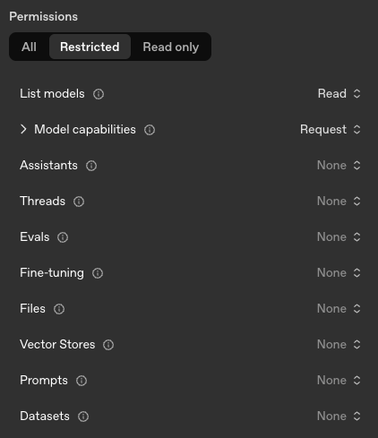

# Provider Configuration

> [!NOTE]
> AI Gateway requires the [AI Governance Add-On](../ai-governance.md).

Providers are deployment-scoped and managed from the dashboard or the
[AI Providers API](../../reference/api/aiproviders.md). See
[Setup](./setup.md#configure-providers) for the steps to add, edit, and
disable a provider.

This page covers the provider types AI Gateway supports, the setup
considerations for each, how a provider's lifecycle affects request
handling, and how to monitor providers.

## Database management of providers

> [!NOTE]
> Since v2.34, provider environment variables and flags, including
> `CODER_AI_GATEWAY_PROVIDER_<N>_*`, `CODER_AI_GATEWAY_OPENAI_*`,
> `CODER_AI_GATEWAY_ANTHROPIC_*`, and their `--aibridge/ai-gateway-*`
> equivalents, are deprecated. Provider configuration is now stored in
> the database, and any environment variables set on startup are used to
> seed it.
>
> This is a once-off operation. The environment variables have no effect
> once seeding has completed.
>
> **Any changes to the provider environment variables after seeding will
> cause the server to fail to start, to prevent operators from updating a
> configuration that is ineffectual.**
>
> The environment variables can be safely removed once seeding has
> completed. Visit `https://<your-coder-host>/ai/settings/providers` to see
> which providers have been seeded.

After seeding, manage providers through the dashboard or API. A provider
that has been edited or removed there is not recreated or overwritten
from the environment on the next restart.

## Provider types

AI Gateway speaks two upstream API formats: the **OpenAI** format
(Chat Completions and Responses) and the **Anthropic** format
(Messages). Every provider type maps to one of these.

| Type            | API format | Setup notes                                                       |
|-----------------|------------|-------------------------------------------------------------------|
| `openai`        | OpenAI     | Native OpenAI, or any OpenAI-compatible endpoint via the base URL |
| `anthropic`     | Anthropic  | Native Anthropic, or an Anthropic-compatible broker               |
| `bedrock`       | Anthropic  | Anthropic models hosted on AWS Bedrock; authenticates via AWS     |
| `copilot`       | OpenAI     | GitHub Copilot; authenticates via each user's GitHub OAuth token  |
| `azure`         | OpenAI     | OpenAI-compatible endpoint only                                   |
| `google`        | OpenAI     | OpenAI-compatible endpoint only                                   |
| `openrouter`    | OpenAI     | OpenAI-compatible endpoint only                                   |
| `vercel`        | OpenAI     | OpenAI-compatible endpoint only                                   |
| `openai-compat` | OpenAI     | Generic OpenAI-compatible endpoint                                |

`azure`, `google`, `openrouter`, `vercel`, and `openai-compat` are
supported only as OpenAI-compatible endpoints: AI Gateway sends them
OpenAI-format requests, so each must expose an OpenAI-compatible API at
its base URL. They have no provider-specific integration beyond that.

### OpenAI

Set the base URL to the upstream endpoint and provide an API key. The
default `https://api.openai.com/v1/` targets the native OpenAI service;
point it at any OpenAI-compatible endpoint (for example, a hosted proxy
or LiteLLM deployment) when needed.

If you create an [OpenAI key](https://platform.openai.com/api-keys)
with minimal privileges, this is the minimum required set:



### Anthropic

Set the base URL and provide an API key. The default
`https://api.anthropic.com/` targets Anthropic's public API; override it
for Anthropic-compatible brokers.

Anthropic does not allow [API keys](https://console.anthropic.com/settings/keys)
to have restricted permissions at the time of writing (June 2026).

### Amazon Bedrock

Bedrock providers serve Anthropic models hosted on AWS and authenticate
with AWS credentials rather than a registered API key. Configure:

- A **region** (or a full base URL when routing through a proxy or a
  non-standard endpoint that does not follow the
  `https://bedrock-runtime.<region>.amazonaws.com` format).
- The **model** and **small fast model** identifiers.

Do not attach API keys to a Bedrock provider.

AI Gateway resolves AWS credentials one of three ways:

- **AWS SDK default credential chain (recommended).** When no explicit
  credentials are configured, the AWS SDK resolves them automatically
  from the environment: IAM Roles (instance profiles, IRSA, ECS task
  roles), shared config files, environment variables, SSO, and more.
  Attaching an IAM Role to the compute running Coder follows
  [AWS best practices](https://docs.aws.amazon.com/IAM/latest/UserGuide/best-practices.html)
  for temporary credentials. The role must permit `bedrock:InvokeModel`
  and `bedrock:InvokeModelWithResponseStream` for the configured models.
- **Static credentials.** Provide an access key and secret for an IAM
  user with the same Bedrock permissions.
- **Assumed IAM role.** Set a **Role ARN** to have the gateway assume
  that role before calling Bedrock, signing requests with the resulting
  temporary credentials. This works on top of either of the above base
  identities and supports cross-account Bedrock access. See
  [Assuming an IAM role](#assuming-an-iam-role).

#### Obtaining static Bedrock credentials

When you cannot use the default credential chain, create a dedicated IAM
user and generate a static access key:

1. **Choose a region** where you want to use Bedrock.

2. **Generate API keys** in the [AWS Bedrock console](https://us-east-1.console.aws.amazon.com/bedrock/home?region=us-east-1#/api-keys/long-term/create) (replace `us-east-1` in the URL with your chosen region):
   - Choose an expiry period for the key.
   - Select **Generate**.
   - This creates an IAM user with strictly-scoped permissions for Bedrock access.

3. **Create an access key** for the IAM user:
   - After generating the API key, click **"You can directly modify permissions for the IAM user associated"**.
   - In the IAM user page, navigate to the **Security credentials** tab.
   - Under **Access keys**, select **Create access key**.
   - Select **"Application running outside AWS"** as the use case.
   - Select **Next**.
   - Add a description like "Coder AI Gateway token".
   - Select **Create access key**.
   - Save both the access key ID and secret access key securely.

4. **Enter the access key ID and secret access key** when you add or edit
   the Bedrock provider from the dashboard or the
   [AI Providers API](../../reference/api/aiproviders.md), along with the
   region (or base URL) and model identifiers.

#### Assuming an IAM role

Set the optional **Role ARN** field to have the gateway assume an IAM
role before calling Bedrock. The base identity (static credentials or the
default credential chain) signs an STS `AssumeRole` call, and the
temporary credentials it returns sign Bedrock requests. The field is
optional: a provider with no Role ARN authenticates with its base
identity directly, exactly as described above.

To use role assumption:

1. **Create the IAM role** in the target account and grant it
   `bedrock:InvokeModel` and `bedrock:InvokeModelWithResponseStream` for
   the configured models. The base identity does not need Bedrock
   permissions itself; the assumed role does.

2. **Configure the role's trust policy** to allow the gateway's base
   identity to assume it.

3. **Enter the Role ARN** when you add or edit the Bedrock provider. It must be a
   valid IAM role ARN, for example `arn:aws:iam::123456789012:role/BedrockRole`.

Each provider assumes a single role. To use several roles, configure one
provider per role.

#### External ID

When a Bedrock provider assumes a role, the gateway generates a unique
**external ID** for it and sends that value on every `AssumeRole` call.
The external ID guards against the
[confused deputy problem](https://docs.aws.amazon.com/IAM/latest/UserGuide/confused-deputy.html)
on cross-account assumption. The gateway generates and owns the value, as
AWS [recommends](https://docs.aws.amazon.com/IAM/latest/UserGuide/id_roles_create_for-user_externalid.html):
you cannot set or change it. It is not a secret, and it is shown on the
provider's edit page once a Role ARN is configured.

To enforce it, add the external ID to the target role's trust policy as an
`sts:ExternalId` condition:

```json
{
  "Effect": "Allow",
  "Principal": { "AWS": "<gateway base identity>" },
  "Action": "sts:AssumeRole",
  "Condition": { "StringEquals": { "sts:ExternalId": "<the provider's External ID>" } }
}
```

> [!IMPORTANT]
> The gateway sends the external ID whether or not the trust policy checks
> it. Until you add the `sts:ExternalId` condition, the value is sent but
> not enforced, and the role can still be assumed without it. To rotate the
> external ID, recreate the provider.

### GitHub Copilot

GitHub Copilot offers three plans: Individual, Business, and Enterprise,
each with its own API endpoint. Add one `copilot` provider per plan your
organization uses, setting the base URL accordingly:

| Plan       | Base URL                                   |
|------------|--------------------------------------------|
| Individual | `https://api.individual.githubcopilot.com` |
| Business   | `https://api.business.githubcopilot.com`   |
| Enterprise | `https://api.enterprise.githubcopilot.com` |

Copilot providers authenticate with each user's request-time GitHub
OAuth token, so do not attach API keys. For client-side setup (proxy,
certificates, IDE configuration), see
[GitHub Copilot client configuration](./clients/copilot.md).

### ChatGPT

ChatGPT subscriptions (Plus, Pro, Business) are supported through a
provider of type `openai` with a specific name and base URL:

| Field    | Value                                   |
|----------|-----------------------------------------|
| Type     | `openai`                                |
| Name     | `chatgpt`                               |
| Base URL | `https://chatgpt.com/backend-api/codex` |

The name must be exactly `chatgpt`. It determines the route clients use
to reach the provider: `/api/v2/ai-gateway/chatgpt/v1`. If no provider
with this name exists, requests to that route fail with
`404 route not supported`.

Do not attach API keys. ChatGPT providers authenticate with each user's
ChatGPT OAuth token through [BYOK](./auth.md#bring-your-own-key-byok),
so BYOK must remain enabled. For client-side setup, see the
[Codex CLI ChatGPT subscription configuration](./clients/codex.md#byok-chatgpt-subscription).

### OpenAI-compatible providers

Azure-hosted OpenAI, Google, OpenRouter, Vercel, and any other
OpenAI-compatible service are configured with the matching type (or the
generic `openai-compat`), the provider's OpenAI-compatible base URL, and
an API key.

> [!NOTE]
> See the [Supported APIs](./reference.md#supported-apis) section for
> precise endpoint coverage and interception behavior.

## Provider lifecycle

Every provider carries an explicit status, surfaced through the
[`provider_info`](./monitoring.md#provider-metrics) metric and the API:

| Status     | Meaning                                                                       | Effect on requests                               |
|------------|-------------------------------------------------------------------------------|--------------------------------------------------|
| `enabled`  | Configuration is valid and the provider is serving traffic                    | Requests are proxied to the upstream             |
| `disabled` | The provider exists but has been turned off                                   | Requests are rejected with a non-retryable error |
| `error`    | The provider is enabled but cannot be built (missing credentials, bad config) | Requests fail; the error is surfaced in metrics  |

Disabling a provider does not delete it, its credentials, or its
historical interception data. Re-enabling restores it to service.

## Monitoring and reloads

Provider configuration changes take effect automatically, without
restarting `coderd`. AI Gateway records the timestamp of each reload
attempt and each successful reload, exposed as Prometheus metrics:

- `coder_ai_gateway_providers_last_reload_timestamp_seconds`
- `coder_ai_gateway_providers_last_reload_success_timestamp_seconds`

If you run the [external proxy](./ai-gateway-proxy/index.md), it exposes
the same pair under the `coder_ai_gateway_proxy_` prefix.

A growing gap between the attempt and success timestamps means reloads
are firing but failing to apply. Alert on that gap rather than on a
single failure, which may resolve on the next change. See
[Monitoring](./monitoring.md#provider-metrics) for the full metric list
and sample alert queries.

## Key failover

You can configure multiple centralized API keys for a single provider instance
so that AI Gateway automatically retries with the next key when one fails. This
is transparent to end users, and clients see no difference in behavior or need
any configuration changes.

Key failover is supported for **OpenAI** and **Anthropic** providers. Amazon
Bedrock and GitHub Copilot do not support key failover.

Multiple keys can be added per provider through the
[AI Providers API](../../reference/api/aiproviders.md). Each provider supports
a maximum of **5 keys**.

### Failover behavior

Every request starts with the first key in the list. If a key is rate-limited
or returns an authentication error, AI Gateway automatically retries the request
with the next available key.

> [!WARNING]
> A key that fails with an authentication error (`401 Unauthorized` or
> `403 Forbidden`) is permanently disabled and will not be used again until the
> server is restarted or the provider configuration is reloaded.

If all keys in the pool are exhausted, AI Gateway returns:

- `429 Too Many Requests` when at least one key is rate-limited, with a `Retry-After` header set to the shortest cooldown across all keys.
- `502 Bad Gateway` when every key has failed permanently.

## Bring Your Own Key

A provider's configured credentials are the centralized default. When
Bring Your Own Key (BYOK) is enabled, a user's own credential takes
precedence over the provider's for that user's requests, and AI Gateway
falls back to the provider credentials when the user has none. See
[Authentication](./auth.md#bring-your-own-key-byok) for the BYOK flow
and how to enable or disable it.

## Failure modes

| Symptom                                        | Likely cause                                               | Corrective action                        |
|------------------------------------------------|------------------------------------------------------------|------------------------------------------|
| Startup fails referencing an existing provider | Env config drifted from a provider already in the database | Remove the provider env vars and restart |
| Provider returns errors with no upstream call  | The provider is `disabled` or in `error` status            | Consult the server logs for details      |
| Configuration changes not taking effect        | Reloads are firing but failing to apply                    | Consult the server logs for details      |
