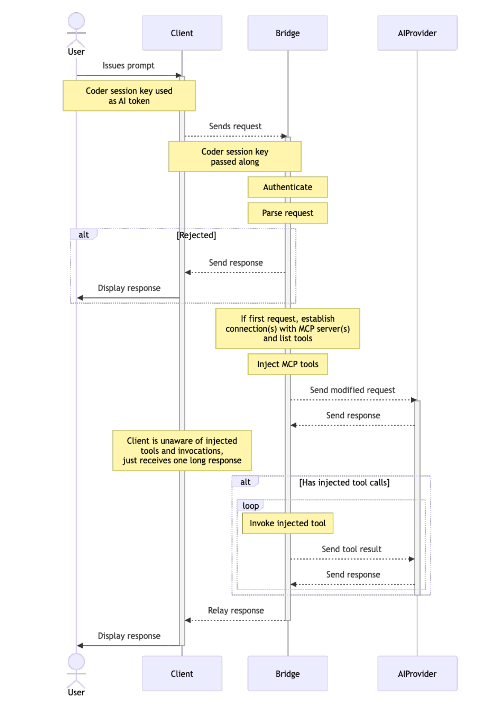

> [!NOTE]
> AI Gateway is part of [AI Governance](../ai-governance.md), which is
> included with a Premium license.

## Deployment topologies

AI Gateway can run inside `coderd` or as a standalone data-plane service.
Both topologies run the same gateway request handling and keep `coderd` as the source of truth for Coder API key validation, provider configuration, and AI session records.
They differ in how requests are routed to the gateway.

### Embedded gateway

By default, `coder server` runs an in-memory gateway instance in the `coderd` process.
AI clients send requests to `<Coder access URL>/api/v2/ai-gateway/<provider-name>/`.
The embedded gateway uses the same control RPC as a standalone deployment, over an in-process transport rather than a network connection.
It does not use a gateway key and does not negotiate an AI Gateway API version.

The following diagram shows the embedded topology:

### Standalone gateway

A [standalone deployment](./standalone.md) runs the AI traffic data plane outside the `coderd` process.
Each replica accepts client traffic, sends AI requests directly to upstream providers, and maintains a control connection to `coderd` by using a [gateway key](./standalone.md#create-a-gateway-key).

The control connection carries the following:

- Coder API key validation, which resolves each request to an active Coder user.
- AI budget checks, which reject requests from users over their spend limit.
- Provider configuration, plus a change signal when the provider set changes.
- AI session records.
- **Deprecated**: the configuration and access tokens used by [injected MCP](./mcp.md).

Standalone replicas have no authoritative database state.
They keep ephemeral provider snapshots, request caches, provider key pools, and metrics in memory, and emit their own logs and traces.
When API dumps are enabled, each replica writes its own [API dumps](./setup.md#api-dumps) to its own local disk.

`coderd` remains required for standalone operation.
A replica becomes unready when its control connection is unavailable, even if its HTTP listener remains healthy.
AI Gateway Proxy remains part of `coderd` and can forward its intercepted traffic to either the embedded gateway or a standalone endpoint.

## Version compatibility

The control connection between a standalone replica and `coderd` uses a versioned AI Gateway API.
The current AI Gateway API version is defined in [`coderd/aibridged/proto/version.go`](../../../coderd/aibridged/proto/version.go).

`coderd` validates the AI Gateway API version that a standalone replica advertises before it accepts the control connection.
AI Gateway API compatibility follows these rules:

- The gateway and `coderd` AI Gateway API major versions must match.
- The gateway's AI Gateway API minor version must be less than or equal to the `coderd` instance's AI Gateway API minor version.
- `coderd` rejects a standalone gateway that advertises a newer AI Gateway API minor version.

A rejected replica receives an HTTP 400 response that reports the `client_api_version` and `server_api_version` values.
Coder build versions are not the compatibility criterion.

For upgrade and rollback ordering, refer to [Version compatibility](./standalone.md#version-compatibility) in the standalone deployment guide.

## Actor header forwarding

Enable `--ai-gateway-send-actor-headers`, `CODER_AI_GATEWAY_SEND_ACTOR_HEADERS`, or `ai_gateway.send_actor_headers` to add actor identity to intercepted upstream requests.
The setting is disabled by default.

When actor forwarding is enabled, AI Gateway uses these default header settings:

| Actor attribute | Default header                        | Value                                              |
|-----------------|---------------------------------------|----------------------------------------------------|
| `id`            | `X-AI-Bridge-Actor-ID`                | The authenticated Coder user ID.                   |
| `username`      | `X-AI-Bridge-Actor-Metadata-Username` | The username from the authenticated Coder account. |
| `email`         | *(empty)*                             | The authenticated Coder account email address.     |

Configure the ID header with `--ai-gateway-actor-header-id`, `CODER_AI_GATEWAY_ACTOR_HEADER_ID`, or `ai_gateway.actor_header_id`.
Configure the username header with `--ai-gateway-actor-header-username`, `CODER_AI_GATEWAY_ACTOR_HEADER_USERNAME`, or `ai_gateway.actor_header_username`.
Configure the email header with `--ai-gateway-actor-header-email`, `CODER_AI_GATEWAY_ACTOR_HEADER_EMAIL`, or `ai_gateway.actor_header_email`.

Each option uses its own precedence: the CLI flag overrides the environment variable, the environment variable overrides the YAML value, and the default applies when none is set.
Set an option to an empty value to disable that actor attribute without disabling the other attributes.
Email forwarding requires both the global `send_actor_headers` setting and a non-empty email header name.

AI Gateway uses values from the authenticated Coder account, not client-supplied headers.
AI Gateway omits the email header when the authenticated account has no email address.
Actor header settings apply to every configured provider.
Email is personal information, so set the email option only if every upstream may receive it.
Gateway does not inject actor headers on passthrough routes.

### Header name restrictions

An empty header name turns off that actor attribute.
A nonempty name must be a valid [HTTP field name](https://www.rfc-editor.org/rfc/rfc9110.html#section-5.1) as defined by RFC 9110.
Nonempty configured names must be unique, ignoring case.

You can't use any of these reserved names, regardless of casing:

- **Authentication and session**: `Authorization`, `X-Api-Key`, `Cookie`, `Set-Cookie`.
- **Transport and forwarding**: `Host`, `User-Agent`, `Content-Length`, `Content-Type`, `Content-Encoding`, `Accept-Encoding`, `Connection`, `Keep-Alive`, `Te`, `Trailer`, `Transfer-Encoding`, `Upgrade`, `Forwarded`, `X-Forwarded-For`, `X-Forwarded-Host`, `X-Forwarded-Proto`, `X-Forwarded-Port`.
- **Proxy**: `Proxy-Authorization`, `Proxy-Authenticate`.
- **Coder internal**: `Coder-Session-Token`, `X-Coder-Ai-Governance-Token`, `X-Coder-Ai-Governance-Request-Id`, `X-Coder-Agent-Firewall-Session-Id`, `X-Coder-Agent-Firewall-Sequence-Number`.

Names beginning with `X-AI-Bridge-Actor` are also reserved, ignoring case, except for the standard name of the attribute you're configuring.
For example, `X-User-ID` and `X-Username` are valid custom names.
An invalid configuration prevents `coderd` or a standalone AI Gateway from starting.

## Supported APIs

API support is divided into two categories:

- **Intercepted**: Requests are intercepted, audited, and augmented.
- **Passthrough**: Requests are proxied directly to the upstream provider without auditing or augmentation.

Where relevant, both streaming and non-streaming requests are supported.
Paths are relative to the provider's base URL, such as `https://ai-gateway.example.com/openai/v1` or `https://ai-gateway.example.com/anthropic`.

### OpenAI

The OpenAI provider also serves the Azure OpenAI, Google, OpenRouter, Vercel, and OpenAI-compatible provider types.

#### Intercepted

- [`/v1/chat/completions`](https://platform.openai.com/docs/api-reference/chat/create)
- [`/v1/responses`](https://platform.openai.com/docs/api-reference/responses/create)

#### Passthrough

- [`/v1/conversations(/*)`](https://platform.openai.com/docs/api-reference/conversations)
- [`/v1/models(/*)`](https://platform.openai.com/docs/api-reference/models/list)
- [`/v1/responses/*`](https://platform.openai.com/docs/api-reference/responses/get)

The legacy [`/v1/completions`](https://platform.openai.com/docs/api-reference/completions) API is deprecated and is not passed through.

### Anthropic

The Anthropic provider also serves the AWS Bedrock provider type.

#### Intercepted

- [`/v1/messages`](https://docs.claude.com/en/api/messages)

#### Passthrough

- [`/v1/messages/count_tokens`](https://docs.claude.com/en/api/messages-count-tokens)
- [`/v1/models(/*)`](https://docs.claude.com/en/api/models-list)
- `/api/event_logging/*`

### GitHub Copilot

#### Intercepted

- `/chat/completions`
- `/responses`
- `/v1/messages`

#### Passthrough

All Copilot routes other than the intercepted routes listed above pass through to the configured upstream provider.

## Troubleshooting

To report a bug, file a feature request, or review known issues, visit the [Coder GitHub repository](https://github.com/coder/coder/issues).
For help with AI Gateway, visit the [Coder Discord](https://discord.gg/coder).
