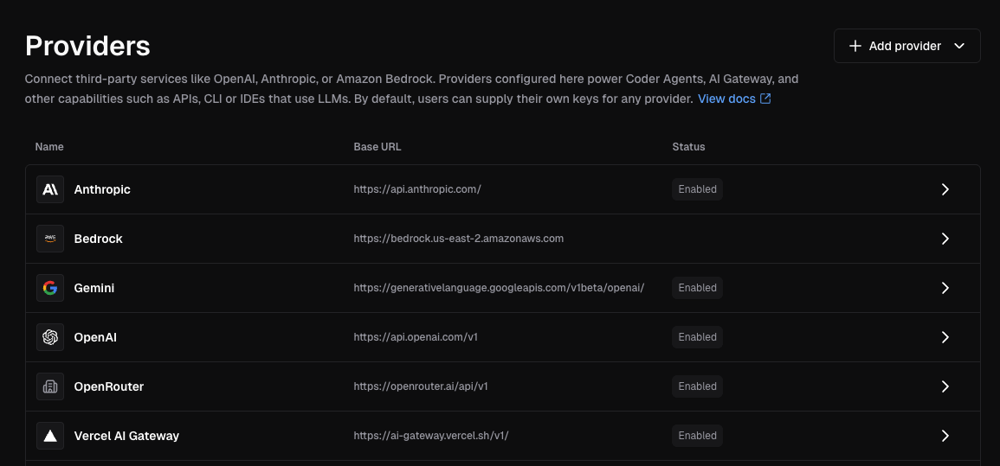
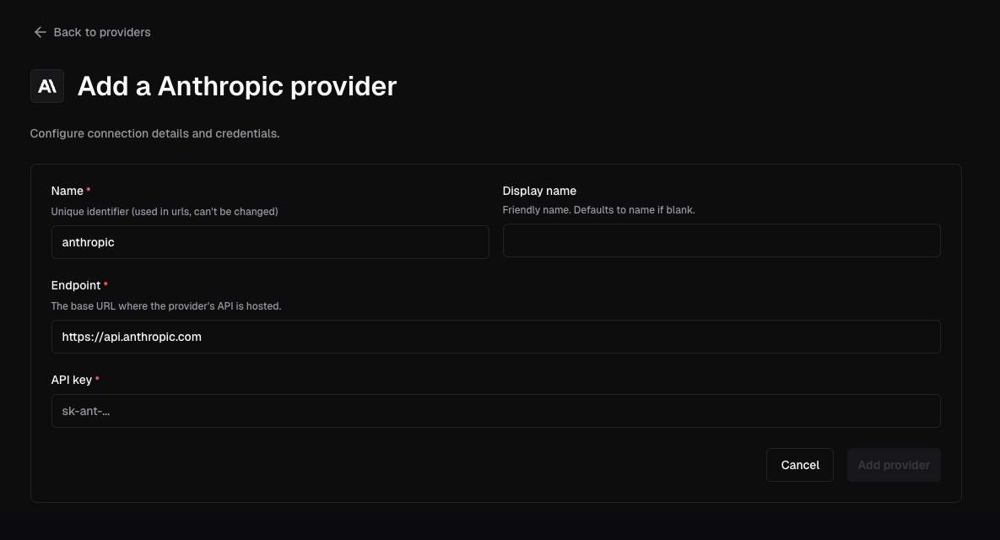
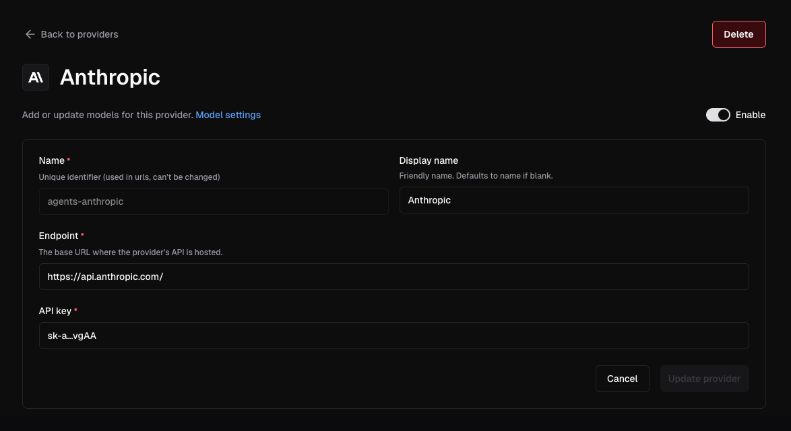

# Setup

AI Gateway runs inside the Coder control plane (`coderd`), requiring no separate compute to deploy or scale. Once enabled, `coderd` runs the `aibridged` in-memory and brokers traffic to your configured AI providers on behalf of authenticated users.

> [!NOTE]
> Since v2.34, provider environment variables and flags are deprecated.
> Provider configuration is now stored in the database, and any
> environment variables set on startup are used to seed it once. See
> [Database management of providers](./providers.md#database-management-of-providers)
> for details.

## Activation

AI Gateway must be enabled in deployment config before users can authenticate
to it.

```sh
export CODER_AI_GATEWAY_ENABLED=true
coder server
# or
coder server --ai-gateway-enabled=true
```

_AI Gateway is enabled by default as of v2.34._

## Configure Providers

Configure at least one provider before exposing AI Gateway to end users.

Providers are deployment-scoped. Add them from the dashboard or the
[AI Providers API](../../reference/api/aiproviders.md). Changes take effect
without restarting `coderd`.

### Dashboard

1. Navigate to **Admin settings** > **AI**
1. Select **Providers**
1. Click **Add provider**
1. Select the provider type
1. Enter a unique lowercase name, the upstream endpoint, and the credentials
1. Save the provider

Each provider gets its own AI Gateway route at
`/api/v2/ai-gateway/<provider-name>/`.

> [!NOTE]
> Provider names must be unique and use lowercase, hyphen-separated identifiers
> such as `anthropic-corp` or `azure-openai`. Once deleted, another provider
> may reuse the name.





Open an existing provider to rotate credentials, update its endpoint, or
disable it without restarting `coderd`.



## API Dumps

AI Gateway can dump provider request and response pairs to disk for debugging.
Configure the dump directory with `--ai-gateway-dump-dir` or
`CODER_AI_GATEWAY_DUMP_DIR`:

```sh
coder server --ai-gateway-dump-dir=/var/lib/coder/ai-gateway-dumps
```

Or in YAML:

```yaml
ai_gateway:
  api_dump_dir: /var/lib/coder/ai-gateway-dumps
```

This top-level setting replaces the previous per-provider `DUMP_DIR` field.
For each provider, AI Gateway writes dumps under `<base>/<provider_name>`, where
`<base>` is the configured dump directory and `<provider_name>` is the provider
instance name used in the route. For example, a provider named `anthropic-corp`
with `/var/lib/coder/ai-gateway-dumps` configured writes to
`/var/lib/coder/ai-gateway-dumps/anthropic-corp`.

Sensitive headers are redacted before dumps are written. Leave the value empty
to disable dumping.

> [!WARNING]
> API dumps are intended for short diagnostic sessions only. Dump files contain
> raw request and response data, which may include proprietary or sensitive
> information such as prompts, completions, and tool inputs. Protect the target
> directory and disable dumping when diagnostics are complete.

## Data Retention

AI Gateway records prompts, token usage, tool invocations, and model reasoning for auditing and
monitoring purposes. By default, this data is retained for **60 days**.

Configure retention using `--ai-gateway-retention` or `CODER_AI_GATEWAY_RETENTION`:

```sh
coder server --ai-gateway-retention=90d
```

Or in YAML:

```yaml
ai_gateway:
  retention: 90d
```

Set to `0` to retain data indefinitely.

For duration formats, how retention works, and best practices, see the
[Data Retention](../../admin/setup/data-retention.md) documentation.

## Structured Logging

AI Gateway can emit structured logs for every interception record, making it
straightforward to export data to external SIEM or observability platforms.

Enable with `--ai-gateway-structured-logging` or `CODER_AI_GATEWAY_STRUCTURED_LOGGING`:

```sh
coder server --ai-gateway-structured-logging=true
```

Or in YAML:

```yaml
ai_gateway:
  structured_logging: true
```

These logs are written to the same output stream as all other `coderd` logs,
using the format configured by
[`--log-human`](../../reference/cli/server.md#--log-human) (default, writes to
stderr) or [`--log-json`](../../reference/cli/server.md#--log-json). For machine
ingestion, set `--log-json` to a file path or `/dev/stderr` so that records are
emitted as JSON.

Filter for AI Gateway records in your logging pipeline by matching on the
`"interception log"` message. Each log line includes a `record_type` field that
indicates the kind of event captured:

| `record_type`        | Description                             | Key fields                                                                     |
|----------------------|-----------------------------------------|--------------------------------------------------------------------------------|
| `interception_start` | A new intercepted request begins.       | `interception_id`, `initiator_id`, `provider`, `model`, `client`, `started_at` |
| `interception_end`   | An intercepted request completes.       | `interception_id`, `ended_at`                                                  |
| `token_usage`        | Token consumption for a response.       | `interception_id`, `input_tokens`, `output_tokens`, `created_at`               |
| `prompt_usage`       | The last user prompt in a request.      | `interception_id`, `prompt`, `created_at`                                      |
| `tool_usage`         | A tool/function call made by the model. | `interception_id`, `tool`, `input`, `server_url`, `injected`, `created_at`     |
| `model_thought`      | Model reasoning or thinking content.    | `interception_id`, `content`, `created_at`                                     |
