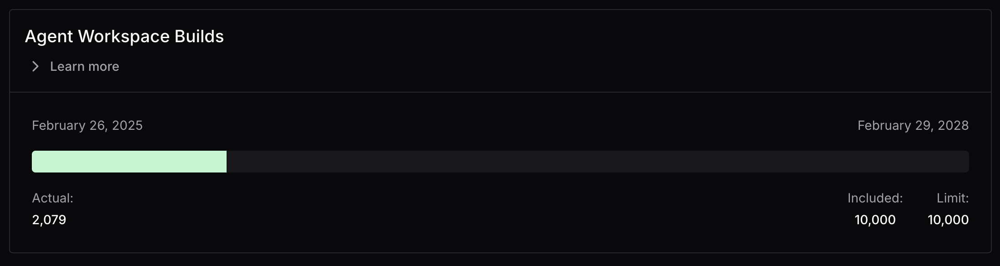

# AI Governance Add-On (Premium)

Coder Workspaces already lets teams run AI tools like
[Cursor](https://registry.coder.com/modules/coder/cursor) and
[Claude Code](https://registry.coder.com/modules/coder/claude-code) inside their
development environments. As adoption grows, many enterprises also need
observability, management, and policy controls to support secure and auditable
AI rollouts.

Coder’s AI Governance Add-On for Premium licenses includes a set of features
that help organizations safely roll out AI tooling at scale:

- [AI Bridge](./ai-bridge/index.md): LLM gateway to audit AI sessions, central
  MCP server management, and policy enforcement
- [Agent Boundaries](./agent-boundaries/index.md): Process-level firewalls for
  agents, restricting which domains can be accessed by AI agents
- [Additional Tasks Use (via Agent Workspace Builds)](#how-coder-tasks-usage-is-measured):
  Additional allowance of Agent Workspace Builds for continued use of Coder
  Tasks.

## Who should use the AI Governance Add-On

The AI Governance Add-On is for teams that want to extend that platform to
support AI-powered IDEs and coding agents in a controlled, observable way.

It's a good fit if you're:

- Rolling out AI-powered IDEs like Cursor and AI coding agents like Claude Code
  across teams
- Looking to centrally observe, audit, and govern AI activity in Coder
  Workspaces
- Managing AI workflows against sensitive or regulated codebases
- Expanding the use of Coder Tasks for AI-driven background work

If you already use other AI governance tools, such as third-party LLM gateways
or vendor-managed policies, you can continue using them. Coder Workspaces can
still serve as the backend for development environments and AI workflows, with
or without the AI Governance Add-On.

## Use cases for AI Governance

Organizations adopting AI coding tools at scale often encounter operational and
security challenges that traditional developer tooling doesn't address.

### Auditing AI activity across teams

Without centralized monitoring, teams have no way to understand how AI tools are
being used across the organization. AI Bridge provides audit trails of prompts,
token usage, and tool invocations, giving administrators insight into AI
adoption patterns and potential issues.

### Restricting agent network and command access

AI agents can make arbitrary network requests, potentially accessing
unauthorized services or exfiltrating data. They can also execute destructive
commands within a workspace. Agent Boundaries enforce process-level policies
that restrict which domains agents can reach and what actions they can perform,
preventing unintended data exposure and destructive operations like `rm -rf`.

### Centralizing API key management

Managing individual API keys for AI providers across hundreds of developers
creates security risks and administrative overhead. AI Bridge centralizes
authentication so users authenticate through Coder, eliminating the need to
distribute and rotate provider API keys.

### Standardizing MCP tools and servers

Different teams may use different MCP servers and tools with varying security
postures. AI Bridge enables centralized MCP administration, allowing
organizations to define approved tools and servers that all users can access.

### Measuring AI adoption and spend

Without usage data, it's hard to justify AI tooling investments or identify
high-leverage use cases. AI Bridge captures metrics on token spend, adoption
rates, and usage patterns to inform decisions about AI strategy.

## GA status and availability

Starting with Coder v2.30 (February 2026), AI Bridge and Agent Boundaries are
generally available as part of the AI Governance Add-On.

If you've been experimenting with these features in earlier releases, you'll see
a notification banner in your deployment in v2.30. This banner is a reminder
that these features have moved out of beta and are now included with the AI
Governance Add-On.

In v2.30, this notification is informational only. A future Coder release will
require the add-on to continue using AI Bridge and Agent Boundaries.

To learn more about enabling the AI Governance Add-On, pricing, or trial
options, reach out to your
[Coder account team](https://coder.com/contact/sales).

## How Coder Tasks usage is measured

> [!NOTE]
> There is a known issue with how Agent Workspace Builds are tallied in v2.28
> and v2.29. We recommend updating to v2.28.9, v2.29.4, or v2.30 to resolve
> this issue.

The usage metric used to measure Coder Tasks consumption is called **Agent
Workspace Builds** (prev. "managed agents").

An Agent Workspace Build is counted each time a workspace is started
specifically for a coding agent to independently work on a Coder Task. Most of
the work in this workspace is performed by the agent, not a human developer.
Each Coder Task starts its own workspace, and the usage meter counts one Agent
Workspace Build.

Traditional Coder Workspaces started manually by developers or scheduled to
auto-start do not count as an Agent Workspace Build. These are considered
daily-driver development environments where developers co-exist with their IDEs
and coding assistants.

### Scenarios

| Scenario                                                                                          | Consumes Agent Workspace Build |
|---------------------------------------------------------------------------------------------------|--------------------------------|
| Developer creates a Coder Task to write end-to-end tests                                          | Yes                            |
| Automated pipeline creates a task via Coder Tasks CLI (with Claude Code) to review a pull request | Yes                            |
| Developer resumes an old Coder Task order to continue prototyping                                 | Yes                            |
| Developer starts a workspace for use with VS Code and Jupyter                                     | No                             |
| Developer creates a workspace for use with Cursor and Claude Code CLI                             | No                             |
| Developer creates a workspace for use with Coder AI Bridge and Agent Boundaries                   | No                             |

In the future, additional capabilities for managing agents (beyond Coder Tasks)
may also consume agent workspace builds.

### Agent Workspace Build Limits

Without proper controls and sandboxing, it is not recommended to open up Coder
Tasks to a large audience in the enterprise. Coder Premium deployments include
1,000 Agent Workspace Builds, primarily for proof-of-concept use and basic
workflows.

Our [AI Governance Add-On](./ai-governance.md) includes a shared usage pool of
Agent Workspace Builds for automated workflows, along with limits that scale
proportionately with user count. Usage counts are measured and sent to Coder via
[usage data reporting](./usage-data-reporting.md). Coder Tasks and other AI
features continue to function normally even if the limit is breached. Admins
will receive a warning to [contact their account team](https://coder.com/contact)
to remediate.

### Tracking Agent Workspace Builds

Admins can monitor Agent Workspace Build usage from the Coder dashboard.
Navigate to **Deployment** > **Licenses** to view current usage against your
entitlement limits.

<small>Agent Workspace Build usage showing current consumption against
entitlement limits in the Licenses page.</small>
