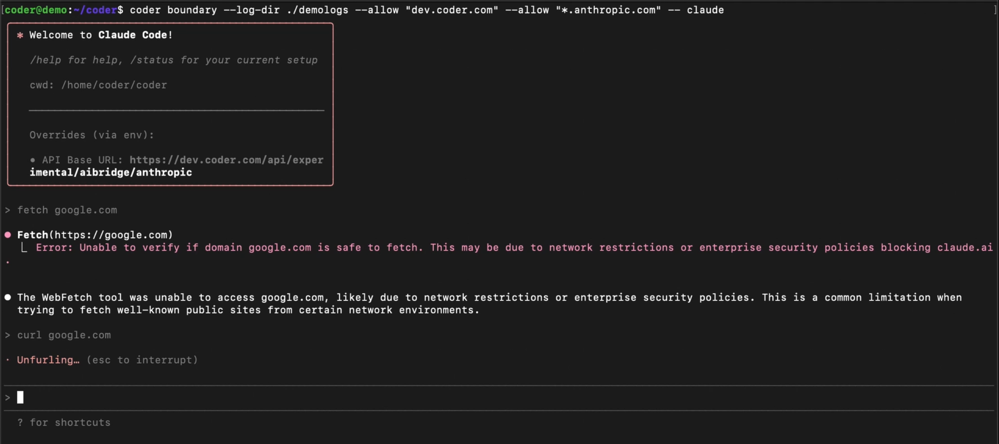

# Agent Boundary

Agent Boundaries are process-level firewalls that restrict and audit what autonomous programs, such as AI agents, can access and use.

Example of Agent Boundaries blocking a process.

## Supported Agents

Agent Boundaries support the securing of any terminal-based agent, including your own custom agents.

## Features

Agent Boundaries offer network policy enforcement, which blocks domains and HTTP verbs to prevent exfiltration, and writes logs to the workspace.

Agent Boundaries also stream audit logs to Coder's control plane for centralized
monitoring of HTTP requests.

## Getting Started with Boundary

The easiest way to use Agent Boundaries is through existing Coder modules, such as the [Claude Code module](https://registry.coder.com/modules/coder/claude-code). It can also be ran directly in the terminal by installing the [CLI](https://github.com/coder/boundary).

## Configuration

Boundary is configured using a `config.yaml` file. This allows you to maintain allow lists and share detailed policies with teammates.

In your Terraform module, enable Boundary with minimal configuration:

```tf
module "claude-code" {
  source              = "dev.registry.coder.com/coder/claude-code/coder"
  version             = "4.3.0"
  enable_boundary     = true
  boundary_version    = "v0.5.2"
}
```

Create a `config.yaml` file in your template directory with your policy. For the Claude Code module, use the following minimal configuration:

```yaml
allowlist:
  - "domain=dev.coder.com"              # Required - use your Coder deployment domain
  - "domain=api.anthropic.com"          # Required - API endpoint for Claude
  - "domain=statsig.anthropic.com"      # Required - Feature flags and analytics
  - "domain=claude.ai"                  # Recommended - WebFetch/WebSearch features
  - "domain=*.sentry.io"                # Recommended - Error tracking (helps Anthropic fix bugs)
log_dir: /tmp/boundary_logs
proxy_port: 8087
log_level: warn
```

For a basic recommendation of what to allow for agents, see the [Anthropic documentation on default allowed domains](https://code.claude.com/docs/en/claude-code-on-the-web#default-allowed-domains). For a comprehensive example of a production Boundary configuration, see the [Coder dogfood policy example](https://github.com/coder/coder/blob/main/dogfood/coder/boundary-config.yaml).

Add a `coder_script` resource to mount the configuration file into the workspace filesystem:

```tf
resource "coder_script" "boundary_config_setup" {
  agent_id     = coder_agent.dev.id
  display_name = "Boundary Setup Configuration"
  run_on_start = true

  script = <<-EOF
    #!/bin/sh
    mkdir -p ~/.config/coder_boundary
    echo '${base64encode(file("${path.module}/config.yaml"))}' | base64 -d > ~/.config/coder_boundary/config.yaml
    chmod 600 ~/.config/coder_boundary/config.yaml
  EOF
}
```

Boundary automatically reads `config.yaml` from `~/.config/coder_boundary/` when it starts, so everyone who launches Boundary manually inside the workspace picks up the same configuration without extra flags. This is especially convenient for managing extensive allow lists in version control.

### Configuration Parameters

- `log_dir` defines where boundary writes log files
- `log_level` defines the verbosity at which requests are logged. Boundary uses the following verbosity levels:
  - `WARN`: logs only requests that have been blocked by Boundary
  - `INFO`: logs all requests at a high level
  - `DEBUG`: logs all requests in detail
- `proxy_port` defines the port used by the HTTP proxy.
- `allowlist` defines the URLs that the agent can access, in addition to the default URLs required for the agent to work. Rules use the format `"key=value [key=value ...]"`:
  - `domain=github.com` - allows the domain and all its subdomains
  - `domain=*.github.com` - allows only subdomains (the specific domain is excluded)
  - `method=GET,HEAD domain=api.github.com` - allows specific HTTP methods for a domain
  - `method=POST domain=api.example.com path=/users,/posts` - allows specific methods, domain, and paths
  - `path=/api/v1/*,/api/v2/*` - allows specific URL paths

For detailed information about the rules engine and how to construct allowlist rules, see the [rules engine documentation](./rules-engine.md).

You can also run Agent Boundaries directly in your workspace and configure it per template. You can do so by installing the [binary](https://github.com/coder/boundary) into the workspace image or at start-up. You can do so with the following command:

```bash
curl -fsSL https://raw.githubusercontent.com/coder/boundary/main/install.sh | bash
 ```

## Jail Types

Boundary supports two different jail types for process isolation, each with different characteristics and requirements:

1. **nsjail** - Uses Linux namespaces for isolation. This is the default jail type and provides network namespace isolation. See [nsjail documentation](./nsjail.md) for detailed information about runtime requirements and Docker configuration.

2. **landjail** - Uses Landlock V4 for network isolation. This provides network isolation through the Landlock Linux Security Module (LSM) without requiring network namespace capabilities. See [landjail documentation](./landjail.md) for implementation details.

The choice of jail type depends on your security requirements, available Linux capabilities, and runtime environment. Both nsjail and landjail provide network isolation, but they use different underlying mechanisms. nsjail uses Linux namespaces, while landjail uses Landlock V4. Landjail may be preferred in environments where namespace capabilities are limited or unavailable.

## Implementation Comparison: Namespaces+iptables vs Landlock V4

| Aspect                        | Namespace Jail (Namespaces + veth-pair + iptables)                                | Landlock V4 Jail                                                        |
|-------------------------------|-----------------------------------------------------------------------------------|-------------------------------------------------------------------------|
| **Privileges**                | Requires `CAP_NET_ADMIN`                                                          | ✅ No special capabilities required                                      |
| **Docker seccomp**            | ❌ Requires seccomp profile modifications or sysbox-runc                           | ✅ Works without seccomp changes                                         |
| **Kernel requirements**       | Linux 3.8+ (widely available)                                                     | ❌ Linux 6.7+ (very new, limited adoption)                               |
| **Bypass resistance**         | ✅ Strong - transparent interception prevents bypass                               | ❌ **Medium - can bypass by connecting to `evil.com:<HTTP_PROXY_PORT>`** |
| **Process isolation**         | ✅ PID namespace (processes can't see/kill others); **implementation in-progress** | ❌ No PID namespace (agent can kill other processes)                     |
| **Non-TCP traffic control**   | ✅ Can block/control UDP via iptables; **implementation in-progress**              | ❌ No control over UDP (data can leak via UDP)                           |
| **Application compatibility** | ✅ Works with ANY application (transparent interception)                           | ❌ Tools without `HTTP_PROXY` support will be blocked                    |

## Audit Logs

Agent Boundaries stream audit logs to the Coder control plane, providing centralized
visibility into HTTP requests made within workspaces—whether from AI agents or ad-hoc
commands run with `boundary-run`.

Audit logs are independent of application logs:

- **Audit logs** record Boundary's policy decisions: whether each HTTP request was
  allowed or denied based on the allowlist rules. These are always sent to the control
  plane regardless of Boundary's configured log level.
- **Application logs** are Boundary's operational logs written locally to the workspace.
  These include startup messages, internal errors, and debugging information controlled
  by the `log_level` setting.

For example, if a request to `api.example.com` is allowed by Boundary but the remote
server returns a 500 error, the audit log records `decision=allow` because Boundary
permitted the request. The HTTP response status is not tracked in audit logs.

> [!NOTE]
> Requires Coder v2.30+ and Boundary v0.5.2+.

### Audit Log Contents

Each boundary audit log entry includes:

| Field            | Description                                                                             |
|------------------|-----------------------------------------------------------------------------------------|
| `decision`       | Whether the request was allowed (`allow`) or blocked (`deny`)                           |
| `workspace_id`   | The UUID of the workspace where the request originated                                  |
| `workspace_name` | The name of the workspace where the request originated                                  |
| `owner`          | The owner of the workspace where the request originated                                 |
| `http_method`    | The HTTP method used (GET, POST, PUT, DELETE, etc.)                                     |
| `http_url`       | The fully qualified URL that was requested                                              |
| `event_time`     | Timestamp when boundary processed the request (RFC3339 format)                          |
| `matched_rule`   | The allowlist rule that permitted the request (only present when `decision` is `allow`) |

### Viewing Audit Logs

Boundary audit logs are emitted as structured log entries from the Coder server.
You can collect and analyze these logs using any log aggregation system such as
Grafana Loki.

Example of an allowed request (assuming stderr):

```console
2026-01-16 00:11:40.564 [info]  coderd.agentrpc: boundary_request owner=joe  workspace_name=some-task-c88d agent_name=dev  decision=allow  workspace_id=f2bd4e9f-7e27-49fc-961e-be4d1c2aa987  http_method=GET http_url=https://dev.coder.com  event_time=2026-01-16T00:11:39.388607657Z  matched_rule=domain=dev.coder.com request_id=9f30d667-1fc9-47ba-b9e5-8eac46e0abef trace=478b2b45577307c4fd1bcfc64fad6ffb span=9ece4bc70c311edb
```
