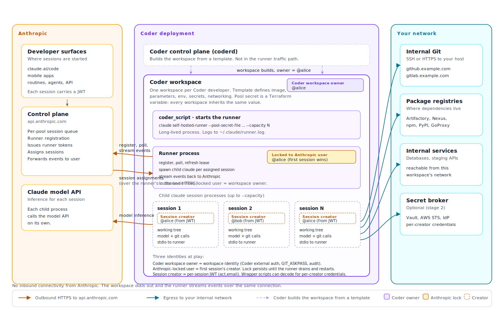

# Claude Code Self-Hosted Runners on Coder

> [!NOTE]
> Claude Code self-hosted runners are in early access (EAP) from Anthropic.
> Contact your Anthropic account team to request access and obtain the runner
> build. This guide describes how to run those runners on Coder workspaces
> using only existing Coder capabilities. **No Coder product changes are
> required.**

[Claude Code self-hosted runners](https://docs.claude.com/en/docs/claude-code/self-hosted-runners)
let you execute Claude Code remote sessions on infrastructure you control. A
runner is a long-lived process that registers with a pool in your Anthropic
organization, polls for assigned sessions, spawns a Claude Code child process
per session, and streams results back to Anthropic. Sessions originate from
Claude Code on the web, the mobile apps, scheduled routines, agents, or other
Anthropic surfaces. The runner is surface-agnostic.

Because the runner is just a Linux/macOS process with outbound HTTPS to
`api.anthropic.com`, **a Coder workspace is a natural host for it**. Coder
already gives you the things runners need: a reproducible base image
(template), credential delivery (parameters, env vars, secrets), per-user
isolation (one workspace per user), networking policy (workspace egress to
your internal Git and registries), and a place to attach an IDE if you want a
developer to debug what the runner is doing.

This page describes the **basic flow** for running Claude Code self-hosted
runners on Coder with no product changes. Subsequent pages describe more
advanced variants and the longer-term plan.

## What you get

- Claude Code remote sessions execute inside your Coder workspaces, on the
  same network and image your developers already use.
- Each Anthropic user is served by their own workspace, mirroring Anthropic's
  "one runner is locked to one user at a time" model.
- The runner can reach internal Git, package registries, databases, and
  build tooling that the workspace can reach, with no extra network plumbing.
- Existing Coder primitives (templates, parameters, schedules, RBAC, audit
  log, autostop) govern the runner the same way they govern any other
  workload.

## What this is *not*

- It is not a managed Anthropic integration. Coder does not provision pools,
  rotate pool secrets, or route sessions; Anthropic does.
- It does not require any new Coder feature. The runner is a regular process
  inside a workspace.
- It is not the same as [Coder Agents](../agents/index.md) or
  [AI Gateway](../ai-gateway/index.md). Coder Agents is Coder's own
  control-plane agent. AI Gateway is Coder's egress proxy for LLM traffic.
  Self-hosted runners are Anthropic's product running on your compute. The
  three are complementary and can be used together. See
  [How it relates to Coder Agents and AI Gateway](#how-it-relates-to-coder-agents-and-ai-gateway).

## How it fits together



- A developer starts a Claude Code session at `claude.ai/code` (or from
  mobile, a routine, etc.) and picks the pool that points at your Coder
  workspaces.
- The session is queued on Anthropic's side. A free Coder-hosted runner
  picks it up, clones the requested repo, spawns a child `claude` process,
  and streams events back to Anthropic.
- The developer sees the session in the Anthropic UI exactly as they would
  for an Anthropic-managed session. The fact that the compute is in Coder
  is transparent to them.

## High-level user-facing flow

This is the day-one flow we are documenting. It maps cleanly to roles your
team already has.

### Roles

| Role                 | Responsibility                                                                                                                                                                                             |
|----------------------|------------------------------------------------------------------------------------------------------------------------------------------------------------------------------------------------------------|
| Anthropic org admin  | Creates and rotates self-hosted runner pools in `claude.ai`. Distributes the pool secret to the platform team.                                                                                             |
| Coder template admin | Publishes a Coder template that bakes the runner binary, Git identity, and required toolchains into a workspace. Defines parameters for `--capacity`, repo allow-list, and so on.                          |
| Coder developer      | Creates a workspace from the template, supplies their pool secret as a workspace parameter or env var, and starts the workspace. The runner registers with Anthropic and is ready to serve their sessions. |
| Anthropic developer  | Starts sessions from `claude.ai/code`, mobile, or routines and picks the pool that targets Coder. They never need to log in to Coder.                                                                      |

In small teams the same person plays the first three roles.

### End-to-end flow

1. **Anthropic org admin** creates a pool at `claude.ai > Settings > Claude
   Code > Self-hosted runner pools` and copies the pool secret. The secret
   is shown once.
2. **Coder template admin** publishes a Coder template that bakes the
   runner binary into a workspace image and starts the runner via
   `coder_script`. Push credentials come from Coder external auth (the
   agent wires `GIT_ASKPASS` automatically).
3. **Developer** creates a workspace from the template and supplies the
   pool secret (either pasted as a sensitive parameter or pre-injected
   from your secrets platform).
4. The workspace agent starts the runner. The runner dials out to
   `api.anthropic.com`, registers with the pool, receives a runner token,
   and begins polling for sessions.
5. **Anthropic developer** starts a session at `claude.ai/code` (or from
   mobile, a routine, etc.) and picks the pool that targets Coder.
6. The runner claims the session, spawns a child `claude` process inside
   the workspace, and streams events back to Anthropic. The developer
   sees the session in the Anthropic UI exactly as if it were an
   Anthropic-managed session.

## Basic recipe (no product changes)

The rest of this section is the minimum viable setup. Each step uses an
existing Coder feature. See the [setup guide](./setup.md) for copyable
Terraform.

### 1. Get the runner build from Anthropic

Your Anthropic account team provides a `BYOC_VERSION` and a tarball URL on
`storage.googleapis.com`. The tarball contains one subdirectory per supported
platform (`linux-x64`, `linux-arm64`, `linux-x64-musl`, `linux-arm64-musl`,
`darwin-x64`, `darwin-arm64`). On Linux x86_64 workspaces you will use the
`linux-x64` binary.

Bake the binary into your **workspace base image** (recommended) or download
it from a `coder_script` on workspace start. Baking is recommended because it
gives you a single artifact to scan, sign, and roll out.

### 2. Create a pool in `claude.ai`

In `claude.ai`, navigate to **Settings → Claude Code → Self-hosted runner
pools** and create a pool. Copy the pool secret. It is shown once and cannot
be retrieved later. Store it in your existing secrets system (Vault,
1Password, AWS Secrets Manager, etc.).

### 3. Publish a Coder template

The template's job is to start a single workspace per user where the runner
process runs. The template should:

- Use a base image that includes `git`, `curl`, the Claude Code runner
  binary, and any compilers/SDKs sessions will need.
- Set a system-wide Git identity in the image (`/etc/gitconfig`) so the
  child process can commit. Anthropic-managed sessions use
  `Claude <noreply@anthropic.com>`; you can reuse that or use your own bot
  identity.
- Pre-configure Git push credentials (SSH key, `.netrc`, or
  `git credential.helper`) for the repos sessions will push to. The runner
  itself does not configure Git auth.
- Accept the pool secret as a sensitive Coder parameter, or read it from a
  pre-injected environment variable / mounted secret if your platform
  already delivers per-user secrets.
- Start the runner from a `coder_script` block. The runner inherits the
  workspace's environment, network, and filesystem.

A minimal `coder_script` looks like this:

```hcl
resource "coder_script" "claude_runner" {
  agent_id     = coder_agent.main.id
  display_name = "Start Claude Code self-hosted runner"
  run_on_start = true
  start_blocks_login = false

  script = <<-EOT
    set -euo pipefail

    POOL_SECRET_FILE=/etc/claude/pool-secret
    sudo install -d -m 0750 /etc/claude
    printf '%s' "$CLAUDE_POOL_SECRET" | sudo tee "$POOL_SECRET_FILE" >/dev/null
    sudo chmod 0400 "$POOL_SECRET_FILE"

    exec /opt/claude/claude self-hosted-runner \
      --pool-secret-file "$POOL_SECRET_FILE" \
      --capacity "$CLAUDE_CAPACITY" \
      --log-file "$HOME/.claude/runner.log"
  EOT
}
```

`CLAUDE_POOL_SECRET` and `CLAUDE_CAPACITY` come from Coder parameters or
agent `env`. See [Setup](./setup.md) for the full template.

### 4. Developer creates a workspace

The developer creates one workspace from the template, supplies the pool
secret (or relies on the template admin to inject it), and starts the
workspace. Within a few seconds, the runner appears in the Anthropic admin
UI under the pool, and the workspace is ready to serve Claude Code sessions
for that user.

The developer does not need to keep Coder open. Once the workspace is
running, sessions flow in from Anthropic surfaces. They can also use the
same workspace as a normal Coder workspace (IDE, terminal, port forwards)
while the runner is active. The runner's child processes operate in their
own checkout directories.

### 5. Routing sessions to the Coder-backed pool

From `claude.ai/code` (or any other Anthropic surface), the developer
selects your pool from the environment picker when starting a session. The
session is queued to the pool and the workspace's runner claims it.

## Lifecycle and isolation

Anthropic's runner model has two important properties that Coder cleanly
matches:

1. **One runner serves one user at a time.** Once a runner picks up its
   first session it is locked to that user until their work drains, then
   exits. In the Coder model, each developer has their own workspace, so
   "one runner per user" maps to "one workspace per user." There is no
   cross-user data leakage because there is no cross-workspace sharing.

2. **The runner expects a fresh filesystem on restart.** Anthropic
   recommends Kubernetes, ECS, or systemd as the orchestrator that restarts
   the process on exit. In Coder, the workspace agent restarts
   `coder_script` blocks on workspace start, and `coder stop` + `coder start`
   gives you a clean filesystem (you can opt the runner working directory
   out of persistent volumes by mounting it on an `emptyDir` or a tmpfs).
   For the basic flow we recommend setting `coder_script.run_on_start =
   true` and treating workspace restart as the restart boundary.

For the basic flow we do not try to autoscale runners. One workspace per
user is enough. See [Plan: advanced topics](./plan.md) for what changes when
you scale to many concurrent users per workspace, fleet pools, or
short-lived runner workspaces.

## How it relates to Coder Agents and AI Gateway

| Coder feature                                | What it does                                                              | Relationship to self-hosted runners                                                                                                                                                                                 |
|----------------------------------------------|---------------------------------------------------------------------------|---------------------------------------------------------------------------------------------------------------------------------------------------------------------------------------------------------------------|
| [Coder Agents](../agents/index.md)           | Coder's own agent that runs in the control plane and talks to workspaces. | Independent. You can use both, or pick whichever your team prefers per use case.                                                                                                                                    |
| [AI Gateway](../ai-gateway/index.md)         | Egress proxy for LLM traffic with audit and policy.                       | Optional. You can point the child `claude` process at AI Gateway via `ANTHROPIC_BASE_URL`; the runner itself still calls `api.anthropic.com` for pool registration. Detailed in [Plan: advanced topics](./plan.md). |
| [Agent Firewall](../agent-firewall/index.md) | Process-level egress and command policy inside a workspace.               | Optional. Apply it to the workspace if you want extra guardrails on what the child `claude` process can reach or run.                                                                                               |

## Where to next

- [Setup](./setup.md): full Terraform template, image checklist, Git
  identity config, parameter and env wiring.
- [Plan](./plan.md): the staged roadmap from the basic flow above to more
  advanced variants (per-creator credentials, AI Gateway, fleet pools,
  autoscaled runner workspaces). These are documentation and template
  exercises, not Coder product work.
