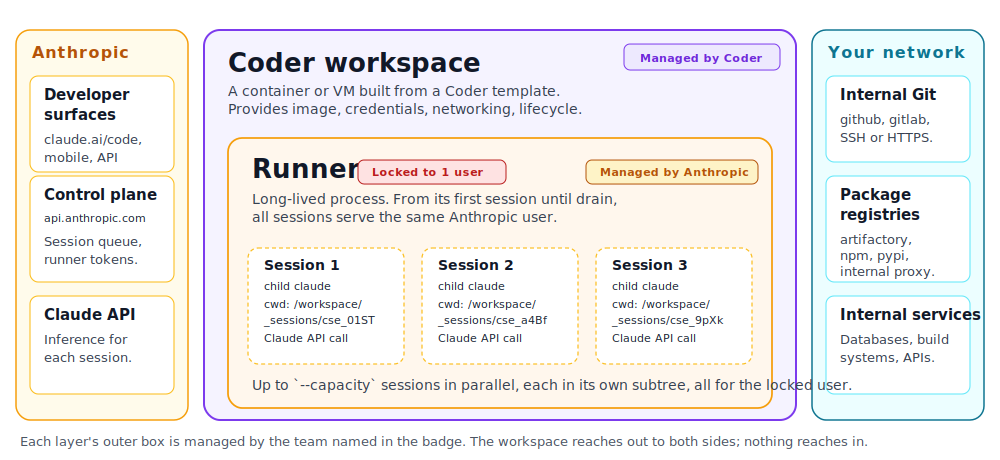

# Claude Code Self-Hosted Runners on Coder

> [!NOTE]
> Claude Code self-hosted runners are in early access from Anthropic.
> Contact your Anthropic account team to request access and obtain the
> runner build. This guide describes how to run those runners on Coder
> workspaces.

Claude Code self-hosted runners are a long-lived process that
registers with a pool in your Anthropic organization and serves Claude
Code sessions on infrastructure you operate. Each runner needs an OS,
an image, an outbound network path to `api.anthropic.com`, and a
lifecycle.

## Where Coder fits

[Coder](https://coder.com) describes infrastructure as Terraform
templates and runs that infrastructure on whatever cloud or cluster
you already use, with the same image, network policy, secret
management, and audit trail as your developer workspaces. A Claude
Code self-hosted runner needs the same things a workspace needs (an
OS, an image, an outbound network path, a credential, a lifecycle),
so we describe it as a template too. Coder's
[prebuilds](../../admin/templates/extending-templates/prebuilt-workspaces.md)
primitive keeps N warm runners ready, and replaces each one when it
drains. No second control plane, no bespoke pool manager.

## Architecture

Three nested concepts, three levels of management:

- **A Coder workspace** is the outer container: a VM or container
  built from a Coder template, with the image, credentials, and
  networking the runner needs. **Coder manages workspaces.**
- **A runner** is the long-lived `claude self-hosted-runner` process
  that lives inside one workspace, registers with your Anthropic
  pool, and polls for work. One runner per workspace. The runner
  locks to a single Anthropic user from its first session until it
  drains. **Anthropic manages runners.**
- **A session** is a single Claude Code conversation, spawned as a
  child `claude` process by the runner when Anthropic assigns one.
  A runner serves up to `--capacity` sessions in parallel, all for
  the locked user. **Anthropic manages sessions.**

All traffic from the runner to Anthropic is **outbound HTTPS** to
`api.anthropic.com`. There is no inbound connectivity from Anthropic
into your network; the runner dials out and streams events over the
same long-poll connection that delivers session assignments. From
those sessions, the runner reaches whatever your workspace can already
reach: internal Git, package registries, databases, build tooling.

### How a session flows

1. A developer starts a Claude Code session from any surface and picks
   the pool that targets Coder.
2. The session queues on Anthropic's side. Anthropic's pool scheduler
   picks a free Coder-hosted runner and routes the session to it.
3. The runner **locks** to that session's Anthropic account. From here
   until drain, this runner serves only that user's sessions, up to
   `--capacity` in parallel.
4. The runner clones the requested repo, spawns a child `claude`
   process, and streams events back to Anthropic.
5. The developer sees the session in the Anthropic UI exactly as they
   would for an Anthropic-managed session. The fact that the compute is
   in Coder is transparent to them.
6. When the user's queued and active sessions drain to zero, the runner
   exits 0 and the orchestrator hands the next process a fresh disk.

### What Coder primitives map to

**Anthropic runner = Coder workspace.** Each runner is one workspace.
A pool of N runners is N prebuilt workspaces; one user serving 4
parallel sessions is 4 child processes inside one workspace; a runner
draining and exiting is the workspace deleting itself.

| Anthropic concept                   | Coder primitive                                                                |
|-------------------------------------|--------------------------------------------------------------------------------|
| One runner                          | **One workspace**                                                              |
| Pool of N runners                   | **N prebuilt workspaces** maintained by a preset with `prebuilds { instances = N }` |
| Runner image                        | Workspace template + image                                                     |
| Runner process                      | A long-running command in `coder_script`                                       |
| Pool secret                         | Sensitive Terraform variable                                                   |
| "Orchestrator restarts the runner"  | `coder_script` + self-eviction via `coder delete` on runner exit               |
| Runner locked to one Anthropic user | A per-workspace state, surfaced on that workspace's page via agent metadata    |
| Per-session checkout (`/workspace`) | Container filesystem in that workspace, deliberately not persisted             |
| Internal Git, registries, services  | Whatever the workspace can already reach                                       |
| Wrapper scripts and lifecycle hooks | Files in the workspace image; pointed at via `--exec-path` or `--hooks-dir`    |

## Why run them on Coder

Self-host the runner on a Coder workspace and the workspace primitives
you already use carry over:

- **Reproducible workspaces as code.** Coder defines a workspace in
  Terraform: pick a container, VM, or bare-metal host on AWS, GCP,
  Azure, vSphere, Kubernetes, Nomad, or your own provider; bake the
  runner binary, language toolchains, and internal CLIs into the
  image; ship the whole thing with one `coder templates push`. Every
  runner in the fleet is the same code path.
- **Network you already control.** The workspace runs wherever your
  template places it: your VPC, your private subnet, your peered
  on-prem segment. Outbound to `api.anthropic.com` is the only thing
  Anthropic needs; reaching internal Git, registries, databases, and
  build systems uses the routes that workspace already has.
- **Compute you already capacity-plan.** Same accounts, same nodes,
  same autoscaler your developer workspaces run on. Coder prebuilds
  keep a warm pool of runners ready, recycle them on a TTL, and let
  you size the pool the way you size any other internal service.
- **One environment, two use cases.** The same base image, the same
  internal registries, and the same git access you give a developer
  for interactive work also serves the runner pool. Ship a developer
  template and a runner template that share an image, then diverge
  only where they should: the runner template can tighten egress to
  `api.anthropic.com` plus your internal hosts, drop interactive
  ports, and apply [Agent Firewall](../agent-firewall/index.md)
  rules, while the developer template stays open. Same environment
  for software engineering and agents, different network controls
  and policies per workspace.
- **Compliance.** Source code, build artifacts, and the runner's
  working directories stay on infrastructure you own. Workspaces,
  agent logs, and Coder audit trails live in your tenancy with the
  rest of your SDLC.
- **Day-2 ops.** Push the template once to ship a new runner image
  fleet-wide. Use the workspace page, agent logs, and metadata
  surfaces to see lock status, in-flight session count, and last
  poll age. Attach an IDE to a workspace when you need to debug what
  a runner is doing.

## What this is and is not

- This is **not a managed Anthropic integration**. Coder does not
  provision pools, rotate pool secrets, or route sessions; Anthropic
  does.
- This is **not the same as [Coder Agents](../agents/index.md) or
  [AI Gateway](../ai-gateway/index.md)**. Coder Agents is Coder's own
  control-plane agent. AI Gateway is Coder's egress proxy for LLM
  traffic. Self-hosted runners are Anthropic's product running on your
  compute. The three are complementary and can be used together.
- This is **early access, not GA**. The runner binary version, the JWT
  claim shape, and the scaling signal interfaces are all marked as
  subject to change during early access. Pin your `BYOC_VERSION` and
  re-test on bumps.

## How it relates to Coder Agents and AI Gateway

| Coder feature                                | What it does                                                              | Relationship to self-hosted runners                                                                                                                                                                       |
|----------------------------------------------|---------------------------------------------------------------------------|-----------------------------------------------------------------------------------------------------------------------------------------------------------------------------------------------------------|
| [Coder Agents](../agents/index.md)           | Coder's own agent that runs in the control plane and talks to workspaces. | Independent. You can use both, or pick whichever fits per use case.                                                                                                                                       |
| [AI Gateway](../ai-gateway/index.md)         | Egress proxy for LLM traffic with audit and policy.                       | Optional. You can point the child `claude` process at AI Gateway via `ANTHROPIC_BASE_URL`; the runner itself still calls `api.anthropic.com` for pool registration. Detailed in the implementation notes. |
| [Agent Firewall](../agent-firewall/index.md) | Process-level egress and command policy inside a workspace.               | Optional. Apply it to the workspace for extra guardrails on what the child `claude` process can reach or run.                                                                                             |

## Identity models

Coder supports running self-hosted runners under two different identity
models. They share the same template, image, and pool; they differ in
who owns the workspace and whose credentials the runner uses.

### System identity (Works Today)

Coder maintains N warm bot-owned workspaces via the prebuilds primitive.
Anthropic's scheduler picks one when a session arrives and locks the
runner (therefore that workspace) to that user. When the user's work
drains the workspace deletes itself, the prebuild reconciler queues a
replacement.

Identity is bot-shaped: every commit author is the bot, every push uses
a bot PAT shipped as a sensitive Terraform variable. The Anthropic
session URL appended to each commit as a trailer is your per-human
signal in git history.

See [System identity](./system-identity.md) for the copyable Terraform
recipe and the known limitations.

### User identity (Planned)

A routing component pre-binds each runner workspace to the developer
who started the session. The workspace owner is the human, Coder
external auth wires their git push token automatically, and audit log
entries attribute to them.

User identity depends on Anthropic runner protocol pieces that are
still being finalized. The on-demand runner orchestrator (shipped in
byoc.14) now provides the user's account email to the `spawn-runner`
hook, which is the data needed to map an Anthropic user to a Coder
user. The remaining blocker is `--lock-to-account`, which is still
marked pending. The [System identity](./system-identity.md)
recipe you ship today is the foundation; turning on user identity will
mean swapping the bot credential plumbing for Coder external auth.

See [User identity](./user-identity.md) for the design and what stays
the same.

## Deployment models

Coder supports two ways to host self-hosted runners, each with different
tradeoffs:

### Fixed fleet (prebuilds)

Coder keeps N warm prebuild workspaces, each running a long-lived runner
process. Anthropic's pool scheduler picks a free runner when a session
arrives. When a runner drains, the workspace deletes itself and the
prebuild reconciler queues a replacement.

Best when: you want instant session pickup with zero cold-start latency,
and can size the pool statically.

See [System identity](./system-identity.md) for the full recipe.

### On-demand (orchestrator)

An orchestrator process (`claude self-hosted-runner orchestrator`) runs
outside your runner workspaces and polls Anthropic for pending spawn
requests. For each request, it invokes a `spawn-runner` hook that calls
`coder create` to spin up a workspace with a single-use work order. The
workspace runs the runner for exactly one session, then exits. The pool
secret never leaves the orchestrator host.

Best when: you want elastic scaling, stronger credential isolation (each
runner gets a single-use work order, not the pool secret), or cannot
size a fixed fleet.

The orchestrator shipped in runner version 2.1.161-byoc.14. See
Anthropic's self-hosted runner guide for the hook contract and a worked
Kubernetes example; the `spawn-runner` hook is provisioner-agnostic, so
the same contract works with `coder create` instead of `kubectl`.

## Where to next

- [System identity](./system-identity.md): the recipe for a self-healing
  pool of bot runners that runs on Coder Premium and the Anthropic
  early-access runner.
- [User identity](./user-identity.md): per-developer attribution. On
  the Coder + Anthropic roadmap; not yet available.
- [Implementation notes](./plan.md): the staged plan, the sub-stages
  within system identity (per-creator credentials via wrapper script,
  AI Gateway routing, custom checkout, tool allowlists), and the open
  questions tracked alongside this delivery.
