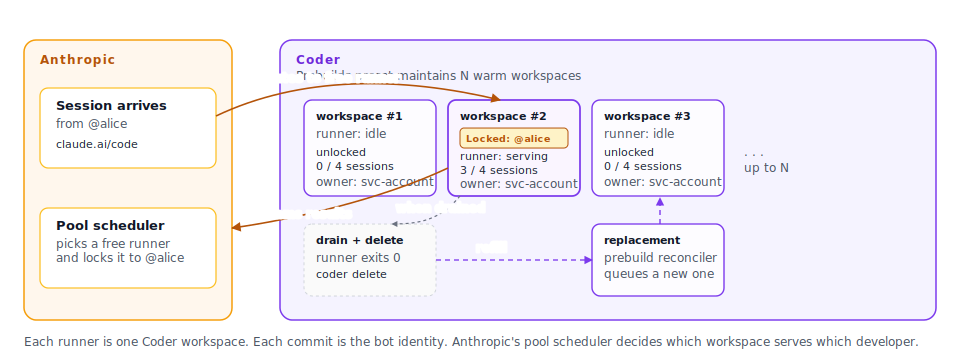

# System identity: a pool of bot runners

Publish a Coder template that runs a pool of Claude Code self-hosted
runners under a **system (bot) identity**. Coder maintains warm runner
workspaces; Anthropic's pool scheduler picks one when a session arrives
and locks it to the developer who started the session. The workspace,
the git push credential, and the commit author are all the same bot
identity, fleet-wide.



> [!NOTE]
> Self-hosted runners are in early access (EAP) from Anthropic. You will
> need a `BYOC_VERSION` and tarball URL from your Anthropic account team
> before you can complete this guide.
>
> System identity is the model documented on this page. For per-user
> identity, see [User identity](./user-identity.md), which is on the
> Coder + Anthropic roadmap.

## Limitations

Read these first; the rest of this page assumes they fit your team.

- **Every commit author is the bot.** Per-human attribution lives in the
  Anthropic session URL trailer, not the git `Author` field.
- **Coder audit log attributes to the prebuilds service account**, not
  to the human who started the session. The human signal lives in
  Anthropic's session log.
- **Coder external auth is not available inside prebuilt workspaces.**
  Workspaces are owned by Coder's prebuilds service account, which
  cannot complete the per-user OAuth flow. The bot git credential ships
  as a sensitive Terraform variable instead.
- **One runner serves one Anthropic user at a time.** If your pool size
  is N and N+1 users arrive at once, the N+1th waits in Anthropic's
  queue until a runner drains.
- **Stalled sessions are dropped.** Once the runner's active session
  count hits zero it drains; half-finished working trees are lost. Do
  not park long interactive sessions in this mode; for that, open a
  regular Coder workspace and run Claude Code interactively.
- **`--capacity` is per-user parallelism, not pool concurrency.**
  `instances = 5, capacity = 4` gives 5 concurrent users, each up to 4
  parallel sessions. Not 20 concurrent users.

If any of these are blockers, wait for
[User identity](./user-identity.md), which addresses the first three.

## What you build in this guide

- One Coder template that bakes the runner binary, runs it as long as
  the workspace is up, and deletes the workspace from the inside after
  the runner drains.
- One Coder preset on that template configured with
  `prebuilds { instances = N }` so Coder keeps N warm runners ready for
  the Anthropic pool to claim.
- Three sensitive template variables: the Anthropic pool secret, a git
  bot credential, and a Coder service-account token the workspace uses
  to delete itself.
- Agent metadata that surfaces the currently locked Anthropic user, the
  in-flight session count, the runner ID, and the last-poll age on the
  Coder workspace page.

The result is a self-healing pool. When the Anthropic pool scheduler
routes a session, one of your warm workspaces locks to that user, serves
their sessions, drains, and deletes itself. The prebuild reconciler
notices the deficit and queues a replacement.

## Prerequisites

- A Coder deployment with **Coder Premium** (required for the prebuilds
  primitive).
- An Anthropic organization admin who can create self-hosted runner pools
  at `claude.ai > Settings > Claude Code > Self-hosted runner pools`.
- A workspace base image that can install the runner. The examples below
  assume a Debian or Ubuntu base; adjust package names for other distros.
- Outbound HTTPS access from the workspace to `api.anthropic.com` and to
  `storage.googleapis.com` (only needed during image build, to download
  the runner tarball).
- Coder admin access to publish a new template, create a service account
  user, and mint a long-lived API token for it.
- A bot identity on your git host (a GitHub bot user with a personal
  access token, an SSH deploy key, or equivalent on GitLab or Bitbucket).

## Identity model

Every commit and push from this pool is the **bot identity**, not the
human. This is intentional:

| Layer            | Identity                                                            |
|------------------|---------------------------------------------------------------------|
| Coder workspace  | Owned by Coder's prebuilds service account                          |
| Git author       | Bot (set in `/etc/gitconfig` in the image)                          |
| Git push token   | Bot PAT or SSH deploy key (sensitive template variable)             |
| Anthropic runner | Locked to the Anthropic user that sent the first session            |
| Commit trailer   | Session URL appended by Claude Code (this is your per-human signal) |

If you need per-user git attribution, ssh-signed commits, or Coder audit
log entries attributed to the human, see
[User identity](./user-identity.md).

## Step 1: Create the Anthropic pool

1. Sign in to `claude.ai` as an Anthropic org admin.
2. Go to **Settings > Claude Code > Self-hosted runner pools**.
3. Click **Create pool**, give it a name (for example `coder-workspaces`),
   and submit.
4. **Copy the pool secret.** It is displayed once and cannot be retrieved
   later. Put it in your existing secrets store (Vault, 1Password, AWS
   Secrets Manager, etc.).

## Step 2: Bake the runner into a workspace image

Anthropic's tarball contains one subdirectory per platform. On Linux
x86_64 the relevant directory is `linux-x64`. The `Dockerfile` below
pins to a specific `BYOC_VERSION`, installs the runner system-wide at
`/opt/claude/claude`, sets the system-level git identity required by the
runner, and creates `/workspace` owned by the workspace user.

```dockerfile
# Base on whatever your workspaces normally use.
FROM ghcr.io/your-org/base:latest

ARG BYOC_VERSION=2.1.97-byoc.9
ENV BYOC_VERSION=${BYOC_VERSION}

USER root

# Minimum runtime dependencies. Add language toolchains your sessions
# need (node, go, python, java, etc.). The Coder CLI is downloaded at
# workspace start by coder_script.
RUN apt-get update && apt-get install -y --no-install-recommends \
      ca-certificates curl git jq tini openssh-client \
    && rm -rf /var/lib/apt/lists/*

# Anthropic-managed sessions use this identity. You can use your own bot
# identity instead; just keep it system-wide so it applies regardless of
# which user the runner process runs as.
RUN git config --system user.name  "Claude" \
 && git config --system user.email "noreply@anthropic.com" \
 && git config --system --add safe.directory '*'

# Pin and install the self-hosted runner binary.
RUN set -eux; \
    install -d /opt/claude; \
    curl -fsSL \
      "https://storage.googleapis.com/claude-code-dist-86c565f3-f756-42ad-8dfa-d59b1c096819/byoc/releases/${BYOC_VERSION}/claude-byoc-${BYOC_VERSION}-all.tar.gz" \
      | tar -xz -C /opt/claude --strip-components=1 linux-x64; \
    ln -sf /opt/claude/claude /usr/local/bin/claude; \
    /usr/local/bin/claude --version

# Repository checkout root used by the self-hosted runner. The runner
# defaults to `--base-dir /workspace` and will `mkdir` it on the first
# session. Without this line the child claude (running as `coder`)
# fails with: EACCES: permission denied, mkdir '/workspace'.
RUN install -d -o coder -g coder /workspace

# Drop back to the workspace user expected by Coder.
USER coder
```

Validate the binary before publishing:

```bash
docker run --rm your-image:tag claude self-hosted-runner --help
```

## Step 3: Create the Coder service account and token

The workspace uses a Coder API token to delete itself when the runner
drains. Create a dedicated service account so that token's scope is
explicit and rotatable.

1. As a Coder admin, create the service account user:

   ```bash
   coder users create \
     --email svc-claude-delete@coder.local \
     --username svc-claude-delete \
     --password "$(openssl rand -base64 24)"
   ```

2. Grant the user the minimum role that includes `delete:workspace` on
   workspaces it does not own. The built-in `owner` role works for the
   pilot; you can scope further with a custom role once you are
   comfortable with the recipe:

   ```bash
   coder users edit-roles svc-claude-delete --roles owner
   ```

3. Mint a long-lived token for that user and store it as
   `CODER_DELETE_TOKEN` in your secrets store:

   ```bash
   coder tokens create \
     --user svc-claude-delete \
     --name claude-self-eviction \
     --lifetime 720h
   ```

> [!TIP]
> Treat the delete token like the pool secret: rotate it on a schedule
> by minting a new one, re-pushing the template with the new value,
> and revoking the old one.

## Step 4: Mint the bot git credential

Pick one of:

- **GitHub bot PAT.** Create a GitHub bot user (or use an existing
  organization bot), grant it write access to the repos you want
  sessions to push to, and mint a PAT scoped to those repos.
- **SSH deploy key.** Generate a key pair, install the public half on
  your git host with push permission, keep the private half for the
  template variable below.

The PAT path is simpler; the deploy-key path scopes better. Either works.

Store the credential as `GIT_BOT_TOKEN` (PAT) or `GIT_BOT_SSH_KEY` (SSH).

## Step 5: Publish the Coder template

The template defines:

- A workspace that runs the runner from `coder_script`, then deletes
  itself when the runner exits.
- Three sensitive variables: `pool_secret`, `git_bot_token`, and
  `coder_delete_token`.
- A `coder_workspace_preset` with `prebuilds { instances = N }` so Coder
  keeps N warm runners ready for the Anthropic pool to claim.
- `coder_agent.metadata` blocks that scrape the runner's `/healthz` and
  `/metrics` and surface the runner state on the workspace page.

The Terraform below is a minimal Docker-backed example. Adapt to
Kubernetes or your existing template by replacing the `docker_*` blocks.

```hcl
terraform {
  required_providers {
    coder  = { source = "coder/coder" }
    docker = { source = "kreuzwerker/docker" }
  }
}

data "coder_provisioner"     "me" {}
data "coder_workspace"       "me" {}
data "coder_workspace_owner" "me" {}

# === Sensitive fleet credentials ===
# All three are set once with `coder templates push --variable name=...`
# and rotate by re-pushing the template.

variable "pool_secret" {
  type        = string
  description = "Claude Code self-hosted runner pool secret (from claude.ai)."
  sensitive   = true
}

variable "git_bot_token" {
  type        = string
  description = "Git PAT for the bot identity. Used by GIT_ASKPASS for pushes."
  sensitive   = true
}

variable "coder_delete_token" {
  type        = string
  description = "Coder API token used by the workspace to delete itself on drain."
  sensitive   = true
}

# === Workspace-shaped parameters ===

data "coder_parameter" "capacity" {
  name         = "capacity"
  display_name = "Concurrent sessions"
  description  = "Maximum sessions this runner serves at once."
  type         = "number"
  default      = "4"
  mutable      = true
  validation { min = 1, max = 16 }
}

# === Prebuild pool ===
# Coder keeps `instances` warm runners alive. When one drains and
# self-evicts, the reconciler queues a replacement so the pool stays at
# this count. Size to your expected peak concurrent Anthropic users.

data "coder_workspace_preset" "warm_runner" {
  name = "Warm runner"
  parameters = {
    capacity = "4"
  }
  prebuilds {
    instances = 5
    expiration_policy {
      ttl = 28800 # 8h: recycle warm runners past this even if unused.
    }
  }
}

# === Agent and runner ===

resource "coder_agent" "main" {
  arch = data.coder_provisioner.me.arch
  os   = "linux"
  dir  = "/home/coder"

  env = {
    CLAUDE_POOL_SECRET = var.pool_secret
    CLAUDE_CAPACITY    = tostring(data.coder_parameter.capacity.value)
    GIT_BOT_TOKEN      = var.git_bot_token
    CODER_DELETE_TOKEN = var.coder_delete_token
    CODER_WORKSPACE_ID = data.coder_workspace.me.id
  }

  startup_script = <<-EOT
    set -euo pipefail
    mkdir -p "$HOME/.claude"

    # Wire git push credentials for the bot identity. GIT_ASKPASS is a
    # one-line script that prints the token whenever git needs a password.
    if [ -n "$${GIT_BOT_TOKEN:-}" ]; then
      install -d -m 0700 "$HOME/.git-creds"
      cat > "$HOME/.git-creds/askpass.sh" <<'ASK'
    #!/bin/sh
    printf '%s' "$GIT_BOT_TOKEN"
    ASK
      chmod 0500 "$HOME/.git-creds/askpass.sh"
      git config --global core.askPass "$HOME/.git-creds/askpass.sh"
      git config --global credential.helper ''
    fi

    # Symlink the agent-installed Coder CLI onto a stable path so the
    # coder_script can call it on self-eviction without hunting for it
    # under /tmp/coder.*. The agent installs the CLI before run_on_start
    # fires.
    install -d "$HOME/.local/bin"
    coder_bin=$(find /tmp -maxdepth 2 -type f -name coder -executable 2>/dev/null | head -n1 || true)
    if [ -n "$coder_bin" ]; then
      ln -sf "$coder_bin" "$HOME/.local/bin/coder"
    fi
  EOT

  metadata {
    display_name = "Locked Anthropic user"
    key          = "0_locked_user"
    interval     = 10
    timeout      = 5
    script       = <<-EOT
      email=$(curl -fsS http://127.0.0.1:8080/metrics 2>/dev/null \
        | awk -F'"' '/^claude_code_self_hosted_runner_locked_account/ {print $2; exit}')
      if [ -n "$email" ]; then printf '%s' "$email"
      else printf '(unlocked, waiting for first session)'; fi
    EOT
  }

  metadata {
    display_name = "Active sessions"
    key          = "1_active_sessions"
    interval     = 5
    timeout      = 5
    script       = <<-EOT
      active=$(curl -fsS http://127.0.0.1:8080/healthz 2>/dev/null \
        | jq -r '.active_sessions // empty')
      if [ -z "$active" ]; then echo '?'; exit 0; fi
      printf '%s / %s' "$active" "${CLAUDE_CAPACITY:-1}"
    EOT
  }

  metadata {
    display_name = "Runner ID"
    key          = "2_runner_id"
    interval     = 30
    timeout      = 5
    script       = <<-EOT
      curl -fsS http://127.0.0.1:8080/healthz 2>/dev/null \
        | jq -r '.runner_id // "(starting)"'
    EOT
  }

  metadata {
    display_name = "Last Anthropic poll"
    key          = "3_last_poll"
    interval     = 15
    timeout      = 5
    script       = <<-EOT
      age=$(curl -fsS http://127.0.0.1:8080/healthz 2>/dev/null \
        | jq -r '.last_poll_age_ms // empty')
      if [ -z "$age" ]; then echo '?'; exit 0; fi
      if [ "$age" -lt 30000 ]; then printf 'ok (%sms ago)' "$age"
      else printf 'stale (%ss ago)' $((age/1000)); fi
    EOT
  }
}

resource "coder_script" "claude_runner" {
  agent_id           = coder_agent.main.id
  display_name       = "Claude self-hosted runner"
  run_on_start       = true
  start_blocks_login = false
  icon               = "/icon/code.svg"

  script = <<-EOT
    set -euo pipefail

    if [ -z "$${CLAUDE_POOL_SECRET:-}" ]; then
      echo "CLAUDE_POOL_SECRET is empty. Re-push the template with --variable pool_secret=..."
      exit 1
    fi

    POOL_SECRET_FILE="$HOME/.claude/pool-secret"
    install -d -m 0700 "$HOME/.claude"
    rm -f "$POOL_SECRET_FILE"
    umask 077
    printf '%s' "$CLAUDE_POOL_SECRET" > "$POOL_SECRET_FILE"
    chmod 0400 "$POOL_SECRET_FILE"

    # Run the runner in the foreground. On drain it exits 0; on a hard
    # error it exits non-zero. Either way, we fall through to the
    # self-eviction call below.
    /usr/local/bin/claude self-hosted-runner \
      --pool-secret-file "$POOL_SECRET_FILE" \
      --capacity        "$${CLAUDE_CAPACITY:-1}" \
      --log-file        "$HOME/.claude/runner.log" \
      || true

    echo "Runner exited. Self-evicting the workspace so the prebuild pool refills."

    # Self-eviction. Uses the service-account token; the agent token
    # cannot delete its own workspace.
    coder_cmd="$HOME/.local/bin/coder"
    if [ ! -x "$coder_cmd" ]; then
      coder_cmd=$(find /tmp -maxdepth 2 -type f -name coder -executable 2>/dev/null | head -n1 || true)
    fi
    if [ -z "$coder_cmd" ] || [ ! -x "$coder_cmd" ]; then
      echo "coder CLI not found in workspace; skipping self-eviction."
      exit 0
    fi

    # CODER_URL must be set so the CLI knows which server to talk to;
    # a freshly spawned workspace has no global Coder CLI config, so the
    # CLI prints 'You are not logged in' and self-eviction silently
    # no-ops without this line.
    CODER_URL="$CODER_AGENT_URL" \
      CODER_SESSION_TOKEN="$CODER_DELETE_TOKEN" \
      "$coder_cmd" delete --yes "$CODER_WORKSPACE_ID" \
      || echo "Self-eviction failed (continuing)."
  EOT
}

# === Docker resources ===

resource "docker_volume" "home" {
  name = "coder-${data.coder_workspace.me.id}-home"
  lifecycle { ignore_changes = all }
}

resource "docker_image" "runner" {
  name = "your-org/claude-runner:latest"
}

resource "docker_container" "workspace" {
  count    = data.coder_workspace.me.start_count
  image    = docker_image.runner.name
  name     = "coder-${data.coder_workspace_owner.me.name}-${lower(data.coder_workspace.me.name)}"
  hostname = data.coder_workspace.me.name
  user     = "coder"

  entrypoint = ["sh", "-c", coder_agent.main.init_script]

  env = ["CODER_AGENT_TOKEN=${coder_agent.main.token}"]

  volumes {
    container_path = "/home/coder"
    volume_name    = docker_volume.home.name
    read_only      = false
  }
}
```

> [!NOTE]
> The `coder` CLI must be on PATH inside the workspace for self-eviction
> to work. Coder's `enterprise-base` images include it; if you build
> from a stock distribution base, the agent downloads it on first start
> and the `startup_script` symlinks it onto `~/.local/bin/coder` so the
> `coder_script` can find it.

## Step 6: Push the template

Push the template with all three variables set:

```bash
coder templates push claude-self-hosted-runner \
  --variable pool_secret="$(cat path/to/pool-secret)" \
  --variable git_bot_token="$(cat path/to/git-bot-token)" \
  --variable coder_delete_token="$(cat path/to/coder-delete-token)" \
  --yes
```

Within a few seconds, Coder spawns `instances` prebuilt workspaces. Each
one runs the runner, registers with the Anthropic pool, and starts
polling.

## Step 7: Verify

1. In Coder's admin UI, open **Workspaces > All** and filter by the
   prebuilds owner. You should see `instances` workspaces named
   `prebuild-...`, each one running, with metadata showing:
   - `Locked Anthropic user: (unlocked, waiting for first session)`
   - `Active sessions: 0 / 4`
   - `Runner ID: ccrunner_...`
   - `Last Anthropic poll: ok (...ms ago)`
2. In `claude.ai > Settings > Claude Code > Self-hosted runner pools`,
   confirm the same number of runners appear under the pool.
3. Start a session at `claude.ai/code` and select the pool. Within
   seconds, **one** of the Coder prebuilds flips its `Locked Anthropic
   user` metadata to your Anthropic email and the `Active sessions`
   metadata bumps to `1 / 4`.
4. Send a few more messages or open additional sessions. Watch the
   active-session count climb (up to `--capacity`).
5. Let all sessions finish. The runner drains, the workspace
   self-evicts, and the prebuild reconciler queues a replacement
   workspace within a minute.

## Operate

### Logs

The runner writes to `~/.claude/runner.log` plus stderr (visible in the
Coder workspace agent logs). Each session also writes a child debug log
to `$TMPDIR/claude-code-debug-<sessionId>.txt` that the runner preserves
on failure.

### Pool sizing

Pick `instances = N` based on concurrent users. Each runner serves one
Anthropic user at a time, so the floor is "however many users you
expect to be active simultaneously." Bump if your queue depth shows
backlog at Anthropic; trim if warm runners sit idle for hours.

### Rotation

| Secret               | Rotate by                                                                                                                                                                                                                |
|----------------------|--------------------------------------------------------------------------------------------------------------------------------------------------------------------------------------------------------------------------|
| `pool_secret`        | Create a new pool secret in `claude.ai`, re-push the template with `--variable pool_secret=...`, revoke the old one. Active runners holding the old secret exit on next token refresh and the reconciler replaces them. |
| `git_bot_token`      | Mint a new PAT, re-push the template, revoke the old PAT. Already-running runners use the old token until they drain.                                                                                                    |
| `coder_delete_token` | Generate a new token for the service account, re-push the template, delete the old token.                                                                                                                                |

### Upgrade the runner binary

Bump `BYOC_VERSION` in the `Dockerfile`, rebuild the image, push the
template. New prebuilds come up on the new version. Existing prebuilds
serve sessions until drain, then self-evict; replacements come up on
the new image.

### Reading the runner state

The `coder_agent.metadata` blocks already surface the most useful state.
For deeper debugging:

```bash
# Inside the workspace:
curl -s http://127.0.0.1:8080/healthz | jq .
curl -s http://127.0.0.1:8080/metrics | grep claude_code_self_hosted
tail -f ~/.claude/runner.log
```

## Common pitfalls

| Symptom                                                          | Cause and fix                                                                                                                                                                                                                                                                              |
|------------------------------------------------------------------|--------------------------------------------------------------------------------------------------------------------------------------------------------------------------------------------------------------------------------------------------------------------------------------------|
| `EACCES: permission denied, mkdir '/workspace'`                  | The image is missing the `install -d -o coder -g coder /workspace` step. Sessions fail on first checkout. Fix in the `Dockerfile`, re-push the template, and let prebuilds replace warm runners.                                                                                           |
| Prebuilds never come up                                          | Confirm your deployment is on **Coder Premium** (prebuilds is an enterprise feature). Check `coder server` logs for `prebuilds` errors.                                                                                                                                                    |
| Runner appears in pool but sessions stay queued                  | The runner is locked to an Anthropic account that does not match the user trying to send a session. Each runner serves one Anthropic user at a time. Either wait for it to drain, add more `instances`, or wait for [User identity](./user-identity.md) which pre-locks per Anthropic user. |
| Self-eviction logs `You are not logged in`                       | The `coder_script` is missing `CODER_URL=$CODER_AGENT_URL` on the `coder delete` line. A freshly spawned workspace has no global Coder CLI config, so the CLI cannot guess the server URL. Add the line and re-push the template.                                                          |
| Workspace does not self-evict on drain                           | `CODER_DELETE_TOKEN` is wrong or the service account lacks `delete:workspace`. The workspace will sit idle until Coder's TTL reaps it. Fix the token or grant the role and re-push the template. As a backstop, set a workspace TTL on the template.                                       |
| `git push` fails with 403 / Permission denied                    | `git_bot_token` is missing required repo scope, or the bot identity does not have push access to the repo the session is working in. Confirm the bot's permissions on the git host.                                                                                                        |
| Metadata shows `?` for active sessions                           | The runner has not started yet, the `/healthz` port is firewalled inside the container, or `jq` is missing from the image. Check `tail -f ~/.claude/runner.log` and `apt list --installed jq`.                                                                                              |

## Where to next

- [User identity](./user-identity.md): the user-identity follow-on.
  On the Coder + Anthropic roadmap; not yet available.
- [Implementation notes](./plan.md): the staged plan, the sub-stages
  within system identity (per-creator credentials, AI Gateway routing,
  custom checkout, tool allowlists), and the open questions tracked
  alongside this delivery.
