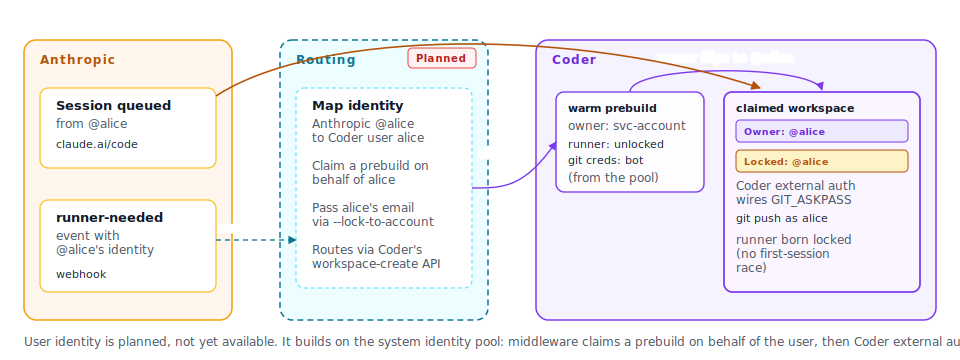

# User identity: per-developer attribution

User identity will let Coder workspaces host Claude Code self-hosted
runners on behalf of the **individual developer** who started the
session, not just a fleet-wide bot. The runner workspace becomes the
developer's, their git push credential is used, their commits are
authored by them, and Coder's audit log attributes runner activity to
them.



> [!NOTE]
> User identity is on the Coder + Anthropic roadmap and is not yet
> available. The runner protocol pieces it depends on are still being
> finalized by Anthropic. In the meantime,
> [System identity](./system-identity.md) is the model documented for
> today.

## What user identity gives you

Compared to [System identity](./system-identity.md), user identity
restores the per-developer audit trail across the whole stack:

| Concern                  | System identity                                          | User identity                                                              |
|--------------------------|----------------------------------------------------------|----------------------------------------------------------------------------|
| Coder workspace owner    | A bot service account                                    | The Coder user who matches the Claude Code session creator                 |
| Git push credential      | A fleet-wide bot PAT delivered as a Terraform variable   | The user's own git push credential via Coder external auth                 |
| Git author on commits    | The bot                                                  | The bot in `Author` plus the human's session URL trailer (or per-user, depending on your image) |
| Coder audit log          | Attributes to the bot service account                    | Attributes to the user, with the routing service account shown as on-behalf-of creator |
| Routing                  | Anthropic picks any free runner; the runner locks on first session | The runner is pre-bound to the matching user before sessions arrive        |
| Failure if the user is missing in Coder | Not possible to detect: the workspace runs as the bot regardless | Pre-flight rejects with a friendly error so onboarding can complete first   |

The single biggest practical win is that **per-developer git push,
external-auth refresh, and Coder audit log all just work the way the
rest of Coder works**. You stop having to special-case Claude Code
sessions in your audit and policy story.

## What stays the same

User identity is built on top of the System identity recipe. You keep:

- The same Coder template and image.
- The same prebuilt-workspace pool as inventory.
- The same self-eviction loop and metadata blocks.
- The same Anthropic pool secret and pool configuration.

So the System identity rollout you ship today is the foundation. When
user identity ships, you turn it on by adding a thin routing component
between Anthropic and Coder and switching the template's git-credential
plumbing from the bot PAT to Coder's external auth feature.

## Where this depends on Anthropic

Two pieces of the Anthropic runner protocol are still being finalized:

- A way for Anthropic to **tell your infrastructure** that a specific
  user has a session waiting, so Coder can spawn a workspace on their
  behalf instead of waiting for a runner to be claimed.
- A way to **pre-bind a runner to a specific user** at startup, so
  there is no race where a session lands on the wrong runner.

Anthropic has flagged both in their guide as not yet stable and has
invited operator input on the contract shape. Once those are
finalized, this page will be replaced with a copy-and-go recipe.

## What to do today

If you need per-user attribution **today**, the closest thing System
identity offers is the commit trailer that Claude Code automatically
appends to every commit:

```text
Co-authored-by: Claude <noreply@anthropic.com>
Session: https://claude.ai/code/sessions/cse_...
```

That trailer points at the Anthropic session, which is attributed to
the human user. Your tooling (CODEOWNERS bots, dashboards, audit
reports) can read it to recover the per-human signal.

For most teams that bridges the gap until user identity ships. If your
audit, signed-commit, or policy requirements need per-user attribution
at the `Author` line, contact Coder so we can prioritize against your
timeline.

## Where to next

- [System identity](./system-identity.md): the recipe that ships today.
- [Implementation notes](./plan.md): the staged plan and the open
  questions for both Anthropic and Coder that gate user identity.
