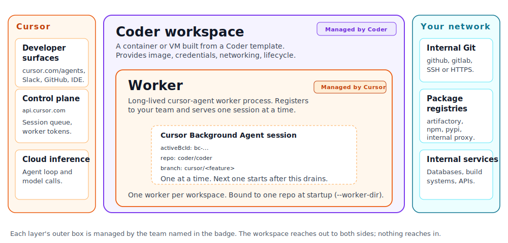

# Cursor Self-Hosted Workers on Coder

> [!NOTE]
> Cursor private workers are an early-access feature from Cursor. Contact
> your Cursor account team to enable them for your team and obtain a
> service-account API key. This guide describes how to run those workers
> on Coder workspaces.

Cursor private workers are a long-lived process that registers with a
pool in your Cursor team, binds to one git repository, and serves
Cursor Background Agent sessions on infrastructure you operate. Each
worker needs an OS, an image, an outbound network path to
`api.cursor.com`, and a lifecycle.

That is what [Coder workspaces](../../user-guides/workspace-management.md)
are. The same
[Terraform templates](../../admin/templates/index.md) your platform team
uses to ship developer environments can ship workers.

## Architecture

The relationship is one to one to one: **one Coder workspace contains
exactly one `cursor-agent worker` process, which serves exactly one
Cursor Background Agent session at a time.** That is the unit you size,
name, and recycle.

- **A Coder workspace** is the outer container: a VM or container built
  from a Coder template, with the image, credentials, and networking
  the worker needs. **Coder manages workspaces.**
- **A worker** is the long-lived `cursor-agent worker` process that
  lives inside one workspace, registers with your Cursor team, and
  polls for work. The worker is bound to one repository at startup
  (`--worker-dir`). **Cursor manages workers.**
- **A session** is a single Cursor Background Agent conversation. While
  a session is active, the worker is unavailable to anyone else; when
  it ends, the same worker can serve the next session in line.
  **Cursor manages sessions.**

All traffic from the worker to Cursor is **outbound HTTPS** to
`api.cursor.com`. There is no inbound connectivity from Cursor into
your network; the worker dials out and streams events over the same
long-poll connection that delivers session assignments. From those
sessions, the worker reaches whatever your workspace can already
reach: internal Git, package registries, databases, build tooling.

### How a session flows

1. A developer starts a Cursor Background Agent session and picks the
   private-worker pool that targets Coder, against a specific
   repository.
2. The session queues on Cursor's side. Cursor's label-based routing
   matches the request to a free worker whose `repo=` label is the
   requested repository.
3. The worker pulls the requested branch into its checkout, runs the
   session, and streams events back to Cursor.
4. The developer sees the session in the Cursor UI exactly as they
   would for a Cursor-managed session. The fact that the compute is in
   Coder is transparent to them.
5. When the session ends and the worker stays idle for
   `--idle-release-timeout` (8h default), the worker stops accepting
   new connections. The reconciler then deletes the workspace and
   queues a replacement.

### What Coder primitives map to

**Cursor worker = Coder workspace.** Each worker is one workspace
bound to one repository. A pool of N workers for a repo is N
workspaces of the same shape; a second repo is a second pool.

| Cursor concept                       | Coder primitive                                                     |
|--------------------------------------|---------------------------------------------------------------------|
| One worker                           | **One workspace**                                                   |
| Pool of N workers for one repo       | **N workspaces** with a shared template and one preset (per repo)   |
| Multiple pools across repos          | **Multiple presets on one template**, one per repo                  |
| Worker image                         | Workspace template + image                                          |
| Worker process                       | `cursor-agent worker start` under `coder_agent.startup_script`      |
| Service-account API key              | Sensitive Terraform variable                                        |
| "Reconciler refills the pool"        | Coder prebuilds, or an external `cursor-worker-pool-daemon` for OSS |
| Per-session checkout                 | `$HOME/workspace`, populated by `git clone` in `startup_script`     |
| Internal Git, registries, services   | Whatever the workspace can already reach                            |
| Wrapper scripts and lifecycle hooks  | Files in the workspace image, invoked before `cursor-agent`         |
| `/healthz`, `/readyz` (cursor-agent) | `coder_agent.metadata` blocks that curl `:8080`                     |

## Why run them on Coder

Self-host the worker on a Coder workspace and the workspace primitives
you already use carry over:

- **Reproducible workspaces as code.** Coder defines a workspace in
  Terraform: pick a container, VM, or bare-metal host on AWS, GCP,
  Azure, vSphere, Kubernetes, Nomad, or your own provider; bake the
  `cursor-agent` binary, language toolchains, and internal CLIs into
  the image; ship the whole thing with one `coder templates push`.
  Every worker in the fleet is the same code path.
- **Network you already control.** The workspace runs wherever your
  template places it: your VPC, your private subnet, your peered
  on-prem segment. Outbound to `api.cursor.com` is the only thing
  Cursor needs; reaching internal Git, registries, databases, and
  build systems uses the routes that workspace already has.
- **Compute you already capacity-plan.** Same accounts, same nodes,
  same autoscaler your developer workspaces run on. Coder prebuilds
  keep a warm pool of workers ready, recycle them on a TTL, and let
  you size the pool the way you size any other internal service.
- **One environment, two use cases.** The same base image, the same
  internal registries, and the same git access you give a developer
  for interactive work also serves the worker pool. Ship a developer
  template and a worker template that share an image, then diverge
  only where they should: the worker template can tighten egress to
  `api.cursor.com` plus your internal hosts, drop interactive ports,
  and apply [Agent Firewall](../agent-firewall/index.md) rules, while
  the developer template stays open. Same environment for software
  engineering and agents, different network controls and policies per
  workspace.
- **Compliance.** Source code, build artifacts, and the worker's
  working directories stay on infrastructure you own. Workspaces,
  agent logs, and Coder audit trails live in your tenancy with the
  rest of your SDLC.
- **Day-2 ops.** Push the template once to ship a new worker image
  fleet-wide. Use the workspace page, agent logs, and metadata
  surfaces to see in-use state and active session id. Attach an IDE
  to a workspace when you need to debug what a worker is doing.

## What this is and is not

- This is **not a managed Cursor integration**. Coder does not
  provision pools, rotate service-account keys, or route sessions;
  Cursor does.
- This is **not the same as [Coder Agents](../agents/index.md) or
  [AI Gateway](../ai-gateway/index.md)**. Coder Agents is Coder's own
  control-plane agent. AI Gateway is Coder's egress proxy for LLM
  traffic. Self-hosted Cursor workers are Cursor's product running on
  your compute. The three are complementary and can be used together.
- This is **early access, not GA**. The `cursor-agent worker` flag
  set, the fleet API shape, and the sub-token contract are all
  subject to change during early access. Pin a known-good
  `cursor-agent` version in your image and re-test on bumps.

## How it relates to Coder Agents and AI Gateway

| Coder feature                                | What it does                                                              | Relationship to self-hosted workers                                                                                                                                                                                                            |
|----------------------------------------------|---------------------------------------------------------------------------|------------------------------------------------------------------------------------------------------------------------------------------------------------------------------------------------------------------------------------------------|
| [Coder Agents](../agents/index.md)           | Coder's own agent that runs in the control plane and talks to workspaces. | Independent. You can use both, or pick whichever fits per use case.                                                                                                                                                                            |
| [AI Gateway](../ai-gateway/index.md)         | Egress proxy for LLM traffic with audit and policy.                       | **Not applicable today.** The worker doesn't make model-provider calls; the agent loop runs in Cursor's cloud, so there is no traffic for AI Gateway to intercept. See [AI Governance Integration](./concepts/ai-governance.md) for the full breakdown. |
| [Agent Firewall](../agent-firewall/index.md) | Process-level egress and command policy inside a workspace.               | Optional. Apply it to the worker workspace for extra guardrails on what sessions can reach or run.                                                                                                                                             |

## Two paths

Coder supports two operational models for running Cursor workers. Pick
based on your Cursor plan and whether you want a centrally-operated
pool or per-developer workspaces.

### Worker Pool (Cursor Enterprise)

An admin publishes one template and a fleet of warm bot-owned
workspaces per repo. Cursor's label-based routing matches each session
to a free worker in the matching pool. Centralized image, centralized
network egress, centralized capacity planning.

- **Requires Cursor Enterprise.** Pool workers authenticate with a
  service-account API key, and service accounts are Enterprise-only.
- **Identity is bot, fleet-wide.** Every session runs under the same
  service account. Git pushes are blocked at startup
  (`remote.origin.pushurl = no_push`) because there is no per-user
  identity to attribute commits to. The per-human signal lives in
  Cursor's session log, keyed by the worker's `activeBcId`.
- **Per-user identity on a shared pool is not shippable today.**
  See [User identity on a shared pool](./concepts/user-identity.md)
  for the live-
  validated reasons (UI visibility and pool dispatch are coupled on
  Cursor's side). The per-user path that ships is
  [Personal Workers](./personal-workers.md).

See [Worker Pool](./system-identity.md) for the copyable Terraform
recipe and the known limitations.

### Personal Workers (any Cursor plan)

Each developer creates their own Coder workspace and pastes in their
personal Cursor API key. The workspace runs as the developer, the
worker registers as that developer's personal machine, and Cursor
routes only that developer's sessions to it.

- **Works on Cursor Team plan and above.** No service account needed.
- **Per-user identity end to end.** Workspace owner is the human, Coder
  external auth wires their git push token, audit log entries
  attribute to them, the worker registers under their Cursor identity.
- **No shared inventory.** Alice's workers don't serve Bob's sessions.
  Each developer manages their own capacity.
- **Sessions trigger by name.** Developers use `worker=<name>` or
  `machine=<name>` from Slack, GitHub, Linear, or the Cloud Agents
  dashboard.

See [Personal Workers](./personal-workers.md) for the recipe.

### Picking between them

| If your team...                                                 | Use                                                         |
|-----------------------------------------------------------------|-------------------------------------------------------------|
| Is on Cursor Enterprise and wants central admin control         | [Worker Pool](./system-identity.md)                         |
| Is on Cursor Team plan                                          | [Personal Workers](./personal-workers.md)                   |
| Wants per-user identity (git push, audit) today                 | [Personal Workers](./personal-workers.md)                   |
| Wants Worker Pool with per-user identity                        | Use [Personal Workers](./personal-workers.md) today, watch [User identity on a shared pool](./concepts/user-identity.md) for the shared-pool shape |
| Wants both (org-managed pool + power users on personal workers) | Both. They share the same image; only the template differs. |

## Where to next

- [Worker Pool](./system-identity.md): admin-operated central pool,
  requires Cursor Enterprise. Bot identity, label-routed.
- [Personal Workers](./personal-workers.md): one workspace per
  developer, per-user identity, works on Cursor Team plan.
- [User identity on a shared pool](./concepts/user-identity.md): why per-user
  identity on a shared pool is not shippable today, and what would
  unblock it.
- [Autoscaling the Worker Pool](./concepts/autoscaling.md): a router
  that watches Cursor's fleet API and scales workspaces on top of the
  prebuild baseline.
- [AI Governance Integration](./concepts/ai-governance.md): how the two paths
  affect Coder AI Gateway coverage.
- [Implementation notes](./concepts/implementation-notes.md): staged plan and open questions.
