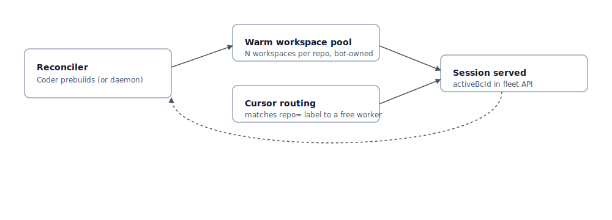

# Worker Pool (Cursor Enterprise)

Publish a Coder template that runs a centrally-operated pool of Cursor
private workers under a shared **bot identity**. Coder maintains warm
worker workspaces per repository; when a Cursor session for that repo
arrives, Cursor's label-based routing assigns it to a free worker in
the matching pool. The workspace, the git push credential (which is
blocked by default), and the worker's Cursor identity are all the same
service account, fleet-wide.

> [!IMPORTANT]
> **Worker Pool requires a Cursor Enterprise plan.** Pool workers
> authenticate with a service-account API key, and service accounts
> are an Enterprise-only feature. Team plan teams cannot register pool
> workers; their workers register as personal machines instead. For
> Team plan deployments, see [Personal Workers](./personal-workers.md).
>
> **Worker Pool runs every session under a shared bot identity today.**
> Per-user identity on pool workers is planned via the router pattern
> documented in [User Identity](./user-identity.md): a Coder workspace
> per session, owned by the human, with the pool worker authenticating
> as the team service account (the only identity Cursor accepts for
> pool workers). Per-user attribution lives on the Coder side (owner,
> external auth, secrets, audit) plus a `coder-owner=<email>` label on
> the worker for Cursor's session log. If you need per-user identity
> right now, use [Personal Workers](./personal-workers.md).



## How it works

A Worker Pool is a set of warm Coder workspaces, each running one
`cursor-agent worker` process bound to one git repository. Cursor sees
them all as members of the same fleet, authenticated by the same
service-account API key. When a developer triggers a Cloud Agent
session against a repo, Cursor's label-based routing picks any free
worker whose `repo=` label matches and runs the session there.

From the platform team's perspective, a pool is one Terraform template
plus one preset per repository. Coder keeps the configured number of
workspaces warm; when one drains, Coder replaces it. Operators size,
image, network, and rotate the fleet the same way they would any other
internal service.

> [!NOTE]
> **Dynamic per-session sizing is on the roadmap.** Today, the pool
> size is a fixed `instances = N` per preset. A future Coder release
> will scale pool size in response to Cursor's pending-request signal,
> so workspaces spawn on demand instead of being pre-provisioned. The
> template you publish today is the foundation; dynamic sizing turns
> on without re-authoring the recipe. See
> [User Identity](./user-identity.md) for the related per-user claim
> work.

## Limitations

Read these first; the rest of this page assumes they fit your team.

- **One repo per workspace, one session per worker.** Each worker is
  bound to a single `--worker-dir` at startup and `IsInUse` is a
  boolean. Concurrent sessions on the same repo need a larger pool;
  concurrent sessions across repos need a pool per repo.
- **Bot identity end to end, pushes blocked.** Commit author, worker
  Cursor identity, and Coder workspace owner are all the same service
  account. Git pushes are blocked
  (`remote.origin.pushurl = no_push`) because there is no per-user
  identity to attribute commits or PRs to. Workers can read and search
  the repo, produce diffs in the session UI, and run sessions; they
  cannot create branches or open pull requests.
- **Cross-user attribution lives in Cursor.** The per-human signal is
  the session id (`activeBcId` in the fleet API) and whatever Cursor
  records server-side keyed to it. Coder's audit log attributes
  workspace builds to the bot.
- **Pool concurrency = pool size, no `--capacity` lever.** Cursor's
  worker serves one session at a time. Cross-user concurrency for a
  given repo is bounded by the number of workspaces in that repo's
  pool.

If the second is a blocker for your team, wait for
[User identity](./user-identity.md).

## What you build in this guide

- One Coder template that bakes the `cursor-agent` binary, runs it as
  long as the workspace is up, and exposes its `/healthz` and `/readyz`
  state as workspace metadata.
- One or more `coder_workspace_preset` blocks (one per repo) configured
  with `prebuilds { instances = N }` so Coder keeps N warm workers per
  repo.
- One sensitive template variable: the Cursor team service-account API
  key.
- Agent metadata that surfaces in-use state, active session id, and
  poll health on the Coder workspace page.

## Prerequisites

- A Coder deployment with **Coder Premium** for the prebuilds path
  below.
- A Cursor team admin who can issue a service-account API key at
  `cursor.com > Settings > Team > API Keys`.
- A workspace base image that can install `cursor-agent`. The example
  below uses `codercom/oss-dogfood:latest`.
- Outbound HTTPS access from the workspace to `api.cursor.com` and to
  `cursor.com` (for the one-line installer during image build).
- Coder admin access to publish a new template.

## Identity model

Every commit and push from this pool is the **bot identity**, not the
human. This is intentional:

| Layer            | Identity                                                                |
|------------------|-------------------------------------------------------------------------|
| Coder workspace  | Owned by Coder's prebuilds service account                              |
| Git author       | Workspace owner (the prebuilds service account)                         |
| Git push         | Blocked (`remote.origin.pushurl = no_push`)                             |
| Cursor worker    | Authenticated with the team service-account API key                     |
| Per-human signal | `activeBcId` in the fleet API; full attribution in Cursor's session log |

If you need per-user git attribution, audit log entries attributed to
the human, or to lift the push block, see
[User identity](./user-identity.md).

> [!NOTE]
> Today the synthetic `prebuilds` service account owns the warm
> workspaces. Coder external auth and user secrets are disabled on
> prebuilds, so the Cursor service-account key has to ride in as a
> sensitive Terraform variable on the template rather than through
> normal secret management. Allowing prebuilds to optionally run as a
> configurable service account, with external auth and user secrets
> available, would clean this up. Tracked in
> [coder/coder#25419](https://github.com/coder/coder/issues/25419).

## Step 1: Create the Cursor service account and pool

1. Sign in to `cursor.com` as a team admin.
2. Go to **Settings > Team > API Keys**.
3. Create a new service-account key. Copy the value; it is shown
   once. Store it in your existing secrets store (Vault, 1Password,
   AWS Secrets Manager, etc.).
4. Note your team slug or ID; you will need it for verification later.

## Step 2: Bake the `cursor-agent` binary into a workspace image

The image installs `cursor-agent` system-wide and creates the
`$HOME/workspace` directory where each worker clones the assigned
repo.

```dockerfile
# Use whatever Coder workspace base your developers already use. The
# only requirements are a `coder` user that owns /home/coder, sudo for
# the root build steps, and outbound network to cursor.com to fetch
# the installer.
FROM codercom/oss-dogfood:latest

USER root

# Install cursor-agent system-wide. The official installer drops a
# binary into $HOME/.local/bin; we relocate it to /usr/local/bin so
# every user inherits it.
RUN curl -fsSL "https://cursor.com/install" | bash \
 && install -m 0755 /root/.local/bin/cursor-agent /usr/local/bin/cursor-agent \
 && /usr/local/bin/cursor-agent --version

# Per-worker checkout root. cursor-agent runs as the workspace user
# and clones into $HOME/workspace from the startup script.
RUN install -d -o coder -g coder /home/coder/workspace

USER coder
```

Validate the binary before publishing:

```bash
docker run --rm your-image:tag cursor-agent --help
```

## Step 3: Publish the Coder template

The template defines:

- A workspace that runs `cursor-agent worker start` from
  `coder_agent.startup_script`. The agent treats the long-running
  worker as its primary process; when it exits, the workspace is no
  longer healthy.
- One sensitive variable: `cursor_api_key`.
- One `coder_workspace_preset` per repository, with
  `prebuilds { instances = N }`. The preset pins the
  `git_repo_url` parameter so every prebuild in that preset clones
  the same repo.
- `coder_agent.metadata` blocks that surface in-use state and the
  active session id on the workspace page.

The Terraform below is a minimal Docker-backed example. Adapt to
Kubernetes or your existing template by replacing the `docker_*`
blocks.

```hcl
terraform {
  required_providers {
    coder  = { source = "coder/coder" }
    docker = { source = "kreuzwerker/docker" }
  }
}

data "coder_provisioner"     "me" {}
data "coder_workspace"       "me" {}
data "coder_workspace_owner" "me" {}

variable "cursor_api_key" {
  type        = string
  description = "Cursor team service-account API key."
  sensitive   = true
}

variable "idle_release_timeout" {
  type        = number
  description = "Seconds of inactivity after a session ends before the worker stops accepting new connections."
  default     = 28800 # 8 hours
}

data "coder_parameter" "git_repo_url" {
  name         = "git_repo_url"
  display_name = "Git Repository URL"
  description  = "Repository this worker serves."
  type         = "string"
  default      = "https://github.com/coder/coder"
  mutable      = false
}

# One preset per repo. Coder keeps `instances` warm prebuilds per
# preset. Cursor's label-based routing matches a session to any free
# worker whose repo= label is the requested repo.

data "coder_workspace_preset" "coder_repo" {
  name = "coder/coder pool"
  parameters = {
    git_repo_url = "https://github.com/coder/coder"
  }
  prebuilds {
    instances = 3
    expiration_policy {
      ttl = 28800 # 8h: recycle warm workers past this even if unused.
    }
  }
}

# Add more presets for additional repos:
#
# data "coder_workspace_preset" "internal_app" {
#   name = "Internal app pool"
#   parameters = {
#     git_repo_url = "https://github.com/your-org/internal-app"
#   }
#   prebuilds { instances = 2 }
# }

resource "coder_agent" "main" {
  arch = data.coder_provisioner.me.arch
  os   = "linux"
  dir  = "/home/coder"

  env = {
    CURSOR_API_KEY = var.cursor_api_key
  }

  startup_script = <<-EOT
    set -eu
    export PATH="/usr/local/bin:$PATH"

    REPO_DIR="$HOME/workspace"
    REPO_URL="${data.coder_parameter.git_repo_url.value}"
    WORKER_LABEL="coder-${data.coder_workspace_owner.me.name}-${lower(data.coder_workspace.me.name)}"

    if [ ! -d "$REPO_DIR/.git" ]; then
      rm -rf "$REPO_DIR"
      git clone "$REPO_URL" "$REPO_DIR"
    else
      cd "$REPO_DIR"
      git remote set-url origin "$REPO_URL"
      git fetch --prune origin
      git reset --hard origin/HEAD
      git clean -fd
    fi

    cd "$REPO_DIR"

    # Block all pushes. Workers are read-only under system identity;
    # there is no per-user identity to attribute commits or pull
    # requests to.
    git remote set-url --push origin no_push

    git config --global user.name  "${coalesce(data.coder_workspace_owner.me.full_name, data.coder_workspace_owner.me.name)}"
    git config --global user.email "${data.coder_workspace_owner.me.email}"

    cursor-agent \
      --api-key "$CURSOR_API_KEY" \
      worker \
      --worker-dir         "$REPO_DIR" \
      --management-addr    ":8080" \
      --name               "$WORKER_LABEL" \
      --label              "coder-workspace=$WORKER_LABEL" \
      --idle-release-timeout ${var.idle_release_timeout} \
      start >> "$HOME/cursor-agent.log" 2>&1
  EOT

  metadata {
    display_name = "CPU"
    key          = "0_cpu"
    script       = "coder stat cpu"
    interval     = 10
    timeout      = 1
  }

  metadata {
    display_name = "RAM"
    key          = "1_ram"
    script       = "coder stat mem"
    interval     = 10
    timeout      = 1
  }

  metadata {
    display_name = "Worker process"
    key          = "2_worker_process"
    interval     = 10
    timeout      = 2
    script       = <<-EOS
      if pgrep -f "cursor-agent worker" > /dev/null 2>&1; then echo running
      else echo stopped; fi
    EOS
  }

  metadata {
    display_name = "Ready (idle)"
    key          = "3_ready"
    interval     = 5
    timeout      = 3
    # cursor-agent returns 200 on /readyz when the worker is idle and
    # connected, 503 when it's claimed or not yet connected. Treating
    # 200 as "idle / available for claim" gives operators a single
    # field to scan for "is this worker free?"
    script       = <<-EOS
      if curl -fsS -o /dev/null http://127.0.0.1:8080/readyz; then echo idle
      else echo busy-or-starting; fi
    EOS
  }
}

resource "docker_volume" "home" {
  name = "coder-${data.coder_workspace.me.id}-home"
  lifecycle { ignore_changes = all }
}

resource "docker_image" "worker" {
  name = "your-org/cursor-worker:latest"
}

resource "docker_container" "workspace" {
  count    = data.coder_workspace.me.start_count
  image    = docker_image.worker.name
  name     = "coder-${data.coder_workspace_owner.me.name}-${lower(data.coder_workspace.me.name)}"
  hostname = data.coder_workspace.me.name
  user     = "coder"

  entrypoint = ["sh", "-c", coder_agent.main.init_script]

  env = ["CODER_AGENT_TOKEN=${coder_agent.main.token}"]

  volumes {
    container_path = "/home/coder"
    volume_name    = docker_volume.home.name
    read_only      = false
  }
}
```

## Step 4: Push the template

```bash
coder templates push cursor-self-hosted-workers \
  --variable cursor_api_key="$(cat path/to/cursor-api-key)" \
  --yes
```

Within a minute, Coder spawns `instances` prebuilt workspaces per
preset. Each one runs `cursor-agent worker start`, registers with the
Cursor pool, and begins polling.

## Step 5: Verify

1. In Coder's admin UI, open **Workspaces > All** and filter by the
   prebuilds owner. You should see one warm workspace per `instances`
   per preset, each one running, with metadata showing:
   - `Worker process: running`
   - `Ready (idle): idle`
2. In Cursor's team admin, confirm the same number of workers appear
   under the pool with `IsInUse: false`.
3. Start a Cursor Background Agent session against one of the
   repositories your pool serves. Within seconds, **one** workspace's
   `Ready (idle)` metadata flips to `busy-or-starting`, and the
   corresponding worker's `IsInUse` flips to `true` in the fleet API.
4. Let the session finish. The worker stays idle until
   `--idle-release-timeout` (8h default), then stops accepting
   connections. The reconciler deletes the workspace and a fresh
   prebuild comes up to replace it.

## Operate

### Logs

`cursor-agent` writes to `~/cursor-agent.log` inside each workspace.
Tail it from the workspace's web terminal or via SSH.

### Pool sizing

Pick `instances = N` per preset based on concurrent sessions per
repository. Each worker serves one session at a time, so the floor
is "however many sessions you expect to be active simultaneously
against this repo." Bump if Cursor's queue depth shows backlog for
that repo; trim if warm workers sit idle for hours.

### Rotation

| Secret           | Rotate by                                                                                                                                                                 |
|------------------|---------------------------------------------------------------------------------------------------------------------------------------------------------------------------|
| `cursor_api_key` | Mint a new service-account key in `cursor.com`, re-push the template with `--variable cursor_api_key=...`, revoke the old one. Active workers exit on next token refresh. |

### Upgrade `cursor-agent`

Bump the `cursor-agent` version in your `Dockerfile`, rebuild the
image, re-push the template. New prebuilds come up on the new
version; existing prebuilds run until they drain or hit their TTL,
then get replaced.

### Reading worker state

The `coder_agent.metadata` blocks already surface the most useful
state. For deeper debugging:

```bash
# Inside the workspace:
curl -s http://127.0.0.1:8080/healthz
curl -s http://127.0.0.1:8080/readyz
tail -f ~/cursor-agent.log
```

## Common pitfalls

| Symptom                                              | Cause and fix                                                                                                                                                                                                                                                                                                          |
|------------------------------------------------------|------------------------------------------------------------------------------------------------------------------------------------------------------------------------------------------------------------------------------------------------------------------------------------------------------------------------|
| Prebuilds never come up                              | Confirm your deployment is on **Coder Premium** (prebuilds is an enterprise feature). Check `coder server` logs for `prebuilds` errors.                                                                                                                                                                                |
| Workers appear in Cursor but never get claimed       | The `git_repo_url` parameter doesn't match the repo a developer is asking for. Cursor's routing only matches a session to a worker whose `repo=` label is the same repo. Create a preset per repo.                                                                                                                     |
| `git push` fails with "Permission denied"            | Expected. System identity blocks pushes on purpose. Sessions can read, search, and propose diffs; pull requests are not supported until [User identity](./user-identity.md).                                                                                                                                           |
| Worker process is `stopped` but workspace is healthy | `cursor-agent worker start` exited. Tail `~/cursor-agent.log` for the reason. Common causes: invalid `--worker-dir` (not a git repo), service-account key revoked, network egress to `api.cursor.com` blocked.                                                                                                         |
| Same worker keeps getting claimed                    | Cursor's routing matches by label, not by recency. If you have one preset of `instances = 1`, every session for that repo goes to the same workspace until it's busy. Bump `instances` for parallel sessions. The ordering between multiple matching workers isn't documented; don't depend on a specific tie-breaker. |

## Where to next

- [Personal Workers](./personal-workers.md): one workspace per
  developer with per-user identity. The path for Cursor Team plans, or
  for users on Enterprise who want their own machines alongside the
  shared pool.
- [User Identity](./user-identity.md): per-developer attribution on
  Worker Pool. Planned; not yet available.
- [Implementation Notes](./plan.md): the staged plan and open questions
  tracked alongside this delivery.
