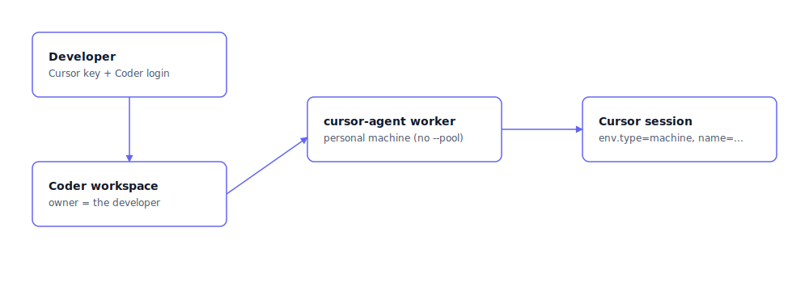

# User identity: per-developer attribution

User identity will let Coder workspaces host Cursor private workers on
behalf of the **individual developer** who started the session, not
just a fleet-wide bot. The worker workspace becomes the developer's,
their git push credential is used, their commits are authored by them,
and Coder's audit log attributes worker activity to them.

> [!IMPORTANT]
> User identity is not available yet.
>
> - The Cursor API pieces it depends on (a team service-account key
>   with `agent:*` scope, `POST /v1/sub-tokens` for per-user token
>   minting, a stable shape for `GET /v0/private-workers/pending-requests`)
>   are partially shipped. Today, `POST /v1/sub-tokens` returns 403
>   with the message "Sub-tokens require a team service-account API
>   key with the agent:* scope." Issuance of that scoped key is
>   pending on Cursor's side.
> - The Coder-side routing component that would receive Cursor's
>   webhook (or poll its pending-requests endpoint), map the Cursor
>   user to a Coder user, and claim a prebuild on their behalf does
>   not exist yet. There is no `coderd` endpoint, no middleware, no
>   Terraform block you can wire up today.
>
> Until both ship, the model to use is
> [System identity](./system-identity.md). This page describes what
> the user-identity model will look like once both pieces land.

## What user identity gives you

Compared to [System identity](./system-identity.md), user identity
restores the per-developer audit trail across the whole stack:

| Concern                                | System identity                                          | User identity                                                              |
|----------------------------------------|----------------------------------------------------------|----------------------------------------------------------------------------|
| Coder workspace owner                  | A bot service account                                    | The Coder user who matches the Cursor session creator                      |
| Git push                               | Blocked (`remote.origin.pushurl = no_push`)              | Enabled via the user's own credential through Coder external auth          |
| Git author on commits                  | The bot                                                  | The user                                                                   |
| Coder audit log                        | Attributes to the bot service account                    | Attributes to the user, with the routing service account shown as on-behalf-of creator |
| Routing                                | Label-based: Cursor picks any free worker whose `repo=` label matches the request | The worker is born authenticated as the user before sessions arrive        |
| Pool size / concurrency                | Fixed per repo: at most `instances` concurrent sessions per repo, every workspace is the bot | Dynamic: one workspace per session, spawned on demand; prebuilds become a warm cache that hides cold-start time |
| Failure if the user is missing in Coder | Not possible to detect: the workspace runs as the bot regardless | Pre-flight rejects with a friendly error so onboarding can complete first   |

The single biggest practical win is that **per-developer git push,
external-auth refresh, and Coder audit log all just work the way the
rest of Coder works**. You stop having to special-case Cursor sessions
in your audit and policy story.

> [!TIP]
> If you stay on a bot identity for commits and pushes, the routing
> layer is still useful on its own. Pointing it at a single bot Coder
> user instead of the matching human gives you:
>
> - **Dynamic concurrency.** A workspace per concurrent session,
>   spawned on demand. Prebuilds become a warm cache for cold-start
>   latency, not the inventory itself.
> - **Pre-flight validation.** Sessions for unknown Cursor users
>   reject up front instead of silently running as the bot.
> - **Per-worker audit context.** The routing service account shows
>   up as the on-behalf-of creator in the Coder audit log, so you can
>   still tie a workspace build back to a specific Cursor session,
>   even if the workspace owner is the bot.
>
> You opt into per-human attribution separately by pointing the
> router at the matching Coder user rather than the bot. The two
> decisions (dynamic spawn vs. fixed pool, and human owner vs. bot
> owner) are independent.

## What stays the same

User identity is built on top of the System identity recipe. You
keep:

- The same Coder template and image.
- The same prebuilt-workspace pool per repo as inventory.
- The same metadata blocks.
- The same Cursor pool configuration.

So the System identity rollout you ship today is the foundation. When
user identity ships, you turn it on by adding a thin routing
component between Cursor and Coder and switching the worker's
authentication from the shared team service-account key to per-user
sub-tokens.

## The flow, once it ships

1. A Cursor user creates a Background Agent job. The session queues on
   Cursor's side as a pending request with `userId`, `repoUrl`, and a
   request id.
2. The router learns about the request, either by polling
   `GET /v0/private-workers/pending-requests` or by receiving a
   webhook that Cursor sends when the queue is non-empty.
3. The router mints a per-user worker token:
   `POST /v1/sub-tokens { forUserId }` returns an access token scoped
   to that one Cursor user. **This is the gate.** The team
   service-account key calling this endpoint must have `agent:*`
   scope; today's keys do not.
4. The router resolves `userId` to a Coder user: Cursor user id ->
   email (via Cursor's user-lookup endpoint) -> Coder username (via
   Coder's users API). If the Coder user is missing, the router
   rejects the request before any workspace is created.
5. The router claims a warm prebuild from the matching repo's pool on
   behalf of the human. The workspace's ownership flips atomically
   from the prebuilds service account to the user. Coder external
   auth then resolves to the user's git credentials inside the
   workspace.
6. The agent inside the workspace starts `cursor-agent worker start`
   with `--api-key <subToken>`. The worker registers in the fleet
   with the user's identity.
7. The pending Cursor session routes to that worker because its
   registered identity matches the requesting user.

The result: end-to-end attribution. Cursor's fleet shows the worker
running as the user, Coder's audit log attributes the workspace to
the user, and any commits the session produces are authored and
pushed by the user.

## Where this depends on Cursor

Three pieces of the Cursor API need to settle before this can ship:

- **`agent:*` scope on team service-account keys.** Issuance is
  pending. Without it, `POST /v1/sub-tokens` returns 403.
- **`POST /v1/sub-tokens` semantics.** What is the token's TTL? Does
  the worker need to refresh, or is the token long-lived enough to
  cover a session? Does revoking the parent team key revoke
  outstanding sub-tokens? These shape how the router caches and
  rotates.
- **A stable user-lookup endpoint.** The router needs `userId ->
  email` for users **other than the caller**. `GET /v1/me` returns
  the caller's profile; a `/v1/users/{id}` (or a `userEmail` field on
  the pending-request payload) is what the router needs.
- **A scaling signal.** Polling
  `GET /v0/private-workers/pending-requests` works but is latency-
  bound by the poll interval. A webhook on queue events would let
  the router respond in milliseconds; the wire format is not
  finalized.

Send your requirements on these to your Cursor account team. Each
ships independently; user identity needs all three.

## Where this depends on Coder

Once Cursor publishes the missing pieces, **one of two**
architectures gets you to per-user workspaces. Pick one:

- **Middleware in front of Coder.** A small service (a few hundred
  lines of Go or Node) does the steps above. Fastest to ship: lands
  the day Cursor turns on the `agent:*` key, on top of Coder
  primitives that exist today.
- **Built into `coderd`.** Coder's server consumes the Cursor scaling
  signal directly. No separate service to run, no extra token to
  rotate. The integration is a config block in the template instead
  of a deployment you operate. Better long-term shape, but a larger
  product change.

We expect early adopters to start with middleware and, once the
integration shape settles, fold it into `coderd`.

## What to do today

If you need per-user attribution **today**, the closest thing System
identity offers is the `activeBcId` field in Cursor's fleet API. It
identifies the Cursor session that claimed the worker, and Cursor's
session log attributes the session to the human user. Your tooling
(audit dashboards, attribution reports) can join on `activeBcId` to
recover the per-human signal.

## Where to next

- [System identity](./system-identity.md): the recipe that ships
  today.
- [Implementation notes](./plan.md): the staged plan and the open
  questions for both Cursor and Coder that gate user identity.
