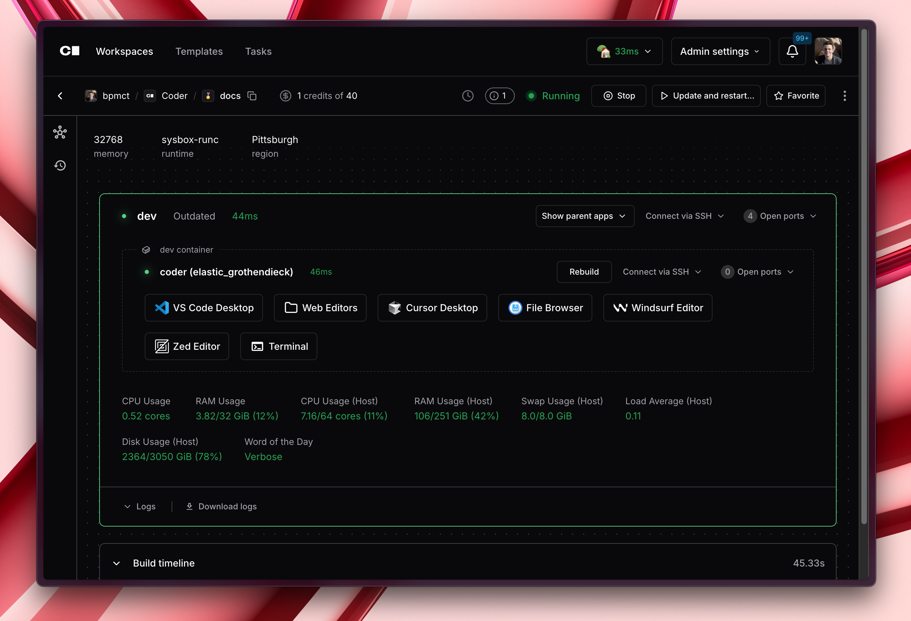

Learn how to use Coder Workspaces with IDEs and plugins to run coding agents like Cursor, GitHub Copilot, Windsurf, RooCode, and more.

## How it works

Coder Workspaces are full development environments that run on your cloud infrastructure, such as Kubernetes or AWS EC2. Developers can connect with their favorite IDEs with pre-configured extensions and configuration for agentic coding.

## Coder versus Local Development

Running coding agents in Coder workspaces provides several advantages over running them locally:

- **Fast, out-of-the-box setup**: LLMs, proxies, and MCP tools can be pre-configured for developers to use immediately, eliminating setup time and configuration hassles.
- **Consistent environments**: All developers use the same standardized environments, ensuring consistent access to tools and resources.
- **Resource optimization**: Leverage powerful cloud resources without taxing local machines.
- **Security and isolation**: Keep sensitive code, API keys, and secrets in controlled environments.

[Learn more about Coder](https://coder.com/cde/compare)

## IDE Support

Follow the Coder Documentation for [Connecting to Workspaces](../user-guides/workspace-access/index.md) to connect to your Coder Workspaces with your favorite IDEs.

## Pre-Configuring Extensions &amp; Plugins

Read our [VS Code module documentation](https://registry.coder.com/modules/coder/vscode-web) for examples on how to pre-install plugins like GitHub Copilot, RooCode, Sourcegraph Cody, and more in Coder workspaces.
