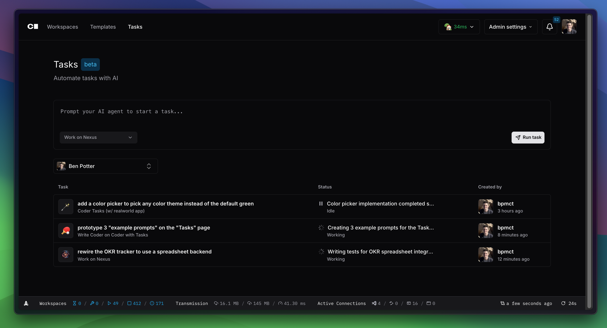

# Run AI Coding Agents in Coder

Learn how to run & manage coding agents with Coder, both alongside existing workspaces and for background task execution.

## Agents in the IDE

Coder [integrates with IDEs](../user-guides/workspace-access/index.md) such as Cursor, Windsurf, and Zed that include built-in coding agents to work alongside developers. Additionally, template admins can [pre-install extensions](https://registry.coder.com/modules/coder/vscode-web) for agents such as GitHub Copilot and Roo Code.

These agents work well inside existing Coder workspaces as they can simply be enabled via an extension or are built-into the editor.

## Agents with Coder Tasks

In cases where the IDE is secondary, such as prototyping or long-running background jobs, agents like Claude Code or Aider are better for the job and new SaaS interfaces like [Devin](https://devin.ai) and [ChatGPT Codex](https://openai.com/index/introducing-codex/) are emerging.

[Coder Tasks](./tasks.md) is an interface inside Coder to run and manage coding agents with a chat-based UI. Unlike SaaS-based products, Coder Tasks is self-hosted (included in your Coder deployment) and allows you to run any terminal-based agent such as Claude Code or Codex's Open Source CLI.

[Learn more about Coder Tasks](./tasks.md) for best practices and how to get started.

## Secure Your Workflows with Agent Boundaries (Beta)

AI agents can be powerful teammates, but must be treated as untrusted and unpredictable interns as opposed to tools. Without the right controls, they can go rogue.

[Agent Boundaries](./boundary/agent-boundary.md) is a new tool that offers process-level safeguards that detect and prevent destructive actions. Unlike traditional mitigation methods like firewalls, service meshes, and RBAC systems, Agent Boundaries is an agent-aware, centralized control point that can either be embedded in the same secure Coder Workspaces that enterprises already trust, or used through an open source CLI.

To learn more about features, implementation details, and how to get started, check out the [Agent Boundary documentation](./boundary/agent-boundary.md).
