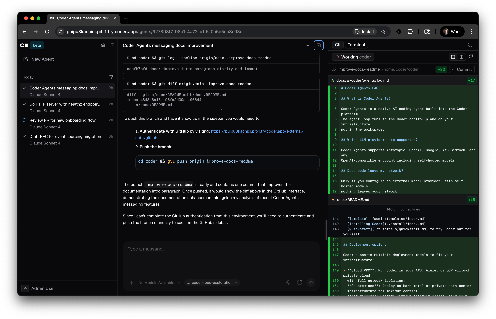

# Run AI Coding Agents in Coder

Learn how to run & manage coding agents with Coder, both alongside existing
workspaces and for background task execution.

## Agents in the IDE

Coder [integrates with IDEs](../user-guides/workspace-access/index.md) such as
Cursor, Windsurf, and Zed that include built-in coding agents to work alongside
developers. Additionally, template admins can
[pre-install extensions](https://registry.coder.com/modules/coder/vscode-web)
for agents such as GitHub Copilot and Roo Code.

These agents work well inside existing Coder workspaces as they can simply be
enabled via an extension or are built-into the editor.

## Coder Agents

In cases where the IDE is secondary, such as prototyping, research, or
long-running background jobs, [Coder Agents](./agents/index.md) is the
recommended way to delegate development work to coding agents in your Coder
deployment.

Coder Agents is a native AI coding agent built into Coder. The agent loop runs
in the Coder control plane on your infrastructure rather than inside the
workspace, so workspaces can be completely network isolated. Developers
interact with agents through the web UI, the CLI (`coder agents`), or the
REST API.

[Learn more about Coder Agents](./agents/index.md) for architecture details,
supported LLM providers, and how to get started.

## Govern AI activity with the AI Governance Add-On

AI coding tools are quickly becoming core to how engineering teams ship
software. As adoption grows, platform teams want a clear picture of how AI is
being used, consistent guardrails across teams, and predictable cost controls
so they can confidently scale AI tooling to the whole organization.

The [AI Governance Add-On](./ai-governance.md) is a per-user license that adds
observability, management, and policy controls for AI tooling across your
Coder deployment. It includes:

- [AI Gateway](./ai-gateway/index.md) for centralized authentication, audit
  trails of prompts and tool invocations, and policy enforcement against
  upstream LLM providers.
- [Agent Firewall](./agent-firewall/index.md) for process-level network and
  command policies that restrict what agents can reach and do inside a
  workspace.
- Expanded Agent Workspace Build allowances for teams running AI-driven
  background work at scale.

[Learn more about the AI Governance Add-On](./ai-governance.md) for use cases,
entitlements, and how to enable it in your deployment.
