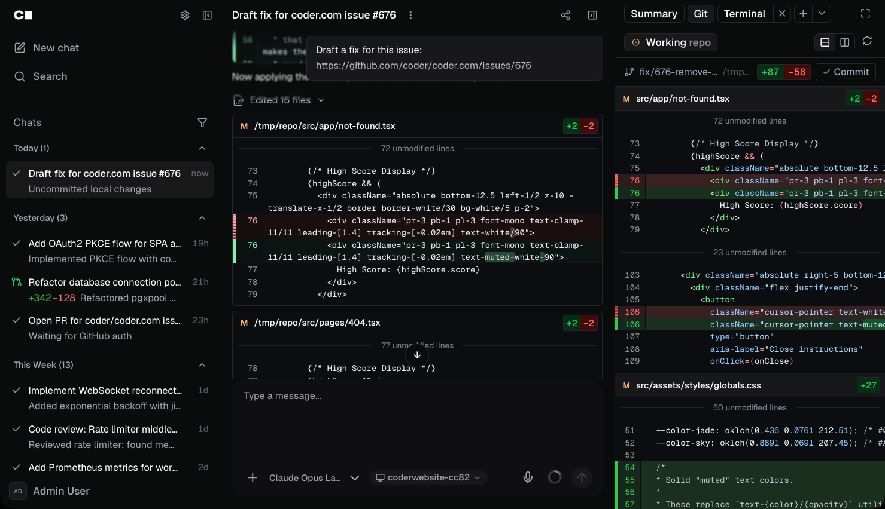

Learn how to run & manage coding agents with Coder, both alongside existing workspaces and for background task execution.

Coder supports several ways to run and [govern](#govern-ai-activity-with-ai-governance) coding agents, depending on how much control you need over execution and orchestration:

- [Coder Agents](#coder-agents), self-hosted AI workflow infrastructure best suited for headless, automated background tasks and parallel agentic development in a conversational UI.
- [Agent Relay](#agent-relay), best suited for preserving the cloud agent experience developers already know while running execution in self-hosted Coder workspaces.
- [Agents in the IDE](#agents-in-the-ide), best suited for in-editor code assist use cases alongside a developer's existing workflow.
- [Agents in workspace templates](#agents-in-workspace-templates), best suited for developers who want to pair one-on-one with an agent like Claude Code or Codex in a workspace.

## Coder Agents

In cases where the IDE is secondary, such as prototyping, research, or long-running background jobs, [Coder Agents](./agents/index.md) is the recommended way to delegate development work to coding agents in your Coder deployment.

Coder Agents is a native AI coding agent built into Coder.
The agent loop runs in the Coder control plane on your infrastructure rather than inside the workspace, so workspaces can be completely network isolated.
Developers interact with agents through the web UI or the REST API.



[Learn more about Coder Agents](./agents/index.md) for architecture details, supported LLM providers, and how to get started.

## Agent Relay

[Agent Relay](./agent-relay/index.md) connects a supported cloud-hosted AI agent provider's hosted sessions to self-hosted Coder workspaces.
The provider's orchestration and AI inference stay cloud-hosted; a worker process inside the workspace executes the agent's tool calls.
[Cursor Cloud Agents](https://cursor.com/cloud) is the first supported provider.

Agent Relay is in [early access](../install/releases/feature-stages.md#early-access-features) and is in closed preview with select customers.

[Learn more about Agent Relay](./agent-relay/index.md) for architecture details and supported providers.

## Agents in the IDE

Coder [integrates with IDEs](../user-guides/workspace-access/index.md) such as Cursor, Devin Desktop, and Zed that include built-in coding agents to work alongside developers.
Additionally, template admins can [pre-install extensions](https://registry.coder.com/modules/coder/vscode-web) for agents such as GitHub Copilot.

These agents work well inside existing Coder workspaces as they can simply be enabled via an extension or are built-into the editor.

## Agents in workspace templates

Template admins can install terminal-based coding agents, such as Claude Code or Codex, directly into a workspace template using a [registry module](https://registry.coder.com).
Pick from a curated list of agent modules in the [template builder](../admin/templates/creating-templates.md#template-builder), or add a module directly in Terraform:

```tf
module "claude-code" {
  source   = "registry.coder.com/coder/claude-code/coder"
  version  = "~> 5.2"
  agent_id = coder_agent.main.id
}
```

Visit the [Coder Registry](https://registry.coder.com) for the full list of available agent modules.

[Learn more about extending templates](../admin/templates/extending-templates/index.md).

## Govern AI activity with AI Governance

AI coding tools are quickly becoming core to how engineering teams ship software.
As adoption grows, platform teams want a clear picture of how AI is being used, consistent guardrails across teams, and predictable cost controls so they can confidently scale AI tooling to the whole organization.

[AI Governance](./ai-governance.md) is included with a Premium license and adds observability, management, and policy controls for AI tooling across your Coder deployment.
It includes:

- [AI Gateway](./ai-gateway/index.md) for centralized authentication, audit trails of prompts and tool invocations, and policy enforcement against upstream LLM providers.
- [Agent Firewall](./agent-firewall/index.md) for process-level network and command policies that restrict what agents can reach and do inside a workspace.

[Learn more about AI Governance](./ai-governance.md) for use cases, entitlements, and how to enable it in your deployment.
