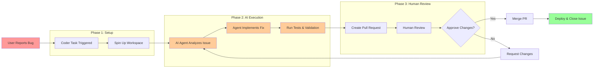

# Understanding Coder Tasks

TODO: need to be consistent with capitlization of tasks, templates, workspaces, etc

## What is a Task? 

Tasks is Coder's platform for managing coding agents and other AI-enabled tools. With Coder Tasks, you can

- Connect an AI Agent like Claude Code or OpenAI's Codex to your IDE to assist in day-to-day development and building
- Kick off AI-enabled workflows such as upgrading a vulnerable package and automatically opening a GitHub Pull Requests with the patch
- Facilitate an automated agent to detect a failure in your CI/CD pipeline, spin up a Coder Workspace, apply a fix, and prepare a PR _without_ manual input

Coder Tasks Dashboard view to see all available tasks.

Coder Tasks allows you and your organization to build and automate workflows to fully leverage AI. Tasks operate through Coder Workspaces, so developers can [connect via an IDE](../user-guides/workspace-access) to jump in and guide development and fully interact with the agent.

## Why Use Tasks?

- The problems they solve (consistency, reproducibility, reducing manual setup)
- How they fit into the Coder mental model
- Relation to developer productivity and environment setup

Coder Tasks make both developer-driven _and_ autonomous agentic workflows first-class citizens within your organization. Without Tasks, teams will fall back to ad-hoc scripts, one-off commands, or manual checklists to perform simpler operations that LLMs can easily automate. These work arounds can help a single engineer, but don't scale or provide consistency across an organization that is attempting to use AI as a true force multiplier. 

Tasks exist to solve these types of problems:

- **Consistency:** Capture a known, safe, & secure workflow once that can then be run anywhere
- **Reproducability:** Every Task runs from a Coder Workspace, so results are reliable
- **Productivity:** Eliminate manual processes from developer processes enabling them to focus on less defined and harder-to-do issues
- **Scalability:** Once a workflow is captured in a Task, it can be reused by other teams within your organization scaling with you as you grow
- **Flexibility:** Support both developer *AND* autonomous agentic workflows

### Example Task Workflow



## How to Make a Task Template
- Define what a “task template” is
- How a template differs from a single-use task
- Lifecycle: draft → reusable template

### Refresher: What are Templates

As a quick refresher, a template defines the underlying infrastructure that a Coder workspace runs on. Templates themself are writtin in Terraform managed as a `main.tf` file that defines the contents of the workspace and the resources it requires to run. Templates can also pull in Dockerfiles, other build files, and startup scripts or config files to specially configure.

Within this configuration, Coder specifically looks for 
* `coder_agent`: Coder's fundamental resource that runs inside a workspace to enable connectivity to external systems
* `coder_workspace`: Defines the workspace owner, state, etc. 
* `coder_provisioner`: Defines basic system information like system architecture, OS, etc.
* `coder_app`: Pull in IDE or other applications like VS Code, terminals, web apps

Coder templates also supports standard Terraform providers for connecting to external systems like AWS/Azure/GCP.

### What Makes a Task Template

Task templates are regular Coder Templates, with a few specific resources defined additionally. These resources prime the template and corresponding workspaces for automated execution and AI-driven workfows rather than development environments for developers and builders. 

The specific resources that turn a template into a task template include:
* `coder_ai_task`: Core resource that defines the AI-powered tasks and automation
* `coder_parameter` named _ai_prompt_: Define the AI prompt input so users can define/specify what tasks need to run

The following code snippit can be dropped into any existing template to modify it into a Claude-Code enabled task template. This snippit also includes space for a setup script that will prime the agent for execution.

```hcl
data "coder_parameter" "ai_prompt" {
    name = "AI Prompt"
    type = "string"
}

data "coder_parameter" "setup_script" {
  name         = "setup_script"
  display_name = "Setup Script"
  type         = "string"
  form_type    = "textarea"
  description  = "Script to run before running the agent"
  mutable      = false
  default      = ""
}

# The Claude Code module does the automatic task reporting
# Other agent modules: https://registry.coder.com/modules?search=agent
# Or use a custom agent:  
module "claude-code" {
  count               = data.coder_workspace.me.start_count
  source              = "registry.coder.com/coder/claude-code/coder"
  version             = "2.2.0"
  agent_id            = coder_agent.main.id
  folder              = "/home/coder/projects"
  install_claude_code = true
  claude_code_version = "latest"
  order               = 999

  # experiment_post_install_script = data.coder_parameter.setup_script.value

  # This enables Coder Tasks
  experiment_report_tasks = true
}

variable "anthropic_api_key" {
  type        = string
  description = "Generate one at: https://console.anthropic.com/settings/keys"
  sensitive   = true
}

resource "coder_env" "anthropic_api_key" {
  agent_id = coder_agent.main.id
  name     = "CODER_MCP_CLAUDE_API_KEY"
  value    = var.anthropic_api_key
}
```

## Task Template Design Principles
- Reusability  
- Composability (can be chained or combined)  
- Transparency (clear inputs/outputs)  
- Portability (works across environments)  

## How Tasks Fit Into Coder
- Place in the overall system (workspaces, environments, AI Coder)  
- How tasks interact with other features (e.g., provisioning, configuration)

## Best Practices for Authoring Tasks
- Keep them modular and focused
- Use clear naming and documentation
- Handle errors and edge cases gracefully

## Looking Ahead
- How tasks and templates may evolve
- Vision for tasks as part of the broader developer workflow


