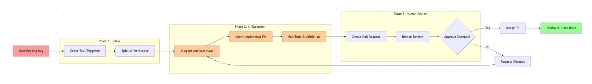

# Understanding Coder Tasks

## What is a Task? 

Tasks is Coder's platform for managing coding agents and other AI-enabled tools. With Coder Tasks, you can

- Connect an AI Agent like Claude Code or OpenAI's Codex to your IDE to assist in day-to-day development and building
- Kick off AI-enabled workflows such as upgrading a vulnerable package and automatically opening a GitHub Pull Requests with the patch
- Configure a background operation where an automated agent to detect a failure in your CI/CD pipeline, spin up a Coder Workspace, apply a fix, and prepare a PR _without_ manual input

Coder Tasks Dashboard view to see all available tasks.

Coder Tasks allows you and your organization to build and automate workflows to fully leverage AI. Tasks operate through Coder Workspaces, so developers can [connect via an IDE](../user-guides/workspace-access) to jump in and guide development and fully interact with the agent.

## Why Use Tasks?

Coder Tasks make both developer-driven _and_ autonomous agentic workflows first-class citizens within your organization. Without Tasks, teams will fall back to ad-hoc scripts, one-off commands, or manual checklists to perform simpler operations that LLMs can easily automate. These work arounds can help a single engineer, but don't scale or provide consistency across an organization that is attempting to use AI as a true force multiplier. 

Tasks exist to solve these types of problems:

- **Consistency:** Capture a known, safe, & secure workflow once that can then be run anywhere
- **Reproducibility:** Every Task runs from a Coder Workspace, so results are reliable
- **Productivity:** Eliminate manual processes from developer processes enabling them to focus on less defined and harder-to-do issues
- **Scalability:** Once a workflow is captured in a Task, it can be reused by other teams within your organization scaling with you as you grow
- **Flexibility:** Support both developer *AND* autonomous agentic workflows

### Example Task Workflow

Example of Background Coder Tasks operation.

<!-- ```mermaid
flowchart LR
    A[User Reports Bug] --> B[Coder Task Triggered]
    B --> C[Spin Up Workspace]
    C --> D[AI Agent Analyzes Issue]
    D --> E[Agent Implements Fix]
    E --> F[Run Tests & Validation]
    F --> G[Create Pull Request]
    G --> H[Human Review]
    H --> I{Approve Changes?}
    I -->|Yes| J[Merge PR]
    I -->|No| K[Request Changes]
    K --> D
    J --> L[Deploy & Close Issue]
    
    subgraph "Phase 1: Setup"
        B
        C
    end
    
    subgraph "Phase 2: AI Execution"
        D
        E
        F
    end
    
    subgraph "Phase 3: Human Review"
        G
        H
        I
    end
    
    style A fill:#ff9999
    style L fill:#99ff99
    style D fill:#ffcc99
    style E fill:#ffcc99
    style F fill:#ffcc99
``` -->

## How to Make a Task Template

### Refresher: What are Templates

As a quick refresher, a template defines the underlying infrastructure that a Coder workspace runs on. Templates themself are writting in Terraform managed as a `main.tf` file that defines the contents of the workspace and the resources it requires to run. Templates can also pull in Dockerfiles, other build files, and startup scripts or config files to specially configure.

Within this configuration, Coder specifically looks for 
* `coder_agent`: Coder's fundamental resource that runs inside a workspace to enable connectivity to external systems
* `coder_workspace`: Defines the workspace owner, state, etc. 
* `coder_provisioner`: Defines basic system information like system architecture, OS, etc.
* `coder_app`: Pull in IDE or other applications like VS Code, terminals, web apps

Coder templates also supports standard Terraform providers for connecting to external systems like AWS/Azure/GCP.

### What Makes a Task Template

Task templates are regular Coder Templates, with a few specific resources defined additionally. These resources prime the template and corresponding workspaces for automated execution and AI-driven workflows rather than development environments for developers and builders. 

The specific resources that turn a template into a task template include:
* **AgentAPI Module:** Coder's task execution engine that provides Web UI integration, task reporting, and agent lifecycle management that makes any module compatible with Coder Tasks
* `coder_parameter` named _ai_prompt_: Define the AI prompt input so users can define/specify what tasks need to run

The following code snippit can be dropped into any existing template to modify it into a Claude-Code enabled task template. This snippit also includes space for a setup script that will prime the agent for execution.

```hcl
data "coder_parameter" "ai_prompt" {
    name = "AI Prompt"
    type = "string"
}

data "coder_parameter" "setup_script" {
  name         = "setup_script"
  display_name = "Setup Script"
  type         = "string"
  form_type    = "textarea"
  description  = "Script to run before running the agent"
  mutable      = false
  default      = ""
}

# The Claude Code module does the automatic task reporting
# Other agent modules: https://registry.coder.com/modules?search=agent
# Or use a custom agent:  
module "claude-code" {
  count               = data.coder_workspace.me.start_count
  source              = "registry.coder.com/coder/claude-code/coder"
  version             = "2.2.0"
  agent_id            = coder_agent.main.id
  folder              = "/home/coder/projects"
  install_claude_code = true
  claude_code_version = "latest"
  order               = 999

  # experiment_post_install_script = data.coder_parameter.setup_script.value

  # This enables Coder Tasks
  experiment_report_tasks = true
}

variable "anthropic_api_key" {
  type        = string
  description = "Generate one at: https://console.anthropic.com/settings/keys"
  sensitive   = true
}

resource "coder_env" "anthropic_api_key" {
  agent_id = coder_agent.main.id
  name     = "CODER_MCP_CLAUDE_API_KEY"
  value    = var.anthropic_api_key
}
```

Let's break down this snippit:
- You aren't seeing the **AgentAPI Module**. That's because the AgentAPI module is it's own resource that other modules can pull in
- The `module "claude-code"` sets up the Task template to use Claude Code, but Coder's Registry supports many other agent modules like [OpenAI's Codex](https://registry.coder.com/modules/coder-labs/codex) or [Gemini CLI](https://registry.coder.com/modules/coder-labs/gemini)
- Each module define's its own specific inputs. Claude Code expects the `CODER_MCP_CLAUDE_API_KEY` environment variable to exist, but OpenAI based agents expect `OPENAI_API_KEY` for example. You'll want to check the specific module's defined variables to know what exactly needs to be defined
- You can define specific scripts to run at startup of the Task. For example, you could define a setup scrip that calls to AWS S3 and pulls specific files you want your agent to have access to

Given this, you can easily build your own Task Template. All you need to do is identify the existing agent you want access to in our [Registry](https://registry.coder.com/modules), and then
1. Add the agent's module to your existing template 
1. Define the module's required inputs
3. Define the `coder_parameter`

and you're all set to go! If you want to build your own custom agent, read up on our [Custom Agents](https://coder.com/docs/ai-coder/custom-agents) documentation. 

In summary, task templates are highly flexible. You can swap out modules depending on which agent you want to run, adjust their inputs based on the provider’s requirements, and layer on custom setup scripts to tailor the environment to your workflow. Whether that means using a different LLM, pointing to a new API key, or pulling files from S3 at startup, the template structure makes it easy to adapt Tasks without having to rebuild everything from scratch.

## Task Template Design Principles

Coder Tasks, being based in a given Workspace, operate on very similar principles: 
- **Specificity & Refinability:** Tasks, just like templates, are made to address a specific problem and evolve with that problem and your team over time
- **Security:** Because Tasks are defined through templates, you can define and restrict what access an agent running inside a Task has access to
- **Frugality:** Tasks only consume resources when running. You should design your Task Template to provide just enough compute and storage so that your task can effectively complete its job, reducing infrastructure cost
- **Model Applicability:** Task Templates can specify which model is most appropriate, meaning you can fine tune your Task based on it's job, be that a code-focused model for fixing bugs or a generalized LLM to write summaries and updates on Pull Requests
- **Automation:** Coder Tasks provide a comprehensive set of built-in APIs, status monitoring, and notification systems. This allows for you and your team to build seamless integrations with externation automation workflows

Together, these principles make up the core idea of designing Task Templates. Tasks are programmable, secure, and cost-efficient agents that integrate seamlessly into your team's workflow. By treating Task Templates as living and adaptable designs, you can evolve them with your team and needs without sacrificing clarity or control. The result is a system where automation, resource management, and security are baked into the foundation letting developers focus less on orchestration details and more on solving the problems that matter.

These design principles aren’t just technical guidelines, however. They're the lens through which to understand what Tasks are and how to use them effectively. By grounding Tasks in specificity, security, frugality, applicability, and automation, you ensure they remain reliable building blocks for both individual workflows and larger team processes.

### Identity, Security, and Access

Agents running with Coder Tasks always act as the authenticated developer. External auth tokens tie actions directly back to a specific user, so Git operations like cloning, pushing, or creating a PR are executed under the developer's personal OAuth tokens. Workspace SSH keys are generated per user, and external service integrations authenticate with the developer's personal credentials. This preserves audit trails and ensures actions stay traceable. Authentication (who the user is) subsequently stays separate from authorization (what the user can do), with identity providers acting as the source of truth. For human users, OIDC or SSO ensure sessions are consistent, centralized, and easy to govern.

For automated or background use cases, Tasks ca also run under service identities. These behave like CI jobs: locked down, narrowly scoped, and managed by the organization. Service accounts or bot identities cover headless API-driven systems, while GitHub Apps enable fine-grained repository access under your organizations control. If long-lived API tokens are needed, they should be tied to service accounts with strict roles and rotation policies. In practice, the default should always be user-context execution for developer workflows while service accounts are reserved for production automation, CI/CD pipelines, and cross-team integrations. This balance keeps developer productivity high while aligning with organizational security requirements.

## How Tasks Fit Into Coder

Coder's platform is built around three core concepts that work together:

**Templates** define the infrastructure and tool configurations that can be reused across your organization. They're the "blueprint" that ensures consistency and captures your team's working preferences.

**Workspaces** are the individual development environments that are spun up from templates. They provide developers with consistent, reproducible environments to perform their job.

**Tasks** extend this model to AI agents and automated workflows. The same template-driven approach is now optimized to allow for autonomous execution that can be independent from human interaction.

### Platform Integration

Tasks aren't a separate system bolted onto Coder, but a natural extension of your existing infrastructure.
- **Security:** Tasks inherit the same access controls, secrets management, and network policies as developer workspaces
- **Resource Management:** Tasks have access to the same compute pools, storage, and scaling policies you've already configured
- **Observability:** Tasks use the same underlying infrastructure for monitoring, and appear in their own custom task-specific dashboards

### Developer Experience Continuity

Coder understand that every team is in a different place in it's AI adoption plan. Some teams are still working to AI assistants to speed up development, while other teams are adopting background tasks to automate PR reviews and small bug fixes.

Naturally, your team might want to jump into a Task, for example when the agent encounters an issue or needs human input. With Tasks, you're able to jump into the existing Coder Workspace environment backing up the Task execution so that you can push the work forward. There's no context switching between tools; it's the same Workspace you're already used to and the agent's work becomes yours.
