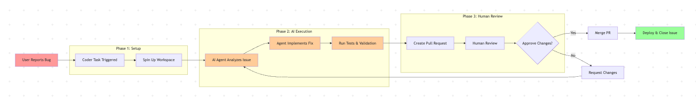

# Understanding Coder Tasks

## What is a Task?

Coder Tasks is Coder's platform for managing coding agents. With Coder Tasks, you can:

- Run an AI Agent like Claude Code or OpenAI's Codex in your Workspace to assist in day-to-day development and building
- Kick off AI-enabled workflows such as upgrading a vulnerable package and automatically opening a GitHub Pull Requests with the patch
- Configure a background operation where an automated agent can detect a failure in your CI/CD pipeline, spin up a Coder Workspace, apply a fix, and prepare a PR _without_ manual input

Coder Tasks Dashboard view to see all available tasks.

Coder Tasks allows you and your organization to build and automate workflows to fully leverage AI. Tasks operate through Coder Workspaces. We support interacting with an agent through the Task UI and CLI. Some Tasks can also be accessed through the Coder Workspace IDE; see [connect via an IDE](../user-guides/workspace-access).

## Why Use Tasks?

Coder Tasks make both developer-driven _and_ autonomous agentic workflows first-class citizens within your organization. Without Coder Tasks, teams revert to ad-hoc scripts, one-off commands, or manual checklists even for tasks that LLMs could automate. These workarounds can help a single engineer, but don't scale or provide consistency across an organization that is attempting to use AI as a true force multiplier.

Coder Tasks exist to solve these types of problems:

- **Consistency:** Capture a known, safe, & secure workflow once that can then be run anywhere
- **Reproducibility:** Every task runs from a Coder Workspace, so results are reliable
- **Productivity:** Eliminate manual processes from developer processes enabling them to focus on less defined and harder-to-do issues
- **Scalability:** Once a workflow is captured in a task, it can be reused by other teams within your organization scaling with you as you grow
- **Flexibility:** Support both developer _AND_ autonomous agentic workflows

### Example Task Workflow

Coder Tasks aren't limited to manual operation. They can operate as event-driven automations triggered by your team's everyday activities. Tasks can be thought of through two different type of triggers: manual and event-driven. In the below diagram, the user reported bug could result in a task being spun up via:

- **Event-Driven:** An automatic hook in your git repository
- **Manual:** An engineer reviewing the bug backlog manually creates a task

Other common triggers for event-based workflows include PRs being created/updated, a failure in your CI/CD pipeline, or issues being created/updated in your repository.

Example of Background Coder Tasks operation.

## How to Make a Task Template

If you need a refresher on Coder Templates, check out our [starting guide here](https://coder.com/docs/tutorials/template-from-scratch).

### What Makes a Task Template

Task Templates are regular Coder Templates with a few additional resources defined. These resources include the logic that lets the Coder UI and infrastructure recognize a Task, and prepare the system for automated execution and AI-driven workflows rather than development environments for developers and builders.

There are two approaches to turning a Template into a Task Template:

#### Using a Registry Module

You can use a pre-existing agent module that [Coder maintains](https://registry.coder.com/modules). When using an agent module, you must define:

- `coder_ai_task` resource: links a `coder_app` to a Task.
- **Agentic Module** that defines the agent you want to use, e.g. Claude Code, Codex CLI, Gemini CLI

Coder maintains various agentic modules; see [Coder Labs](https://registry.coder.com/contributors/coder-labs). These modules, in addition to defining connection information for the specific agent, reference the [AgentAPI module](https://registry.coder.com/modules/coder/agentapi) which provides connection, reporting, and agent life cycle management operations. The modules also output the specific `coder_app` identifier for the specific agent running inside the workspace.

The following code snippet can be dropped into any existing template in Coder v2.28 or above to modify it into a Claude-Code enabled task template. This snippet also includes space for a setup script that will prime the agent for execution.

> [!NOTE] This requires at least version 2.13.0 of the `coder/coder` Terraform provider.

```hcl
data "coder_parameter" "setup_script" {
  name         = "setup_script"
  display_name = "Setup Script"
  type         = "string"
  form_type    = "textarea"
  description  = "Script to run before running the agent"
  mutable      = false
  default      = ""
}

data "coder_ai_task_prompt" "me" {}

resource "coder_ai_task" "task" {
  app_id = module.claude-code.task_app_id
}

# The Claude Code module does the automatic task reporting
# Other agent modules: https://registry.coder.com/modules?search=agent
# Or use a custom agent:
module "claude-code" {
  source   = "registry.coder.com/coder/claude-code/coder"
  version  = "4.0.0"
  agent_id = coder_agent.example.id
  workdir  = "/home/coder/project"

  claude_api_key = var.anthropic_api_key
  # OR
  # claude_code_oauth_token = var.anthropic_oauth_token

  claude_code_version = "1.0.82" # Pin to a specific version
  agentapi_version    = "v0.6.1"

  ai_prompt = data.coder_parameter.ai_prompt.value
  model     = "sonnet"

  # Optional: run your pre-flight script
  # pre_install_script = data.coder_parameter.setup_script.value

  permission_mode = "plan"

  mcp = <<-EOF
  {
    "mcpServers": {
      "my-custom-tool": {
        "command": "my-tool-server",
        "args": ["--port", "8080"]
      }
    }
  }
  EOF
}

# Rename to `anthropic_oauth_token` if using the Oauth Token
variable "anthropic_api_key" {
  type        = string
  description = "Generate one at: https://console.anthropic.com/settings/keys"
  sensitive   = true
}
```

Let's break down this snippet:

- The `module "claude-code"` sets up the Task template to use Claude Code. Coder's Registry supports many other agent modules like [OpenAI's Codex](https://registry.coder.com/modules/coder-labs/codex) or [Gemini CLI](https://registry.coder.com/modules/coder-labs/gemini)
- Each module defines its own specific inputs. Claude Code expects the `claude_api_key` input, but OpenAI based agents expect `OPENAI_API_KEY` for example. You'll want to check the specific module's defined variables to know what exactly needs to be defined. You will also generally need to pass `data.coder_task.me.prompt`
- Each module outputs the UUID of the `coder_app` related to the AI agent. In the above example, the output is named `task_app_id`. See the relevant documentation for the module for more detailed information.
- You can define specific scripts to run before the module is installed, `pre_install_script`, or after install, `pre_install_script`. For example, you could define a setup script that calls to AWS S3 and pulls specific files you want your agent to have access to

#### Using a Custom Agent

Coder allows you to define a custom agent. When doing so, you must define:

- A `coder_app` resource that uses [`coder/agentapi`](https://github.com/coder/agentapi) to run the custom agent. **AgentAPI** provides runtime execution logistics for the task.
- A `coder_ai_task` resource which associates the `coder_app` related to the AI agent with the Task.

You can find the latest [AgentAPI binary here](https://github.com/coder/agentapi/releases). You can alternatively import and use the [AgentAPI module](https://registry.coder.com/modules/coder/agentapi?tab=variables) Coder maintains.

Read more about [custom agents here](https://coder.com/docs/ai-coder/custom-agents).

#### Putting it all Together

Coder recommends using pre-existing agent modules when making a Task Template. Making a Task Template boils down to:

1. Identify the existing agent you want access to in our [Registry](https://registry.coder.com/modules)
1. Add the agent's module to your existing template
1. Define the module's required inputs
1. Define the `coder_ai_task` resource.

and you're all set to go! If you want to build your own custom agent, read up on our [Custom Agents](https://coder.com/docs/ai-coder/custom-agents) documentation.

In summary, Task Templates are highly flexible. You can swap out modules depending on which agent you want to run, adjust their inputs based on the provider's requirements, and layer on custom setup scripts to tailor the environment to your workflow. Whether that means using a different LLM, pointing to a new API key, or pulling files from S3 at startup, the template structure makes it easy to adapt tasks without having to rebuild everything from scratch.

## Task Template Design Principles

Coder Tasks, being based in a given Workspace, operate on very similar principles:

- **Specificity & Refinability:** Tasks, just like Templates, are made to address a specific problem and evolve with that problem and your team over time
- **Security:** Because Tasks are defined through templates, you can define and restrict what access an agent running inside a Task has access to
- **Frugality:** Tasks only consume resources when running. You should design your Task Template to provide just enough compute and storage so that your task can effectively complete its job, reducing infrastructure cost
- **Model Applicability:** Task Templates can specify which model is most appropriate, meaning you can fine tune your Task based on its job, be that a code-focused model for fixing bugs or a generalized LLM to write summaries and updates on Pull Requests
- **Automation:** Coder Tasks provide a comprehensive set of built-in APIs, status monitoring, and notification systems. This allows for you and your team to build seamless integrations with external automation workflows

Together, these principles make up the core idea of designing task templates. Tasks are programmable, secure, and cost-efficient agents that integrate seamlessly into your team's workflow. By treating task templates as living and adaptable designs, you can evolve them with your team and needs without sacrificing clarity or control. The result is a system where automation, resource management, and security are baked into the foundation letting developers focus less on orchestration details and more on solving the problems that matter.

These design principles aren’t just technical guidelines; they're the lens through which to understand what Tasks are and how to use them effectively. By grounding Tasks in specificity, security, frugality, applicability, and automation, you ensure they remain reliable building blocks for both individual workflows and larger team processes.

### Practical Considerations

Tasks don't expose template parameters at runtime. If users need to choose different compute, region, or tooling options for example, you can define workspace presets in the template and have users select a preset when starting the Task. See workspace presets for details: ../admin/templates/extending-templates/parameters#workspace-presets.

### Identity, Security, and Access

By default, agents running with Coder Tasks always act as the authenticated developer. External auth tokens tie actions directly back to a specific user, so Git operations like cloning, pushing, or creating a PR are executed under the developer's personal OAuth tokens. Workspace SSH keys are generated per user, and external service integrations authenticate with the developer's personal credentials. This preserves audit trails and ensures actions stay traceable. Authentication (who the user is) subsequently stays separate from authorization (what the user can do), with identity providers acting as the source of truth. For human users, OIDC or SSO ensure sessions are consistent, centralized, and easy to govern.

For automated or background use cases, Tasks can also run under service identities. These behave like CI jobs: locked down, narrowly scoped, and managed by the organization. Service accounts or bot identities cover headless API-driven systems, while GitHub Apps enable fine-grained repository access under your organization's control. If long-lived API tokens are needed, they should be tied to service accounts with strict roles and rotation policies. In practice, the default should always be user-context execution for developer workflows while service accounts are reserved for production automation, CI/CD pipelines, and cross-team integrations. This balance keeps developer productivity high while aligning with organizational security requirements.

## How Tasks Fit Into Coder

Coder's platform is built around three core concepts that work together:

**Coder Templates** define the infrastructure and tool configurations that can be reused across your organization. They're the "blueprint" that ensures consistency and captures your team's working preferences.

**Coder Workspaces** are the individual development environments that are spun up from templates. They provide developers with consistent, reproducible environments to perform their job.

**Tasks** extend this model to AI agents and automated workflows. The same template-driven approach is now optimized to allow for autonomous execution that can be independent from human interaction.

### Platform Integration

Tasks aren't a separate system bolted onto Coder, but a natural extension of your existing infrastructure.

- **Security:** Tasks inherit the same access controls, secrets management, and network policies as developer workspaces
- **Resource Management:** Tasks have access to the same compute pools, storage, and scaling policies you've already configured
- **Observability:** Tasks use the same underlying infrastructure for monitoring, and appear in their own custom task-specific dashboards

### Developer Experience Continuity

Coder understands that every team is in a different place in its AI adoption plan. Some teams are still working with AI assistants to speed up development, while other teams are adopting background tasks to automate PR reviews and small bug fixes.

Naturally, your team might want to jump into a task, for example when the agent encounters an issue or needs human input. With Coder Tasks, you're able to jump into the existing Coder Workspace environment backing the task execution so that you can push the work forward. There's no context switching between tools; it's the same workspace you're already used to and the agent's work becomes yours.
