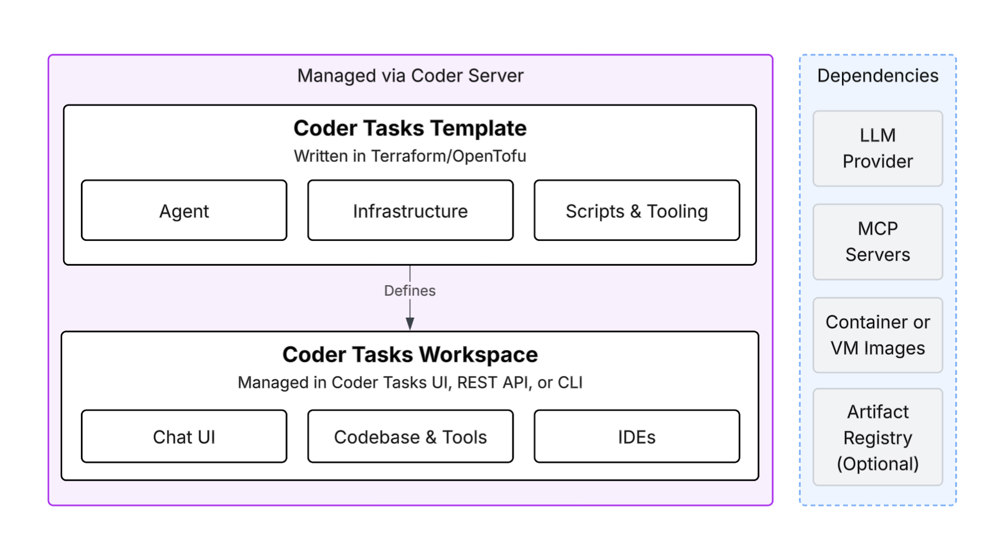
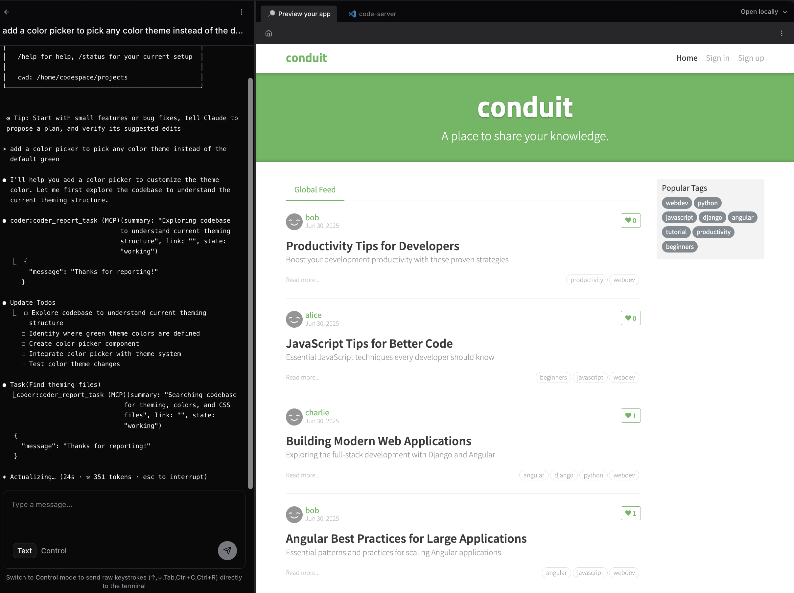

# Coder Tasks

Coder Tasks is an interface for running & managing coding agents such as Claude Code and Aider, powered by Coder workspaces.


Coder Tasks is best for cases where the IDE is secondary, such as prototyping or running long-running background jobs. However, tasks run inside full workspaces so developers can [connect via an IDE](../user-guides/workspace-access) to take a task to completion.

> [!NOTE]
> Premium Coder deployments are limited to running 1,000 tasks. [Contact us](https://coder.com/contact) for pricing options or learn more about our [AI Governance Add-On](./ai-governance.md) to evaluate all of Coder's AI features.

## Supported Agents (and Models)

Any terminal-based agent that supports Model Context Protocol (MCP) can be integrated with Coder Tasks, including your own custom agents.

Out of the box, agents like Claude Code and Goose are supported with built-in modules that can be added to a template. [See all modules compatible with Tasks in the Registry](https://registry.coder.com/modules?search=tag%3Atasks).

Enterprise LLM Providers such as AWS Bedrock, GCP Vertex and proxies such as LiteLLM can be used as well in order to keep intellectual property private. Self-hosted models such as llama4 can also be configured with specific agents, such as Aider and Goose.

## Architecture

Each task runs inside its own Coder workspace for isolation purposes. Agents like Claude Code also run in the workspace, and can be pre-installed via a module in the Coder Template. Agents then communicate with your LLM provider, so no GPUs are directly required in your workspaces for inference.



Coder's [built-in modules for agents](https://registry.coder.com/modules?search=tag%3Atasks) will pre-install the agent alongside [AgentAPI](https://github.com/coder/agentapi). AgentAPI is an open source project developed by Coder which improves status reporting and the Chat UI, regardless of which agent you use.

## Getting Started with Tasks

### Option 1&rpar; Import and Modify Our Example Template

Our example template is the best way to experiment with Tasks with a [real world demo app](https://github.com/gothinkster/realworld). The application is running in the background and you can experiment with coding agents.



Try prompts such as:

- "rewrite the backend in go"
- "document the project structure"
- "change the primary color theme to purple"

To import the template and begin configuring it, import the example [Run Coder Tasks on Docker](https://github.com/coder/coder/tree/main/examples/templates/tasks-docker) template.

### Option 2&rpar; Create or Duplicate Your Own Template

A template becomes a Task-capable template if it defines a `coder_ai_task` resource. Coder analyzes template files during template version import to determine if these requirements are met. Try adding this terraform block to an existing template where you'll add our Claude Code module.

> [!NOTE]
> The `coder_ai_task` resource is not defined within the [Claude Code Module](https://registry.coder.com/modules/coder/claude-code?tab=readme). You need to define it yourself.

```hcl
terraform {
  required_providers {
    coder = {
      source = "coder/coder"
      version = ">= 2.13"
    }
  }
}

data "coder_parameter" "setup_script" {
  name         = "setup_script"
  display_name = "Setup Script"
  type         = "string"
  form_type    = "textarea"
  description  = "Script to run before running the agent"
  mutable      = false
  default      = ""
}

data "coder_task" "me" {}

resource "coder_ai_task" "task" {
  app_id = module.claude-code.task_app_id
}

# The Claude Code module does the automatic task reporting
# Other agent modules: https://registry.coder.com/modules?search=agent
# Or use a custom agent:
module "claude-code" {
  source   = "registry.coder.com/coder/claude-code/coder"
  version  = "4.0.0"
  agent_id = coder_agent.example.id
  workdir  = "/home/coder/project"

  claude_api_key = var.anthropic_api_key
  # OR
  # claude_code_oauth_token = var.anthropic_oauth_token

  claude_code_version = "1.0.82" # Pin to a specific version
  agentapi_version    = "v0.6.1"

  ai_prompt = data.coder_task.me.prompt
  model     = "sonnet"

  # Optional: run your pre-flight script
  # pre_install_script = data.coder_parameter.setup_script.value

  permission_mode = "plan"

  mcp = <<-EOF
  {
    "mcpServers": {
      "my-custom-tool": {
        "command": "my-tool-server",
        "args": ["--port", "8080"]
      }
    }
  }
  EOF
}

# Rename to `anthropic_oauth_token` if using the Oauth Token
variable "anthropic_api_key" {
  type        = string
  description = "Generate one at: https://console.anthropic.com/settings/keys"
  sensitive   = true
}
```

Because Tasks run unpredictable AI agents, often for background tasks, we recommend creating a separate template for Coder Tasks with limited permissions. You can always duplicate your existing template, then apply separate network policies/firewalls/permissions to the template. From there, follow the docs for one of our [built-in modules for agents](https://registry.coder.com/modules?search=tag%3Atasks) in order to add it to your template, configure your LLM provider.

Alternatively, follow our guide for [custom agents](./custom-agents.md).

> [!IMPORTANT]
> Upgrading from Coder v2.27 or earlier? See the [Tasks Migration Guide](./tasks-migration.md) for breaking changes in v2.28.0.

## Customizing the Task UI

The Task UI displays all workspace apps declared in a Task template. You can customize the app shown in the sidebar using the `app_id` field on the `coder_ai_task` resource.

If a workspace app has the special `"preview"` slug, a navbar will appear above it. This is intended for templates that let users preview a web app they’re working on.

We plan to introduce more customization options in future releases.

## Pausing and Resuming Tasks

You can pause and resume tasks directly from the Tasks table using the action
buttons. Pausing a task stops the underlying workspace, freeing up compute
resources while preserving task state. This is useful for long-running tasks
you want to pause during periods of inactivity.

Running tasks show a pause button, while paused or errored tasks show a resume
button. Resuming restarts the workspace, which takes time while it starts up
and the agent reconnects.

## Automatically name your tasks

Coder can automatically generate a name your tasks if you set the `ANTHROPIC_API_KEY` environment variable on the Coder server. Otherwise, tasks will be given randomly generated names.

## Opting out of Tasks

If you tried Tasks and decided you don't want to use it, you can hide the Tasks tab by starting `coder server` with the `CODER_HIDE_AI_TASKS=true` environment variable or the `--hide-ai-tasks` flag.

## Command Line Interface

See [Tasks CLI](./cli.md).

## Next Steps

<children></children>
