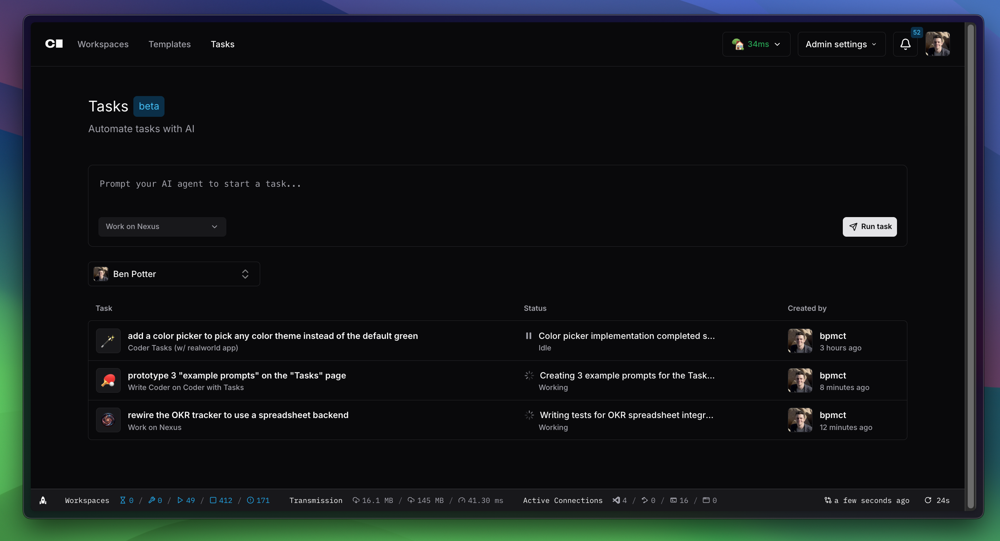

# Coder Tasks (Beta)

Coder Tasks is an interface for running & managing coding agents such as Claude Code and Aider, powered by Coder workspaces.



Coder Tasks is best for cases where the IDE is secondary, such as prototyping or running long-running background jobs. However, tasks run inside full workspaces so developers can [connect via an IDE](../user-guides/workspace-access) to take a task to completion.

> [!NOTE]
> Coder Tasks is free and open source. If you are a Coder Premium customer or want to run hundreds of tasks in the background, [contact us](https://coder.com/contact) for roadmap information and volume pricing.

## Supported Agents (and Models)

Any terminal-based agent that supports Model Context Protocol (MCP) can be integrated with Coder Tasks, including your own custom agents.

Out of the box, agents like Claude Code and Goose are supported with built-in modules that can be added to a template. [See all modules compatible with Tasks in the Registry](https://registry.coder.com/modules?search=tag%3Atasks).

Enterprise LLM Providers such as AWS Bedrock, GCP Vertex and proxies such as LiteLLM can be used as well in order to keep intellectual property private. Self-hosted models such as llama4 can also be configured with specific agents, such as Aider and Goose.

## Architecture

Each task runs inside its own Coder workspace for isolation purposes. Agents like Claude Code also run in the workspace, and can be pre-installed via a module in the Coder Template. Agents then communicate with your LLM provider, so no GPUs are directly required in your workspaces for inference.


Coder's [built-in modules for agents](https://registry.coder.com/modules?search=tag%3Atasks) will pre-install the agent alongside [AgentAPI](https://github.com/coder/agentapi). AgentAPI is an open source project developed by Coder which improves status reporting and the Chat UI, regardless of which agent you use.

## Getting Started with Tasks

### Option 1) Import and Modify Our Example Template

Our example template is the best way to experiment with Tasks with a [real world demo app](https://github.com/gothinkster/realworld). The application is running in the background and you can experiment with coding agents.


Try prompts such as:

- "rewrite the backend in go"
- "document the project structure"
- "change the primary color theme to purple"

To import the template and begin configuring it, follow the [documentation in the Coder Registry](https://registry.coder.com/templates/coder-labs/tasks-docker)

> [!NOTE]
> The Tasks tab will appear automatically after you add a Tasks-compatible template and refresh the page.

### Option 2) Create or Duplicate Your Own Template

A template becomes a Task template if it defines a `coder_ai_task` resource and a `coder_parameter` named `"AI Prompt"`. Coder analyzes template files during template version import to determine if these requirements are met. Try adding this terraform block to an existing template where you'll add our Claude Code module. Note: the `coder_ai_task` resource is defined within the [Claude Code Module](https://registry.coder.com/modules/coder/claude-code?tab=readme), so it's not defined within this block.

```hcl
data "coder_parameter" "ai_prompt" {
    name = "AI Prompt"
    type = "string"
}

data "coder_parameter" "setup_script" {
  name         = "setup_script"
  display_name = "Setup Script"
  type         = "string"
  form_type    = "textarea"
  description  = "Script to run before running the agent"
  mutable      = false
  default      = ""
}

# The Claude Code module does the automatic task reporting
# Other agent modules: https://registry.coder.com/modules?search=agent
# Or use a custom agent:  
module "claude-code" {
  count               = data.coder_workspace.me.start_count
  source              = "registry.coder.com/coder/claude-code/coder"
  version             = "2.2.0"
  agent_id            = coder_agent.main.id
  folder              = "/home/coder/projects"
  install_claude_code = true
  claude_code_version = "latest"
  order               = 999

  # experiment_post_install_script = data.coder_parameter.setup_script.value

  # This enables Coder Tasks
  experiment_report_tasks = true
}

variable "anthropic_api_key" {
  type        = string
  description = "Generate one at: https://console.anthropic.com/settings/keys"
  sensitive   = true
}

resource "coder_env" "anthropic_api_key" {
  agent_id = coder_agent.main.id
  name     = "CODER_MCP_CLAUDE_API_KEY"
  value    = var.anthropic_api_key
}
```

> [!NOTE]
> This definition is not final and may change while Tasks is in beta. After any changes, we guarantee backwards compatibility for one minor Coder version. After that, you may need to update your template to continue using it with Tasks.

Because Tasks run unpredictable AI agents, often for background tasks, we recommend creating a separate template for Coder Tasks with limited permissions. You can always duplicate your existing template, then apply separate network policies/firewalls/permissions to the template. From there, follow the docs for one of our [built-in modules for agents](https://registry.coder.com/modules?search=tag%3Atasks) in order to add it to your template, configure your LLM provider.

Alternatively, follow our guide for [custom agents](./custom-agents.md).

## Customizing the Task UI

The Task UI displays all workspace apps declared in a Task template. You can customize the app shown in the sidebar using the `sidebar_app.id` field on the `coder_ai_task` resource.

If a workspace app has the special `"preview"` slug, a navbar will appear above it. This is intended for templates that let users preview a web app they’re working on.

We plan to introduce more customization options in future releases.

## Automatically name your tasks

Coder can automatically generate a name your tasks if you set the `ANTHROPIC_API_KEY` environment variable on the Coder server. Otherwise, tasks will be given randomly generated names.

## Opting out of Tasks

If you tried Tasks and decided you don't want to use it, you can hide the Tasks tab by starting `coder server` with the `CODER_HIDE_AI_TASKS=true` environment variable or the `--hide-ai-tasks` flag.

## Command Line Interface

The Coder CLI provides experimental task commands for managing tasks programmatically. These are available under `coder exp task`.

### Creating Tasks

```bash
coder exp task create [input] [flags]
```

Creates a new task with the provided input. You can specify input either as a command argument or via stdin.

**Flags:**
- `--name <name>` - Specify the name of the task (optional, will be auto-generated if not provided)
- `--owner <owner>` - Specify the owner of the task (defaults to current user)
- `--org, -O <organization>` - Select which organization (uuid or name) to use
- `--template <template>` - Template name to use for the task
- `--template-version <version>` - Specific template version to use
- `--preset <preset>` - Template preset to use
- `--stdin` - Read task input from stdin instead of command arguments
- `--quiet, -q` - Only display the created task's ID

**Examples:**
```bash
# Create a task with direct input
coder exp task create "Add authentication to the user service"

# Create a task using stdin
echo "Refactor the database layer" | coder exp task create --stdin

# Create a task with a specific template
coder exp task create "Fix bug in payment processing" --template backend-dev

# Create a task for another user (requires appropriate permissions)
coder exp task create "Review code changes" --owner alice --name "code-review-task"
```

**Environment Variables:**
- `CODER_TASK_TEMPLATE_NAME` - Default template name
- `CODER_TASK_TEMPLATE_VERSION` - Default template version  
- `CODER_TASK_PRESET_NAME` - Default preset name

### Listing Tasks

```bash
coder exp task list [flags]
coder exp task ls [flags]  # alias
```

Lists tasks with status, state, and timing information.

**Flags:**
- `--status <status>` - Filter by task status (e.g., running, failed, stopped)
- `--all, -a` - List tasks for all users you can view
- `--user <user>` - List tasks for a specific user (username or "me")
- `--quiet, -q` - Only display task IDs

**Examples:**
```bash
# List your tasks
coder exp task list

# List all running tasks
coder exp task list --status running

# List tasks for all users
coder exp task list --all

# List tasks for a specific user
coder exp task list --user alice

# Get task IDs only
coder exp task list --quiet
```

### Viewing Task Status

```bash
coder exp task status <task> [flags]
coder exp task stat <task> [flags]  # alias
```

Shows detailed status information for a specific task.

**Flags:**
- `--watch` - Watch the task status for live updates

**Examples:**
```bash
# Show task status
coder exp task status my-task-name

# Show status using task ID
coder exp task status 550e8400-e29b-41d4-a716-446655440000

# Watch task status for live updates
coder exp task status my-task --watch
```

> **Note**: The `--watch` flag will automatically exit when the task reaches a terminal state. Watch mode ends when:
> - The workspace is stopped
> - The workspace agent becomes unhealthy or is shutting down
> - The task completes (reaches a non-working state like completed, failed, or canceled)

### Viewing Task Logs

```bash
coder exp task logs <task> [flags]
```

Retrieves and displays the logs for a specific task.

**Flags:**
- (No additional flags beyond common options)

**Examples:**
```bash
# View logs for a task
coder exp task logs my-task-name

# View logs using task ID
coder exp task logs 550e8400-e29b-41d4-a716-446655440000
```

### Sending Input to Tasks

```bash
coder exp task send <task> [<input> | --stdin] [flags]
```

Sends additional input to a running task. This is useful for providing follow-up instructions or responding to task requests.

**Flags:**
- `--stdin` - Read input from stdin instead of command arguments

**Examples:**
```bash
# Send input to a task
coder exp task send my-task "Please also add unit tests"

# Send input via stdin
echo "Use TypeScript instead of JavaScript" | coder exp task send my-task --stdin
```

### Deleting Tasks

```bash
coder exp task delete <task> [<task> ...] [flags]
```

Deletes one or more tasks. This action requires confirmation unless the `--yes` flag is used.

**Flags:**
- `--yes, -y` - Bypass confirmation prompts

**Examples:**
```bash
# Delete a single task (with confirmation)
coder exp task delete my-task-name

# Delete multiple tasks
coder exp task delete task1 task2 task3

# Delete without confirmation prompt
coder exp task delete my-task --yes
```

### Task Identification

Tasks can be identified in CLI commands using either:
- **Task Name**: The human-readable name (e.g., `my-task-name`)
- **Task ID**: The UUID identifier (e.g., `550e8400-e29b-41d4-a716-446655440000`)
- **Owner/Name format**: For tasks owned by other users (e.g., `alice/her-task`)

### Global Options

All task commands support standard Coder CLI global options:
- `--url <url>` - Coder server URL
- `--token <token>` - Authentication token
- `--verbose` - Enable verbose logging
- `--help` - Show command help

### Common Command Options

Many task commands also support these common formatting options:
- `--output, -o <format>` - Output format (table, json). Default: table
- `--column, -c <columns>` - Columns to display in table output (varies by command)

## Next Steps

<children></children>
