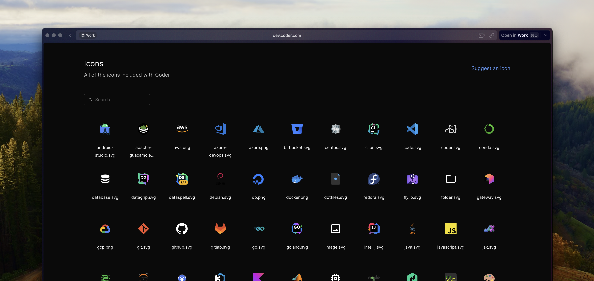

## Changelog

### Important Features

- We added a new builtin icons page.

  

- We added icon selector to the emoji picker.

  

Both of these features makes it easier to find and use icons the builtin icons. For more information, see [Icons](https://coder.com/docs/v2/latest/templates/icons).

### Features

- Expose user seat limits as Prometheus metrics (#10169) (@mtojek)
- Now you can control autostart days for templates (#10226) (#10263) (@Emyrk)
- Aadd support for sending batched agent metadata (#10223) (#10224) (@mafredri)
- Add extraTemplates to provisioners Helm chart (#10256) (@johnstcn)
- Only show `Running`, `Stopped`, `Failed` and `Pending` status for workspace filtering (#10283) (@BrunoQuaresma)

### Bug fixes

- Use UTF-8 encoding with screen (#10190) (@code-asher)
- update create workspace button to recognize template names + display names (#10233) (@Parkreiner)
- display health alert in `DeploymentBannerView` (#10193) (@aslilac)
- send metadata in batches (#10225) (@mafredri)
- make activitybump aware of default template ttl (#10253) (@johnstcn)
- pass through api ctx to provisionerdserver (#10259) (@johnstcn)
- ensure empty string error shows default message (#10196) (@Kira-Pilot)
- display empty component when workspace has no parameters (#10286) (@BrunoQuaresma)
- do not return next page if the current size is lower than the limit (#10287) (@BrunoQuaresma)

### Documentation

- Add [Icons](https://coder.com/docs/v2/latest/templates/icons).
  in the template documentation (#10230) (@aslilac)

Compare: [`v2.3.0...v2.3.1`](https://github.com/coder/coder/compare/v2.3.0...v2.3.1)

## Container image

- `docker pull ghcr.io/coder/coder:v2.3.1`

## Install/upgrade

Refer to our docs to [install](https://coder.com/docs/v2/latest/install) or [upgrade](https://coder.com/docs/v2/latest/admin/upgrade) Coder, or use a release asset below.
