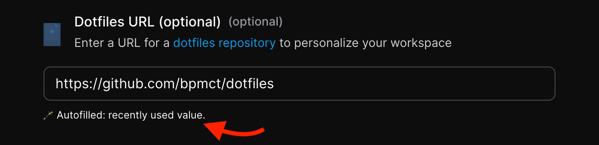
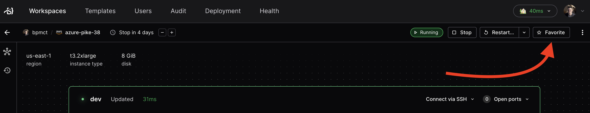

## Changelog

### Features

- Coder will now autofill parameters in the "create workspace" page based on the previous value (#11731) (@ammario)
  
- Show workspace name suggestions below the name field (#12001) (@aslilac)
- Add favorite/unfavorite commands (@johnstcn)
- Add .zip support for Coder templates (#11839) (#12032) (@mtojek)
- Add support for `--wait` and scripts that block login (#10473) (@mafredri)
- Users can mark workspaces as favorite to show up at the top of their list (#11875) (#11793) (#11878) (#11791) (@johnstcn)
  
- Add Prometheus metrics to servertailnet (#11988) (@coadler)
- Add support for concurrent scenarios (#11753) (@mafredri)
- Display user avatar on workspace page (#11893) (@BrunoQuaresma)
- Do not show popover on update deadline (#11921) (@BrunoQuaresma)
- Simplify "Create Template" form by removing advanced settings (#11918) (@BrunoQuaresma)
- Show deprecation message on template page (#11996) (@BrunoQuaresma)
- Check agent API version on connection (#11696)
- Add "updated" search param to workspaces (#11714)
- Add option to speedtest to dump a pcap of network traffic (#11848) (@coadler)
- Add logging to client tailnet yamux (#11908) (@spikecurtis)
- Add customizable upgrade message on client/server version mismatch (#11587) (@sreya)
- Add logging to pgcoord subscribe/unsubscribe (#11952) (@spikecurtis)
- Add logging to pgPubsub (#11953) (@spikecurtis)
- Add logging to agent yamux session (#11912) (@spikecurtis)
- Move agent v2 API connection monitoring to yamux layer (#11910) (@spikecurtis)
- eb03e4490 feat: add statsReporter for reporting stats on agent v2 API (#11920) (@spikecurtis)
- Add metrics to PGPubsub (#11971) (@spikecurtis)
- Add custom error message on signups disabled page (#11959) (@mtojek)

### Bug fixes

- Make ServerTailnet set peers lost when it reconnects to the coordinator (#11682)
- Properly auto-update workspace on SSH if template policy is set (#11773)
- Allow template name length of 32 in template push and create (#11915) (@mafredri)
- Alter return signature of convertWorkspace, add check for requesterID (#11796) (@johnstcn)
- Fix limit in `GetUserWorkspaceBuildParameters` (#11954) (@mafredri)
- Fix test flake in TestHeartbeat (#11808) (@johnstcn)
- Do not cache context cancellation errors (#11840) (@johnstcn)
- Fix startup script on workspace creation (#11958) (@matifali)
- Fix startup script looping (#11972) (@code-asher)
- Add ID to default columns in licenses list output (#11823) (@johnstcn)
- Handle query canceled error in sendBeat() (#11794) (@johnstcn)
- Fix proxy settings link (#11817) (@BrunoQuaresma)
- Disable autostart and autostop according to template settings (#11809) (@Kira-Pilot)
- Fix capitalized username (#11891) (@BrunoQuaresma)
- Fix parameters' request upon template variables update (#11898) (@BrunoQuaresma)
- Fix text overflow on batch ws deletion (#11981) (@BrunoQuaresma)
- Fix parameter input icon shrink (#11995) (@BrunoQuaresma)
- Use TSMP ping for reachability, not latency (#11749)
- Display error when fetching OAuth2 provider apps (#11713)
- Fix code-server path based forwarding, defer to code-server (#11759)
- Use correct logger for lifecycle_executor (#11763)
- Disable keepalives in workspaceapps transport (#11789) (@coadler)
- Accept agent RPC connection without version query parameter (#11790) (@spikecurtis)
- Stop spamming DERP map updates for equivalent maps (#11792) (@spikecurtis)
- Check update permission to start workspace (#11798) (@mtojek)
- Always attempt external auth refresh when fetching (#11762) (@Emyrk)
- Stop running tests that exec sh scripts in parallel (#11834) (@spikecurtis)
- Fix type error from theme update (#11844) (@aslilac)
- Use new context after t.Parallel in TestOAuthAppSecrets (@spikecurtis)
- Always attempt external auth refresh when fetching (#11762) (#11830) (@Emyrk)
- Wait for new template version before promoting (#11874) (@spikecurtis)
- Respect wait flag on ping (#11896) (@f0ssel)
- Fix cliui prompt styling (#11899) (@aslilac)
- Fix prevent agent_test.go from failing on error logs (#11909) (@spikecurtis)
- Add timeout to listening ports request (#11935) (@coadler)
- Only delete expired agents on success (#11940) (@coadler)
- Close MultiAgentConn when coordinator closes (#11941) (@spikecurtis)
- Strip timezone information from a date in dau response (#11962) (@Emyrk)
- Improve click UX and styling for Auth Token page (#11863) (@Parkreiner)
- Rewrite url to agent ip in single tailnet (#11810) (@coadler)
- Avoid race in TestPGPubsub_Metrics by using Eventually (#11973) (@spikecurtis)
- Always return a clean http client for promoauth (#11963) (@Emyrk)
- Change build status colors (#11985) (@aslilac)
- Only display xray results if vulns > 0 (#11989) (@sreya)
- Use dark background in terminal, even when a light theme is selected (#12004) (@aslilac)
- Fix graceful disconnect in DialWorkspaceAgent (#11993) (@spikecurtis)
- Stop logging error on query canceled (#12017) (@spikecurtis)

### Documentation

- 6b0e1291d docs: add v2.7.3 changelog (#11811) (@bpmct)
- 979a92083 docs: use coder modules in offline deployments (#11788) (@matifali)
- 541154b74 docs: simplify JFrog integration docs (#11787) (@matifali)
- be4d5221b docs: add guide for azure federation (#11864) (@ericpaulsen)
- d8a3ebef3 docs: fix example template README 404s and semantics (#11903) (@ericpaulsen)
- 21237d96a docs: update remote docker host docs (#11919) (@matifali)
- f57ce97b5 docs: add faq for gateway reconnects (#12007) (@ericpaulsen)

### Code refactoring

- a31d19d53 refactor(site): apply cosmetic changes and remove ExternalAuth from settings page (#11756)
- 910f17f4e refactor(site): refactor external auth component (#11758)
- e828daba6 refactor(site): simplify create workspace form (#11771)
- 6145da8a9 refactor(site): verify external auth before display ws form (#11777) (@BrunoQuaresma)
- 8bc91b489 refactor(site): increase form fields gap (#11803) (@BrunoQuaresma)
- e371716b3 refactor(site): add minor workspace improvements (#11822) (@BrunoQuaresma)
- 0ba035a16 refactor(site): improve parameters field (#11802) (@BrunoQuaresma)
- 1a9468692 refactor(site): add table chosmetic changes (#11977) (@BrunoQuaresma)
- 6c9f60a9c refactor(site): only display quota if it is higher than 0 (#11979) (@BrunoQuaresma)
- f74ef142d refactor: reorganize auth components and hooks (#11717)
- 69e963b1a refactor: move dashboard functionality to modules/dashboard/ (#11721)
- c85fc3c8f refactor: add more `fill` variants to the experimental theme (#11827) (@aslilac)
- 619bdd1e7 refactor: redesign `Paywall` component (#11907) (@aslilac)
- 76e73287a refactor: add modules/templates and modules/workspaces (#11947) (@aslilac)
- e070a5514 refactor: stabilize `theme.roles` (#11969) (@aslilac)

Compare: [`v2.7.2...v2.7.3`](https://github.com/coder/coder/compare/v2.7.2...v2.7.3)

## Container image

- `docker pull ghcr.io/coder/coder:v2.7.3`

## Install/upgrade

Refer to our docs to [install](https://coder.com/docs/v2/latest/install) or [upgrade](https://coder.com/docs/v2/latest/admin/upgrade) Coder, or use a release asset below.
