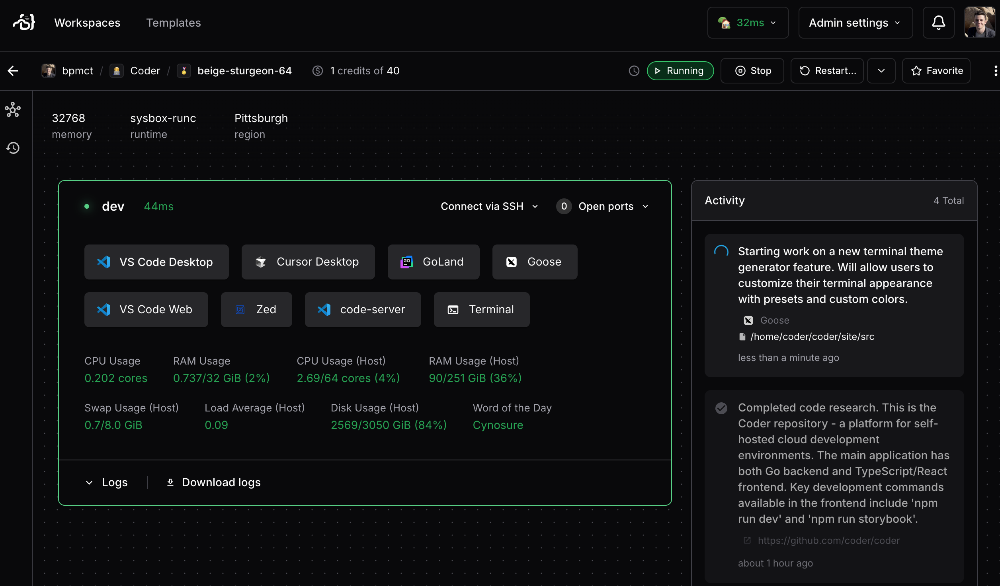

> [!NOTE]
>
> This functionality is in early access and is evolving rapidly.
>
> For now, we recommend testing it in a demo or staging environment,
> rather than deploying to production.
>
> Join our [Discord channel](https://discord.gg/coder) or
> [contact us](https://coder.com/contact) to get help or share feedback.

## Prerequisites

- A Coder deployment with v2.21 or later
- A [template configured for AI agents](./create-template.md)

## Overview

Once you have an agent running and reporting activity to Coder, you can view
status and switch between workspaces from the Coder dashboard.

## Next Steps

- [Supervise Agents in the IDE](./ide-integration.md)
- [Supervise Agents Programmatically](./headless.md)
- [Securing Agents](./securing.md)
