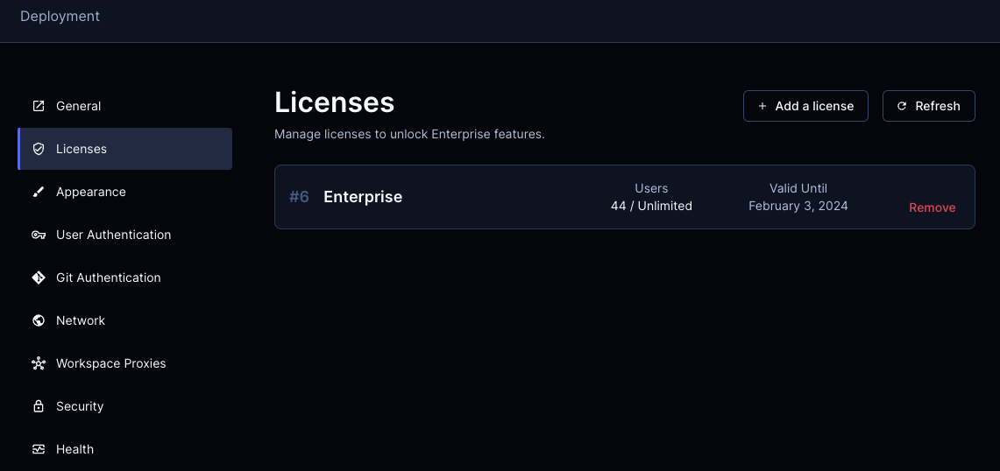

# Enterprise Features

Coder is free to use and includes some features that are only accessible with a
paid license. [Contact Sales](https://coder.com/contact) for pricing or
[get a free trial](https://coder.com/trial).

| Category        | Feature                                                                                             | Open Source | Enterprise |
| --------------- | --------------------------------------------------------------------------------------------------- | :---------: | :--------: |
| Support         | Email, Prioritization                                                                               |     ❌      |     ✅     |
| Scale           | [High Availability](./admin/high-availability.md)                                                   |     ❌      |     ✅     |
| Scale           | [Multiple External Auth Providers](./admin/external-auth.md#multiple-external-providers-enterprise) |     ❌      |     ✅     |
| Scale           | [Isolated Terraform Runners](./admin/provisioners.md)                                               |     ❌      |     ✅     |
| Scale           | [Workspace Proxies](./admin/workspace-proxies.md)                                                   |     ❌      |     ✅     |
| Governance      | [Audit Logging](./admin/audit-logs.md)                                                              |     ❌      |     ✅     |
| Governance      | [Browser Only Connections](./networking/#browser-only-connections-enterprise)                       |     ❌      |     ✅     |
| Governance      | [Groups & Template RBAC](./admin/rbac.md)                                                           |     ❌      |     ✅     |
| Cost Control    | [Quotas](./admin/quotas.md)                                                                         |     ❌      |     ✅     |
| Cost Control    | [Max Workspace Lifetime](./workspaces.md#max-lifetime)                                              |     ❌      |     ✅     |
| User Management | [Groups](./admin/groups.md)                                                                         |     ❌      |     ✅     |
| User Management | [Group & role sync](./admin/auth.md#group-sync-enterprise)                                          |     ❌      |     ✅     |
| User Management | [SCIM](./admin/auth.md#scim)                                                                        |     ❌      |     ✅     |

## Adding your license key

There are two ways to add an enterprise license to a Coder deployment: In the
Coder UI or with the Coder CLI.

### Coder UI

Click Deployment, Licenses, Add a license then drag or select the license file
with the `jwt` extension.

### Coder CLI

### Requirements

- Your license key
- Coder CLI installed

### Instructions

1. Save your license key to disk and make note of the path
2. Open a terminal
3. Ensure you are logged into your Coder deployment

   `coder login <access url>`

4. Run

   `coder licenses add -f <path to your license key>`

## Up Next

- [Learn how to contribute to Coder](./CONTRIBUTING.md).
