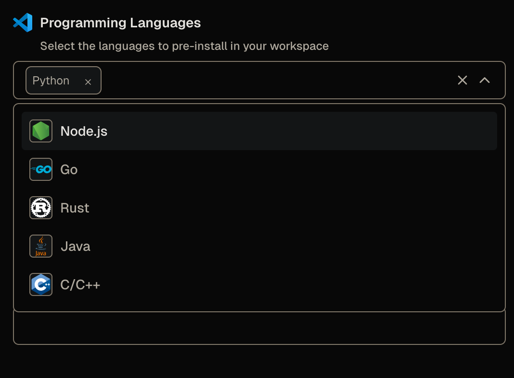
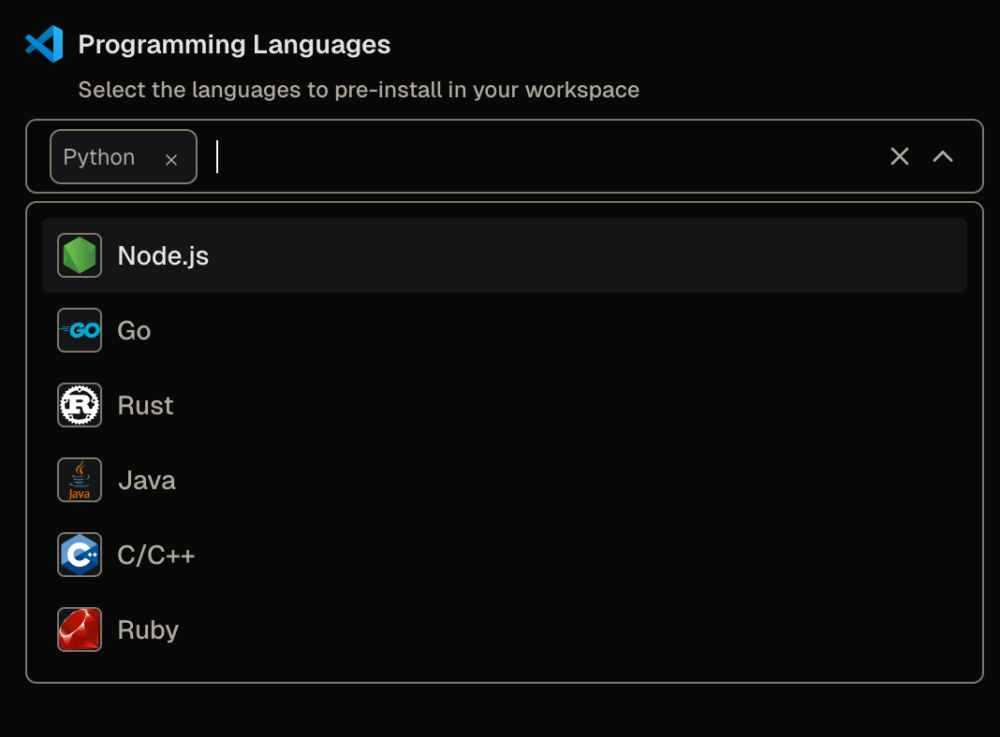
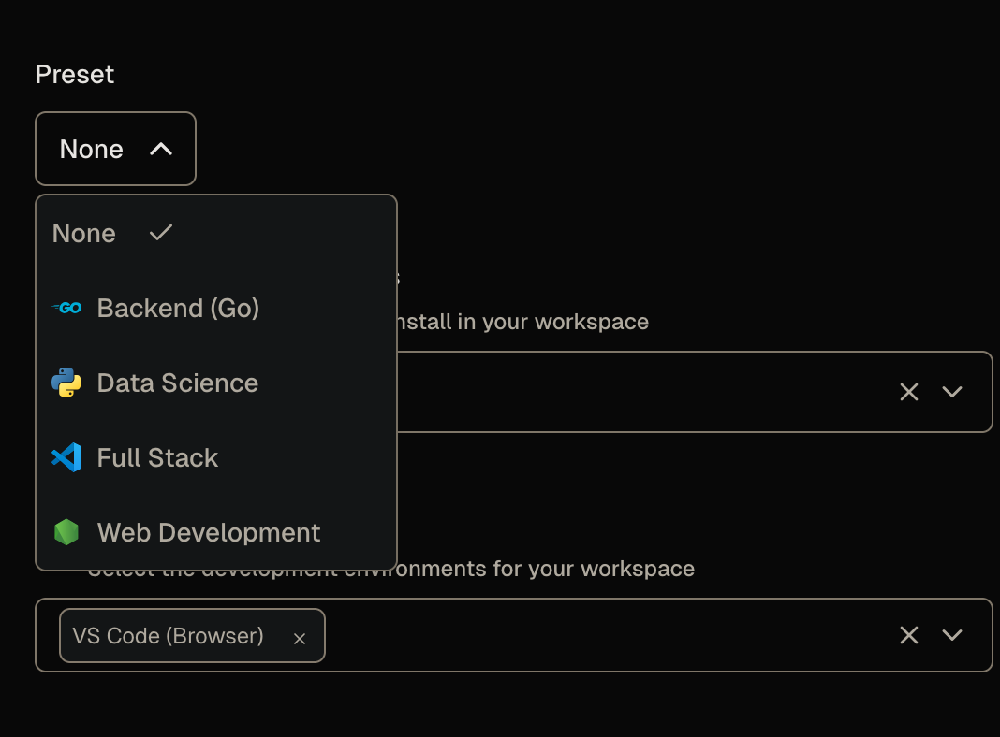
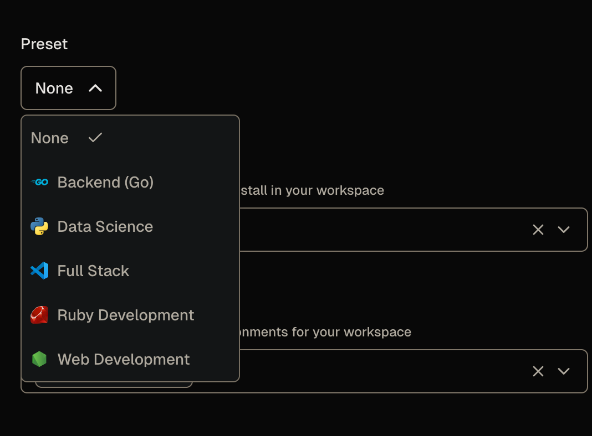
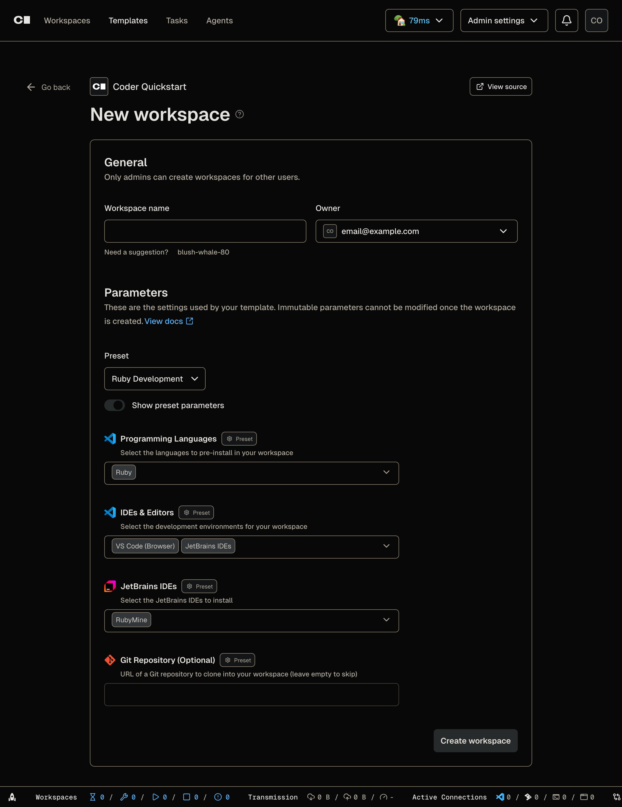

# Add a programming language to your template

Now that you've finished [Launch your first workspace](../index.md), you can add another language toolchain to every workspace you create.

The Quickstart template installs a language only when the workspace owner selects it from the **Programming Languages** parameter.
In this guide, you add Ruby as an option.

> [!NOTE]
> This guide assumes your Quickstart template is open for editing.
> If it's not, you can edit the template from the web by finding the template, selecting the three dots menu, and selecting **Edit files**.
> Refer to [Customize workspace startup](./index.md#open-the-template-for-editing) for more information.

## What you'll do

- ✅ Add a Ruby option to the **Programming Languages** parameter.
- ✅ Publish the change and apply it to your running workspace.
- ✅ Install the Ruby toolchain so selecting Ruby works.

## Parameters in brief

A parameter is a question Coder asks when someone creates a workspace.
Each parameter comes from a `coder_parameter` [data source](https://developer.hashicorp.com/terraform/language/data-sources) in the template.
The **Programming Languages** parameter is a multi-select list, and each language the reader can choose is an `option` block:

```tf
data "coder_parameter" "languages" {
  name         = "languages"
  display_name = "Programming Languages"
  description  = "Select the languages to pre-install in your workspace"
  type         = "list(string)"
  form_type    = "multi-select"
  default      = jsonencode(["python"])
  mutable      = true
  icon         = "/icon/code.svg"
  order        = 1

  option {
    name  = "Python"
    value = "python"
    icon  = "/icon/python.svg"
  }
  # ...more options
}
```

This produces the following dropdown parameter:

_Programming Language dropdown parameter from the Quickstart template_

Adding an `option` adds a choice to that list.

## Step 1: Add the Ruby option

In `main.tf`, find the `data "coder_parameter" "languages"` block.
Add a Ruby `option` after the last existing option, before the parameter's closing brace:

```tf
  option {
    name  = "Ruby"
    value = "ruby"
    icon  = "/icon/ruby.svg"
  }
```

> [!IMPORTANT]
> The `option` block must sit at the same indentation as the other `option` blocks inside the parameter.
> Coder reads the parameter's choices from these blocks, so a misplaced `option` doesn't appear in the form.

The `icon` value points at an icon bundled with your Coder deployment.
To browse the full set and copy a path, open `https://<your-coder-url>/icons`.

Now publish the change as a new template version:

<div class="tabs">

### UI

In the web editor, make the edit above in `main.tf`.
Select **Build**, wait for the build to pass, then select **Publish**.

### CLI

Make the edit in `~/coder-quickstart/main.tf`, then publish a new version:

```sh
coder templates push -d ~/coder-quickstart -y quickstart
```

</div>

## Step 2: Add Ruby to your workspace

Your workspace from [Launch your first workspace](../index.md) is still on the old template version.
Update it to the version you just published, and add Ruby to its **Programming Languages** selection:

<div class="tabs">

### UI

1. From your workspace, open **Workspace settings** (top right), then select **Parameters**.
2. Add **Ruby** to the **Programming Languages** parameter.
3. Apply the change. Coder updates the workspace to the new template version and restarts it with Ruby selected.

### CLI

Update the workspace and re-select its parameters.
Replace `<your-workspace>` with your workspace's name (run `coder list` to see it):

```sh
coder update <your-workspace> --always-prompt
```

When prompted for **Programming Languages**, add **Ruby**, then let the workspace rebuild.

</div>

Adding the Ruby option to the parameter shows the following:

_Programming Language dropdown parameter from the Quickstart template with Ruby_

## Step 3: Check whether Ruby is installed

When the workspace restarts, open a terminal and ask for the Ruby version:

```sh
ruby --version
```

The command fails:

```text
ruby: command not found
```

You added the option, selected it, and rebuilt the workspace, but Ruby isn't there.
Adding the `option` only changed the form.
It added Ruby to the list of choices, but nothing in the template acts on that choice yet.
A separate startup script installs each selected toolchain, and you haven't taught it about Ruby.

## Step 4: Install Ruby when the workspace starts

The template installs each selected language from `install-languages.sh.tftpl`, a startup script that runs when the workspace boots.
Open that file and add a branch that installs Ruby when the reader selects it:

```sh
if echo "$LANGUAGES" | grep -q "ruby"; then
  if command -v ruby >/dev/null 2>&1; then
    echo "Ruby: $(ruby --version | head -1)"
  else
    echo "Installing Ruby toolchain..."
    apt_update
    sudo apt-get install -y -qq ruby-full
    echo "Installed Ruby: $(ruby --version | head -1)"
  fi
fi
```

The script installs Ruby with `apt-get`, the package manager built into the workspace image.

> [!WARNING]
> Use the package manager the workspace image provides, not a personal one.
> If you replace the `apt-get` line with `brew install ruby`, the build fails: the `codercom/enterprise-base:ubuntu` image doesn't include Homebrew, so the workspace logs `brew: command not found` and Ruby never installs.
> To install a personal tool like a Homebrew formula in your own workspace, refer to [Install your own command-line tools](./install-command-line-tools.md).

Publish the change, then update your workspace again:

<div class="tabs">

### UI

1. In the web editor, make the edit above in `install-languages.sh.tftpl`.
2. Select **Build**, wait for the build to pass, then select **Publish**.
3. On your workspace's home tab, select **Update and restart**.

### CLI

Make the edit in `~/coder-quickstart/install-languages.sh.tftpl`, then publish and update:

```sh
coder templates push -d ~/coder-quickstart -y quickstart
coder update <your-workspace>
```

</div>

Ruby is already selected, so you don't change parameters this time.
When the workspace restarts, open a terminal and check again:

```sh
ruby --version
```

This time the workspace reports a Ruby version.

## Step 5: Add a Ruby preset

Steps 1 through 4 make Ruby selectable as a parameter and install it at startup.
The Quickstart template also ships presets: named bundles of parameter values that appear on the workspace creation form:

_Default presets with the Quickstart template_

The shipped presets cover combinations like Go and Python, but none selects Ruby, so add one to keep the parameter and preset choices in sync.

In `main.tf`, find the `# --- Presets ---` section and add a Ruby preset next to the existing ones:

```tf
data "coder_workspace_preset" "ruby_dev" {
  name = "Ruby Development"
  icon = "/icon/ruby.svg"
  parameters = {
    languages      = jsonencode(["ruby"])
    ides           = jsonencode(["code-server", "jetbrains"])
    jetbrains_ides = jsonencode(["RM"])
    git_repo       = ""
  }
}
```

This preset adds JetBrains RubyMine as a default option for the language, but you can customize the preferred IDEs in this default based on your needs.

Publish the template again.
The next time you create a workspace, **Ruby Development** appears in the preset list and preselects Ruby:

_Updated presets with the Quickstart template_

Expanding the preset parameters after selecting **Ruby Development** shows the parameter values Coder will use to create the workspace:

_Expanded parameter values for the Ruby Development preset_

## What just happened

You changed two different things to add one language:

- The `coder_parameter` `option` block added Ruby to the workspace creation form.
- The startup script installed the Ruby toolchain when a workspace owner selected Ruby.

A parameter collects a choice.
A startup script acts on it.
A new language needs both.

You also added support for a new preset, so workspace users can launch a workspace from this template quickly, without having to fill out the parameters manually.

<details>
<summary>How does Coder install the language you pick?</summary>

The selection travels through the template in four steps:

1. The `option` block in `data "coder_parameter" "languages"` (`main.tf`) adds `ruby` to the values the form accepts.
2. When the workspace builds, `local.languages` decodes the selection in `main.tf`:

   ```tf
   languages = jsondecode(data.coder_parameter.languages.value)
   ```

3. `coder_script.install_languages` renders the startup script with that list and runs it on the agent (also in `main.tf`):

   ```tf
   script = templatefile("${path.module}/install-languages.sh.tftpl", {
     LANGUAGES = join(",", local.languages)
   })
   ```

4. Inside the rendered script, the `ruby` branch matches and installs the toolchain:

   ```sh
   if echo "$LANGUAGES" | grep -q "ruby"; then
   ```

The first three steps ran as soon as you added the option, which is why Ruby appeared in the form.
Step 4 is the part you were missing in Step 3, so the script had nothing to do for `ruby`.

</details>

<details>
<summary>Why a <code>.tftpl</code> file instead of a plain script?</summary>

The install script needs to know which languages the workspace owner selected, and only Terraform has that value when the workspace builds.
`templatefile()` renders `install-languages.sh.tftpl` and replaces `${LANGUAGES}` with `join(",", local.languages)`, producing a finished script with the selection baked in.
A static `.sh` file couldn't receive that value, so the `.tftpl` is the bridge between the parameter and the shell script.

</details>

## Final code

<details>

<summary>The complete template files</summary>

Your template files after this guide's changes, starting from the Quickstart template:

<div class="tabs">

### main.tf

```tf
terraform {
  required_providers {
    coder = {
      source = "coder/coder"
    }
    docker = {
      source = "kreuzwerker/docker"
    }
    external = {
      source = "hashicorp/external"
    }
  }
}

variable "docker_socket" {
  default     = ""
  description = "(Optional) Docker socket URI"
  type        = string
}

provider "docker" {
  host = var.docker_socket != "" ? var.docker_socket : null
}

data "coder_provisioner" "me" {}
data "coder_workspace" "me" {}
data "coder_workspace_owner" "me" {}

# --- Parameters ---

data "coder_parameter" "languages" {
  name         = "languages"
  display_name = "Programming Languages"
  description  = "Select the languages to pre-install in your workspace"
  type         = "list(string)"
  form_type    = "multi-select"
  default      = jsonencode(["python"])
  mutable      = true
  icon         = "/icon/code.svg"
  order        = 1

  option {
    name  = "Python"
    value = "python"
    icon  = "/icon/python.svg"
  }
  option {
    name  = "Node.js"
    value = "nodejs"
    icon  = "/icon/nodejs.svg"
  }
  option {
    name  = "Go"
    value = "go"
    icon  = "/icon/go.svg"
  }
  option {
    name  = "Rust"
    value = "rust"
    icon  = "/icon/rust.svg"
  }
  option {
    name  = "Java"
    value = "java"
    icon  = "/icon/java.svg"
  }
  option {
    name  = "C/C++"
    value = "cpp"
    icon  = "/icon/cpp.svg"
  }
  option {
    name  = "Ruby"
    value = "ruby"
    icon  = "/icon/ruby.svg"
  }
}

data "coder_parameter" "ides" {
  name         = "ides"
  display_name = "IDEs & Editors"
  description  = "Select the development environments for your workspace"
  type         = "list(string)"
  form_type    = "multi-select"
  default      = jsonencode(["code-server"])
  mutable      = true
  icon         = "/icon/code.svg"
  order        = 2

  option {
    name  = "VS Code (Browser)"
    value = "code-server"
    icon  = "/icon/code.svg"
  }
  option {
    name  = "Cursor"
    value = "cursor"
    icon  = "/icon/cursor.svg"
  }
  option {
    name  = "JetBrains IDEs"
    value = "jetbrains"
    icon  = "/icon/jetbrains.svg"
  }
  option {
    name  = "Zed"
    value = "zed"
    icon  = "/icon/zed.svg"
  }
  option {
    name  = "Windsurf"
    value = "windsurf"
    icon  = "/icon/windsurf.svg"
  }
}

# Shown only when "JetBrains IDEs" is selected in the IDEs parameter.
# Pre-selects IDEs that match the chosen languages.
data "coder_parameter" "jetbrains_ides" {
  count        = contains(local.ides, "jetbrains") ? 1 : 0
  name         = "jetbrains_ides"
  display_name = "JetBrains IDEs"
  description  = "Select the JetBrains IDEs to install"
  type         = "list(string)"
  form_type    = "multi-select"
  default      = jsonencode(local.jetbrains_ides_from_languages)
  mutable      = true
  icon         = "/icon/jetbrains.svg"
  order        = 3

  option {
    name  = "IntelliJ IDEA"
    value = "IU"
    icon  = "/icon/intellij.svg"
  }
  option {
    name  = "PyCharm"
    value = "PY"
    icon  = "/icon/pycharm.svg"
  }
  option {
    name  = "GoLand"
    value = "GO"
    icon  = "/icon/goland.svg"
  }
  option {
    name  = "WebStorm"
    value = "WS"
    icon  = "/icon/webstorm.svg"
  }
  option {
    name  = "RustRover"
    value = "RR"
    icon  = "/icon/rustrover.svg"
  }
  option {
    name  = "CLion"
    value = "CL"
    icon  = "/icon/clion.svg"
  }
  option {
    name  = "PhpStorm"
    value = "PS"
    icon  = "/icon/phpstorm.svg"
  }
  option {
    name  = "RubyMine"
    value = "RM"
    icon  = "/icon/rubymine.svg"
  }
  option {
    name  = "Rider"
    value = "RD"
    icon  = "/icon/rider.svg"
  }
}

data "coder_parameter" "git_repo" {
  name         = "git_repo"
  display_name = "Git Repository (Optional)"
  description  = "URL of a Git repository to clone into your workspace (leave empty to skip)"
  type         = "string"
  default      = ""
  mutable      = true
  icon         = "/icon/git.svg"
  order        = 4
}

# --- Locals ---

locals {
  username  = data.coder_workspace_owner.me.name
  languages = jsondecode(data.coder_parameter.languages.value)
  ides      = jsondecode(data.coder_parameter.ides.value)

  # Map selected languages to the relevant JetBrains IDE product codes.
  # Used as the default for the JetBrains IDE selector parameter.
  jetbrains_by_language = {
    python = ["PY"]
    go     = ["GO"]
    java   = ["IU"]
    nodejs = ["WS"]
    rust   = ["RR"]
    cpp    = ["CL"]
  }
  jetbrains_ides_from_languages = distinct(flatten([
    for lang in local.languages : lookup(local.jetbrains_by_language, lang, [])
  ]))

  # The actual JetBrains IDEs to install, from the user's selection
  # in the conditional JetBrains parameter (or empty if not shown).
  jetbrains_selected = contains(local.ides, "jetbrains") ? jsondecode(data.coder_parameter.jetbrains_ides[0].value) : []
}

# --- Agent ---

resource "coder_agent" "main" {
  arch           = data.coder_provisioner.me.arch
  os             = "linux"
  startup_script = <<-EOT
    set -e
    if [ ! -f ~/.init_done ]; then
      cp -rT /etc/skel ~
      touch ~/.init_done
    fi
  EOT

  env = {
    GIT_AUTHOR_NAME     = coalesce(data.coder_workspace_owner.me.full_name, data.coder_workspace_owner.me.name)
    GIT_AUTHOR_EMAIL    = "${data.coder_workspace_owner.me.email}"
    GIT_COMMITTER_NAME  = coalesce(data.coder_workspace_owner.me.full_name, data.coder_workspace_owner.me.name)
    GIT_COMMITTER_EMAIL = "${data.coder_workspace_owner.me.email}"
  }

  metadata {
    display_name = "CPU Usage"
    key          = "0_cpu_usage"
    script       = "coder stat cpu"
    interval     = 10
    timeout      = 1
  }

  metadata {
    display_name = "RAM Usage"
    key          = "1_ram_usage"
    script       = "coder stat mem"
    interval     = 10
    timeout      = 1
  }

  metadata {
    display_name = "Home Disk"
    key          = "3_home_disk"
    script       = "coder stat disk --path $${HOME}"
    interval     = 60
    timeout      = 1
  }
}

# --- Language installation ---
# All languages install in a single script to avoid apt-get lock
# conflicts (coder_script resources run in parallel).

resource "coder_script" "install_languages" {
  count              = length(local.languages) > 0 ? 1 : 0
  agent_id           = coder_agent.main.id
  display_name       = "Install Languages"
  icon               = "/icon/code.svg"
  run_on_start       = true
  start_blocks_login = true
  script = templatefile("${path.module}/install-languages.sh.tftpl", {
    LANGUAGES = join(",", local.languages)
  })
}

# --- IDE modules ---

module "code-server" {
  count    = data.coder_workspace.me.start_count * (contains(local.ides, "code-server") ? 1 : 0)
  source   = "registry.coder.com/coder/code-server/coder"
  version  = "~> 1.0"
  agent_id = coder_agent.main.id
  order    = 1
}

module "cursor" {
  count    = data.coder_workspace.me.start_count * (contains(local.ides, "cursor") ? 1 : 0)
  source   = "registry.coder.com/coder/cursor/coder"
  version  = "~> 1.0"
  agent_id = coder_agent.main.id
  folder   = "/home/coder"
  order    = 3
}

# TODO: Re-add the coder/jetbrains module once Coder's dynamic
# parameter system respects module count for parameter visibility.
# The module's internal coder_parameter appears even when count = 0,
# creating a ghost parameter in the workspace creation form.
# module "jetbrains" {
#   count    = data.coder_workspace.me.start_count * (contains(local.ides, "jetbrains") && length(local.jetbrains_selected) > 0 ? 1 : 0)
#   source   = "registry.coder.com/coder/jetbrains/coder"
#   version  = "~> 1.0"
#   agent_id = coder_agent.main.id
#   folder   = "/home/coder"
#   default  = toset(local.jetbrains_selected)
# }

module "zed" {
  count    = data.coder_workspace.me.start_count * (contains(local.ides, "zed") ? 1 : 0)
  source   = "registry.coder.com/coder/zed/coder"
  version  = "~> 1.0"
  agent_id = coder_agent.main.id
  folder   = "/home/coder"
  order    = 5
}

module "windsurf" {
  count    = data.coder_workspace.me.start_count * (contains(local.ides, "windsurf") ? 1 : 0)
  source   = "registry.coder.com/coder/windsurf/coder"
  version  = "~> 1.0"
  agent_id = coder_agent.main.id
  folder   = "/home/coder"
  order    = 6
}

# --- Git clone ---

module "git-clone" {
  count    = data.coder_workspace.me.start_count * (data.coder_parameter.git_repo.value != "" ? 1 : 0)
  source   = "registry.coder.com/coder/git-clone/coder"
  version  = "~> 2.0"
  agent_id = coder_agent.main.id
  url      = data.coder_parameter.git_repo.value
}

# --- Presets ---

data "coder_workspace_preset" "web_dev" {
  name = "Web Development"
  icon = "/icon/nodejs.svg"
  parameters = {
    languages = jsonencode(["python", "nodejs"])
    ides      = jsonencode(["code-server"])
    git_repo  = ""
  }
}

data "coder_workspace_preset" "backend_go" {
  name = "Backend (Go)"
  icon = "/icon/go.svg"
  parameters = {
    languages      = jsonencode(["go"])
    ides           = jsonencode(["code-server", "jetbrains"])
    jetbrains_ides = jsonencode(["GO"])
    git_repo       = ""
  }
}

data "coder_workspace_preset" "data_science" {
  name = "Data Science"
  icon = "/icon/python.svg"
  parameters = {
    languages = jsonencode(["python"])
    ides      = jsonencode(["code-server"])
    git_repo  = ""
  }
}

data "coder_workspace_preset" "full_stack" {
  name = "Full Stack"
  icon = "/icon/code.svg"
  parameters = {
    languages = jsonencode(["python", "nodejs", "go"])
    ides      = jsonencode(["code-server", "cursor"])
    git_repo  = ""
  }
}

data "coder_workspace_preset" "ruby_dev" {
  name = "Ruby Development"
  icon = "/icon/ruby.svg"
  parameters = {
    languages      = jsonencode(["ruby"])
    ides           = jsonencode(["code-server", "jetbrains"])
    jetbrains_ides = jsonencode(["RM"])
    git_repo       = ""
  }
}

# --- Docker resources ---

resource "docker_volume" "home_volume" {
  name = "coder-${data.coder_workspace.me.id}-home"
  lifecycle {
    ignore_changes = all
  }
  labels {
    label = "coder.owner"
    value = data.coder_workspace_owner.me.name
  }
  labels {
    label = "coder.owner_id"
    value = data.coder_workspace_owner.me.id
  }
  labels {
    label = "coder.workspace_id"
    value = data.coder_workspace.me.id
  }
  labels {
    label = "coder.workspace_name_at_creation"
    value = data.coder_workspace.me.name
  }
  depends_on = []
}

resource "docker_container" "workspace" {
  count    = data.coder_workspace.me.start_count
  image    = "codercom/enterprise-base:ubuntu"
  name     = "coder-${data.coder_workspace_owner.me.name}-${lower(data.coder_workspace.me.name)}"
  hostname = data.coder_workspace.me.name
  entrypoint = [
    "sh", "-c",
    replace(coder_agent.main.init_script, "/localhost|127\\.0\\.0\\.1/", "host.docker.internal"),
  ]
  env = ["CODER_AGENT_TOKEN=${coder_agent.main.token}"]
  host {
    host = "host.docker.internal"
    ip   = "host-gateway"
  }
  volumes {
    container_path = "/home/coder"
    volume_name    = docker_volume.home_volume.name
    read_only      = false
  }
  labels {
    label = "coder.owner"
    value = data.coder_workspace_owner.me.name
  }
  labels {
    label = "coder.owner_id"
    value = data.coder_workspace_owner.me.id
  }
  labels {
    label = "coder.workspace_id"
    value = data.coder_workspace.me.id
  }
  labels {
    label = "coder.workspace_name"
    value = data.coder_workspace.me.name
  }
  depends_on = []
}
```

### install-languages.sh.tftpl

```sh
#!/bin/bash
set -e

LANGUAGES="${LANGUAGES}"
APT_UPDATED=false

apt_update() {
  if [ "$APT_UPDATED" = "false" ]; then
    sudo apt-get update -qq
    APT_UPDATED=true
  fi
}

if echo "$LANGUAGES" | grep -q "python"; then
  if command -v python3 >/dev/null 2>&1; then
    echo "Python: $(python3 --version)"
  else
    echo "Installing Python..."
    apt_update
    sudo apt-get install -y -qq python3 python3-pip python3-venv
    echo "Installed Python: $(python3 --version)"
  fi
fi

if echo "$LANGUAGES" | grep -q "nodejs"; then
  if command -v node >/dev/null 2>&1; then
    echo "Node.js: $(node --version)"
  else
    echo "Installing Node.js 22..."
    curl -fsSL https://deb.nodesource.com/setup_22.x | sudo -E bash -
    sudo apt-get install -y -qq nodejs
    echo "Installed Node.js: $(node --version)"
  fi
fi

if echo "$LANGUAGES" | grep -q "go"; then
  if command -v /usr/local/go/bin/go >/dev/null 2>&1; then
    echo "Go: $(/usr/local/go/bin/go version)"
  else
    echo "Installing Go..."
    ARCH=$(uname -m)
    case $ARCH in
      x86_64)  GOARCH="amd64" ;;
      aarch64) GOARCH="arm64" ;;
      *)       echo "Unsupported architecture: $ARCH"; exit 1 ;;
    esac
    GO_VERSION=$(curl -fsSL "https://go.dev/VERSION?m=text" | head -1)
    curl -fsSL "https://go.dev/dl/$${GO_VERSION}.linux-$${GOARCH}.tar.gz" | sudo tar -C /usr/local -xz
    echo 'export PATH=$PATH:/usr/local/go/bin:$HOME/go/bin' | sudo tee /etc/profile.d/go.sh >/dev/null
    echo "Installed Go: $(/usr/local/go/bin/go version)"
  fi
fi

if echo "$LANGUAGES" | grep -q "rust"; then
  if command -v rustc >/dev/null 2>&1 || [ -f "$HOME/.cargo/bin/rustc" ]; then
    RUSTC=$${HOME}/.cargo/bin/rustc
    command -v rustc >/dev/null 2>&1 && RUSTC=rustc
    echo "Rust: $($RUSTC --version)"
  else
    echo "Installing Rust..."
    curl --proto '=https' --tlsv1.2 -sSf https://sh.rustup.rs | sh -s -- -y
    echo "Installed Rust: $($HOME/.cargo/bin/rustc --version)"
  fi
fi

if echo "$LANGUAGES" | grep -q "java"; then
  if command -v java >/dev/null 2>&1; then
    echo "Java: $(java --version 2>&1 | head -1)"
  else
    echo "Installing Java (OpenJDK 21)..."
    apt_update
    sudo apt-get install -y -qq openjdk-21-jdk
    echo "Installed Java: $(java --version 2>&1 | head -1)"
  fi
fi

if echo "$LANGUAGES" | grep -q "cpp"; then
  if command -v gcc >/dev/null 2>&1; then
    echo "C/C++: $(gcc --version | head -1)"
  else
    echo "Installing C/C++ toolchain..."
    apt_update
    sudo apt-get install -y -qq gcc g++ make cmake
    echo "Installed C/C++: $(gcc --version | head -1)"
  fi
fi

if echo "$LANGUAGES" | grep -q "ruby"; then
  if command -v ruby >/dev/null 2>&1; then
    echo "Ruby: $(ruby --version | head -1)"
  else
    echo "Installing Ruby toolchain..."
    apt_update
    sudo apt-get install -y -qq ruby-full
    echo "Installed Ruby: $(ruby --version | head -1)"
  fi
fi

echo "Language setup complete."
```

</div>

</details>

## What's next?

Now that you added a language, you can [install your own command-line tools](./install-command-line-tools.md).

## Learn more

- [Parameters](../../admin/templates/extending-templates/parameters.md) in the Coder documentation
- [Terraform data sources](https://developer.hashicorp.com/terraform/language/data-sources)
- [Terraform types](https://developer.hashicorp.com/terraform/language/expressions/types) for parameter values
