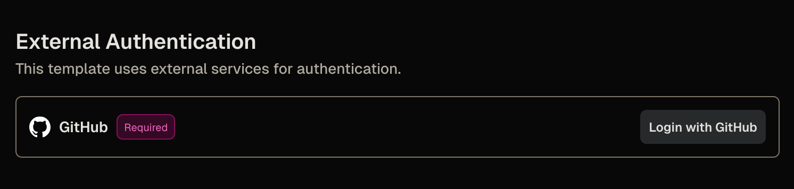
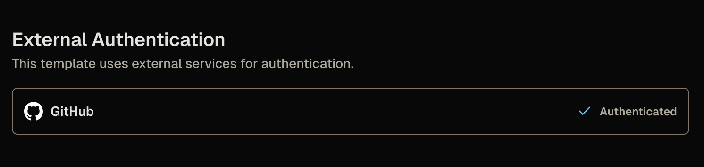

# Clone private repositories

Now that you've finished [Launch your first workspace](../index.md), you can let your workspaces clone private GitHub repositories without a manual login each time.

The Quickstart template already clones **public** repositories through its **Git Repository (Optional)** parameter with no extra setup.
A **private** repository needs authentication, which is what you add here.
In this guide, you add the `coder_external_auth` data source, connect your workspace to GitHub, and clone a private repository with no manual login.
This guide uses GitHub, and the same external-auth pattern works for other providers.

> [!NOTE]
> This guide assumes your Quickstart template is open for editing.
> If it's not, you can edit the template from the web by finding the template, selecting the three dots menu, and selecting **Edit files**.
> Refer to [Customize workspace startup](./index.md#open-the-template-for-editing) for more information.

## What you'll do

- ✅ Add the `coder_external_auth` data source to the template.
- ✅ Connect your workspace to GitHub with the **Login with GitHub** button.
- ✅ Clone a private repository without a manual login.

## Data sources for their side effect

You already met one [data source](https://developer.hashicorp.com/terraform/language/data-sources) in [Add a programming language](./add-a-language.md): `coder_parameter` reads a choice from the workspace owner.

`coder_external_auth` is a data source you add for its side effect rather than its value.
Its presence tells Coder that a workspace requires an authenticated session with a provider before it starts.
The `id` points at a provider configured on the Coder deployment, and the local Coder server you started in Part 1 already has a `github` provider available.

> [!NOTE]
> External authentication lets a workspace sign in to an outside service, such as a Git provider, before it starts.
> A default Coder install includes a built-in GitHub app, so `id = "github"` works without extra setup.
> An admin can configure other providers (GitLab, Bitbucket, Azure DevOps, or generic OIDC) or replace the built-in GitHub app.
> To learn more, refer to [External authentication](../../admin/external-auth/index.md).

## Step 1: Require GitHub authentication

Add this `coder_external_auth` block to `main.tf`:

```tf
data "coder_external_auth" "github" {
  id = "github"
}
```

Then publish a new version of the template:

<div class="tabs">

### UI

In the web editor, add the `coder_external_auth` block to `main.tf`.
Select **Build**, wait for the build to pass, then select **Publish**.

### CLI

Add the block to `~/coder-quickstart/main.tf`, then publish a new version:

```sh
coder templates push -d ~/coder-quickstart -y quickstart
```

</div>

> [!WARNING]
> Adding this block makes GitHub authentication required: a workspace on this template can't start until you authenticate, with no option to skip.
> If you'd rather leave it optional, set `optional = true` in the `coder_external_auth` block so users can skip authentication when they create or update a workspace.

## Step 2: Connect your workspace to GitHub

Update the workspace you built in [Launch your first workspace](../index.md) to the version you just published.
Because the local Coder server is already connected to GitHub, you don't configure an OAuth app; you only authorize the workspace.

<div class="tabs">

### UI

On your workspace, select **Update**.
The update form shows a **Login with GitHub** button: select it, follow the prompts to authorize Coder, then select **Update and restart**.
The following screenshot shows the **External Authentication** section of the workspace creation screen before connecting GitHub:

_External Authentication with GitHub before logging in_

### CLI

Update the workspace:

```sh
coder update <your-workspace>
```

If you aren't authenticated yet, Coder prints a URL to log in with GitHub; open it, authorize Coder, then run the command again.

</div>

Once you authorize Coder, the workspace starts, and Coder stores and refreshes your GitHub token for later builds.
After authorizing Coder, Coder replaces the **Login with GitHub** button with an **Authenticated** message:

_External Authentication with GitHub after logging in_

## Step 3: Clone a private repository

Now that your workspace is connected to GitHub, point the **Git Repository (Optional)** parameter at a private repository.

<div class="tabs">

### UI

On your workspace, set **Git Repository (Optional)** to your private repository URL in the update form, then select **Update and restart**.

### CLI

Update the workspace and re-select its parameters:

```sh
coder update <your-workspace> --always-prompt
```

When prompted for **Git Repository (Optional)**, enter your private repository URL, then let the workspace rebuild.

</div>

On the next build, the workspace clones the private repository with no manual login, because Coder supplies your GitHub token to `git`.

## What just happened

You added one data source and connected your workspace to GitHub:

- `coder_external_auth` declared that the workspace needs an authenticated GitHub session before it starts.
- Selecting **Login with GitHub** authorized Coder, and Coder now supplies a GitHub token to `git` for every build.

A `coder_parameter` reads an answer from the workspace owner.
A `coder_external_auth` data source reaches outside the template for a prerequisite the deployment provides.
Both are data sources, and neither creates infrastructure.

## Final code

<details>

<summary>The complete <code>main.tf</code></summary>

Your `main.tf` after this guide's changes, starting from the Quickstart template:

```tf
terraform {
  required_providers {
    coder = {
      source = "coder/coder"
    }
    docker = {
      source = "kreuzwerker/docker"
    }
    external = {
      source = "hashicorp/external"
    }
  }
}

variable "docker_socket" {
  default     = ""
  description = "(Optional) Docker socket URI"
  type        = string
}

provider "docker" {
  host = var.docker_socket != "" ? var.docker_socket : null
}

data "coder_provisioner" "me" {}
data "coder_workspace" "me" {}
data "coder_workspace_owner" "me" {}

# --- Parameters ---

data "coder_parameter" "languages" {
  name         = "languages"
  display_name = "Programming Languages"
  description  = "Select the languages to pre-install in your workspace"
  type         = "list(string)"
  form_type    = "multi-select"
  default      = jsonencode(["python"])
  mutable      = true
  icon         = "/icon/code.svg"
  order        = 1

  option {
    name  = "Python"
    value = "python"
    icon  = "/icon/python.svg"
  }
  option {
    name  = "Node.js"
    value = "nodejs"
    icon  = "/icon/nodejs.svg"
  }
  option {
    name  = "Go"
    value = "go"
    icon  = "/icon/go.svg"
  }
  option {
    name  = "Rust"
    value = "rust"
    icon  = "/icon/rust.svg"
  }
  option {
    name  = "Java"
    value = "java"
    icon  = "/icon/java.svg"
  }
  option {
    name  = "C/C++"
    value = "cpp"
    icon  = "/icon/cpp.svg"
  }
}

data "coder_parameter" "ides" {
  name         = "ides"
  display_name = "IDEs & Editors"
  description  = "Select the development environments for your workspace"
  type         = "list(string)"
  form_type    = "multi-select"
  default      = jsonencode(["code-server"])
  mutable      = true
  icon         = "/icon/code.svg"
  order        = 2

  option {
    name  = "VS Code (Browser)"
    value = "code-server"
    icon  = "/icon/code.svg"
  }
  option {
    name  = "Cursor"
    value = "cursor"
    icon  = "/icon/cursor.svg"
  }
  option {
    name  = "JetBrains IDEs"
    value = "jetbrains"
    icon  = "/icon/jetbrains.svg"
  }
  option {
    name  = "Zed"
    value = "zed"
    icon  = "/icon/zed.svg"
  }
  option {
    name  = "Windsurf"
    value = "windsurf"
    icon  = "/icon/windsurf.svg"
  }
}

# Shown only when "JetBrains IDEs" is selected in the IDEs parameter.
# Pre-selects IDEs that match the chosen languages.
data "coder_parameter" "jetbrains_ides" {
  count        = contains(local.ides, "jetbrains") ? 1 : 0
  name         = "jetbrains_ides"
  display_name = "JetBrains IDEs"
  description  = "Select the JetBrains IDEs to install"
  type         = "list(string)"
  form_type    = "multi-select"
  default      = jsonencode(local.jetbrains_ides_from_languages)
  mutable      = true
  icon         = "/icon/jetbrains.svg"
  order        = 3

  option {
    name  = "IntelliJ IDEA"
    value = "IU"
    icon  = "/icon/intellij.svg"
  }
  option {
    name  = "PyCharm"
    value = "PY"
    icon  = "/icon/pycharm.svg"
  }
  option {
    name  = "GoLand"
    value = "GO"
    icon  = "/icon/goland.svg"
  }
  option {
    name  = "WebStorm"
    value = "WS"
    icon  = "/icon/webstorm.svg"
  }
  option {
    name  = "RustRover"
    value = "RR"
    icon  = "/icon/rustrover.svg"
  }
  option {
    name  = "CLion"
    value = "CL"
    icon  = "/icon/clion.svg"
  }
  option {
    name  = "PhpStorm"
    value = "PS"
    icon  = "/icon/phpstorm.svg"
  }
  option {
    name  = "RubyMine"
    value = "RM"
    icon  = "/icon/rubymine.svg"
  }
  option {
    name  = "Rider"
    value = "RD"
    icon  = "/icon/rider.svg"
  }
}

data "coder_parameter" "git_repo" {
  name         = "git_repo"
  display_name = "Git Repository (Optional)"
  description  = "URL of a Git repository to clone into your workspace (leave empty to skip)"
  type         = "string"
  default      = ""
  mutable      = true
  icon         = "/icon/git.svg"
  order        = 4
}

# --- External authentication ---

data "coder_external_auth" "github" {
  id = "github"
}

# --- Locals ---

locals {
  username  = data.coder_workspace_owner.me.name
  languages = jsondecode(data.coder_parameter.languages.value)
  ides      = jsondecode(data.coder_parameter.ides.value)

  # Map selected languages to the relevant JetBrains IDE product codes.
  # Used as the default for the JetBrains IDE selector parameter.
  jetbrains_by_language = {
    python = ["PY"]
    go     = ["GO"]
    java   = ["IU"]
    nodejs = ["WS"]
    rust   = ["RR"]
    cpp    = ["CL"]
  }
  jetbrains_ides_from_languages = distinct(flatten([
    for lang in local.languages : lookup(local.jetbrains_by_language, lang, [])
  ]))

  # The actual JetBrains IDEs to install, from the user's selection
  # in the conditional JetBrains parameter (or empty if not shown).
  jetbrains_selected = contains(local.ides, "jetbrains") ? jsondecode(data.coder_parameter.jetbrains_ides[0].value) : []
}

# --- Agent ---

resource "coder_agent" "main" {
  arch           = data.coder_provisioner.me.arch
  os             = "linux"
  startup_script = <<-EOT
    set -e
    if [ ! -f ~/.init_done ]; then
      cp -rT /etc/skel ~
      touch ~/.init_done
    fi
  EOT

  env = {
    GIT_AUTHOR_NAME     = coalesce(data.coder_workspace_owner.me.full_name, data.coder_workspace_owner.me.name)
    GIT_AUTHOR_EMAIL    = "${data.coder_workspace_owner.me.email}"
    GIT_COMMITTER_NAME  = coalesce(data.coder_workspace_owner.me.full_name, data.coder_workspace_owner.me.name)
    GIT_COMMITTER_EMAIL = "${data.coder_workspace_owner.me.email}"
  }

  metadata {
    display_name = "CPU Usage"
    key          = "0_cpu_usage"
    script       = "coder stat cpu"
    interval     = 10
    timeout      = 1
  }

  metadata {
    display_name = "RAM Usage"
    key          = "1_ram_usage"
    script       = "coder stat mem"
    interval     = 10
    timeout      = 1
  }

  metadata {
    display_name = "Home Disk"
    key          = "3_home_disk"
    script       = "coder stat disk --path $${HOME}"
    interval     = 60
    timeout      = 1
  }
}

# --- Language installation ---
# All languages install in a single script to avoid apt-get lock
# conflicts (coder_script resources run in parallel).

resource "coder_script" "install_languages" {
  count              = length(local.languages) > 0 ? 1 : 0
  agent_id           = coder_agent.main.id
  display_name       = "Install Languages"
  icon               = "/icon/code.svg"
  run_on_start       = true
  start_blocks_login = true
  script = templatefile("${path.module}/install-languages.sh.tftpl", {
    LANGUAGES = join(",", local.languages)
  })
}

# --- IDE modules ---

module "code-server" {
  count    = data.coder_workspace.me.start_count * (contains(local.ides, "code-server") ? 1 : 0)
  source   = "registry.coder.com/coder/code-server/coder"
  version  = "~> 1.0"
  agent_id = coder_agent.main.id
  order    = 1
}

module "cursor" {
  count    = data.coder_workspace.me.start_count * (contains(local.ides, "cursor") ? 1 : 0)
  source   = "registry.coder.com/coder/cursor/coder"
  version  = "~> 1.0"
  agent_id = coder_agent.main.id
  folder   = "/home/coder"
  order    = 3
}

# TODO: Re-add the coder/jetbrains module once Coder's dynamic
# parameter system respects module count for parameter visibility.
# The module's internal coder_parameter appears even when count = 0,
# creating a ghost parameter in the workspace creation form.
# module "jetbrains" {
#   count    = data.coder_workspace.me.start_count * (contains(local.ides, "jetbrains") && length(local.jetbrains_selected) > 0 ? 1 : 0)
#   source   = "registry.coder.com/coder/jetbrains/coder"
#   version  = "~> 1.0"
#   agent_id = coder_agent.main.id
#   folder   = "/home/coder"
#   default  = toset(local.jetbrains_selected)
# }

module "zed" {
  count    = data.coder_workspace.me.start_count * (contains(local.ides, "zed") ? 1 : 0)
  source   = "registry.coder.com/coder/zed/coder"
  version  = "~> 1.0"
  agent_id = coder_agent.main.id
  folder   = "/home/coder"
  order    = 5
}

module "windsurf" {
  count    = data.coder_workspace.me.start_count * (contains(local.ides, "windsurf") ? 1 : 0)
  source   = "registry.coder.com/coder/windsurf/coder"
  version  = "~> 1.0"
  agent_id = coder_agent.main.id
  folder   = "/home/coder"
  order    = 6
}

# --- Git clone ---

module "git-clone" {
  count    = data.coder_workspace.me.start_count * (data.coder_parameter.git_repo.value != "" ? 1 : 0)
  source   = "registry.coder.com/coder/git-clone/coder"
  version  = "~> 2.0"
  agent_id = coder_agent.main.id
  url      = data.coder_parameter.git_repo.value
}

# --- Presets ---

data "coder_workspace_preset" "web_dev" {
  name = "Web Development"
  icon = "/icon/nodejs.svg"
  parameters = {
    languages = jsonencode(["python", "nodejs"])
    ides      = jsonencode(["code-server"])
    git_repo  = ""
  }
}

data "coder_workspace_preset" "backend_go" {
  name = "Backend (Go)"
  icon = "/icon/go.svg"
  parameters = {
    languages      = jsonencode(["go"])
    ides           = jsonencode(["code-server", "jetbrains"])
    jetbrains_ides = jsonencode(["GO"])
    git_repo       = ""
  }
}

data "coder_workspace_preset" "data_science" {
  name = "Data Science"
  icon = "/icon/python.svg"
  parameters = {
    languages = jsonencode(["python"])
    ides      = jsonencode(["code-server"])
    git_repo  = ""
  }
}

data "coder_workspace_preset" "full_stack" {
  name = "Full Stack"
  icon = "/icon/code.svg"
  parameters = {
    languages = jsonencode(["python", "nodejs", "go"])
    ides      = jsonencode(["code-server", "cursor"])
    git_repo  = ""
  }
}

# --- Docker resources ---

resource "docker_volume" "home_volume" {
  name = "coder-${data.coder_workspace.me.id}-home"
  lifecycle {
    ignore_changes = all
  }
  labels {
    label = "coder.owner"
    value = data.coder_workspace_owner.me.name
  }
  labels {
    label = "coder.owner_id"
    value = data.coder_workspace_owner.me.id
  }
  labels {
    label = "coder.workspace_id"
    value = data.coder_workspace.me.id
  }
  labels {
    label = "coder.workspace_name_at_creation"
    value = data.coder_workspace.me.name
  }
  depends_on = []
}

resource "docker_container" "workspace" {
  count    = data.coder_workspace.me.start_count
  image    = "codercom/enterprise-base:ubuntu"
  name     = "coder-${data.coder_workspace_owner.me.name}-${lower(data.coder_workspace.me.name)}"
  hostname = data.coder_workspace.me.name
  entrypoint = [
    "sh", "-c",
    replace(coder_agent.main.init_script, "/localhost|127\\.0\\.0\\.1/", "host.docker.internal"),
  ]
  env = ["CODER_AGENT_TOKEN=${coder_agent.main.token}"]
  host {
    host = "host.docker.internal"
    ip   = "host-gateway"
  }
  volumes {
    container_path = "/home/coder"
    volume_name    = docker_volume.home_volume.name
    read_only      = false
  }
  labels {
    label = "coder.owner"
    value = data.coder_workspace_owner.me.name
  }
  labels {
    label = "coder.owner_id"
    value = data.coder_workspace_owner.me.id
  }
  labels {
    label = "coder.workspace_id"
    value = data.coder_workspace.me.id
  }
  labels {
    label = "coder.workspace_name"
    value = data.coder_workspace.me.name
  }
  depends_on = []
}
```

</details>

## What's next?

You finished the Customize your template series, and your workspaces can now clone private repositories.

This is the last guide in the series. To keep going, explore more of what Coder offers:

- [Manage workspaces for your team](../../user-guides/workspace-management.md).
- [Try Coder Agents](../../ai-coder/agents/getting-started.md), the chat interface and API for delegating work to coding agents.

Or revisit the [Customize your template overview](./index.md) for the full list of guides.

## Learn more

- [External authentication](../../admin/external-auth/index.md) in the Coder documentation
- [coder_external_auth data source](https://registry.terraform.io/providers/coder/coder/latest/docs/data-sources/external_auth) in the Terraform Registry
- [Terraform data sources](https://developer.hashicorp.com/terraform/language/data-sources)
