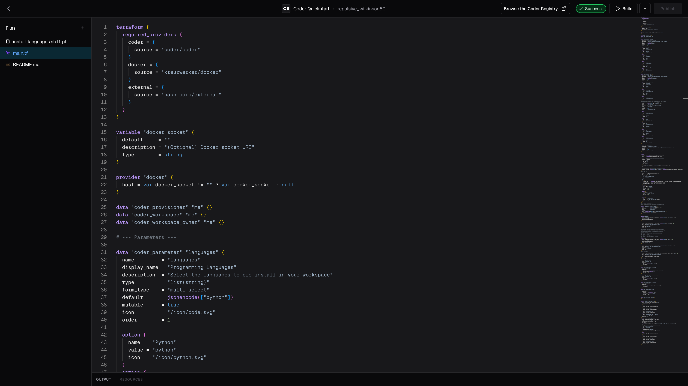

# Customize your template

In [Launch your first workspace](../index.md), you installed the `coder` CLI, started the Coder server, and built a workspace from the Quickstart template.
That template is a good starting point, but it has gaps:

- It may not include every language in which you write code.
- It comes with a base toolset, but not the personal command-line tools you install on every machine.
- It clones public repositories, but it can't reach your private repositories without manual authentication.

This part of the Quickstart closes those gaps one at a time.
Most of these guides edit the same template and introduce one Terraform building block.
One guide instead works inside a running workspace.
Each guide ties its change to something you can observe.

## What you'll do

Work through the guides in order, or pick the one that solves your problem:

- [Add a programming language](./add-a-language.md): expose a new language through a parameter and install it at startup.
- [Install your own command-line tools](./install-command-line-tools.md): install personal command-line tools and make them persist.
- [Clone private repositories](./authenticate-to-github.md): authenticate to GitHub with an external-auth data source.

Each guide takes about 10 minutes.

## Templates in brief

A template is a [Terraform](https://developer.hashicorp.com/terraform) blueprint for a workspace.
It consists of one or more Terraform files (`*.tf`), and it can include templated scripts (`*.tftpl`), a `README`, and any other supporting file.

Every Coder template declares the `coder` provider inside a `required_providers` block:

```tf
terraform {
  required_providers {
    coder = {
      source = "coder/coder"
    }
  }
}
```

A template is built from a few kinds of Terraform block:

- A [provider](https://developer.hashicorp.com/terraform/language/providers) is a plugin that connects Terraform to a platform or service.
  The `coder` provider connects Terraform to Coder.
- A [resource](https://developer.hashicorp.com/terraform/language/resources) is any infrastructure object you want to manage with Terraform, such as a workspace agent or a cloud storage bucket.
- A [data source](https://developer.hashicorp.com/terraform/language/data-sources) reads data from a provider without creating or changing infrastructure.
  Parameters and external auth are data sources.
- A [module](https://developer.hashicorp.com/terraform/language/modules) is a reusable bundle of resources, data sources, providers, and other Terraform blocks you pull in by reference.
  Modules reduce the need to define the same Terraform code multiple times.
  You can pull modules from the [Coder Registry](https://registry.coder.com).

To go deeper on any of these, visit the [Terraform documentation](https://developer.hashicorp.com/terraform).

## Open the template for editing

Most guides in this part edit the Quickstart template.
Open it for editing now, either in the Coder web editor or in your local editor with the `coder` CLI.

<div class="tabs">

### UI

1. Log in to Coder and select **Templates**.
2. Find the **Coder Quickstart** template you created and open it.
3. Select the three-dots menu next to **Create Workspace**, then select **Edit files**.

The template web editor opens:

_Coder template web editor_

### CLI

Pull the template to your local filesystem so you can edit it in your own editor.
With the server running in your existing terminal, open a second terminal and log in:

```sh
coder login
```

`coder login` opens a browser page that generates a session token.
Copy the token, return to the terminal, and paste it.
Then pull the template:

```sh
coder templates pull quickstart ~/coder-quickstart
```

Open the `~/coder-quickstart` folder in your preferred editor.

</div>

The template has 3 files:

- `install-languages.sh.tftpl`, a startup script that installs the selected languages.
- `main.tf`, the Terraform that defines the workspace.
- `README.md`.

The guides in this part edit `main.tf` and `install-languages.sh.tftpl`.

Each guide publishes a new template version after you edit these files.
The guides use the CLI command `coder templates push`, which reads from the `~/coder-quickstart` folder you pulled.
If you opened the template in the web editor instead, publish the new version from the editor each time a guide tells you to push.

## What's next?

Start with [Add a programming language](./add-a-language.md), then work through the rest of the series in order.

## Learn more

- [Extending templates](../../admin/templates/extending-templates/index.md) in the Coder documentation
- [Terraform documentation](https://developer.hashicorp.com/terraform) from HashiCorp
