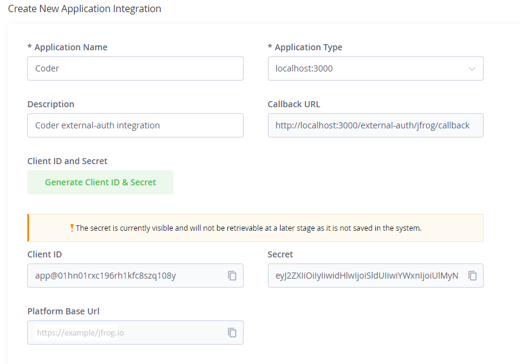

# JFrog Artifactory Integration

<div>
  <a href="https://github.com/matifali" style="text-decoration: none; color: inherit;">
    <span style="vertical-align:middle;">M Atif Ali</span>
    
  </a>
</div>
January 24, 2024

---

Use Coder and JFrog Artifactory together to secure your development environments
without disturbing your developers' existing workflows.

This guide will demonstrate how to use JFrog Artifactory as a package registry
within a workspace.

## Requirements

- A JFrog Artifactory instance
- 1:1 mapping of users in Coder to users in Artifactory by email address or
  username
- Repositories configured in Artifactory for each package manager you want to
  use

## Provisioner Authentication

The most straight-forward way to authenticate your template with Artifactory is
by using our official Coder [modules](https://registry.coder.com). We publish
two type of modules that automate the JFrog Artifactory and Coder integration.

1. [JFrog-OAuth](https://registry.coder.com/modules/jfrog-oauth)
2. [JFrog-Token](https://registry.coder.com/modules/jfrog-token)

### JFrog-OAuth

This module is usable by JFrog self-hosted (on-premises) Artifactory as it
requires configuring a custom integration. This integration benefits from
Coder's [external-auth](https://coder.com/docs/v2/latest/admin/external-auth)
feature and allows each user to authenticate with Artifactory using an OAuth
flow and issues user-scoped tokens to each user.

To set this up, follow these steps:

1. Modify your Helm chart `values.yaml` for JFrog Artifactory to add,

```yaml
artifactory:
  enabled: true
  frontend:
  extraEnvironmentVariables:
    - name: JF_FRONTEND_FEATURETOGGLER_ACCESSINTEGRATION
      value: "true"
  access:
  accessConfig:
    integrations-enabled: true
    integration-templates:
      - id: "1"
        name: "CODER"
        redirect-uri: "https://CODER_URL/external-auth/jfrog/callback"
        scope: "applied-permissions/user"
```

> Note Replace `CODER_URL` with your Coder deployment URL, e.g.,
> <coder.example.com>

2. Create a new Application Integration by going to
   <https://JFROG_URL/ui/admin/configuration/integrations/new> and select the
   Application Type as the integration you created in step 1.



3. Add a new
   [external authentication](https://coder.com/docs/v2/latest/admin/external-auth)
   to Coder by setting these env variables,

```env
# JFrog Artifactory External Auth
CODER_EXTERNAL_AUTH_1_ID="jfrog"
CODER_EXTERNAL_AUTH_1_TYPE="jfrog"
CODER_EXTERNAL_AUTH_1_CLIENT_ID="YYYYYYYYYYYYYYY"
CODER_EXTERNAL_AUTH_1_CLIENT_SECRET="XXXXXXXXXXXXXXXXXXX"
CODER_EXTERNAL_AUTH_1_DISPLAY_NAME="JFrog Artifactory"
CODER_EXTERNAL_AUTH_1_DISPLAY_ICON="/icon/jfrog.svg"
CODER_EXTERNAL_AUTH_1_AUTH_URL="https://JFROG_URL/ui/authorization"
CODER_EXTERNAL_AUTH_1_SCOPES="applied-permissions/user"
```

> Note Replace `JFROG_URL` with your JFrog Artifactory base URL, e.g.,
> <example.jfrog.io>

4. Create or edit a Coder template and use the
   [JFrog-OAuth](https://registry.coder.com/modules/jfrog-oauth) module to
   configure the integration.

```hcl
module "jfrog" {
  source = "registry.coder.com/modules/jfrog-oauth/coder"
  version = "1.0.0"
  agent_id = coder_agent.example.id
  jfrog_url = "https://jfrog.example.com"
  configure_code_server = true # this depends on the code-server
  username_field = "username" # If you are using GitHub to login to both Coder and Artifactory, use username_field = "username"
  package_managers = {
    "npm": "npm",
    "go": "go",
    "pypi": "pypi"
  }
}
```

### JFrog-Token

This module makes use of the
[Artifactory terraform provider](https://registry.terraform.io/providers/jfrog/artifactory/latest/docs)
and an admin-scoped token to create user-scoped tokens for each user by matching
their Coder email or username with Artifactory. This can be used for both SaaS
and self-hosted(on-premises) Artifactory instances.

To set this up, follow these steps:

1. Get a JFrog access token from your Artifactory instance. The token must be an
   [admin token](https://registry.terraform.io/providers/jfrog/artifactory/latest/docs#access-token)
   with scope `applied-permissions/admin`.
2. Create or edit a Coder template and use the
   [JFrog-Token](https://registry.coder.com/modules/jfrog-token) module to
   configure the integration and pass the admin token. It is recommended to
   store the token in a sensitive terraform variable to prevent it from being
   displayed in plain text in the terraform state.

```hcl
variable "artifactory_access_token" {
  type      = string
  sensitive = true
}

module "jfrog" {
  source = "registry.coder.com/modules/jfrog-token/coder"
  version = "1.0.0"
  agent_id = coder_agent.example.id
  jfrog_url = "https://example.jfrog.io"
  configure_code_server = true # this depends on the code-server
  artifactory_access_token = var.artifactory_access_token
  package_managers = {
    "npm": "npm",
    "go": "go",
    "pypi": "pypi"
  }
}
```

<blockquote class="info">
The admin-level access token is used to provision user tokens and is never exposed to
developers or stored in workspaces.
</blockquote>

If you do not want to use the official modules, you can check example template
that uses Docker as the underlying compute
[here](https://github.com/coder/coder/tree/main/examples/jfrog/docker). The same
concepts apply to all compute types.

## Offline Deployments

See the [offline deployments](../templates/modules.md#offline-installations)
section for instructions on how to use coder-modules in an offline environment
with Artifactory.

## More reading

- See the full example template
  [here](https://github.com/coder/coder/tree/main/examples/jfrog/docker).
- To serve extensions from your own VS Code Marketplace, check out
  [code-marketplace](https://github.com/coder/code-marketplace#artifactory-storage).
- To store templates in Artifactory, check out our
  [Artifactory modules](../templates/modules.md#artifactory) docs.
