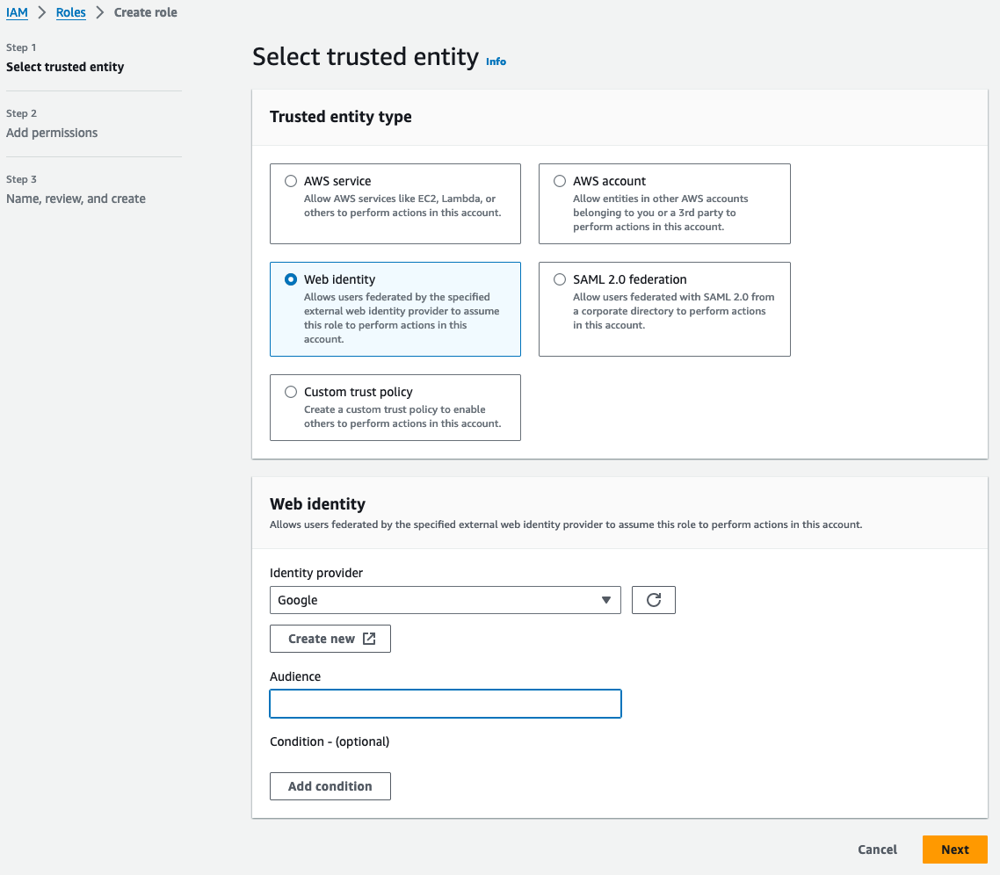

# Federating a Google Cloud service account to AWS

<div>
  <a href="https://github.com/ericpaulsen" style="text-decoration: none; color: inherit;">
    <span style="vertical-align:middle;">Eric Paulsen</span>
    
  </a>
</div>
January 4, 2024

---

This guide will walkthrough how to use a Google Cloud service account to
authenticate the Coder control plane to AWS and create an EC2 workspace. The
below steps assume your Coder control plane is running in Google Cloud and has
the relevant service account assigned.

> For steps on assigning a service account to a resource like Coder,
> [see the Google documentation here](https://cloud.google.com/iam/docs/attach-service-accounts#attaching-new-resource)

## 1. Get your Google service account OAuth Client ID

Navigate to the Google Cloud console, and select **IAM & Admin** > **Service
Accounts**. View the service account you want to use, and copy the **OAuth 2
Client ID** value shown on the right-hand side of the row.

> (Optional): If you do not yet have a service account,
> [here is the Google IAM documentation on creating a service account](https://cloud.google.com/iam/docs/service-accounts-create).

## 2. Create AWS role

Create an AWS role that is configured for Web Identity Federation, with Google
as the identity provider, as shown below:



Once created, edit the **Trust Relationship** section to look like the
following:

```json
{
  "Version": "2012-10-17",
  "Statement": [
    {
      "Effect": "Allow",
      "Principal": {
        "Federated": "accounts.google.com"
      },
      "Action": "sts:AssumeRoleWithWebIdentity",
      "Condition": {
        "StringEquals": {
          "accounts.google.com:aud": "<enter-OAuth-client-ID-here"
        }
      }
    }
  ]
}
```

## 3. Assign permissions to the AWS role

In this example, Coder will need permissions to create the EC2 instance. Add the
following policy to the role:

```json
{
  "Version": "2012-10-17",
  "Statement": [
    {
      "Sid": "VisualEditor0",
      "Effect": "Allow",
      "Action": [
        "ec2:GetDefaultCreditSpecification",
        "ec2:DescribeIamInstanceProfileAssociations",
        "ec2:DescribeTags",
        "ec2:DescribeInstances",
        "ec2:DescribeInstanceTypes",
        "ec2:CreateTags",
        "ec2:RunInstances",
        "ec2:DescribeInstanceCreditSpecifications",
        "ec2:DescribeImages",
        "ec2:ModifyDefaultCreditSpecification",
        "ec2:DescribeVolumes"
      ],
      "Resource": "*"
    },
    {
      "Sid": "CoderResources",
      "Effect": "Allow",
      "Action": [
        "ec2:DescribeInstanceAttribute",
        "ec2:UnmonitorInstances",
        "ec2:TerminateInstances",
        "ec2:StartInstances",
        "ec2:StopInstances",
        "ec2:DeleteTags",
        "ec2:MonitorInstances",
        "ec2:CreateTags",
        "ec2:RunInstances",
        "ec2:ModifyInstanceAttribute",
        "ec2:ModifyInstanceCreditSpecification"
      ],
      "Resource": "arn:aws:ec2:*:*:instance/*",
      "Condition": {
        "StringEquals": {
          "aws:ResourceTag/Coder_Provisioned": "true"
        }
      }
    }
  ]
}
```

## 4. Generate the identity token for the service account

Run the following `gcloud` command to generate the service account identity
token. This is a JWT token with a payload that includes the service account
email, audience, issuer, and expiration.

```console
gcloud auth print-identity-token --audiences=https://aws.amazon.com --impersonate-service-account 12345-compute@de
veloper.gserviceaccount.com  --include-email
```

> Note: Your `gcloud` client may needed elevated permissions to run this
> command.

## 5. Set identity token in Coder control plane

You will need to set the token created in the previous step on a location in the
Coder control plane. Follow the below steps for your specific deployment type:

### VM control plane

- Write the token to a file on the host, preferably inside the `/home/coder`
  directory:

```console
/home/coder/.aws/gcp-identity-token
```

### Kubernetes control plane

- Create the Kubernetes secret to house the token value:

```console
kubectl create secret generic gcp-identity-token -n coder --from-literal=token=<enter-token-here>
```

Make sure the secret is created inside the same namespace where Coder is
running.

- Mount the token file into the Coder pod using the values below:

```yaml
coder:
  volumes:
    - name: "gcp-identity-mount"
      secret:
        secretName: "gcp-identity-token"
  volumeMounts:
    - name: "gcp-identity-mount"
      mountPath: "/home/coder/.aws/gcp-identity-token"
      readOnly: true
```

## 6. Configure the AWS Terraform provider

Navigate to your EC2 workspace template in Coder, and configure the AWS provider
using the block below:

```hcl
provider "aws" {
  assume_role_with_web_identity {
    # enter role ARN here - copy from AWS console
    role_arn = "arn:aws:iam::123456789:role/gcp-to-aws"
    # arbitrary value for logging
    session_name = "coder-session"
    # define location of token file on control plane here
    web_identity_token_file = "/home/coder/.aws/gcp-identity-token"
  }
}
```

This provider block is equivalent to running this `aws` CLI command:

```console
aws sts assume-role-with-web-identity \
  --role-arn arn:aws:iam::123456789:role/gcp-to-aws \
  --role-session-name coder-session \
  --web-identity-token xxx
```

You can run this command with the identity token string to validate or
troubleshoot the call to AWS.
