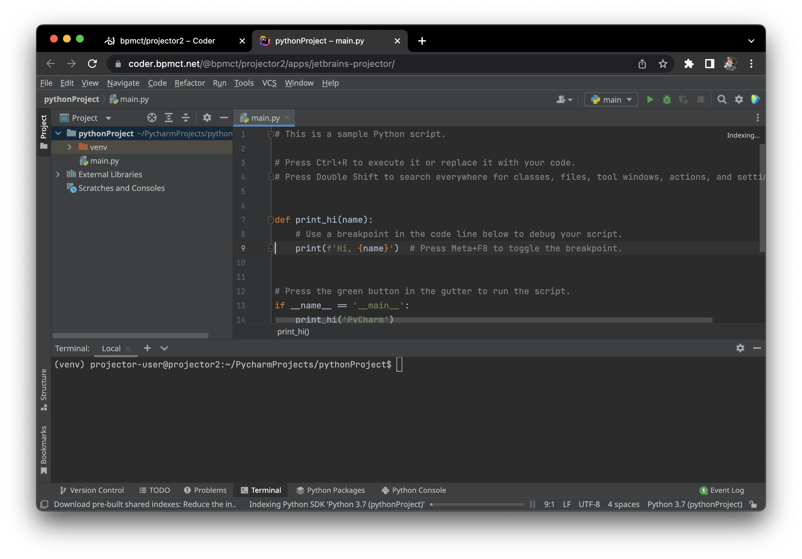
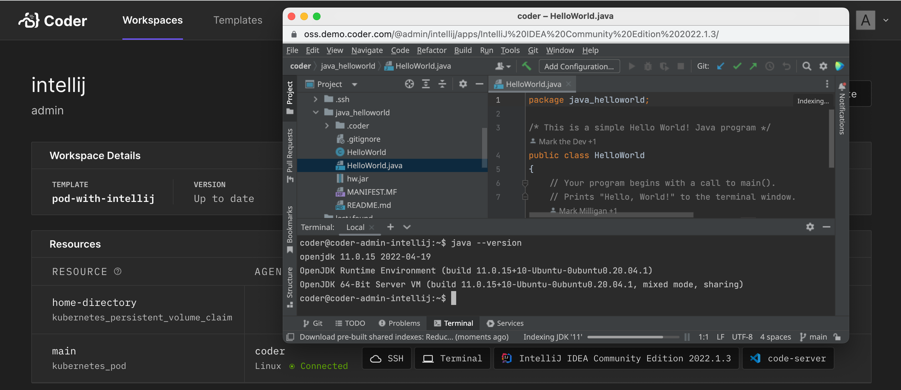
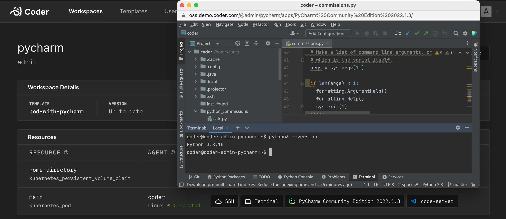
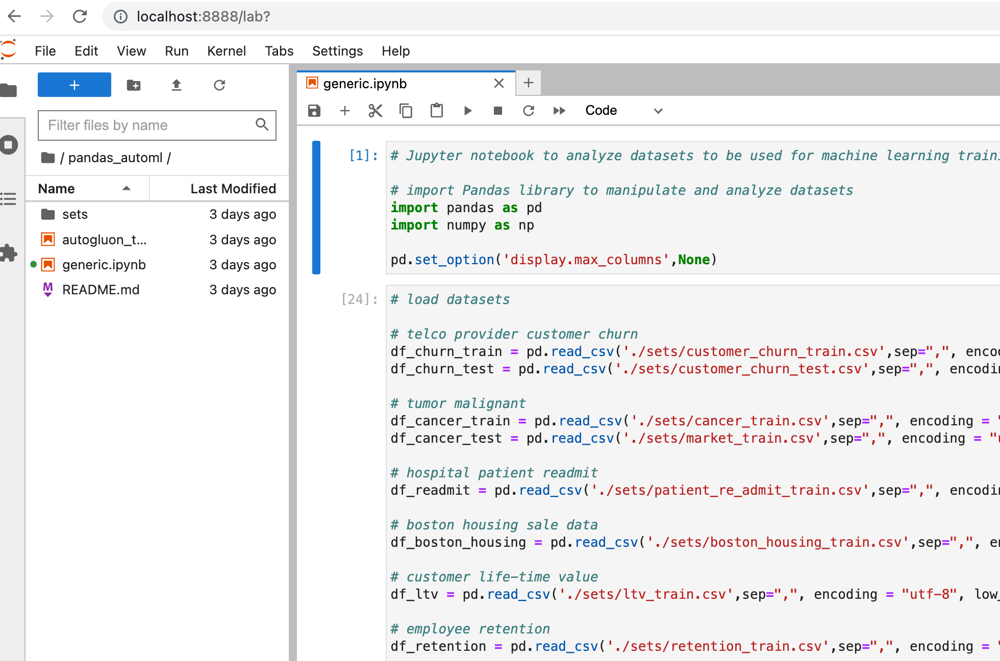

# Configuring web IDEs

By default, Coder workspaces allow connections via:

- Web terminal
- SSH (plus any [SSH-compatible IDE](../ides.md))

It's common to also let developers to connect via web IDEs.


In Coder, web IDEs are defined as
[coder_app](https://registry.terraform.io/providers/coder/coder/latest/docs/resources/app)
resources in the template. With our generic model, any web application can
be used as a Coder application. For example:

```hcl
# Give template users the portainer.io web UI
resource "coder_app" "portainer" {
  agent_id      = coder_agent.main.id
  name          = "portainer"
  icon          = "https://simpleicons.org/icons/portainer.svg"
  url           = "http://localhost:8000"
  relative_path = true
}
```

## code-server


[code-server](https://github.com/coder/coder) is our supported method of running VS Code in the web browser. A simple way to install code-server in Linux/MacOS workspaces is via the Coder agent in your template:

```sh
# edit your template
cd your-template/
vim main.tf
```

```hcl
resource "coder_agent" "main" {
    arch          = "amd64"
    os            = "linux"
    startup_script = <<EOF
    #!/bin/sh
    # install and start code-server
    curl -fsSL https://code-server.dev/install.sh | sh
    code-server --auth none --port 13337
    EOF
}
```

For advanced use, we recommend installing code-server in your VM snapshot or container image. Here's a Dockerfile which leverages some special [code-server features](https://coder.com/docs/code-server/):

```Dockerfile
FROM codercom/enterprise-base:ubuntu

# install a specific code-server version
RUN curl -fsSL https://code-server.dev/install.sh | sh -s -- --version=4.3.0

# pre-install versions
RUN code-server --install-extension eamodio.gitlens

# directly start code-server with the agent's startup_script (see above),
# or use a proccess manager like supervisord
```

You'll also need to specify a `coder_app` resource related to the agent. This is how code-server is displayed on the workspace page.

```hcl
resource "coder_app" "code-server" {
  agent_id = coder_agent.main.id
  name     = "code-server"
  url      = "http://localhost:13337/?folder=/home/coder"
  icon     = "/icon/code.svg"
}
```

<blockquote class="warning">
If the code-server integrated terminal fails to load, (i.e., xterm fails to load), go to DevTools to ensure xterm is loaded, clear your browser cache and refresh.
</blockquote>

## VNC Desktop


You may want a full desktop environment to develop with/preview specialized software.

Workspace requirements:

- VNC server (e.g. [tigervnc](https://tigervnc.org/))
- VNC client (e.g. [novnc](https://novnc.com/info.html))

Installation instructions will vary depending on your workspace's operating system, platform, and build system.

> Coder-provided VNC clients are on the roadmap ([#2106](https://github.com/coder/coder/issues/2106)).

As a starting point, see the [desktop-container](https://github.com/bpmct/coder-templates/tree/main/desktop-container) community template. It builds & provisions a Dockerized workspace with the following software:

- Ubuntu 20.04
- TigerVNC server
- noVNC client
- XFCE Desktop

## JetBrains Projector

[JetBrains Projector](https://jetbrains.github.io/projector-client/mkdocs/latest/) is a JetBrains Incubator project which renders JetBrains IDEs in the web browser.



> It is common to see latency and performance issues with Projector. We recommend using [Jetbrains Gateway](https://youtrack.jetbrains.com/issues/GTW) whenever possible (also no Template edits required!)

Workspace requirements:

- JetBrains projector CLI
- At least 4 CPU cores and 4 GB RAM

- CLion
- pyCharm
- DataGrip
- IntelliJ IDEA Community
- IntelliJ IDEA Ultimate
- PhpStorm
- pyCharm Community
- PyCharm Professional
- Rider
- Rubymine
- WebStorm
- ➕ code-server (just in case!)

For advanced users who want to make a custom image, you can install the Projector CLI in the `startup_script` of the `coder_agent` resource in a Coder template. Using the Projector CLI, you can use `projector ide autoinstall` and `projector run` to download and start a JetBrains IDE in your workspace.



In this example, the version of JetBrains IntelliJ IDE is passed in from a Terraform input variable. You create a JetBrains icon in the workspace using a `coder_app` resource.

> There is a known issue passing query string parameters when opening a JetBrains IDE from an icon in your workspace ([#2669](https://github.com/coder/coder/issues/2669)). Note the `grep` statement to remove an optional password token from the configuration so a query string parameter is not passed.

```hcl

variable "jetbrains-ide" {
  description = "JetBrains IntelliJ IDE"
  default     = "IntelliJ IDEA Community Edition 2022.1.3"
  validation {
    condition = contains([
      "IntelliJ IDEA Community Edition 2022.1.3",
      "IntelliJ IDEA Community Edition 2021.3",
      "IntelliJ IDEA Ultimate 2022.1.3",
      "IntelliJ IDEA Ultimate 2021.3"
    ], var.jetbrains-ide)
    # Find all compatible IDEs with the `projector IDE find` command
    error_message = "Invalid JetBrains IDE!"
}
}

resource "coder_agent" "coder" {
  dir = "/home/coder"
  startup_script = <<EOT
#!/bin/bash

# install projector
PROJECTOR_BINARY=/home/coder/.local/bin/projector
if [ -f $PROJECTOR_BINARY ]; then
    echo 'projector has already been installed - check for update'
    /home/coder/.local/bin/projector self-update 2>&1 | tee projector.log
else
    echo 'installing projector'
    pip3 install projector-installer --user 2>&1 | tee projector.log
fi

echo 'access projector license terms'
/home/coder/.local/bin/projector --accept-license 2>&1 | tee -a projector.log

PROJECTOR_CONFIG_PATH=/home/coder/.projector/configs/intellij

if [ -d "$PROJECTOR_CONFIG_PATH" ]; then
    echo 'projector has already been configured and the JetBrains IDE downloaded - skip step' 2>&1 | tee -a projector.log
else
    echo 'autoinstalling IDE and creating projector config folder'
    /home/coder/.local/bin/projector ide autoinstall --config-name "intellij" --ide-name "${var.jetbrains-ide}" --hostname=localhost --port 8997 --use-separate-config --password coder 2>&1 | tee -a projector.log

    # delete the configuration's run.sh input parameters that check password tokens since tokens do not work with coder_app yet passed in the querystring
    grep -iv "HANDSHAKE_TOKEN" $PROJECTOR_CONFIG_PATH/run.sh > temp && mv temp $PROJECTOR_CONFIG_PATH/run.sh 2>&1 | tee -a projector.log
    chmod +x $PROJECTOR_CONFIG_PATH/run.sh 2>&1 | tee -a projector.log

    echo "creation of intellij configuration complete" 2>&1 | tee -a projector.log
fi
# start JetBrains projector-based IDE
/home/coder/.local/bin/projector run intellij &

EOT
}

resource "coder_app" "intellij" {
  agent_id      = coder_agent.coder.id
  name          = "${var.jetbrains-ide}"
  icon          = "/icon/intellij.svg"
  url           = "http://localhost:8997/"
  relative_path = true
}
```

**Pre-built templates:**

You can also reference/use to these pre-built templates with JetBrains projector:

- IntelliJ ([Docker](https://github.com/mark-theshark/v2-templates/tree/main/docker-with-intellij), [Kubernetes](https://github.com/mark-theshark/v2-templates/tree/main/pod-with-intellij))

- PyCharm ([Docker](https://github.com/mark-theshark/v2-templates/tree/main/docker-with-pycharm), [Kubernetes](https://github.com/mark-theshark/v2-templates/tree/main/pod-with-pycharm)

- GoLand ([Docker](https://github.com/mark-theshark/v2-templates/tree/main/docker-with-goland), [Kubernetes](https://github.com/mark-theshark/v2-templates/tree/main/pod-with-goland))

> You need to have a valid `~/.kube/config` on your Coder host and a namespace on a Kubernetes cluster to use the Kubernetes pod template examples.



> You need to have a valid `~/.kube/config` on your Coder host and a namespace on a Kubernetes cluster to use the Kubernetes pod template examples.

> Coder OSS currently does not perform a health check([#2662](https://github.com/coder/coder/issues/2662)) that any IDE or commands in the `startup_script` have completed, so wait a minute or so before opening the JetBrains or code-server icons. As a precaution, you can open Terminal and run `htop` to see if the processes have completed.

## JupyterLab

Configure your agent and `coder_app` like so to use Jupyter:

```hcl
data "coder_workspace" "me" {}

## The name of the app must always be equal to the "/apps/<name>"
## string in the base_url. This caveat is unique to Jupyter.

resource "coder_agent" "coder" {
  os   = "linux"
  arch = "amd64"
  dir  = "/home/coder"
  startup_script = <<-EOF
pip3 install jupyterlab
jupyter lab --ServerApp.base_url=/@${data.coder_workspace.me.owner}/${data.coder_workspace.me.name}/apps/jupyter/ --ServerApp.token='' --ip='*'
EOF
}

resource "coder_app" "jupyter" {
  agent_id = coder_agent.coder.id
  url = "http://localhost:8888/@${data.coder_workspace.me.owner}/${data.coder_workspace.me.name}/apps/jupyter"
  icon = "/icon/jupyter.svg"
}
```



## SSH Fallback

Certain Web IDEs don't support URL base path adjustment and thus can't be exposed with
`coder_app`. In these cases you can use [SSH](../ides.md#ssh).

### RStudio

```hcl
resource "coder_agent" "coder" {
  os   = "linux"
  arch = "amd64"
  dir = "/home/coder"
  startup_script = <<EOT
#!/bin/bash
# start rstudio
/usr/lib/rstudio-server/bin/rserver --server-daemonize=1 --auth-none=1 &
EOT
}
```

From your local machine, start port forwarding and then open the IDE on
http://localhost:8787.

```console
ssh -L 8787:localhost:8787 coder.<RStudio workspace name>
```

Check out this [RStudio Dockerfile](https://github.com/mark-theshark/dockerfiles/blob/main/rstudio/no-args/Dockerfile) for a starting point to creating a template.


### Airflow

```hcl
resource "coder_agent" "coder" {
  os   = "linux"
  arch = "amd64"
  dir = "/home/coder"
  startup_script = <<EOT
#!/bin/bash
# install and start airflow
pip3 install apache-airflow 2>&1 | tee airflow-install.log
/home/coder/.local/bin/airflow standalone  2>&1 | tee airflow-run.log &
EOT
}
```

From your local machine, start port forwarding and then open the IDE on
http://localhost:8080.

```console
ssh -L 8080:localhost:8080 coder.<Airflow workspace name>
```


