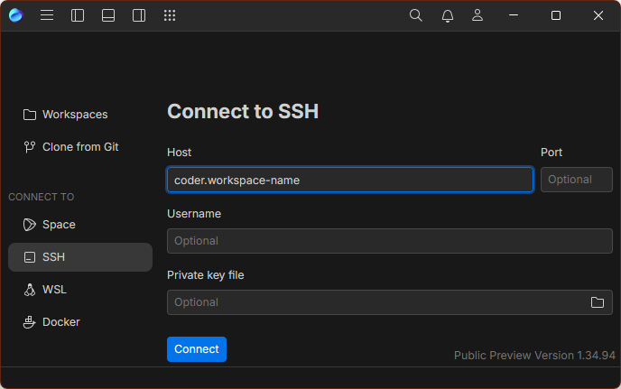

# JetBrains Fleet

JetBrainsFleet comes with essential features out of the box, allowing you to be productive immediately. Just one click transforms Fleet from a lightweight editor into a powerful IDE.

[See JetBrains' website to learn about Fleet](https://www.jetbrains.com/fleet/)

Fleet can connect to a Coder workspace by following these steps.

1. [Install Fleet](https://www.jetbrains.com/fleet/download)
2. Install Coder CLI
   ```shell
   curl -L https://coder.com/install.sh | sh
   ``` 
3. Login and configure Coder SSH.
   ```shell
   coder login coder.example.com
   coder config-ssh
   ```
4. Connect via SSH with the target set to `coder.workspace-name`
   

> If you experience problems, please
> [create a GitHub issue](https://github.com/coder/coder/issues) or share in
> [our Discord channel](https://discord.gg/coder).
