# JetBrains Gateway

JetBrains Gateway is a compact desktop app that allows you to work remotely with
a JetBrains IDE without even downloading one.
[See JetBrains' website to learn about and Gateway.](https://www.jetbrains.com/remote-development/gateway/)

Gateway can connect to a Coder workspace by using Coder's Gateway plugin or
manually setting up an SSH connection.

## Using Coder's JetBrains Gateway Plugin

> If you experience problems, please
> [create a GitHub issue](https://github.com/coder/coder/issues) or share in
> [our Discord channel](https://discord.gg/coder).

1. [Install Gateway](https://www.jetbrains.com/help/idea/jetbrains-gateway.html)
1. Open Gateway and click the Coder icon to install the Coder plugin.
1. Click the "Coder" icon under Install More Providers at the bottom of the
   Gateway home screen
1. Click "Connect to Coder" at the top of the Gateway home screen to launch the
   plugin

   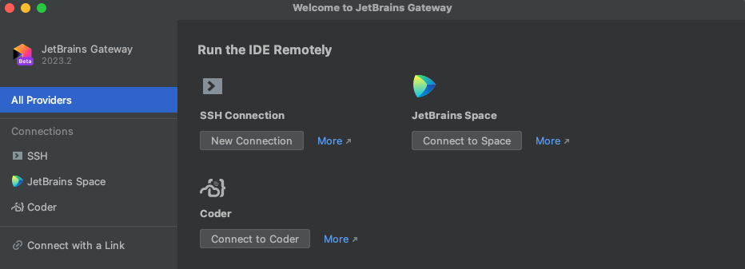

1. Enter your Coder deployment's Access Url and click "Connect" then paste the
   Session Token and click "OK"

   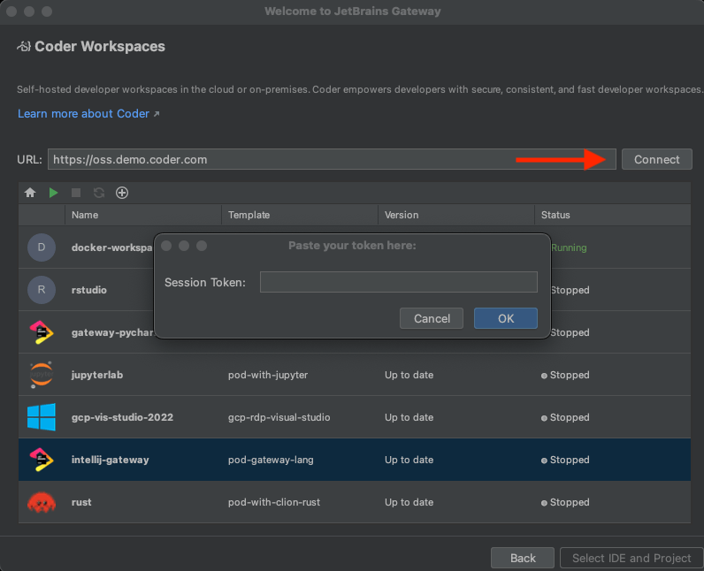

1. Click the "+" icon to open a browser and go to the templates page in your
   Coder deployment to create a workspace

1. If a workspace already exists but is stopped, click the green arrow to start
   the workspace

1. Once the workspace status says Running, click "Select IDE and Project"

   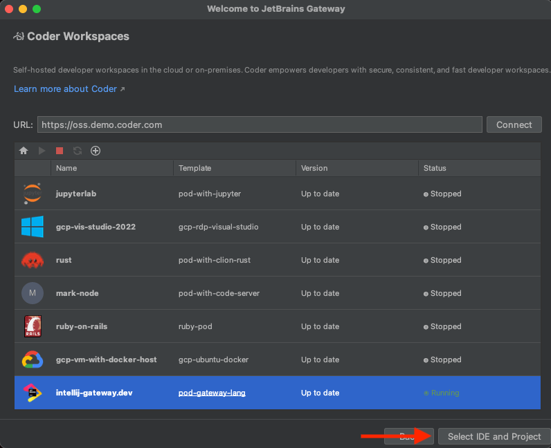

1. Select the JetBrains IDE for your project and the project directory then
   click "Start IDE and connect"
   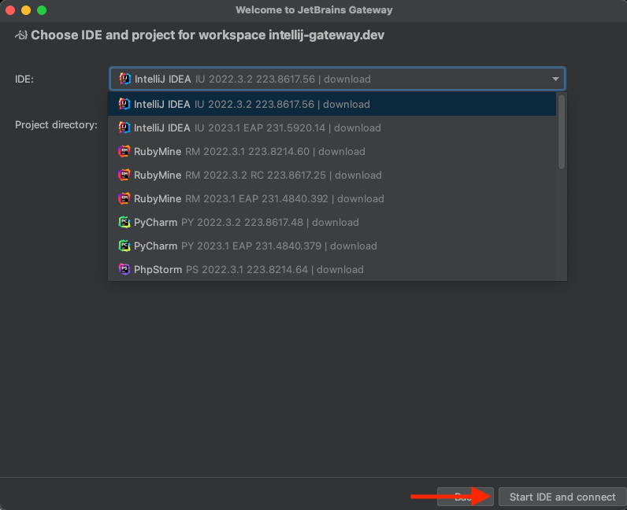

   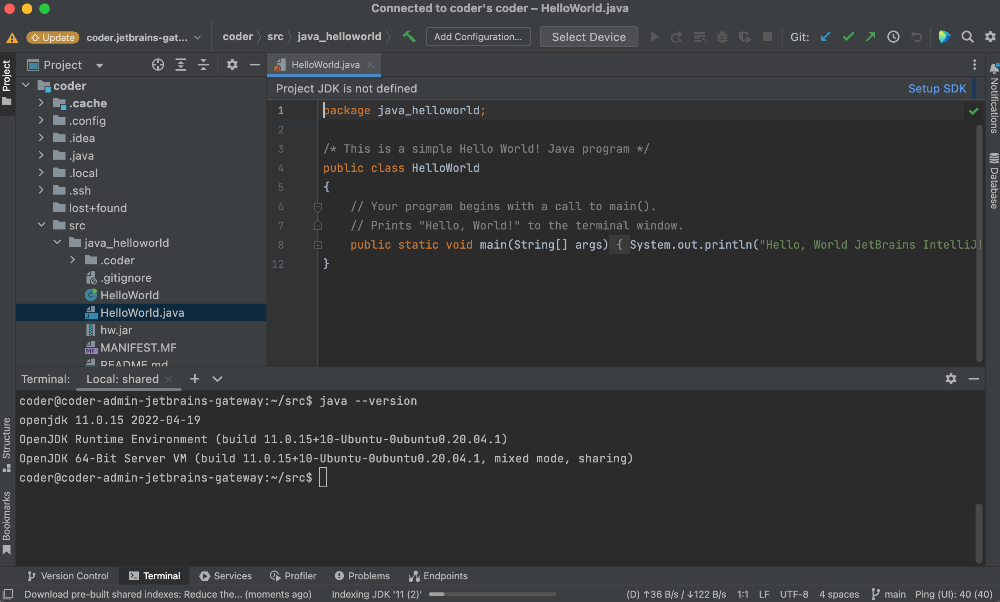

> Note the JetBrains IDE is remotely installed into
> `~/.cache/JetBrains/RemoteDev/dist`

### Update a Coder plugin version

1. Click the gear icon at the bottom left of the Gateway home screen and then
   "Settings"

1. In the Marketplace tab within Plugins, type Coder and if a newer plugin
   release is available, click "Update" and "OK"

   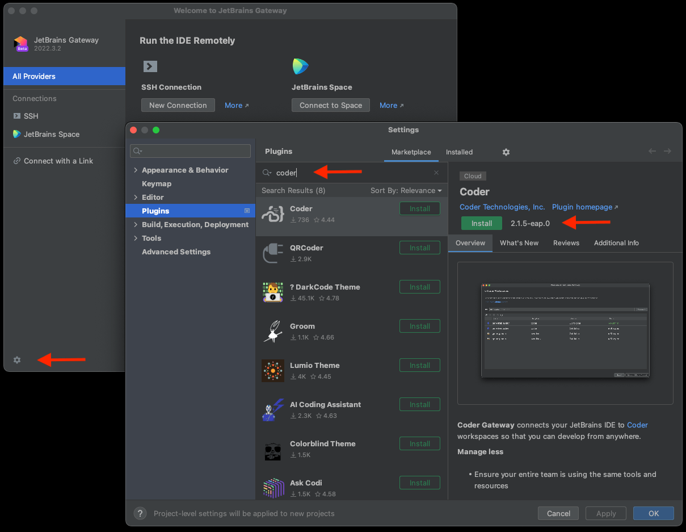

### Configuring the Gateway plugin to use internal certificates

When attempting to connect to a Coder deployment that uses internally signed
certificates, you may receive the following error in Gateway:

```console
Failed to configure connection to https://coder.internal.enterprise/: PKIX path building failed: sun.security.provider.certpath.SunCertPathBuilderException: unable to find valid certification path to requested target
```

To resolve this issue, you will need to add Coder's certificate to the Java
trust store present on your local machine. Here is the default location of the
trust store for each OS:

```console
# Linux
<Gateway installation directory>/jbr/lib/security/cacerts

# macOS
<Gateway installation directory>/jbr/lib/security/cacerts
/Library/Application Support/JetBrains/Toolbox/apps/JetBrainsGateway/ch-0/<app-id>/JetBrains Gateway.app/Contents/jbr/Contents/Home/lib/security/cacerts # Path for Toolbox installation

# Windows
C:\Program Files (x86)\<Gateway installation directory>\jre\lib\security\cacerts
%USERPROFILE%\AppData\Local\JetBrains\Toolbox\bin\jre\lib\security\cacerts # Path for Toolbox installation
```

To add the certificate to the keystore, you can use the `keytool` utility that
ships with Java:

```console
keytool -import -alias coder -file <certificate> -keystore /path/to/trust/store
```

You can use `keytool` that ships with the JetBrains Gateway installation.
Windows example:

```powershell
& 'C:\Program Files\JetBrains\JetBrains Gateway <version>/jbr/bin/keytool.exe' 'C:\Program Files\JetBrains\JetBrains Gateway <version>/jre/lib/security/cacerts' -import -alias coder -file <cert>

# command for Toolbox installation
& '%USERPROFILE%\AppData\Local\JetBrains\Toolbox\apps\Gateway\ch-0\<VERSION>\jbr\bin\keytool.exe' '%USERPROFILE%\AppData\Local\JetBrains\Toolbox\bin\jre\lib\security\cacerts' -import -alias coder -file <cert>
```

macOS example:

```shell
keytool -import -alias coder -file cacert.pem -keystore /Applications/JetBrains\ Gateway.app/Contents/jbr/Contents/Home/lib/security/cacerts
```

## Manually Configuring A JetBrains Gateway Connection

> This is in lieu of using Coder's Gateway plugin which automatically performs
> these steps.

1. [Install Gateway](https://www.jetbrains.com/help/idea/jetbrains-gateway.html)

1. [Configure the `coder` CLI](../ides.md#ssh-configuration)

1. Open Gateway, make sure "SSH" is selected under "Remote Development"

1. Click "New Connection"

   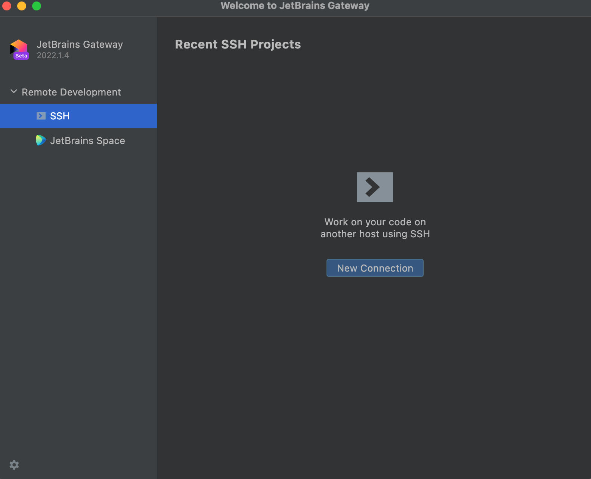

1. In the resulting dialog, click the gear icon to the right of "Connection:"

   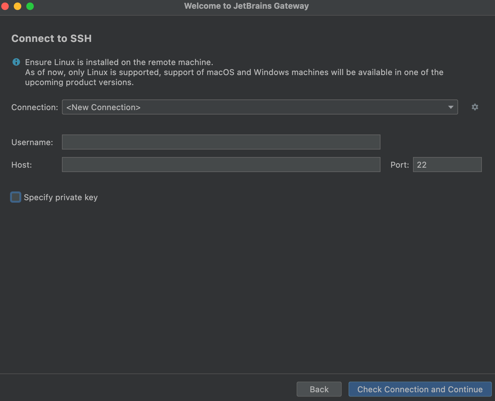

1. Hit the "+" button to add a new SSH connection

   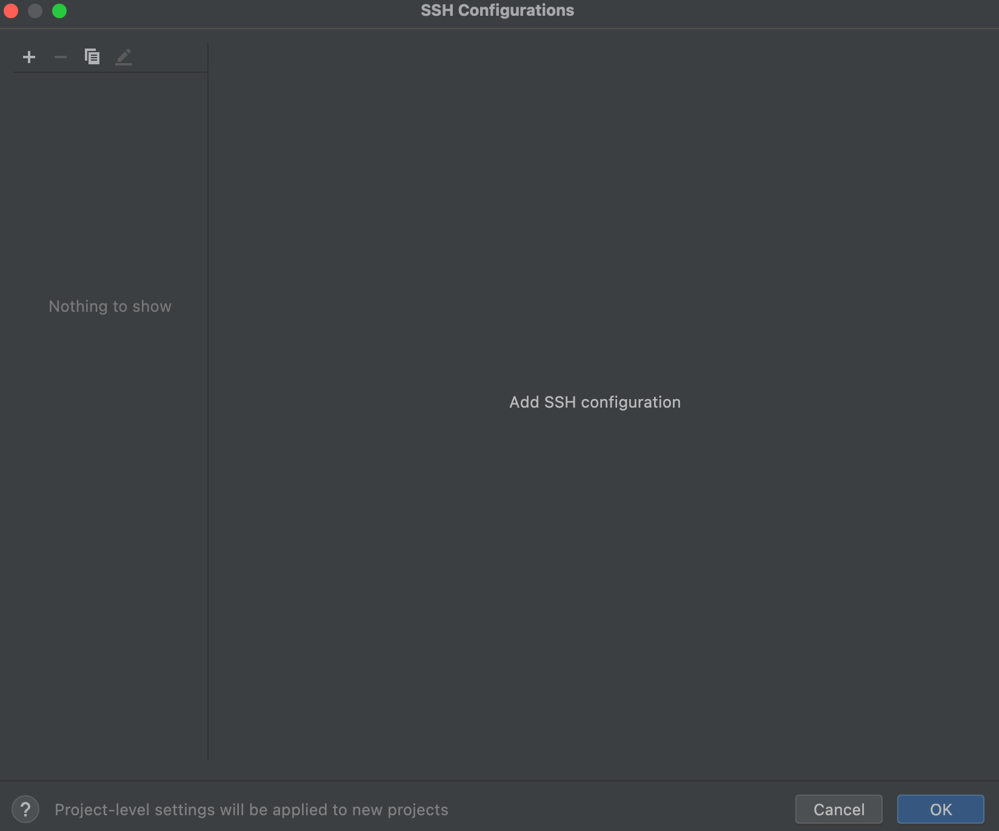

1. For the Host, enter `coder.<workspace name>`

1. For the Port, enter `22` (this is ignored by Coder)

1. For the Username, enter your workspace username

1. For the Authentication Type, select "OpenSSH config and authentication agent"

1. Make sure the checkbox for "Parse config file ~/.ssh/config" is checked.

1. Click "Test Connection" to validate these settings.

1. Click "OK"

   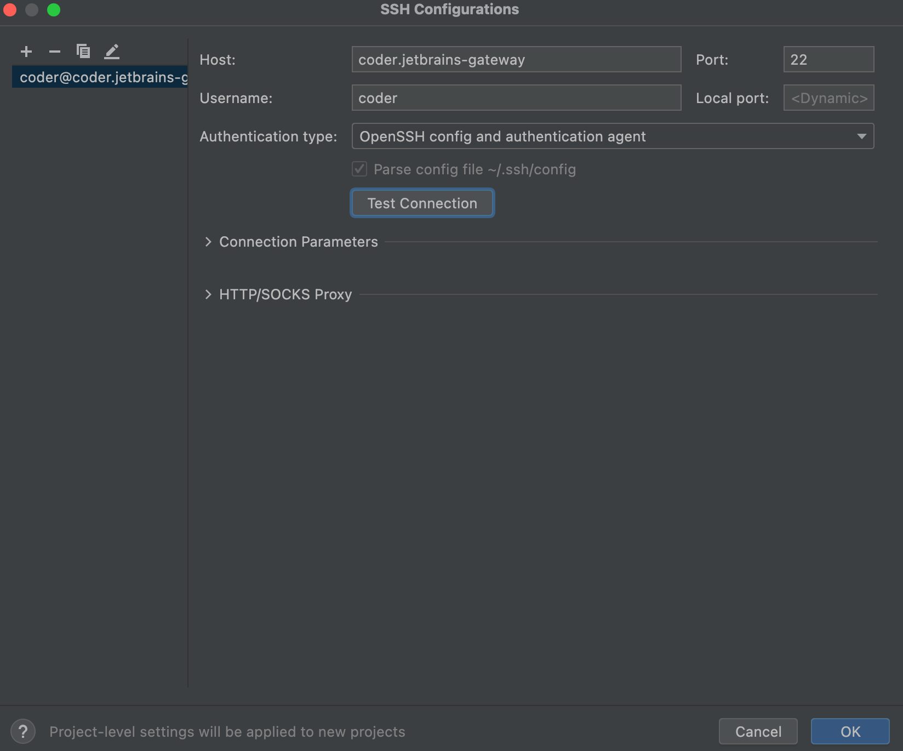

1. Select the connection you just added

   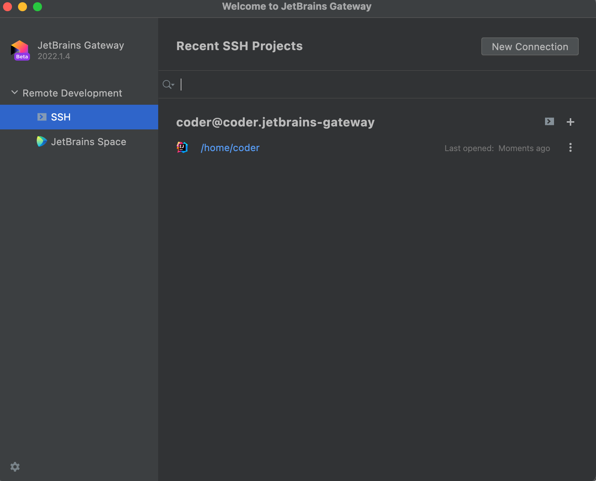

1. Click "Check Connection and Continue"

   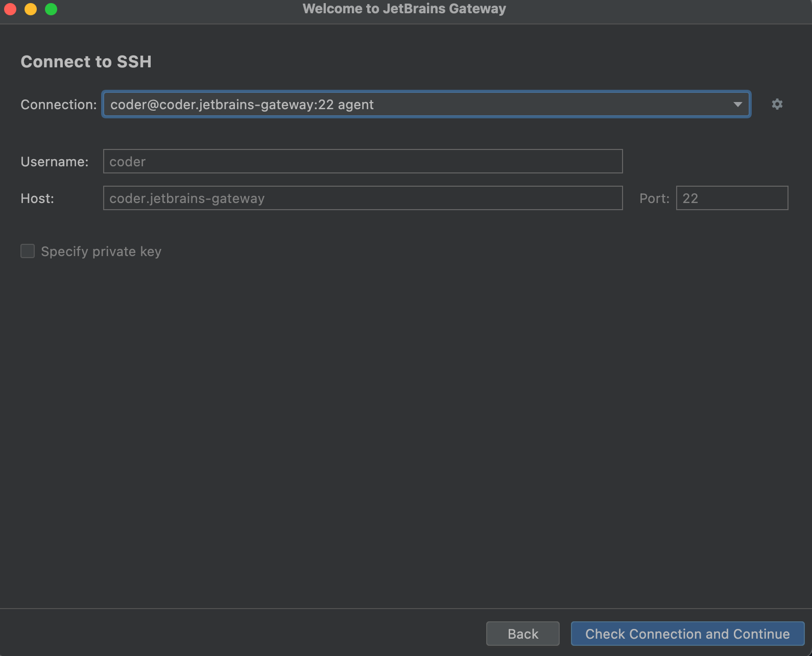

1. Select the JetBrains IDE for your project and the project directory. SSH into
   your server to create a directory or check out code if you haven't already.

   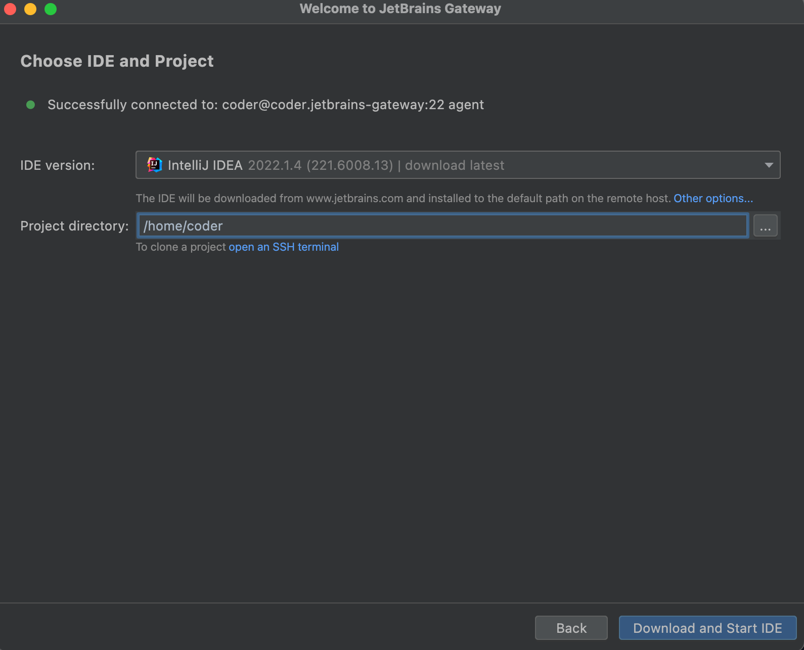

   > Note the JetBrains IDE is remotely installed into
   > `~/. cache/JetBrains/RemoteDev/dist`

1. Click "Download and Start IDE" to connect.

   

## Using an existing JetBrains installation in the workspace

If you would like to use an existing JetBrains IDE in a Coder workspace (or you
are air-gapped, and cannot reach jetbrains.com), run the following script in the
JetBrains IDE directory to point the default Gateway directory to the IDE
directory. This step must be done before configuring Gateway.

```shell
cd /opt/idea/bin
./remote-dev-server.sh registerBackendLocationForGateway
```

> Gateway only works with paid versions of JetBrains IDEs so the script will not
> be located in the `bin` directory of JetBrains Community editions.

[Here is the JetBrains article](https://www.jetbrains.com/help/idea/remote-development-troubleshooting.html#setup:~:text=Can%20I%20point%20Remote%20Development%20to%20an%20existing%20IDE%20on%20my%20remote%20server%3F%20Is%20it%20possible%20to%20install%20IDE%20manually%3F)
explaining this IDE specification.

## JetBrains Gateway in an offline environment

In networks that restrict access to the internet, you will need to leverage the
JetBrains Client Installer to download and save the IDE clients locally. Please
see the
[JetBrains documentation for more information](https://www.jetbrains.com/help/idea/fully-offline-mode.html).

### Configuration Steps

The Coder team built a POC of the JetBrains Gateway Offline Mode solution. Here
are the steps we took (and "gotchas"):

### 1. Deploy the server and install the Client Downloader

We deployed a simple Ubuntu VM and installed the JetBrains Client Downloader
binary. Note that the server must be a Linux-based distribution.

```shell
wget https://download.jetbrains.com/idea/code-with-me/backend/jetbrains-clients-downloader-linux-x86_64-1867.tar.gz && \
tar -xzvf jetbrains-clients-downloader-linux-x86_64-1867.tar.gz
```

### 2. Install backends and clients

JetBrains Gateway requires both a backend to be installed on the remote host
(your Coder workspace) and a client to be installed on your local machine. You
can host both on the server in this example.

See here for the full
[JetBrains product list and builds](https://data.services.jetbrains.com/products).
Below is the full list of supported `--platforms-filter` values:

```console
windows-x64, windows-aarch64, linux-x64, linux-aarch64, osx-x64, osx-aarch64
```

To install both backends and clients, you will need to run two commands.

**Backends**

```shell
./jetbrains-clients-downloader-linux-x86_64-1867/bin4/jetbrains-clients-downloader --products-filter <product-code> --build-filter <build-number> --platforms-filter linux-x64,windows-x64,osx-x64 --download-backends ~/backends
```

**Clients**

This is the same command as above, with the `--download-backends` flag removed.

```shell
./jetbrains-clients-downloader-linux-x86_64-1867/bin4/jetbrains-clients-downloader --products-filter <product-code> --build-filter <build-number> --platforms-filter linux-x64,windows-x64,osx-x64 ~/clients
```

We now have both clients and backends installed.

### 3. Install a web server

You will need to run a web server in order to serve requests to the backend and
client files. We installed `nginx` and setup an FQDN and routed all requests to
`/`. See below:

```console
server {
        listen 80 default_server;
        listen [::]:80 default_server;

        root /var/www/html;

        index index.html index.htm index.nginx-debian.html;

        server_name _;

        location / {
                root /home/ubuntu;
        }
}
```

Then, configure your DNS entry to point to the IP address of the server. For the
purposes of the POC, we did not configure TLS, although that is a supported
option.

### 4. Add Client Files

You will need to add the following files on your local machine in order for
Gateway to pull the backend and client from the server.

```shell
$ cat productsInfoUrl # a path to products.json that was generated by the backend's downloader (it could be http://, https://, or file://)

https://internal.site/backends/<PRODUCT_CODE>/products.json

$ cat clientDownloadUrl # a path for clients that you got from the clients' downloader (it could be http://, https://, or file://)

https://internal.site/clients/

$ cat jreDownloadUrl # a path for JBR that you got from the clients' downloader (it could be http://, https://, or file://)

https://internal.site/jre/

$ cat pgpPublicKeyUrl # a URL to the KEYS file that was downloaded with the clients builds.

https://internal.site/KEYS
```

The location of these files will depend upon your local operating system:

**macOS**

```console
# User-specific settings
/Users/UserName/Library/Application Support/JetBrains/RemoteDev
# System-wide settings
/Library/Application Support/JetBrains/RemoteDev/
```

**Linux**

```console
# User-specific settings
$HOME/.config/JetBrains/RemoteDev
# System-wide settings
/etc/xdg/JetBrains/RemoteDev/
```

**Windows**

```console
# User-specific settings
HKEY_CURRENT_USER registry
# System-wide settings
HKEY_LOCAL_MACHINE registry
```

Additionally, create a string for each setting with its appropriate value in
`SOFTWARE\JetBrains\RemoteDev`:

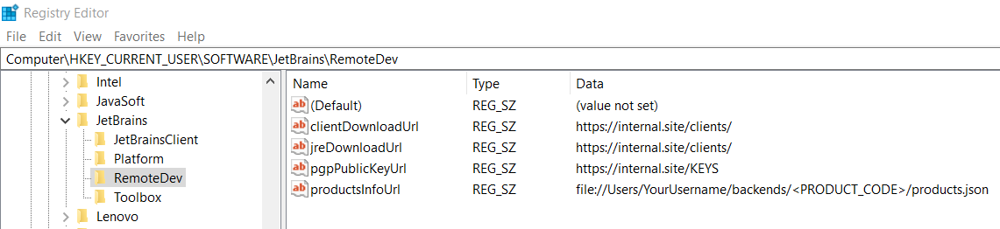

### 5. Setup SSH connection with JetBrains Gateway

With the server now configured, you can now configure your local machine to use
Gateway. Here is the documentation to
[setup SSH config via the Coder CLI](../ides.md#ssh-configuration). On the
Gateway side, follow our guide here until step 16.

Instead of downloading from jetbrains.com, we will point Gateway to our server
endpoint. Select `Installation options...` and select `Use download link`. Note
that the URL must explicitly reference the archive file:

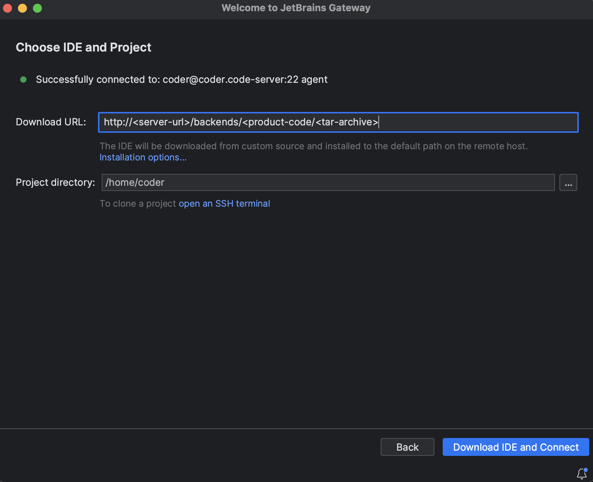

Click `Download IDE and Connect`. Gateway should now download the backend and
clients from the server into your remote workspace and local machine,
respectively.
