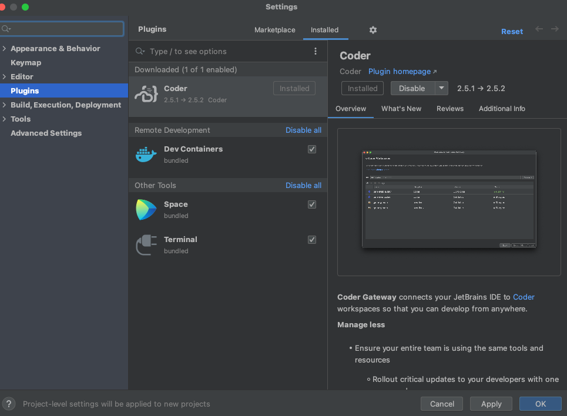
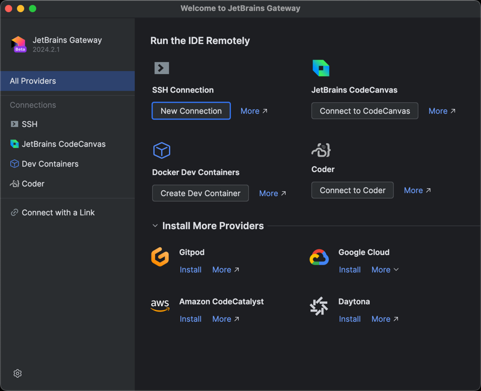

# JetBrains Gateway

JetBrains Gateway is a compact desktop app that allows you to work remotely with a JetBrains IDE without even downloading one. [See JetBrains' website to learn about and Gateway.](https://www.jetbrains.com/remote-development/gateway/)

Gateway can connect to a Coder workspace by using Coder's Gateway plugin or manually setting up an SSH connection.

## Creating a new JetBrains Gateway Connection

1. [Install Gateway](https://www.jetbrains.com/help/idea/jetbrains-gateway.html)
1. [Configure the `coder` CLI](../ides.md#ssh-configuration)
1. Open Gateway, make sure "SSH" is selected under "Remote Development"
1. Click "New Connection"
   
1. In the resulting dialog, click the gear icon to the right of "Connection:"
   
1. Hit the "+" button to add a new SSH connection
   

1. For the Host, enter `coder.<workspace name>`
1. For the Port, enter `22` (this is ignored by Coder)
1. For the Username, enter your workspace username
1. For the Authentication Type, select "OpenSSH config and authentication
   agent"
1. Make sure the checkbox for "Parse config file ~/.ssh/config" is checked.
1. Click "Test Connection" to validate these settings.
1. Click "OK"
   
1. Select the connection you just added
   
1. Click "Check Connection and Continue"
   
1. Select the JetBrains IDE for your project and the project directory.
   SSH into your server to create a directory or check out code if you haven't already.
   
   > Note the JetBrains IDE is remotely installed into `~/. cache/JetBrains/RemoteDev/dist`
1. Click "Download and Start IDE" to connect.
   

## Using an existing JetBrains installation in the workspace

If you would like to use an existing JetBrains IDE in a Coder workspace (or you
are air-gapped, and cannot reach jetbrains.com), run the following script in the
JetBrains IDE directory to point the default Gateway directory to the IDE
directory. This step must be done before configuring Gateway.

```sh
cd /opt/idea/bin
./remote-dev-server.sh registerBackendLocationForGateway
```

> Gateway only works with paid versions of JetBrains IDEs so the script will not be located in the `bin` directory of JetBrains Community editions.

[Here is the JetBrains article](https://www.jetbrains.com/help/idea/remote-development-troubleshooting.html#setup:~:text=Can%20I%20point%20Remote%20Development%20to%20an%20existing%20IDE%20on%20my%20remote%20server%3F%20Is%20it%20possible%20to%20install%20IDE%20manually%3F)
explaining this IDE specification.

## Using Coder's JetBrains Gateway Plugin

> The Coder plugin is an alpha state. If you experience problems, please [create a GitHub issue](https://github.com/coder/coder/issues) or share in [our Discord channel](https://discord.gg/coder).

1. [Install Gateway](https://www.jetbrains.com/help/idea/jetbrains-gateway.html)
1. Open Gateway and click the gear icon at the bottom left and then "Settings"
1. In the Marketplace tab within Plugins, type Coder and then click "Install" and "OK"
   
1. Click the new "Coder" icon on the Gateway home screen
   
1. Enter your Coder deployment's Access Url and click "Connect" then paste the Session Token and click "OK"
   
1. Click the "+" icon to open a browser and go to the templates page in your Coder deployment to create a workspace
1. If a workspace already exists but is stopped, click the green arrow to start the workspace
1. Once the workspace status says Running, click "Select IDE and Project"
   
1. Select the JetBrains IDE for your project and the project directory then click "Start IDE and connect"
   
   

> Note the JetBrains IDE is remotely installed into `~/.cache/JetBrains/RemoteDev/dist`
