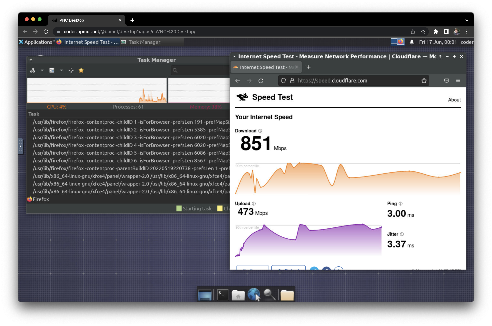
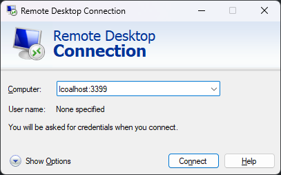

# Remote Desktops

> Built-in remote desktop is on the roadmap
> ([#2106](https://github.com/coder/coder/issues/2106)).

## VNC Desktop

The common way to use remote desktops with Coder is through VNC.



Workspace requirements:

- VNC server (e.g. [tigervnc](https://tigervnc.org/))
- VNC client (e.g. [novnc](https://novnc.com/info.html))

Installation instructions vary depending on your workspace's operating system,
platform, and build system.

As a starting point, see the
[desktop-container](https://github.com/bpmct/coder-templates/tree/main/desktop-container)
community template. It builds and provisions a Dockerized workspace with the
following software:

- Ubuntu 20.04
- TigerVNC server
- noVNC client
- XFCE Desktop

## RDP Desktop

To use RDP with Coder, you'll need to install an
[RDP client](https://docs.microsoft.com/en-us/windows-server/remote/remote-desktop-services/clients/remote-desktop-clients)
on your local machine, and enable RDP on your workspace.

Use the following command to forward the RDP port to your local machine:

```console
coder port-forward <workspace-name> --tcp 3399:3389
```

Then, connect to your workspace via RDP:

```console
mstsc /v localhost:3399
```

or use your favorite RDP client to connect to `localhost:3399`.


> Note: Default username is `Administrator` and password is `coderRDP!`.
