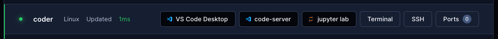

# Web IDEs

By default, Coder workspaces allow connections via:

- Web terminal
- SSH (plus any [SSH-compatible IDE](../ides.md))

It's common to also let developers to connect via web IDEs for uses cases like
zero trust networks, data science, contractors, and infrequent code
contributors.



In Coder, web IDEs are defined as
[coder_app](https://registry.terraform.io/providers/coder/coder/latest/docs/resources/app)
resources in the template. With our generic model, any web application can be
used as a Coder application. For example:

```hcl
# Add button to open Portainer in the workspace dashboard
# Note: Portainer must be already running in the workspace
resource "coder_app" "portainer" {
  agent_id      = coder_agent.main.id
  slug          = "portainer"
  display_name  = "Portainer"
  icon          = "https://simpleicons.org/icons/portainer.svg"
  url           = "https://localhost:9443/api/status"

  healthcheck {
    url       = "https://localhost:9443/api/status"
    interval  = 6
    threshold = 10
  }
}
```

## External URLs

Any URL external to the Coder deployment is accessible as a `coder_app`. e.g.,
Dropbox, Slack, Discord, GitHub

```hcl
resource "coder_app" "pubslack" {
  agent_id     = coder_agent.coder.id
  display_name = "Coder Public Slack"
  slug         = "pubslack"
  url          = "https://coder-com.slack.com/"
  icon         = "https://cdn2.hubspot.net/hubfs/521324/slack-logo.png"
  external     = true
}

resource "coder_app" "discord" {
  agent_id     = coder_agent.coder.id
  display_name = "Coder Discord"
  slug         = "discord"
  url          = "https://discord.com/invite/coder"
  icon         = "https://logodix.com/logo/573024.png"
  external     = true
}
```


## code-server

[code-server](https://github.com/coder/coder) is our supported method of running
VS Code in the web browser. A simple way to install code-server in Linux/macOS
workspaces is via the Coder agent in your template:

```console
# edit your template
cd your-template/
vim main.tf
```

```hcl
resource "coder_agent" "main" {
    arch           = "amd64"
    os             = "linux"
    startup_script = <<EOF
    #!/bin/sh
    # install code-server
    # add '-s -- --version x.x.x' to install a specific code-server version
    curl -fsSL https://code-server.dev/install.sh | sh -s -- --method=standalone --prefix=/tmp/code-server

    # start code-server on a specific port
    # authn is off since the user already authn-ed into the coder deployment
    # & is used to run the process in the background
    /tmp/code-server/bin/code-server --auth none --port 13337 &
    EOF
}
```

For advanced use, we recommend installing code-server in your VM snapshot or
container image. Here's a Dockerfile which leverages some special
[code-server features](https://coder.com/docs/code-server/):

```Dockerfile
FROM codercom/enterprise-base:ubuntu

# install the latest version
USER root
RUN curl -fsSL https://code-server.dev/install.sh | sh
USER coder

# pre-install VS Code extensions
RUN code-server --install-extension eamodio.gitlens

# directly start code-server with the agent's startup_script (see above),
# or use a process manager like supervisord
```

You'll also need to specify a `coder_app` resource related to the agent. This is
how code-server is displayed on the workspace page.

```hcl
resource "coder_app" "code-server" {
  agent_id     = coder_agent.main.id
  slug         = "code-server"
  display_name = "code-server"
  url          = "http://localhost:13337/?folder=/home/coder"
  icon         = "/icon/code.svg"
  subdomain    = false

  healthcheck {
    url       = "http://localhost:13337/healthz"
    interval  = 2
    threshold = 10
  }

}
```


## VS Code Server

VS Code supports launching a local web client using the `code serve-web`
command. To add VS Code web as a web IDE, Install and start this in your
`startup_script` and create a corresponding `coder_app`

```hcl
resource "coder_agent" "main" {
    arch           = "amd64"
    os             = "linux"
    startup_script = <<EOF
    #!/bin/sh
    # install VS Code
    curl -L "https://update.code.visualstudio.com/1.82.0/linux-deb-x64/stable" -o /tmp/code.deb
    sudo dpkg -i /tmp/code.deb && sudo apt-get install -f -y
    # start the web server on a specific port
    code serve-web --port 13338 --without-connection-token  --accept-server-license-terms >/tmp/vscode-web.log 2>&1 &
    EOF
}
```

> `code serve-web` was introduced in version 1.82.0 (August 2023).

You also need to add a `coder_app` resource for this.

```hcl
# VS Code Web
resource "coder_app" "vscode-web" {
  agent_id     = coder_agent.coder.id
  slug         = "vscode-web"
  display_name = "VS Code Web"
  icon         = "/icon/code.svg"
  url          = "http://localhost:13338?folder=/home/coder"
  subdomain    = true  # VS Code Web does currently does not work with a subpath https://github.com/microsoft/vscode/issues/192947
  share        = "owner"
}
```

## JupyterLab

Configure your agent and `coder_app` like so to use Jupyter. Notice the
`subdomain=true` configuration:

```hcl
data "coder_workspace" "me" {}

resource "coder_agent" "coder" {
  os             = "linux"
  arch           = "amd64"
  dir            = "/home/coder"
  startup_script = <<-EOF
pip3 install jupyterlab
$HOME/.local/bin/jupyter lab --ServerApp.token='' --ip='*'
EOF
}

resource "coder_app" "jupyter" {
  agent_id     = coder_agent.coder.id
  slug         = "jupyter"
  display_name = "JupyterLab"
  url          = "http://localhost:8888"
  icon         = "/icon/jupyter.svg"
  share        = "owner"
  subdomain    = true

  healthcheck {
    url       = "http://localhost:8888/healthz"
    interval  = 5
    threshold = 10
  }
}
```


## RStudio

Configure your agent and `coder_app` like so to use RStudio. Notice the
`subdomain=true` configuration:

```hcl
resource "coder_agent" "coder" {
  os             = "linux"
  arch           = "amd64"
  dir            = "/home/coder"
  startup_script = <<EOT
#!/bin/bash
# start rstudio
/usr/lib/rstudio-server/bin/rserver --server-daemonize=1 --auth-none=1 &
EOT
}

# rstudio
resource "coder_app" "rstudio" {
  agent_id      = coder_agent.coder.id
  slug          = "rstudio"
  display_name  = "R Studio"
  icon          = "https://upload.wikimedia.org/wikipedia/commons/d/d0/RStudio_logo_flat.svg"
  url           = "http://localhost:8787"
  subdomain     = true
  share         = "owner"

  healthcheck {
    url       = "http://localhost:8787/healthz"
    interval  = 3
    threshold = 10
  }
}
```


## Airflow

Configure your agent and `coder_app` like so to use Airflow. Notice the
`subdomain=true` configuration:

```hcl
resource "coder_agent" "coder" {
  os   = "linux"
  arch = "amd64"
  dir  = "/home/coder"
  startup_script = <<EOT
#!/bin/bash
# install and start airflow
pip3 install apache-airflow
/home/coder/.local/bin/airflow standalone &
EOT
}

resource "coder_app" "airflow" {
  agent_id      = coder_agent.coder.id
  slug          = "airflow"
  display_name  = "Airflow"
  icon          = "https://upload.wikimedia.org/wikipedia/commons/d/de/AirflowLogo.png"
  url           = "http://localhost:8080"
  subdomain     = true
  share         = "owner"

  healthcheck {
    url       = "http://localhost:8080/healthz"
    interval  = 10
    threshold = 60
  }
}
```


## File Browser

Show and manipulate the contents of the `/home/coder` directory in a browser.

```hcl
resource "coder_agent" "coder" {
  os   = "linux"
  arch = "amd64"
  dir  = "/home/coder"
  startup_script = <<EOT
#!/bin/bash

curl -fsSL https://raw.githubusercontent.com/filebrowser/get/master/get.sh | bash
filebrowser --noauth --root /home/coder --port 13339 >/tmp/filebrowser.log 2>&1 &

EOT
}

resource "coder_app" "filebrowser" {
  agent_id     = coder_agent.coder.id
  display_name = "file browser"
  slug         = "filebrowser"
  url          = "http://localhost:13339"
  icon         = "https://raw.githubusercontent.com/matifali/logos/main/database.svg"
  subdomain    = true
  share        = "owner"

  healthcheck {
    url       = "http://localhost:13339/healthz"
    interval  = 3
    threshold = 10
  }
}
```


## SSH Fallback

If you prefer to run web IDEs in localhost, you can port forward using
[SSH](../ides.md#ssh) or the Coder CLI `port-forward` sub-command. Some web IDEs
may not support URL base path adjustment so port forwarding is the only
approach.
