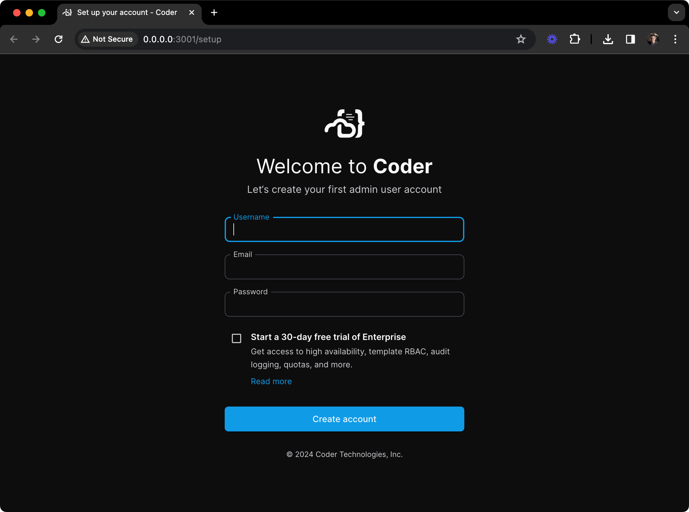

# Installing Coder

A single CLI (`coder`) is used for both the Coder server and the client.

We support two release channels: mainline and stable - read the
[Releases](./releases.md) page to learn more about which best suits your team.

## Download the latest release from GitHub

<div class="tabs">

## Linux/macOS

Our install script is the fastest way to install Coder on Linux/macOS:

```sh
curl -L https://coder.com/install.sh | sh
```

Refer to [GitHub releases](https://github.com/coder/coder/releases) for
alternate installation methods (e.g. standalone binaries, system packages).

## Windows

> **Important:** If you plan to use the built-in PostgreSQL database, you will
> need to ensure that the
> [Visual C++ Runtime](https://learn.microsoft.com/en-US/cpp/windows/latest-supported-vc-redist#latest-microsoft-visual-c-redistributable-version)
> is installed.

Use [GitHub releases](https://github.com/coder/coder/releases) to download the
Windows installer (`.msi`) or standalone binary (`.exe`).


Alternatively, you can use the
[`winget`](https://learn.microsoft.com/en-us/windows/package-manager/winget/#use-winget)
package manager to install Coder:

```powershell
winget install Coder.Coder
```

</div>

To start the Coder server:

```sh
coder server
```



To log in to an existing Coder deployment:

```sh
coder login https://coder.example.com
```

## Download the CLI from your deployment

> [!NOTE]
> Available in Coder 2.19 and newer.

Every Coder server hosts CLI binaries for all supported platforms. You can run a
script to download the appropriate CLI for your machine from your Coder
deployment.

```sh
curl -L https://coder.example.com/install.sh | sh
```

This script works within air-gapped deployments and ensures that the version of
the CLI you have installed on your machine matches the version of the server.

This script can be useful when authoring a template for installing the CLI.

### Next up

- [Create your first template](../tutorials/template-from-scratch.md)
- [Control plane configuration](../admin/setup/index.md)
