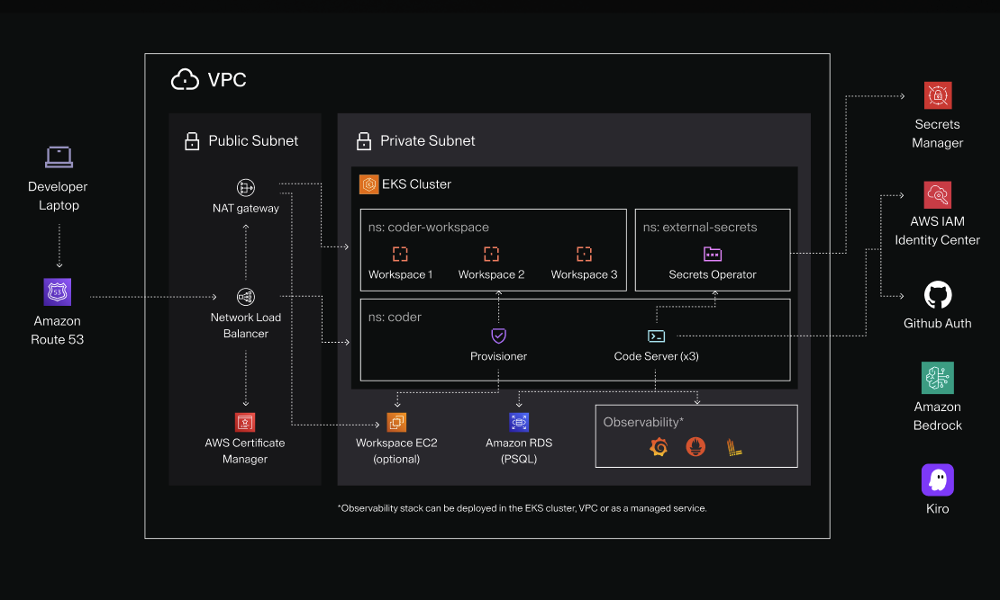
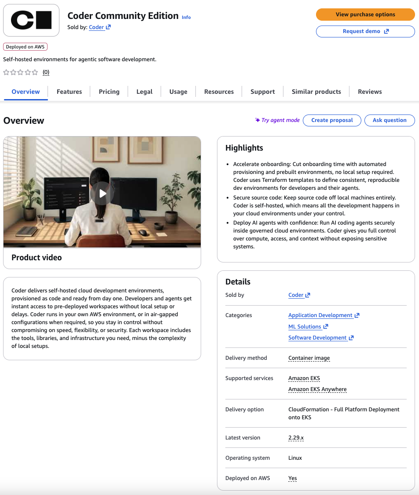
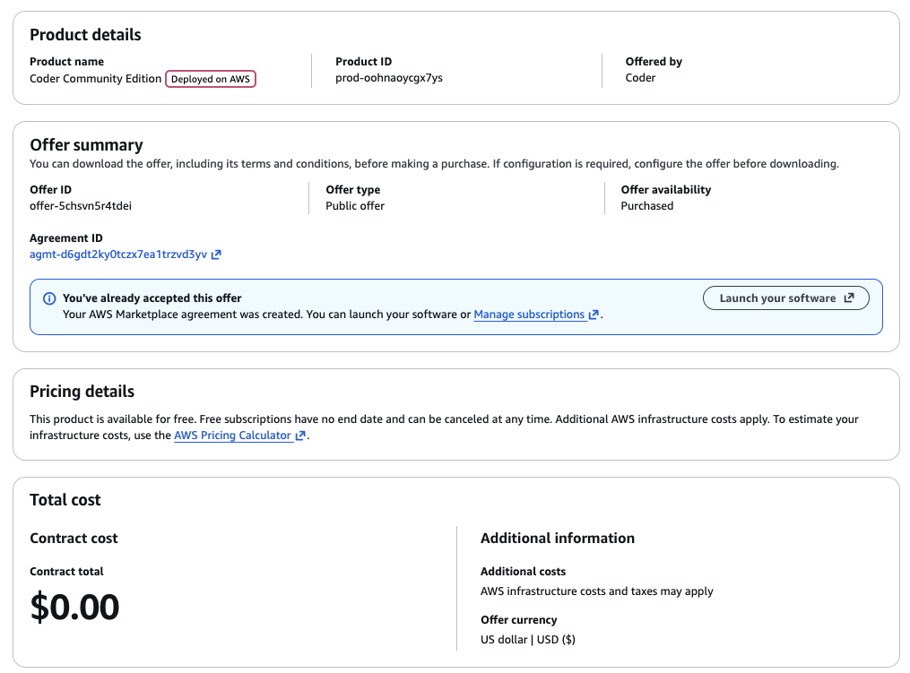
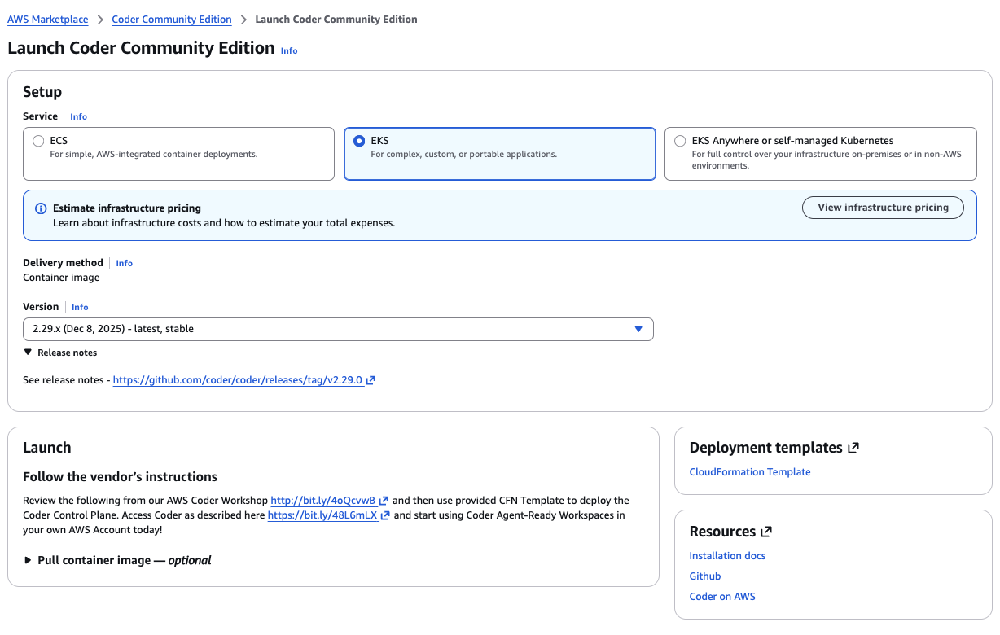
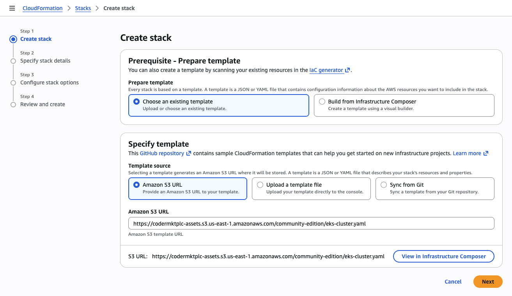
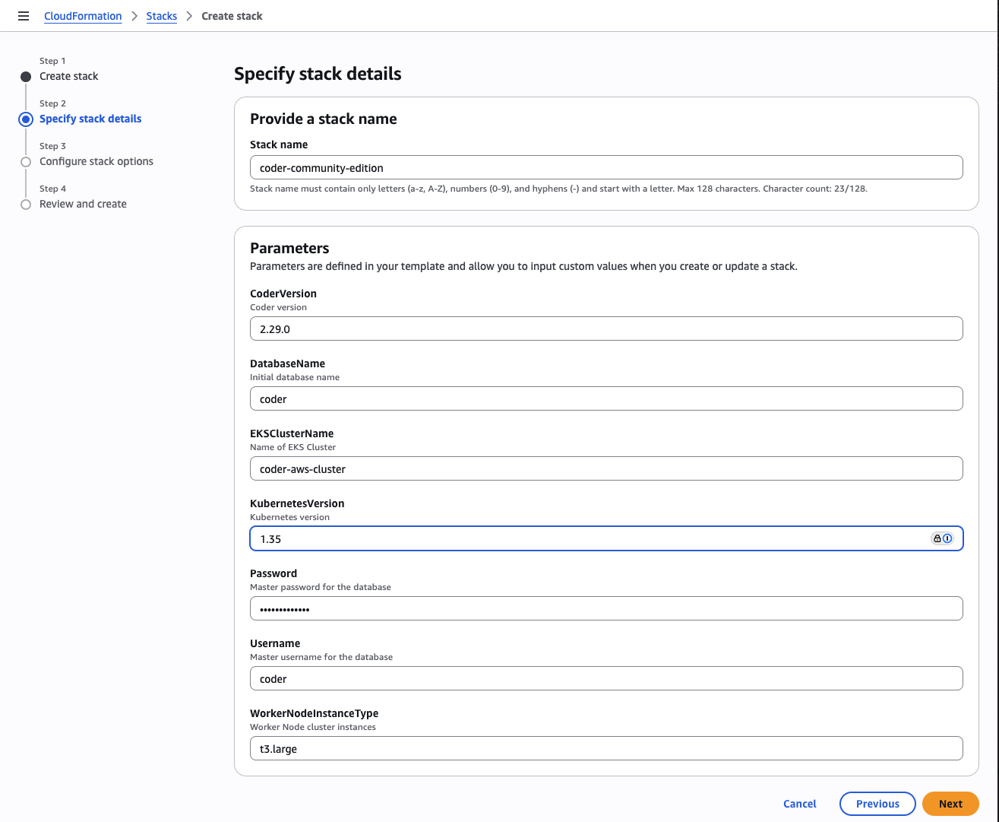
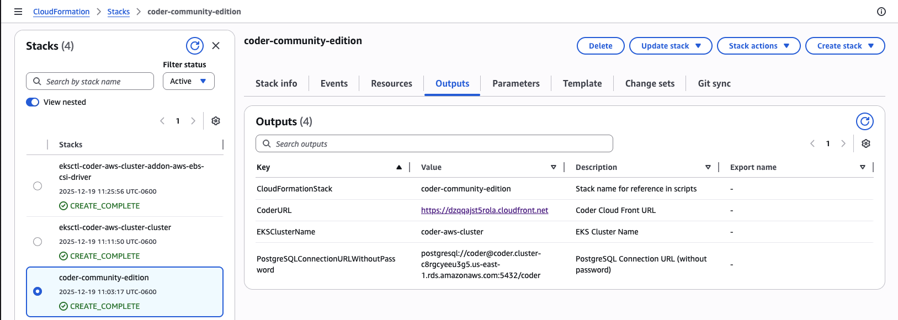

# Amazon Web Services

This guide is designed to get you up and running with a Coder proof-of-concept
on AWS EKS using a [Coder-provided CloudFormation Template](https://codermktplc-assets.s3.us-east-1.amazonaws.com/community-edition/eks-cluster.yaml).  The deployed AWS Coder Reference Architecture is below:

If you are familiar with EC2 however, you can use our
[install script](../cli.md) to run Coder on any popular Linux distribution.

## Requirements

This guide assumes your AWS account has `AdministratorAccess` permissions given the number and types of AWS Services deployed.  After deployment of Coder into a AWS POC or Sandbox account, it is recommended that the permissions be scaled back to only what your deployment requires.

## Launch Coder Community Edition from the from AWS Marketplace

We publish an Ubuntu 22.04 Container Image with Coder pre-installed and a supporting AWS Marketplace Launch guide. Search for `Coder Community Edition` in the AWS Marketplace or
[launch directly from the Coder listing](https://aws.amazon.com/marketplace/pp/prodview-34vmflqoi3zo4).

Use `View purchase options` to create a zero-cost subscription to Coder Community Edition and then use `Launch your software` to deploy to your current AWS Account.

Select `EKS` for the Launch setup, choose the desired/lastest version to deploy, and then review the **Launch** instructions for more detail explanation of what will be deployed.  When you are ready to proceed, click the `CloudFormation Template` link under **Deployment templates**.

You will then be taken to the AWS Management Console, CloudFormation `Create stack` in the currently selected AWS Region.  Select `Next` to view the Coder Community Edition CloudFormation Stack parameters.

The default parameters will support POCs and small team deployments of Coder using `t3.large` (2 cores and 8 GB memory) Nodes.  While the deployment uses EKS Auto-mode and will scale using Karpenter, keep in mind this platforms is intended for proof-of-concept
deployments. You should adjust your infrastructure when preparing for
production use. See: [Scaling Coder](../../admin/infrastructure/index.md)

Select `Next` and follow the prompts to submit the CloudFormation Stack.  Deployment of the Stack can take 10-20 minutes, and will create EKS related sub-stacks and a CodeBuild pipeline that automates the initial Helm deployment of Coder and final AWS network services integration.  Once the Stack successfully creates, access the `Outputs` as shown below:

Look for the `CoderURL` output link, and use to navigate to your newly deployed instance of Coder Community Edition.

That's all! Use the UI to create your first user, template, and workspace. We recommend starting with a Kubernetes template since Coder Community Edition is deployed to EKS.

### Next steps

- [IDEs with Coder](../../user-guides/workspace-access/index.md)
- [Writing custom templates for Coder](../../admin/templates/index.md)
- [Configure the Coder server](../../admin/setup/index.md)
- [Use your own domain + TLS](../../admin/setup/index.md#tls--reverse-proxy)
