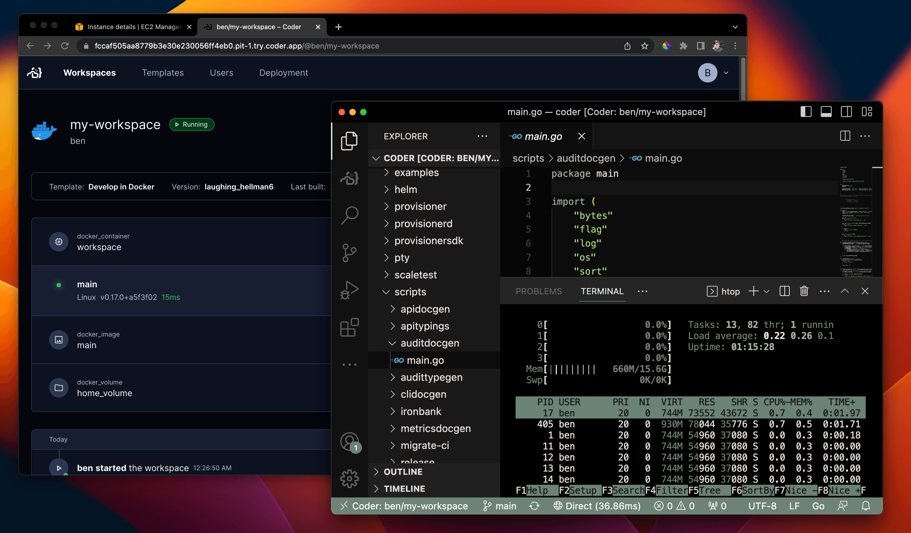
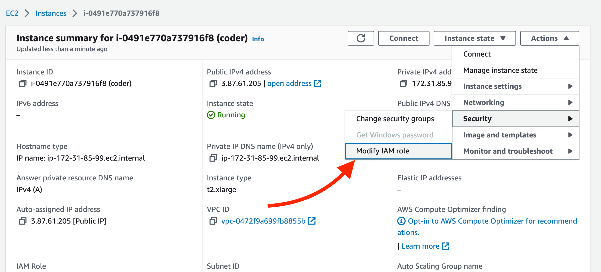
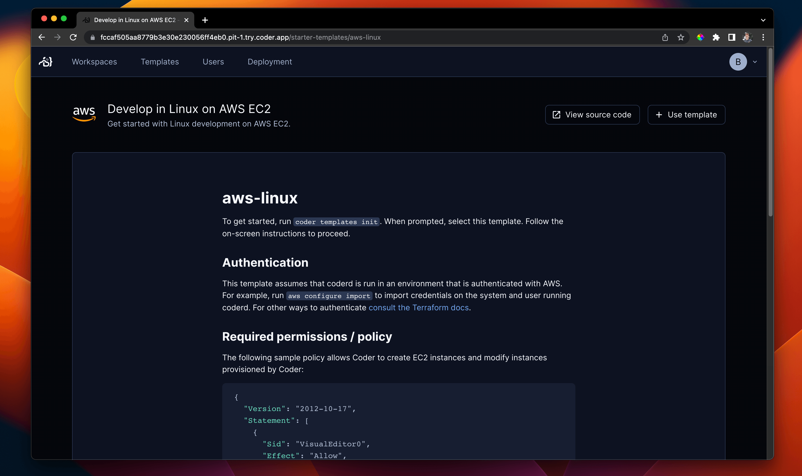

# Amazon Web Services

This guide is designed to get you up and running with a Coder proof-of-concept
on AWS EKS using a [Coder-provided CloudFormation Template](https://codermktplc-assets.s3.us-east-1.amazonaws.com/community-edition/eks-cluster.yaml).  The deployed AWS Coder Reference Architecture is below:


If you are familiar with EC2 however, you can use our
[install script](../cli.md) to run Coder on any popular Linux distribution.

## Requirements

This guide assumes your AWS account has `AdministratorAccess` permissions given the number and types of AWS Services deployed.  After deployment of Coder into a AWS POC or Sandbox account, it is recommended that the permissions be scaled back to only what your depoyment requires.

## Launch Coder Community Edition from the from AWS Marketplace

We publish an Ubuntu 22.04 Container Image with Coder pre-installed and a supporting AWS Marketplace Launch guide. Search for `Coder Community Edition` in the AWS Marketplace or
[launch directly from the Coder listing](https://aws.amazon.com/marketplace/pp/prodview-34vmflqoi3zo4).


Use `View purchase options` to create a zero-cost subscription to Coder Community Edition and then use the `Launch your software` to deploy to your current AWS Account.


Select `EKS` for the Launch setup, choose the desired/lastest version to deploy, and then review the **Launch** instructions for more detail explanation of what will be deployed.  When you are ready to proceed, click the `CloudFormation Template` link under **Deployment templates**.


(`t2.xlarge`, 4 cores and 16 GB
memory) if you plan on provisioning Docker containers as workspaces on this EC2
instance. Keep in mind this platforms is intended for proof-of-concept
deployments and you should adjust your infrastructure when preparing for
production use. See: [Scaling Coder](../../admin/infrastructure/index.md)

Be sure to add a keypair so that you can connect over SSH to further
[configure Coder](../../admin/setup/index.md).

After launching the instance, wait 30 seconds and navigate to the public IPv4
address. You should be redirected to a public tunnel URL.

<video autoplay playsinline loop>
  <source src="https://github.com/coder/coder/blob/main/docs/images/platforms/aws/launch.mp4?raw=true" type="video/mp4">
Your browser does not support the video tag.
</video>

That's all! Use the UI to create your first user, template, and workspace. We
recommend starting with a Docker template since the instance has Docker
pre-installed.



## Configuring Coder server

Coder is primarily configured by server-side flags and environment variables.
Given you created or added key-pairs when launching the instance, you can
[configure your Coder deployment](../../admin/setup/index.md) by logging in via
SSH or using the console:

<!-- TOOD(@kylecarbs): fix this weird formatting (https://imgur.com/a/LAUY3cT) -->

```sh
ssh ubuntu@<ec2-public-IPv4>
sudo vim /etc/coder.d/coder.env # edit config
sudo systemctl daemon-reload
sudo systemctl restart coder # restart Coder
```

## Give developers EC2 workspaces (optional)

Instead of running containers on the Coder instance, you can offer developers
full EC2 instances with the
[aws-linux](https://github.com/coder/coder/tree/main/examples/templates/aws-linux)
template.

Before you add the AWS template from the dashboard or CLI, you'll need to modify
the instance IAM role.



You must create or select a role that has `EC2FullAccess` permissions or a
limited
[Coder-specific permissions policy](https://github.com/coder/coder/tree/main/examples/templates/aws-linux#required-permissions--policy).

From there, you can import the AWS starter template in the dashboard and begin
creating VM-based workspaces.



### Next steps

- [IDEs with Coder](../../user-guides/workspace-access/index.md)
- [Writing custom templates for Coder](../../admin/templates/index.md)
- [Configure the Coder server](../../admin/setup/index.md)
- [Use your own domain + TLS](../../admin/setup/index.md#tls--reverse-proxy)
