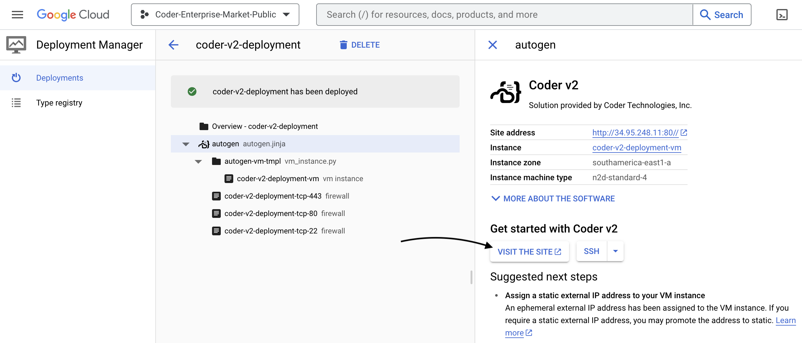

# Google Cloud Platform

In this guide, you will learn how to deploy the Coder control plane instance and
your first template.

## Requirements

This guide assumes you have `roles/compute.instanceAdmin.v1` access to your
Google Cloud Platform project.

## Launch a Coder instance from the Google Cloud Marketplace

We publish an Ubuntu 22.04 VM image with Coder and Docker pre-installed. Search
for `Coder v2` in the GCP Marketplace or
[use direct link](https://console.cloud.google.com/marketplace/product/coder-enterprise-market-public/coder-v2).


Be sure to keep the default firewall options checked so you can connect over
HTTP, HTTPS, and SSH.

We recommend keeping the default instance type (`e2-standard-4`, 4 cores and 16
GB memory) if you plan on provisioning Docker containers as workspaces on this
VM instance. Keep in mind this platforms is intended for proof-of-concept
deployments and you should adjust your infrastructure when preparing for
production use. See: [Scaling Coder](../../admin/infrastructure/index.md)

<video autoplay playsinline loop>
  <source src="https://github.com/coder/coder/blob/main/docs/images/platforms/gcp/launch.mp4?raw=true" type="video/mp4">
Your browser does not support the video tag.
</video>

Be sure to add a keypair so that you can connect over SSH to further
[configure Coder](../../admin/setup/index.md).

After launching the instance, wait 30 seconds and navigate to the public IPv4
address. You should be redirected to a public tunnel URL.



That's all! Use the UI to create your first user, template, and workspace. We
recommend starting with a Docker template since the instance has Docker
pre-installed.


## Configuring Coder server

Coder is primarily configured by server-side flags and environment variables.
Given you created or added key-pairs when launching the instance, you can
[configure your Coder deployment](../../admin/setup/index.md) by logging in via
SSH or using the console:

```shell
ssh ubuntu@<gcp-public-IPv4>
sudo vim /etc/coder.d/coder.env # edit config
sudo systemctl daemon-reload
sudo systemctl restart coder # restart Coder
```

## Give developers VM workspaces (optional)

Instead of running containers on the Coder instance, you can offer developers
full VM instances with the
[gcp-linux](https://github.com/coder/coder/tree/main/examples/templates/gcp-linux)
template.

Before you can use this template, you must authorize Coder to create VM
instances in your GCP project. Follow the instructions in the
[gcp-linux template README](https://github.com/coder/coder/tree/main/examples/templates/gcp-linux#authentication)
to set up authentication.

### Next Steps

- [Use your IDE with Coder](../../user-guides/workspace-access/index.md)
- [Writing custom templates for Coder](../../admin/templates/index.md)
- [Configure the Coder server](../../admin/setup/index.md)
- [Use your own domain + TLS](../../admin/setup/index.md#tls--reverse-proxy)
