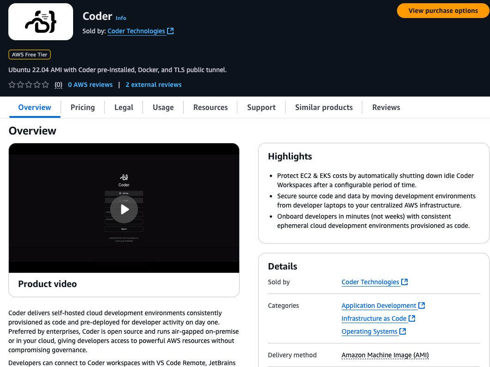
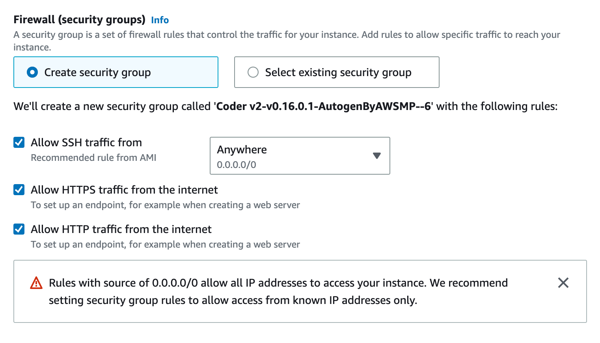
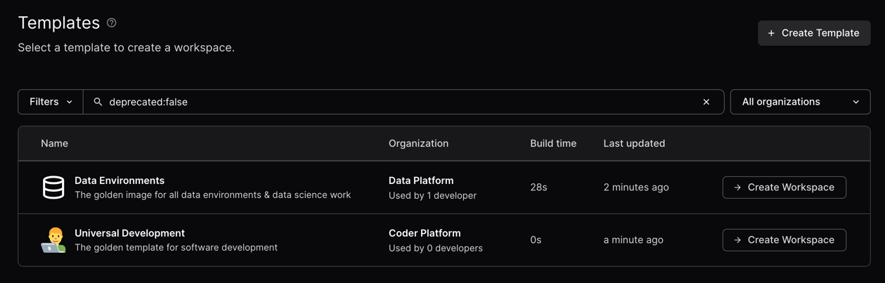
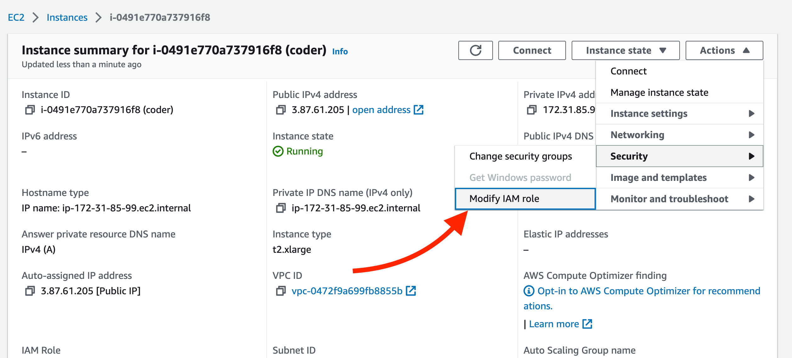
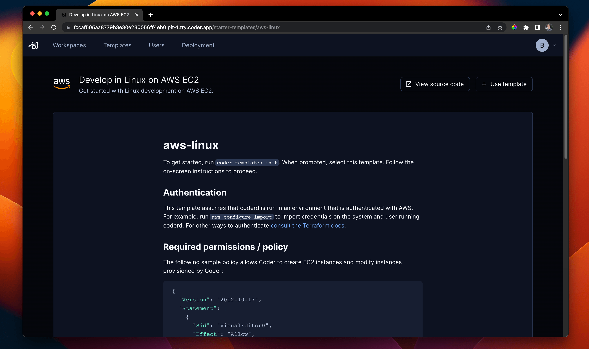

# Amazon Web Services

This guide is designed to get you up and running with a Coder proof-of-concept
VM on AWS EC2 using a [Coder-provided AMI](https://github.com/coder/packages).
If you are familiar with EC2 however, you can use our
[install script](../cli.md) to run Coder on any popular Linux distribution.

## Requirements

This guide assumes your AWS account has `AmazonEC2FullAccess` permissions.

## Launch a Coder instance from the from AWS Marketplace

We publish an Ubuntu 22.04 Amazon Machine Image (AMI) with Coder and Docker
pre-installed.

To launch a Coder AMI EC2 instance:

1. Open the [Amazon EC2 console](https://console.aws.amazon.com/ec2/) and
   confirm that you're logged in.

1. Select **Launch instance**.

1. Assign a name and, optionally, additional tags.

1. In the **Application and OS Images** section, use the search bar to search for `coder`.

   Select the **AWS Marketplace AMIs** tab, then **Select** next to the
   **Coder** AMI.

   

   You can also access the
   [Coder AMI directly](https://aws.amazon.com/marketplace/pp/prodview-zaoq7tiogkxhc),
   then select **View purchase options** to continue to the configuration screen.

1. Name your instance, then in the **Instance type** section, use the dropdown
   list to select `t2.xlarge` (4 vCPU, 16 GiB memory)

   Keep in mind this platform is intended for proof-of-concept deployments and
   you should adjust your infrastructure when preparing for production use.

   Consult the [scale Coder best practices](../../tutorials/best-practices/scale-coder.md)
   for more considerations.

1. Configure the key pair.

1. In the **Firewall (security groups)** section of the **Network settings**,
   enable  **Allow SSH traffic** and **Allow HTTPS traffic from the
   internet**.
   Select **Allow HTTP traffic from the internet** if you need it for your deployment.

   Use the **Anywhere** dropdown list to select and customize what SSH traffic should be allowed:

   

1. In the **Configure storage** section, enter `40` as the root volume size (in GiB).

   The extra disk space is required for template and workspace builds and for
   the embedded PostgreSQL DB.

1. You can adjust other settings if you need to, then select **Launch instance**.

After you launce the instance, wait 30 seconds and navigate to the public IPv4
address. You should be redirected to a public tunnel URL.

That's all! Use the Coder UI to create your first user, template, and workspace. We
recommend starting with a Docker template since the instance has Docker
pre-installed.



## Configuring Coder server

Coder is primarily configured by server-side flags and environment variables.
Given you created or added key-pairs when launching the instance, you can
[configure your Coder deployment](../../admin/setup/index.md) by logging in via
SSH or using the console:

```sh
ssh ubuntu@<ec2-public-IPv4>
sudo vim /etc/coder.d/coder.env # edit config
sudo systemctl daemon-reload
sudo systemctl restart coder # restart Coder
```

## Give developers EC2 workspaces (optional)

Instead of running containers on the Coder instance, you can offer developers
full EC2 instances with the
[aws-linux](https://github.com/coder/coder/tree/main/examples/templates/aws-linux)
template.

Before you add the AWS template from the dashboard or CLI, you'll need to modify
the instance IAM role.



You must create or select a role that has `EC2FullAccess` permissions or a
limited
[Coder-specific permissions policy](https://github.com/coder/coder/tree/main/examples/templates/aws-linux#required-permissions--policy).

From there, you can import the AWS starter template in the dashboard and begin
creating VM-based workspaces.



### Next steps

- [IDEs with Coder](../../user-guides/workspace-access/index.md)
- [Writing custom templates for Coder](../../admin/templates/index.md)
- [Configure the Coder server](../../admin/setup/index.md)
- [Use your own domain + TLS](../../admin/setup/index.md#tls--reverse-proxy)
