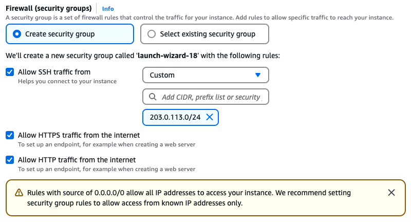

# Amazon Web Services

This guide is designed to get you up and running with a Coder proof-of-concept
VM on AWS EC2 using a [Coder-provided AMI](https://github.com/coder/packages).
If you are familiar with EC2 however, you can use our
[install script](../cli.md) to run Coder on any popular Linux distribution.

## Requirements

This guide assumes your AWS account has `AmazonEC2FullAccess` permissions.

## Launch a Coder instance from the from AWS Marketplace

We publish an Ubuntu 22.04 AMI with Coder and Docker pre-installed. Search for
`Coder` in the EC2 "Launch an Instance" screen or
[launch directly from the marketplace](https://aws.amazon.com/marketplace/pp/prodview-zaoq7tiogkxhc).


Be sure to keep the default firewall (SecurityGroup) options checked so you can
connect over HTTP, HTTPS, and SSH.



We recommend keeping the default instance type (`t2.xlarge`, 4 cores and 16 GB
memory) if you plan on provisioning Docker containers as workspaces on this EC2
instance. Keep in mind this platforms is intended for proof-of-concept
deployments and you should adjust your infrastructure when preparing for
production use. See: [Scaling Coder](../../admin/infrastructure/index.md)

Be sure to add a keypair so that you can connect over SSH to further
[configure Coder](../../admin/setup/index.md).

After launching the instance, wait 30 seconds and navigate to the public IPv4
address. You should be redirected to a public tunnel URL.

<video autoplay playsinline loop>
  <source src="https://github.com/coder/coder/blob/main/docs/images/platforms/aws/launch.mp4?raw=true" type="video/mp4">
Your browser does not support the video tag.
</video>

That's all! Use the UI to create your first user, template, and workspace. We
recommend starting with a Docker template since the instance has Docker
pre-installed.


## Configuring Coder server

Coder is primarily configured by server-side flags and environment variables.
Given you created or added key-pairs when launching the instance, you can
[configure your Coder deployment](../../admin/setup/index.md) by logging in via
SSH or using the console:

<!-- TOOD(@kylecarbs): fix this weird formatting (https://imgur.com/a/LAUY3cT) -->

```sh
ssh ubuntu@<ec2-public-IPv4>
sudo vim /etc/coder.d/coder.env # edit config
sudo systemctl daemon-reload
sudo systemctl restart coder # restart Coder
```

## Give developers EC2 workspaces (optional)

Instead of running containers on the Coder instance, you can offer developers
full EC2 instances with the
[aws-linux](https://github.com/coder/coder/tree/main/examples/templates/aws-linux)
template.

Before you add the AWS template from the dashboard or CLI, you'll need to modify
the instance IAM role.


You must create or select a role that has `EC2FullAccess` permissions or a
limited
[Coder-specific permissions policy](https://github.com/coder/coder/tree/main/examples/templates/aws-linux#required-permissions--policy).

From there, you can import the AWS starter template in the dashboard and begin
creating VM-based workspaces.


### Next steps

- [IDEs with Coder](../../user-guides/workspace-access/index.md)
- [Writing custom templates for Coder](../../admin/templates/index.md)
- [Configure the Coder server](../../admin/setup/index.md)
- [Use your own domain + TLS](../../admin/setup/index.md#tls--reverse-proxy)
