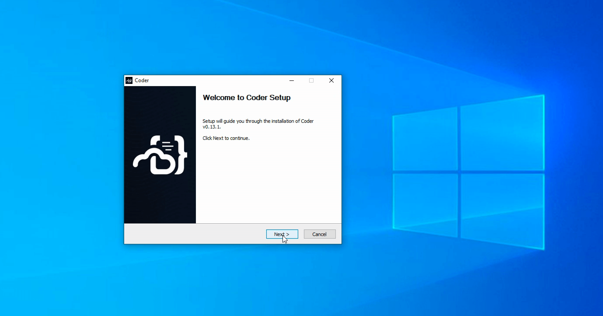
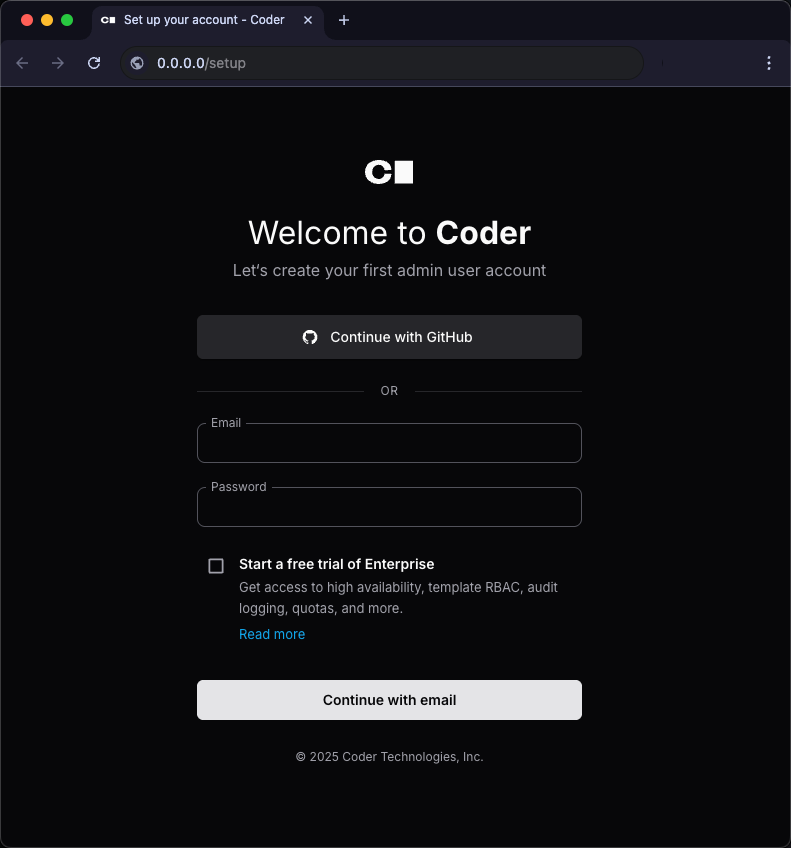

# Installing Coder

A single CLI (`coder`) is used for both the Coder server and the client.

We support two release channels: mainline and stable - read the
[Releases](./releases.md) page to learn more about which best suits your team.

There are several ways to install Coder. Follow the steps on this page for a
minimal installation of Coder, or for a step-by-step guide on how to install and
configure your first Coder deployment, follow the
[quickstart guide](../tutorials/quickstart.md).

For production deployments with 50+ users, we recommend
[installing on Kubernetes](./kubernetes.md). Otherwise, you can install Coder on
your local machine or on a VM:

<div class="tabs">

## Linux/macOS

Our install script is the fastest way to install Coder on Linux/macOS:

```sh
curl -L https://coder.com/install.sh | sh
```

Refer to [GitHub releases](https://github.com/coder/coder/releases) for
alternate installation methods (e.g. standalone binaries, system packages).

## Windows

> [!IMPORTANT]
> If you plan to use the built-in PostgreSQL database, you will
> need to ensure that the
> [Visual C++ Runtime](https://learn.microsoft.com/en-US/cpp/windows/latest-supported-vc-redist#latest-microsoft-visual-c-redistributable-version)
> is installed.

Use [GitHub releases](https://github.com/coder/coder/releases) to download the
Windows installer (`.msi`) or standalone binary (`.exe`).



Alternatively, you can use the
[`winget`](https://learn.microsoft.com/en-us/windows/package-manager/winget/#use-winget)
package manager to install Coder:

```powershell
winget install Coder.Coder
```

## Other

<children></children>

</div>

To start the Coder server:

```sh
coder server
```



To log in to an existing Coder deployment:

```sh
coder login https://coder.example.com
```

## Troubleshooting

### Unable to query ContainerMemory

When you query `ContainerMemory` and encounter the error:

```shell
open /sys/fs/cgroup/memory.max: no such file or directory
```

This error mostly affects Raspberry Pi OS, but might also affect older Debian-based systems as well.

<details><summary>Add `cgroup_memory=1 cgroup_enable=memory` to `cmdline.txt`:</summary>

1. Confirm the list of existing cgroup controllers doesn't include `memory`:

   ```console
   $ cat /sys/fs/cgroup/cgroup.controllers
   cpuset cpu io pids

   $ cat /sys/fs/cgroup/cgroup.subtree_control
   cpuset cpu io pids
   ```

1. Add cgroup entries to `cmdline.txt` in `/boot/firmware` (or `/boot/` on older Pi OS releases):

   ```text
   cgroup_memory=1 cgroup_enable=memory
   ```

   You can use `sed` to add it to the file for you:

   ```bash
   sudo sed -i '$s/$/ cgroup_memory=1 cgroup_enable=memory/' /boot/firmware/cmdline.txt
   ```

1. Reboot:

   ```bash
   sudo reboot
   ```

1. Confirm that the list of cgroup controllers now includes `memory`:

   ```console
   $ cat /sys/fs/cgroup/cgroup.controllers
   cpuset cpu io memory pids

   $ cat /sys/fs/cgroup/cgroup.subtree_control
   cpuset cpu io memory pids
   ```

Read more about cgroup controllers in [The Linux Kernel](https://docs.kernel.org/admin-guide/cgroup-v2.html#controlling-controllers) documentation.

</details>

## Next steps

- [Quickstart](../tutorials/quickstart.md)
- [Configure Control Plane Access](../admin/setup/index.md)
