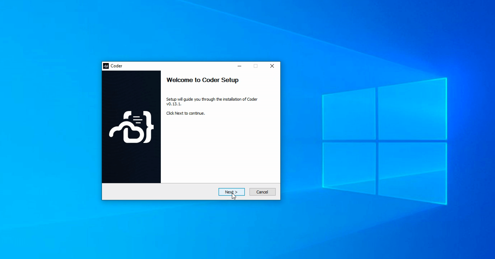

# Installing Coder

A single CLI (`coder`) is used for both the Coder server and the client.

We support two release channels: mainline and stable - read the
[Releases](./releases/index.md) page to learn more about which best suits your team.

> [!NOTE]
> Mainline releases ship every two weeks with new features.
> Stable releases ship monthly,
> are tested against more configurations,
> and are the default choice for production deployments.

There are several ways to install Coder. Follow the steps on this page for a
minimal installation of Coder, or for a step-by-step guide on how to install and
configure your first Coder deployment, follow the
[quickstart guide](../tutorials/quickstart.md).

> [!TIP]
> If you use a coding agent like Claude Code, the [coder/skills](https://github.com/coder/skills) `setup` skill can train the coding agent to install and bootstrap a Coder deployment end-to-end.

## Local/Individual Installs

This install guide is meant for **individual developers, small teams, and/or open source community members** setting up Coder locally or on a single server. It covers the light weight install for Linux, macOS, and Windows.

<div class="tabs">

## Linux/macOS

Our install script is the fastest way to install Coder on Linux/macOS:

```sh
curl -L https://coder.com/install.sh | sh
```

> [!WARNING]
> The command above downloads and executes shell code from `coder.com/install.sh`.
> If your security policy requires reviewing third-party install scripts before running them,
> download the script first,
> inspect it,
> and then run it locally.

Refer to [GitHub releases](https://github.com/coder/coder/releases) for
alternate installation methods (e.g. standalone binaries, system packages).

## Windows

> [!IMPORTANT]
> The built-in PostgreSQL database requires the Microsoft [Visual C++ Runtime](https://learn.microsoft.com/en-US/cpp/windows/latest-supported-vc-redist#latest-microsoft-visual-c-redistributable-version) on Windows.
> Install the runtime before starting the Coder server,
> or the server will fail at startup.

Use [GitHub releases](https://github.com/coder/coder/releases) to download the
Windows installer (`.msi`) or standalone binary (`.exe`).



Alternatively, you can use the
[`winget`](https://learn.microsoft.com/en-us/windows/package-manager/winget/#use-winget)
package manager to install Coder:

```powershell
winget install Coder.Coder
```

</div>

## Hosted/Enterprise Installs

This install guide is meant for **IT Administrators, DevOps, and Platform Teams** deploying Coder for an organization. It covers production-grade, multi-user installs on Kubernetes and other hosted platforms.

<div>

<children></children>

</div>

## Starting the Coder Server

To start the Coder server:

```sh
coder server
```


> [!CAUTION]
> Starting `coder server` without configuring authentication exposes the dashboard on the bound port.
> Configure SSO or password authentication before binding the server to a public IP or DNS name.

To log in to an existing Coder deployment:

```sh
coder login https://coder.example.com
```
