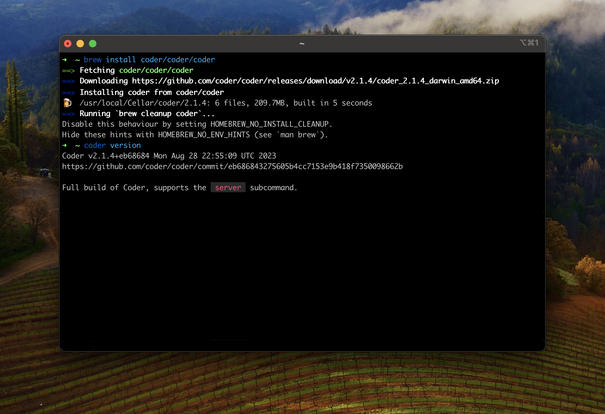

# macOS

You can use [Homebrew](https://brew.sh) to install the `coder` command. Homebrew
is recommended, but you can also use our [install script](./install.sh.md) or
download a [standalone binary](./binary.md).

1. Install Coder from our official
   [Homebrew tap](https://github.com/coder/homebrew-coder)

   ```console
   brew install coder/coder/coder
   ```

   

2. Start a Coder server

   ```console
   # Automatically sets up an external access URL on *.try.coder.app
   coder server

   # Requires a PostgreSQL instance (version 13 or higher) and external access URL
   coder server --postgres-url <url> --access-url <url>
   ```

   > Set `CODER_ACCESS_URL` to the external URL that users and workspaces will
   > use to connect to Coder. This is not required if you are using the tunnel.
   > Learn more about Coder's [configuration options](../admin/configure.md).

3. Visit the Coder URL in the logs to set up your first account, or use the CLI.

## Next steps

- [Configuring Coder](../admin/configure.md)
- [Templates](../templates/index.md)
