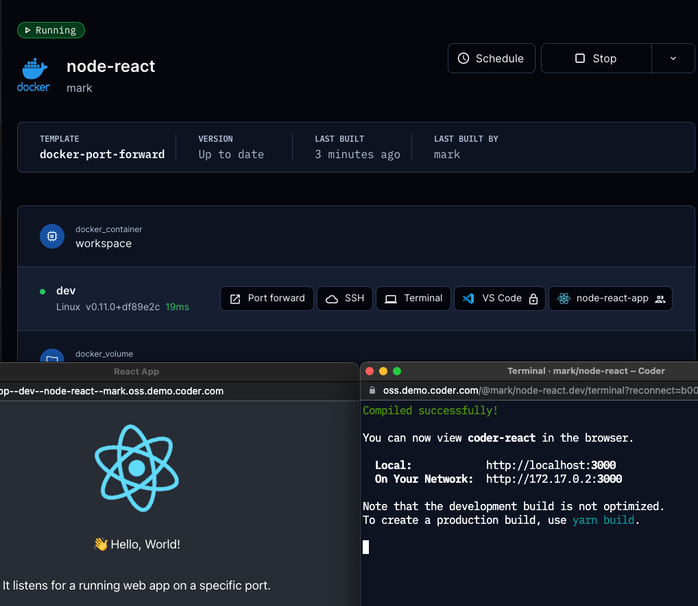

# Port Forwarding

Port forwarding lets developers securely access processes on their Coder
workspace from a local machine. A common use case is testing web
applications in a browser.

There are three ways to forward ports in Coder:

- The `coder port-forward` command
- Dashboard
- SSH

The `coder port-forward` command is generally more performant.

## The `coder port-forward` command

This command can be used to forward TCP or UDP ports from the remote
workspace so they can be accessed locally. Both the TCP and UDP command
line flags (`--tcp` and `--udp`) can be given once or multiple times.

The supported syntax variations for the `--tcp` and `--udp` flag are:

- Single port with optional remote port: `local_port[:remote_port]`
- Comma separation `local_port1,local_port2`
- Port ranges `start_port-end_port`
- Any combination of the above

### Examples

Forward the remote TCP port `8080` to local port `8000`:

```console
coder port-forward myworkspace --tcp 8000:8080
```

Forward the remote TCP port `3000` and all ports from `9990` to `9999`
to their respective local ports.

```console
coder port-forward myworkspace --tcp 3000,9990-9999
```

For more examples, see `coder port-forward --help`.

## Dashboard

> To enable port forwarding via the dashboard, Coder must be configured with a
> [wildcard access URL](../admin/configure.md#wildcard-access-url). If an access
> URL is not specified, Coder will create [a publicly accessible URL](../admin/configure.md#tunnel)
> to reverse proxy the deployment, and port forwarding will work. There is a
> known limitation where if the port forwarding URL length is greater than 63
> characters, port forwarding will not work.

### From an arbitrary port

One way to port forward in the dashboard is to use the "Port forward" button to specify an arbitrary port. Coder will also detect if processes are running, and will list them below the port picklist to click an open the running processes in the browser.


### From an coder_app resource

Another way to port forward is to configure a `coder_app` resource in the workspace's template. This approach shows a visual application icon in the dashboard. See the following `coder_app` example for a Node React app and note the `subdomain` and `share` settings:

```sh
# node app
resource "coder_app" "node-react-app" {
  agent_id = coder_agent.dev.id
  name     = "node-react-app"
  icon     = "https://upload.wikimedia.org/wikipedia/commons/thumb/a/a7/React-icon.svg/2300px-React-icon.svg.png"
  url      = "http://localhost:3000"
  subdomain = true
  share     = "authenticated"

  healthcheck {
    url       = "http://localhost:3000/healthz"
    interval  = 10
    threshold = 30
  }  

}
```

Valid `share` values include `owner` - private to the user, `authenticated` - accessible by any user authenticated to the Coder deployment, and `public` - accessible by users outside of the Coder deployment.



## SSH

First, [configure SSH](../ides.md#ssh-configuration) on your
local machine. Then, use `ssh` to forward like so:

```console
ssh -L 8080:localhost:8000 coder.myworkspace
```

You can read more on SSH port forwarding [here](https://www.ssh.com/academy/ssh/tunneling/example).
