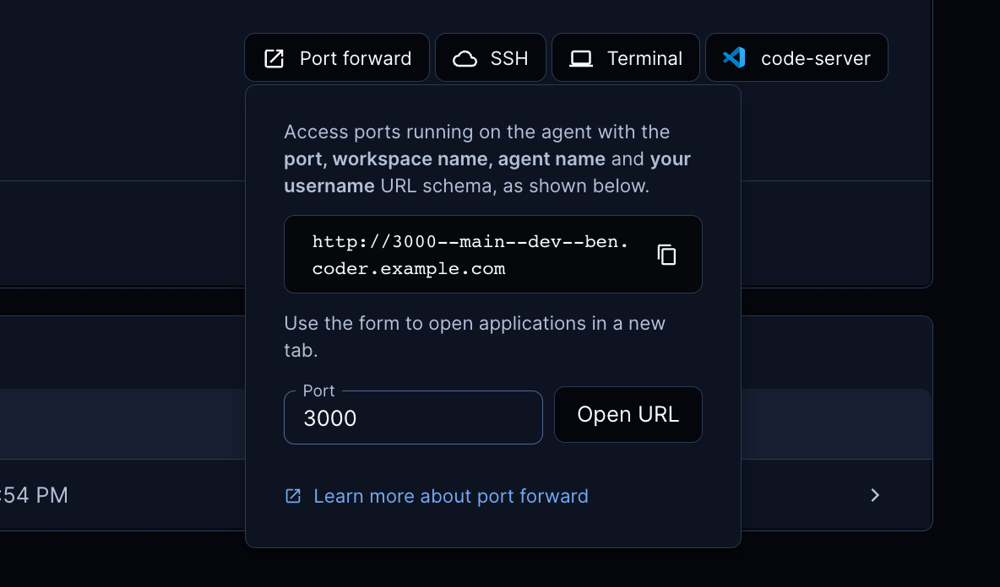

# Port Forwarding

Port forwarding lets developers securely access processes on their Coder
workspace from a local machine. A common use case is testing web
applications in a browser.

There are three ways to forward ports in Coder:

- The `coder port-forward` command
- Dashboard
- SSH

The `coder port-forward` command is generally more performant.

## The `coder port-forward` command

This command can be used to forward TCP or UDP ports from the remote
workspace so they can be accessed locally. Both the TCP and UDP command
line flags (`--tcp` and `--udp`) can be given once or multiple times.

The supported syntax variations for the `--tcp` and `--udp` flag are:

- Single port with optional remote port: `local_port[:remote_port]`
- Comma separation `local_port1,local_port2`
- Port ranges `start_port-end_port`
- Any combination of the above

### Examples

Forward the remote TCP port `8080` to local port `8000`:

```console
coder port-forward myworkspace --tcp 8000:8080
```

Forward the remote TCP port `3000` and all ports from `9990` to `9999`
to their respective local ports.

```console
coder port-forward myworkspace --tcp 3000,9990-9999
```

For more examples, see `coder port-forward --help`.

## Dashboard

> To enable port forwarding via the dashboard, Coder must be configured with a
> [wildcard access URL](../admin/configure.md#wildcard-access-url).

Use the "Port forward" button in the dashboard to access ports
running on your workspace.



## SSH

First, [configure SSH](../ides.md#ssh-configuration) on your
local machine. Then, use `ssh` to forward like so:

```console
ssh -L 8080:localhost:8000 coder.myworkspace
```

You can read more on SSH port forwarding [here](https://www.ssh.com/academy/ssh/tunneling/example).
