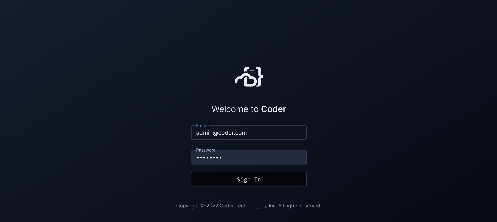
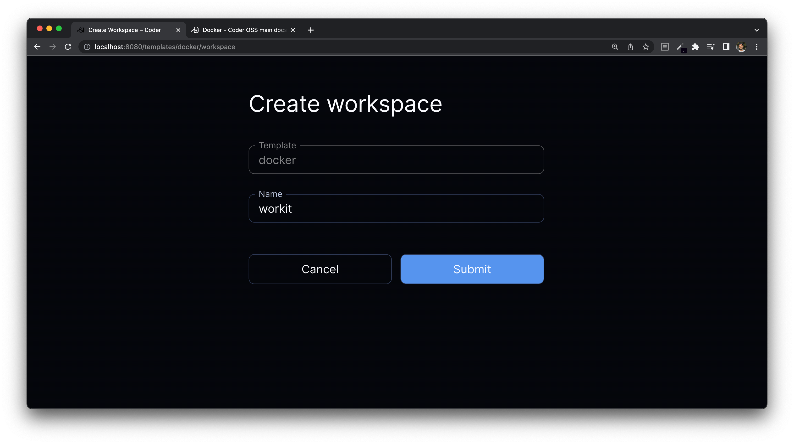
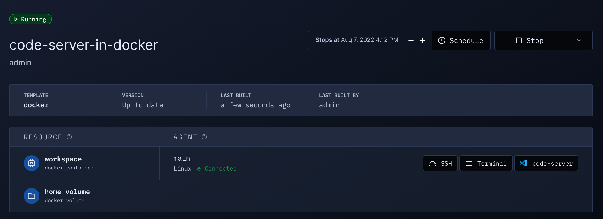

# Docker

Coder with Docker has the following advantages:

- Simple installation (everything is on a single box)
- Workspace images are easily configured
- Workspaces share resources for burst operations

> Note that the below steps are only supported on a Linux distribution.

## Requirements

- A Linux machine
- A running Docker daemon

<blockquote class="warning">
Before you install
If you would like your workspaces to be able to run Docker, we recommend that you <a href="https://github.com/nestybox/sysbox#installation" target="_blank">install Sysbox</a> before proceeding.

As part of the Sysbox installation you will be required to remove all existing
Docker containers including containers used by Coder workspaces. Installing
Sysbox ahead of time will reduce disruption to your Coder instance.

</blockquote>

## Instructions

1. Run Coder with Docker.

   ```shell
   export CODER_DATA=$HOME/.config/coderv2-docker
   export DOCKER_GROUP=$(getent group docker | cut -d: -f3)
   mkdir -p $CODER_DATA
   docker run --rm -it \
       -v $CODER_DATA:/home/coder/.config \
       -v /var/run/docker.sock:/var/run/docker.sock \
       --group-add $DOCKER_GROUP \
       ghcr.io/coder/coder:latest
   ```

   > This will use Coder's tunnel and built-in database. See our
   > [Docker documentation](../install/docker.md) for other configuration
   > options such as running on localhost, using docker-compose, and external
   > PostgreSQL.

1. In new terminal, [install Coder](../install/) in order to connect to your
   deployment through the CLI.

   ```shell
   curl -L https://coder.com/install.sh | sh
   ```

1. Run `coder login <access url>` and follow the interactive instructions to
   create your user.

1. Pull the "Docker" example template using the interactive
   `coder templates init`:

   ```shell
   coder templates init
   cd docker
   ```

1. Push up the template with `coder templates push`

1. Open the dashboard in your browser to create your first workspace:

   

   Then navigate to `Templates > docker > Create Workspace`

   

   Now wait a few moments for the workspace to build... After the first build,
   the image is cached and subsequent builds will take a few seconds.

1. Your workspace is ready to go!

   

   Open up a web application or [SSH in](../ides.md#ssh-configuration).

1. If you want to modify the Docker image or template, edit the files in the
   previously created `./docker` directory, then run `coder templates push`.

## Using remote Docker host

You can use a remote Docker host in 2 ways.

1. Configuring docker provider to use a
   [remote host](https://registry.terraform.io/providers/kreuzwerker/docker/latest/docs#remote-hosts)
   over SSH or TCP.
2. Running an
   [external provisoner](https://coder.com/docs/v2/latest/admin/provisioners#external-provisioners)
   on the remote docker host.

## Troubleshooting

### Docker-based workspace is stuck in "Connecting..."

Ensure you have an externally-reachable `CODER_ACCESS_URL` set. See
[troubleshooting templates](../templates/index.md#Troubleshooting) for more
steps.

### Permission denied while trying to connect to the Docker daemon socket

See Docker's official documentation to
[Manage Docker as a non-root user](https://docs.docker.com/engine/install/linux-postinstall/#manage-docker-as-a-non-root-user).

## Next Steps

- [Port-forward](../networking/port-forwarding.md)
- [Learn more about template configuration](../templates/index.md)
- [Configure more IDEs](../ides/web-ides.md)
