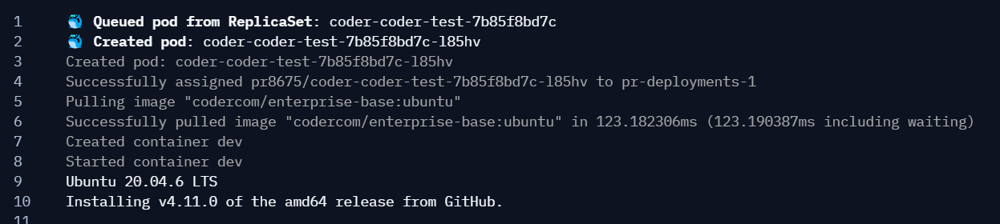
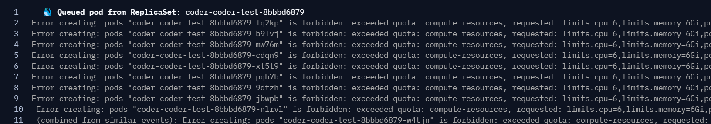
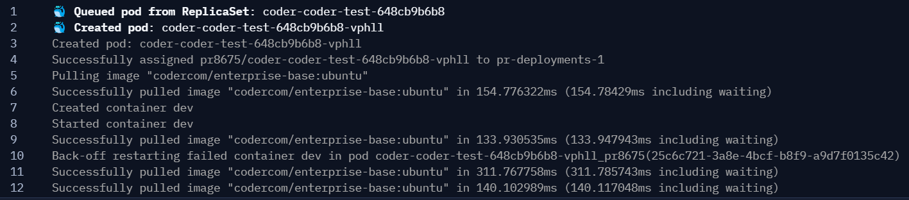

# Kubernetes event logs

To stream Kubernetes events into your workspace startup logs, you can use
Coder's [`coder-logstream-kube`](https://github.com/coder/coder-logstream-kube)
tool. `coder-logstream-kube` provides useful information about the workspace pod
or deployment, such as:

- Causes of pod provisioning failures, or why a pod is stuck in a pending state.
- Visibility into when pods are OOMKilled, or when they are evicted.

## Prerequisites

`coder-logstream-kube` works best with the
[`kubernetes_deployment`](https://registry.terraform.io/providers/hashicorp/kubernetes/latest/docs/resources/deployment)
Terraform resource, which requires the `coder` service account to have
permission to create deployments. For example, if you use
[Helm](../../install/kubernetes.md#install-coder-with-helm) to install Coder,
you should set `coder.serviceAccount.enableDeployments=true` in your
`values.yaml`

```diff
coder:
serviceAccount:
    workspacePerms: true
-   enableDeployments: false
+   enableDeployments: true
    annotations: {}
    name: coder
```

> Note: This is only required for Coder versions < 0.28.0, as this will be the
> default value for Coder versions >= 0.28.0

## Installation

Install the `coder-logstream-kube` helm chart on the cluster where the
deployment is running.

```shell
helm repo add coder-logstream-kube https://helm.coder.com/logstream-kube
helm install coder-logstream-kube coder-logstream-kube/coder-logstream-kube \
    --namespace coder \
    --set url=<your-coder-url-including-http-or-https>
```

## Example logs

Here is an example of the logs you can expect to see in the workspace startup
logs:

### Normal pod deployment


### Wrong image



### Kubernetes quota exceeded



### Pod crash loop



## How it works

Kubernetes provides an
[informers](https://pkg.go.dev/k8s.io/client-go/informers) API that streams pod
and event data from the API server.

coder-logstream-kube listens for pod creation events with containers that have
the CODER_AGENT_TOKEN environment variable set. All pod events are streamed as
logs to the Coder API using the agent token for authentication. For more
details, see the
[coder-logstream-kube](https://github.com/coder/coder-logstream-kube)
repository.
